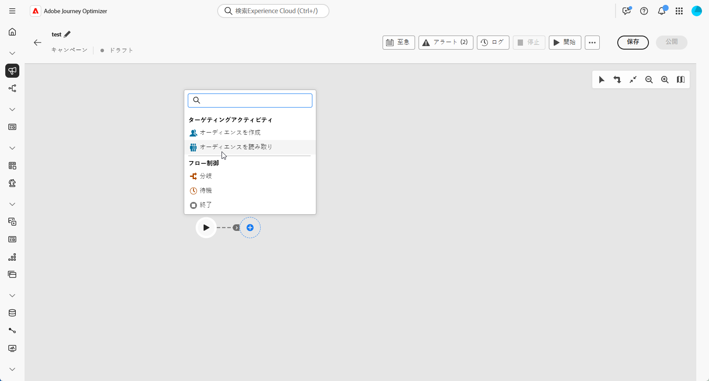
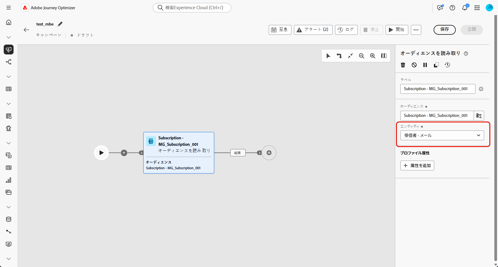
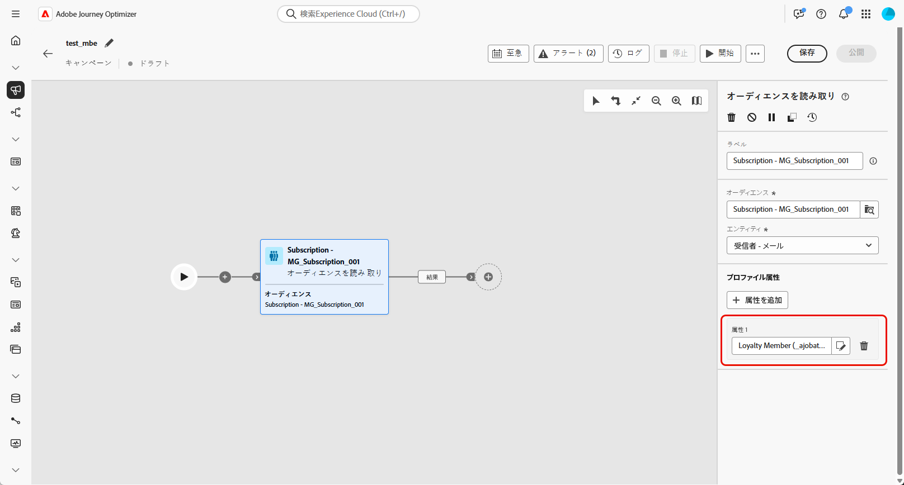
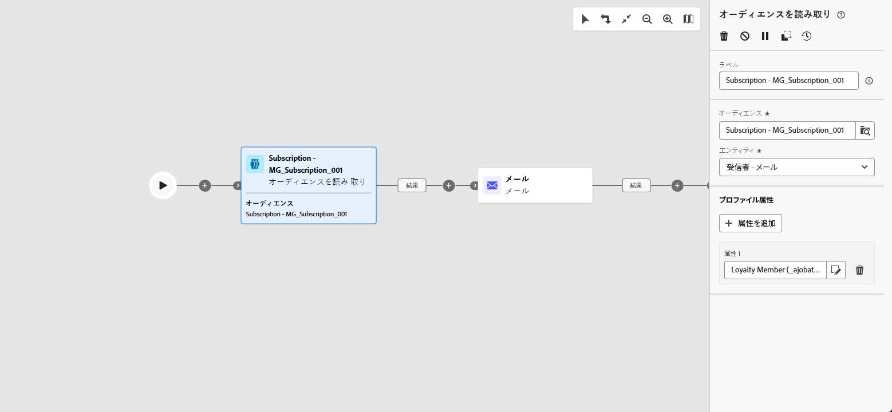

# オーディエンスを読み取り {#read-audience}

>[!CONTEXTUALHELP]
>id="ajo_orchestration_read_audience"
>title="オーディエンスを作成アクティビティ"
>abstract="**オーディエンスを読み取り**&#x200B;アクティビティを使用すると、調整されたキャンペーンにエントリするオーディエンスを選択できます。このオーディエンスは、既存の Adobe Experience Platform オーディエンスか、CSV ファイルから取り込まれたオーディエンスです。調整されたキャンペーンのコンテキストでメッセージを送信する際、メッセージオーディエンスはチャネルアクティビティではなく、**オーディエンスを読み取り**&#x200B;または&#x200B;**オーディエンスを作成**&#x200B;アクティビティで定義されます。"

+++ 目次

| 調整されたキャンペーンへようこそ | 最初の調整されたキャンペーンの開始 | データベースのクエリ | 調整されたキャンペーンアクティビティ |
|---|---|---|---|
| [ 調整されたキャンペーンの基本を学ぶ ](../gs-orchestrated-campaigns.md)   リレーショナルスキーマとデータセットの作成および管理：  <ul><li>[ スキーマとデータセットの概要 ](../gs-schemas.md)</li><li>[ 手動スキーマ ](../manual-schema.md)</li><li>[ ファイルアップロードスキーマ ](../file-upload-schema.md)</li><li>[ データの取り込み ](../ingest-data.md)</li></ul>[ オーケストレーションされたキャンペーンへのアクセスと管理 ](../access-manage-orchestrated-campaigns.md) | [調整されたキャンペーンを作成する主な手順](../gs-campaign-creation.md)  [キャンペーンの作成とスケジュール](../create-orchestrated-campaign.md)  [アクティビティの調整](../orchestrate-activities.md)  [キャンペーンの開始と監視](../start-monitor-campaigns.md)  [レポート](../reporting-campaigns.md) | [ルールビルダーの操作](../orchestrated-rule-builder.md)  [最初のクエリの作成](../build-query.md)  [式の編集](../edit-expressions.md)  [リターゲティング](../retarget.md) | [アクティビティの基本を学ぶ](about-activities.md)  アクティビティ： [AND 結合](and-join.md) - [オーディエンスを作成](build-audience.md) - [ディメンションを変更](change-dimension.md) - [チャネルアクティビティ](channels.md) - [結合](combine.md) - [重複排除](deduplication.md) - [エンリッチメント](enrichment.md) - [分岐](fork.md) - [紐付け](reconciliation.md) - [オーディエンスを保存](save-audience.md) - [分割](split.md) - [待機](wait.md) |

{style="table-layout:fixed"}

+++

 

>[!BEGINSHADEBOX]

 

このページのコンテンツは最終的なものではなく、変更される場合があります。

>[!ENDSHADEBOX]

**[!UICONTROL オーディエンスを読み取り]** アクティビティを使用すると、以前に保存またはインポートした既存のオーディエンスを取得し、調整されたキャンペーン内で再利用できます。 このアクティビティは、新しいセグメント化プロセスを実行しなくても、事前定義済みのプロファイルセットをターゲティングする場合に特に便利です。

オーディエンスが読み込まれたら、一意の ID フィールドを選択し、ターゲティング、パーソナライゼーションまたはレポートの目的で追加のプロファイル属性でオーディエンスを強化することで、オプションでオーディエンスを絞り込むことができます。

## オーディエンスを読み取りアクティビティの設定 {#read-audience-configuration}

**[!UICONTROL オーディエンスを読み取り]** アクティビティを設定するには、次の手順に従います。

1. **[!UICONTROL オーディエンスを読み取り]** アクティビティをオーケストレーションされたキャンペーンに追加します。

   

1. アクティビティに **[!UICONTROL ラベル]** を入力します。

1.  をクリックして、オーケストレーションしたキャンペーンのターゲットにするオーディエンスを選択します。

   

1. キャンペーンターゲティングディメンションから **[!UICONTROL エンティティ&#x200B;]** を選択します。

   ➡️[ このページで説明している手順に従って、Campaign ターゲティングディメンションを作成します ](../target-dimension.md)

   

1. 「**[!UICONTROL 属性を追加]**」を選択して、選択したオーディエンスに追加のデータを追加します。 結果のオーディエンスには、受信者のリストが含まれ、各受信者は選択したプロファイル属性でエンリッチメントされます。

1. オーディエンスに追加する **[!UICONTROL 属性]** を選択します。

   

## 例

次の例では、**[!UICONTROL オーディエンスを読み取り]** アクティビティを使用して、ニュースレターを購読しているプロファイルの、以前に作成および保存されたオーディエンスを取得します。 その後、オーディエンスは **ロイヤルティメンバーシップ** 属性でエンリッチメントされ、ロイヤルティプログラムの登録メンバーであるユーザーのターゲティングが可能になります。

