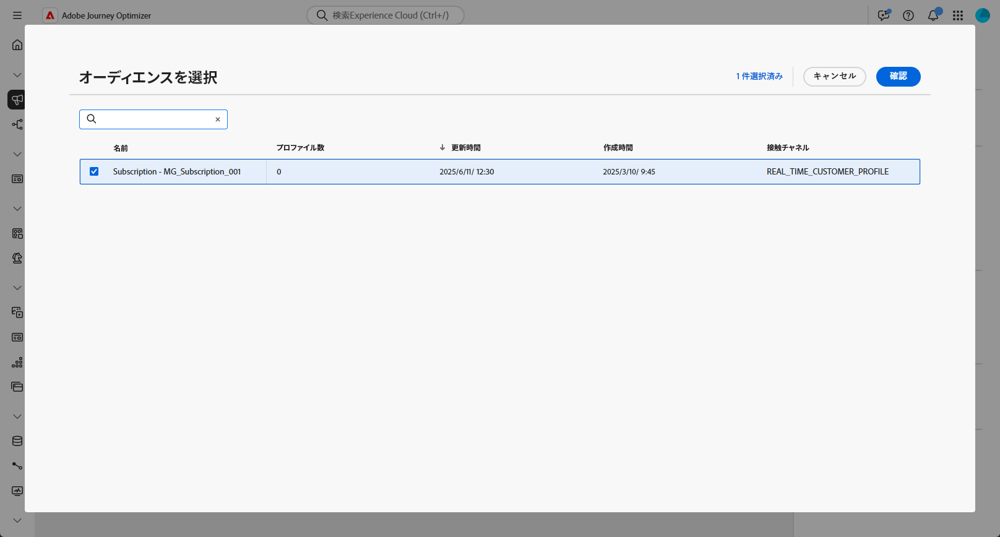

# オーディエンスを読み取り {#read-audience}

>[!CONTEXTUALHELP]
>id="ajo_orchestration_read_audience"
>title="オーディエンスを作成アクティビティ"
>abstract="**オーディエンスを読み取り**&#x200B;アクティビティを使用すると、調整されたキャンペーンにエントリするオーディエンスを選択できます。このオーディエンスは、既存の Adobe Experience Platform オーディエンスか、CSV ファイルから取り込まれたオーディエンスです。調整されたキャンペーンのコンテキストでメッセージを送信する際、メッセージオーディエンスはチャネルアクティビティではなく、**オーディエンスを読み取り**&#x200B;または&#x200B;**オーディエンスを作成**&#x200B;アクティビティで定義されます。"

**[!UICONTROL オーディエンスを読み取り]**&#x200B;アクティビティを使用すると、以前保存または読み込んだ既存のオーディエンスを取得して、調整されたキャンペーン内で再利用できます。このアクティビティは、新しいセグメント化プロセスを実行せずに、定義済みの一連のプロファイルをターゲティングする場合に特に便利です。

オーディエンスが読み込まれたら、必要に応じて、一意の ID フィールドを選択し、オーディエンスにターゲティング、パーソナライゼーションまたはレポートを行うプロファイル属性を追加し、オーディエンスを絞り込むことができます。

## オーディエンスを読み取りキャッシュ {#cache}

オーケストレーションキャンペーンをテストする際、**[!UICONTROL オーディエンスを読み取り]**&#x200B;アクティビティでは通常、データ取得に時間がかかり、テスト実行が長くなる場合があります。これを高速化するために、**[!UICONTROL オーディエンスを読み取り]**&#x200B;のキャッシュを使用できます。

キャッシュには、選択した属性と共にオーディエンスが&#x200B;**最大 2 時間**&#x200B;保存されます。この間、後続のテスト実行ではキャッシュした結果が使用されるので、データを再度取得する必要がなくなります。**2 時間**&#x200B;が経過したら、データを新たに取得する必要があります。

キャッシュは、オーディエンス自体ではなく、オーケストレーションキャンペーンに対して保存されます。同じオーディエンスを、別のオーケストレーションキャンペーン内の&#x200B;**[!UICONTROL オーディエンスを読み取り]**&#x200B;アクティビティで使用する場合、システムはデータを引き続き再度取得する必要があります。

次の場合、キャッシュは保持されません。

* **[!UICONTROL オーディエンスを読み取り]**&#x200B;アクティビティを新しい属性で更新すると、キャッシュは新しい属性データで更新されます。その結果、データを再度取得する必要があるので、更新後の最初のテスト実行にはより長い時間がかかります。

* オーケストレーションキャンペーンを公開すると、ライブのオーケストレーションキャンペーンの実行時に最新のデータが取得されます。

## オーディエンスを読み取りアクティビティの設定 {#read-audience-configuration}

 **[!UICONTROL オーディエンスを読み取り]**&#x200B;アクティビティを設定するには、次の手順に従います。

1. **[!UICONTROL オーディエンスを読み取り]**&#x200B;アクティビティを追加する前に、キャンペーン設定で「**[!UICONTROL 結合ポリシー]**」を選択します。

   

1. **[!UICONTROL オーディエンスを読み取り]**&#x200B;アクティビティを調整されたキャンペーンに追加します。

   

1. アクティビティに&#x200B;**[!UICONTROL ラベル]**&#x200B;を入力します。このラベルは、オーディエンスの名前として機能します。

1.  をクリックして、調整されたキャンペーンのターゲットにするオーディエンスを選択します。

   

1. キャンペーンターゲティングディメンションから&#x200B;**[!UICONTROL エンティティ]**&#x200B;を選択します。この設定は、オーディエンスをターゲットディメンションに紐付けするのに使用されるターゲットエンティティと属性を定義します。

   ➡️[このページで説明されている手順に従って、キャンペーンターゲティングディメンションを作成します。](../target-dimension.md)

   

1. 「**[!UICONTROL 属性を追加]**」を選択して、選択したオーディエンスに追加のデータを補足します。この手順でオーディエンスにプロファイル属性を追加すると、これらの属性が追加された受信者リストが生成されます。

1. オーディエンスに追加する&#x200B;**[!UICONTROL 属性]**&#x200B;を選択します。属性ピッカーには、**結合プロファイルスキーマ**&#x200B;のフィールドが表示されます。

   * CSV ベースのオーディエンスの場合、このスキーマには&#x200B;**プロファイル**&#x200B;属性とカスタムオーディエンスレベル属性の両方が含まれます。これらの属性は、次のスキーマパスにあります。

     `<audienceid> > _ajobatchjourneystage > audienceEnrichment > CustomerAudienceUpload > <audienceid>`

   * 標準の AEP オーディエンスの場合、オーディエンス固有の埋め込みフィールドは含まれないため、**プロファイル**&#x200B;属性のみを使用できます。

   >[!NOTE]
   >
   > 一部の属性は、ピッカーに表示されていても実行時に使用できるかどうかは、オーディエンスデータが正常に調整され、**Adobe Experience Platform プロファイル**&#x200B;と結合されたかどうかによって決まります。

   

オーディエンスを作成すると、読み取り専用となり、編集できなくなります。使用できるようになるのは、作成プロセスが完全に完了した後のみです。

## 例

次の例では、**[!UICONTROL オーディエンスを読み取り]**&#x200B;アクティビティを使用して、ニュースレターを購読しているプロファイルの以前作成および保存したオーディエンスを取得します。その後、オーディエンスに&#x200B;**ロイヤルティメンバーシップ**&#x200B;属性を付加すると、ロイヤルティプログラムの登録メンバーであるユーザーのターゲティングができるようになります。

