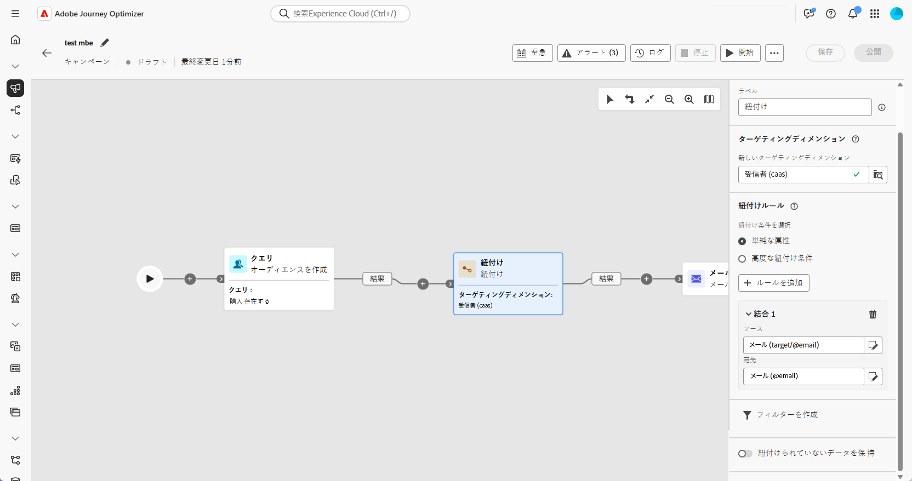

# 紐付け {#reconciliation}

>[!CONTEXTUALHELP]
>id="ajo_orchestration_reconciliation"
>title="紐付けアクティビティ"
>abstract="**紐付け**&#x200B;アクティビティは、Adobe Journey Optimizer と作業用テーブル内のデータ間のリンクを定義できる&#x200B;**ターゲティング**&#x200B;アクティビティです。"

>[!CONTEXTUALHELP]
>id="ajo_orchestration_reconciliation_field"
>title="紐付け選択フィールド"
>abstract="紐付け選択フィールド"

>[!CONTEXTUALHELP]
>id="ajo_orchestration_reconciliation_condition"
>title="紐付け作成条件"
>abstract="紐付け作成条件"

>[!CONTEXTUALHELP]
>id="ajo_orchestration_reconciliation_complement"
>title="紐付けで補集合を生成"
>abstract="紐付けで補集合を生成"

+++ 目次

| 調整されたキャンペーンへようこそ | 最初の調整されたキャンペーンの開始 | データベースのクエリ | キャンペーンアクティビティをキャンセル |
|---|---|---|---|
| [ オーケストレーションされたキャンペーンの概要 ](../gs-orchestrated-campaigns.md)  [ 設定手順 ](../configuration-steps.md)  [ オーケストレーションされたキャンペーンを作成するための主な手順 ](../gs-campaign-creation.md) | [ オーケストレーションされたキャンペーンの作成 ](../create-orchestrated-campaign.md)  [ アクティビティのオーケストレーション ](../orchestrate-activities.md)  [ オーケストレーションされたキャンペーンでのメッセージの送信 ](../send-messages.md)  [ キャンペーンの開始および監視 ](../start-monitor-campaigns.md)  [ レポート ](../reporting-campaigns.md) | [ クエリの操作Modeler](../orchestrated-query-modeler.md)  [ 最初のクエリ ](../build-query.md)  [ 編集式を作成 ](../edit-expressions.md) | [ アクティビティの基本を学ぶ ](about-activities.md)   アクティビティ： [AND 結合 ](and-join.md) - [ オーディエンスを作成 ](build-audience.md) - [ ディメンションを変更 ](change-dimension.md) - [ 結合 ](combine.md) - [ 重複排除 ](deduplication.md) - [ エンリッチメント ](enrichment.md) - [ 分岐 ](fork.md) - [ 紐付け ](reconciliation.md) - [ 分割 ](split.md)  - |

{style="table-layout:fixed"}

+++

  

**紐付け** アクティビティは、Adobe Journey Optimizer内のデータと作業表内のデータとのリンクを定義できる **ターゲティング** アクティビティです。このリンクには、外部ファイルから読み込まれるデータなどが含まれます。

## ベストプラクティス {#reconciliation-best-practices}

**エンリッチメント** アクティビティでは、調整したキャンペーンで処理する追加データを定義できますが（**エンリッチメント** アクティビティを使用すると、複数のセットからのデータを組み合わせたり、一時的なリソースへのリンクを作成したりできます）、**紐付け** アクティビティを使用すると、未識別データを既存のリソースにリンクできます。

>[!NOTE]
>紐付け操作は、リンクされたディメンションのデータが既にデータベースに存在することを意味します。例えば、購入された商品、購入時間、商品を購入したクライアントなどを示す購入ファイルを読み込む場合、商品とクライアントはデータベースに既に存在している必要があります。

## 紐付けアクティビティの設定 {#reconciliation-configuration}

>[!CONTEXTUALHELP]
>id="ajo_orchestration_reconciliation_targeting"
>title="ターゲティングディメンション"
>abstract="新しいターゲティングディメンションを選択します。 ディメンションを使用すると、ターゲット母集団（受信者、アプリのサブスクライバー、オペレーター、サブスクライバーなど）を定義できます。 デフォルトでは、現在のターゲティングディメンションが選択されています。"

>[!CONTEXTUALHELP]
>id="ajo_orchestration_reconciliation_rules"
>title="紐付けルール"
>abstract="重複排除 - 重複に使用する紐付けルールを選択します。 属性を使用するには、「**単純な属性**」オプションを選択し、ソースフィールドと宛先フィールドを選択します。 クエリモデラーを使用して独自の紐付け条件を作成するには、「**高度な紐付け条件**」オプションを選択します。"
>additional-url="https://experienceleague.adobe.com/ja/docs/campaign-web/v8/query-database/query-modeler-overview" text="クエリモデラーの操作"

>[!CONTEXTUALHELP]
>id="ajo_orchestration_reconciliation_targeting_selection"
>title="ターゲティングディメンションの選択"
>abstract="紐付けするインバウンドデータのターゲティングディメンションを選択します。"
>additional-url="https://experienceleague.adobe.com/docs/campaign-web/v8/audiences/gs-audiences-recipients.html?lang=ja#targeting-dimensions" text="ターゲティングディメンション"

>[!CONTEXTUALHELP]
>id="ajo_orchestration_keep_unreconciled_data"
>title="紐付けられていないデータの保持"
>abstract="デフォルトでは、紐付けされていないデータは、アウトバウンドトランジションに保持され、後で使用するために作業用テーブルで使用できます。 紐付けされていないデータを削除するには、「**紐付けされていないデータを保持**」オプションを非アクティブ化します。"

>[!CONTEXTUALHELP]
>id="ajo_orchestration_reconciliation_attribute"
>title="紐付け属性"
>abstract="データの紐付けに使用する属性を選択し、「確認」をクリックします。"

**紐付け**&#x200B;アクティビティを設定するには、次の手順に従います。

1. **紐付け** アクティビティを、調整したキャンペーンに追加します。

1. 新しいターゲティングディメンションを選択します。 ディメンションを使用すると、受信者、アプリの購読者、オペレーター、購読者などのターゲット母集団を定義できます。

1. 紐付けに使用するフィールドを選択します。1 つまたは複数の紐付け条件を使用できます。

   1. 属性を使用してデータを紐付けするには、「**単純な属性**」オプションを選択します。「**ソース**」フィールドには、入力トランジションで使用可能な、紐付けされるフィールドがリストされます。「**宛先**」フィールドは、選択したターゲティングディメンションのフィールドに対応します。データは、ソースと宛先が等しい場合に紐付けされます。例えば、メールアドレスに基づいてプロファイルの重複を排除するには、「**メール**」フィールドを選択します。

      別の紐付け条件を追加するには、「**ルールを追加**」ボタンをクリックします。複数の結合条件が指定される場合、データを相互にリンクさせるには、すべての条件が検証される必要があります。

      

   1. 他の属性を使用してデータを紐付けするには、「**高度な紐付け条件**」オプションを選択します。その後、クエリモデラーを使用して、独自の紐付け条件を作成できます。

1. 「**フィルターを作成**」ボタンを使用して、データをフィルタリングして紐付けできます。これにより、クエリモデラーを使用してカスタム条件を作成できます。

デフォルトでは、紐付けされていないデータは、アウトバウンドトランジションに保持され、後で使用するために作業用テーブルで使用できます。紐付けされていないデータを削除するには、「**紐付けされていないデータを保持**」オプションを非アクティブ化します。
