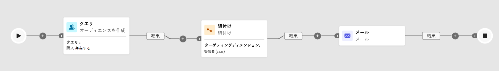

# 紐付け {#reconciliation}

>[!CONTEXTUALHELP]
>id="ajo_orchestration_reconciliation"
>title="紐付けアクティビティ"
>abstract="**紐付け**&#x200B;アクティビティは、Adobe Journey Optimizer とワークテーブル内のデータ間のリンクを定義できる&#x200B;**ターゲティング**&#x200B;アクティビティです。"

>[!CONTEXTUALHELP]
>id="ajo_orchestration_reconciliation_field"
>title="紐付け選択フィールド"
>abstract="紐付け選択フィールド"

>[!CONTEXTUALHELP]
>id="ajo_orchestration_reconciliation_condition"
>title="紐付け作成条件"
>abstract="紐付け作成条件"

>[!CONTEXTUALHELP]
>id="ajo_orchestration_reconciliation_complement"
>title="紐付けで補集合を生成"
>abstract="紐付けで補集合を生成"

+++ 目次

| 調整されたキャンペーンへようこそ | 最初の調整されたキャンペーンの開始 | データベースのクエリ | 調整されたキャンペーンアクティビティ |
|---|---|---|---|
| [ 調整されたキャンペーンの基本を学ぶ ](../gs-orchestrated-campaigns.md)   リレーショナルスキーマとデータセットの作成および管理：  <ul><li>[ スキーマとデータセットの概要 ](../gs-schemas.md)</li><li>[ 手動スキーマ ](../manual-schema.md)</li><li>[ ファイルアップロードスキーマ ](../file-upload-schema.md)</li><li>[ データの取り込み ](../ingest-data.md)</li></ul>[ オーケストレーションされたキャンペーンへのアクセスと管理 ](../access-manage-orchestrated-campaigns.md) | [調整されたキャンペーンを作成する主な手順](../gs-campaign-creation.md)  [キャンペーンの作成とスケジュール](../create-orchestrated-campaign.md)  [アクティビティの調整](../orchestrate-activities.md)  [キャンペーンの開始と監視](../start-monitor-campaigns.md)  [レポート](../reporting-campaigns.md) | [ルールビルダーの操作](../orchestrated-rule-builder.md)  [最初のクエリの作成](../build-query.md)  [式の編集](../edit-expressions.md)  [リターゲティング](../retarget.md) | [アクティビティの基本を学ぶ](about-activities.md)  アクティビティ： [AND 結合](and-join.md) - [オーディエンスを作成](build-audience.md) - [ディメンションを変更](change-dimension.md) - [チャネルアクティビティ](channels.md) - [結合](combine.md) - [重複排除](deduplication.md) - [エンリッチメント](enrichment.md) - [分岐](fork.md) - <b>[紐付け](reconciliation.md)</b> - [オーディエンスを保存](save-audience.md) - [分割](split.md) - [待機](wait.md) |

{style="table-layout:fixed"}

+++

 

>[!BEGINSHADEBOX]

 

このページのコンテンツは最終的なものではなく、変更される場合があります。

>[!ENDSHADEBOX]

**[!UICONTROL 紐付け]**&#x200B;アクティビティは、**[!UICONTROL ターゲティング]**&#x200B;アクティビティで、Adobe Journey Optimizer 内のデータと作業用テーブル内のデータ（外部ファイルから読み込まれたデータなど）との間のリンクを定義できます。

**[!UICONTROL エンリッチメント]**&#x200B;アクティビティを使用すると、複数のソースのデータを組み合わせたり、一時的なリソースにリンクしたりして、調整されたキャンペーンにさらにデータを追加できます。これに対し、**[!UICONTROL 紐付け]**&#x200B;アクティビティは、未識別のデータや外部データをデータベース内の既存のリソースと一致させるのに使用されます。

**[!UICONTROL 紐付け]**&#x200B;には、関連するレコードがシステムに既に存在している必要があります。例えば、製品、タイムスタンプ、顧客情報をリストした購入ファイルをインポートする場合、リンクを確立するには、製品と顧客の両方がデータベースに既に存在している必要があります。

## 紐付けアクティビティの設定 {#reconciliation-configuration}

>[!CONTEXTUALHELP]
>id="ajo_orchestration_reconciliation_targeting"
>title="ターゲティングディメンション"
>abstract="新しいターゲティングディメンションを選択します。 ディメンションを使用すると、ターゲット母集団（受信者、アプリのサブスクライバー、オペレーター、サブスクライバーなど）を定義できます。 デフォルトでは、現在のターゲティングディメンションが選択されています。"

>[!CONTEXTUALHELP]
>id="ajo_orchestration_reconciliation_rules"
>title="紐付けルール"
>abstract="重複排除 - 重複に使用する紐付けルールを選択します。 属性を使用するには、「**単純な属性**」オプションを選択し、ソースフィールドと宛先フィールドを選択します。 クエリモデラーを使用して独自の紐付け条件を作成するには、「**高度な紐付け条件**」オプションを選択します。"
>additional-url="https://experienceleague.adobe.com/ja/docs/campaign-web/v8/query-database/query-modeler-overview" text="クエリモデラーの操作"

>[!CONTEXTUALHELP]
>id="ajo_orchestration_reconciliation_targeting_selection"
>title="ターゲティングディメンションの選択"
>abstract="紐付けするインバウンドデータのターゲティングディメンションを選択します。"
>additional-url="https://experienceleague.adobe.com/docs/campaign-web/v8/audiences/gs-audiences-recipients.html?lang=ja#targeting-dimensions" text="ターゲティングディメンション"

>[!CONTEXTUALHELP]
>id="ajo_orchestration_keep_unreconciled_data"
>title="紐付けられていないデータの保持"
>abstract="デフォルトでは、紐付けされていないデータは、アウトバウンドトランジションに保持され、後で使用するためにワークテーブルで使用できます。 紐付けされていないデータを削除するには、「**紐付けされていないデータを保持**」オプションを非アクティブ化します。"

>[!CONTEXTUALHELP]
>id="ajo_orchestration_reconciliation_attribute"
>title="紐付け属性"
>abstract="データの紐付けに使用する属性を選択し、「確認」をクリックします。"

**[!UICONTROL 紐付け]**&#x200B;アクティビティを設定するには、次の手順に従います。

1. **[!UICONTROL 紐付け]**&#x200B;アクティビティをワークフローに追加します。

1. 新しいターゲティングディメンションを選択し、受信者やサブスクライバーなど、ターゲティングするユーザーを定義します。

1. 受信データを既存のプロファイルと一致させるのに使用するフィールドを設定します。

1. 基本フィールドを使用してデータを一致させるには、「**[!UICONTROL 単純な属性]**」を選択します。

1. 一致するフィールドを設定します。

   * **[!UICONTROL ソース]**：受信データフィールドをリストします。

   * **[!UICONTROL 宛先]**：選択したターゲティングディメンションのフィールドを参照します。

   両方の値が等しい場合、一致が発生します。例えば、プロファイルを識別するのに&#x200B;**[!UICONTROL メール]**&#x200B;で一致します。

   

1. 一致するルールをさらに追加するには、「**[!UICONTROL ルールを追加]**」をクリックします。一致が発生するには、すべての条件を満たす必要があります。

1. より複雑な条件の場合は、「**[!UICONTROL 高度な紐付け条件]**」を選択します。[クエリモデラー](../orchestrated-rule-builder.md)を使用して、カスタムロジックを定義します。

1. 紐付けるデータをフィルタリングするには、「**[!UICONTROL フィルターを作成]**」をクリックして、クエリモデラーで条件を定義します。

1. デフォルトでは、一致しないレコードは、アウトバウンドトランジションに保持され、作業用テーブルに保存されます。これらを削除するには、「**[!UICONTROL 紐付けされていないデータを保持]**」オプションを有効にします。

## 例 {#example-reconciliation}

この例では、Adobe Journey Optimizer の&#x200B;**[!UICONTROL 紐付け]**&#x200B;アクティビティを使用して、認識された顧客にのみメールが送信されるようにします。データは、以前の注文のあるユーザーをターゲットにする&#x200B;**[!UICONTROL オーディエンスを読み取り]**&#x200B;アクティビティを通じて流入します。次に、**[!UICONTROL 紐付け]**&#x200B;アクティビティは、メールフィールドを使用して、この受信データをデータベース内の既存のプロファイルと一致させます。

