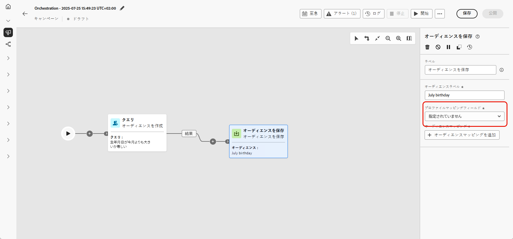
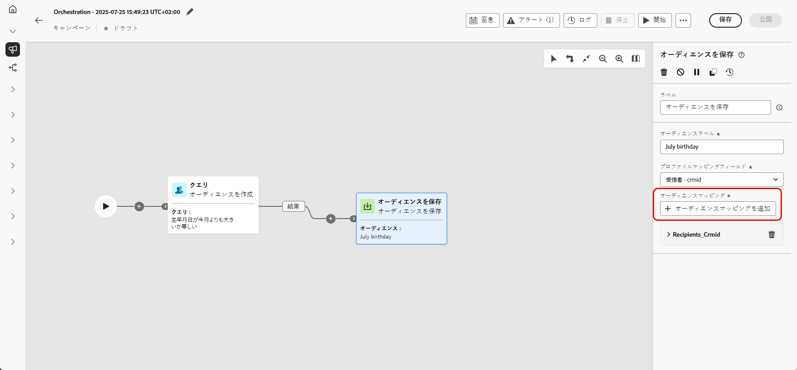
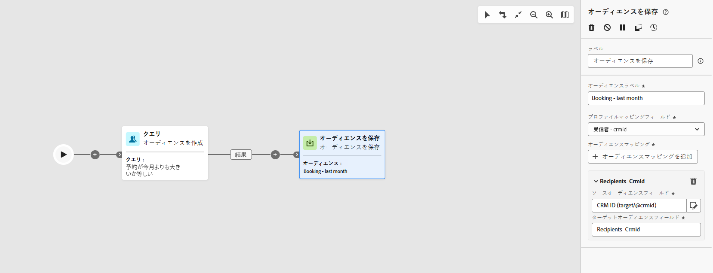
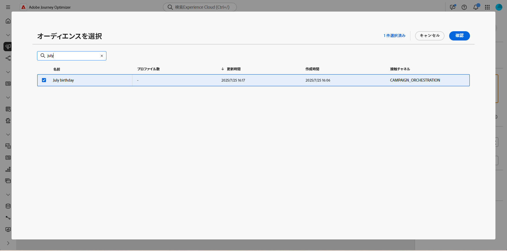

# オーディエンスの保存 {#save-audience}

+++ 目次

| 調整されたキャンペーンへようこそ | 最初の調整されたキャンペーンの開始 | データベースのクエリ | 調整されたキャンペーンアクティビティ |
|---|---|---|---|
| [ オーケストレーションされたキャンペーンの基本を学ぶ ](../gs-orchestrated-campaigns.md)  [ 設定手順 ](../configuration-steps.md)  [ オーケストレーションされたキャンペーンへのアクセスと管理 ](../access-manage-orchestrated-campaigns.md) | [ キャンペーンの作成を調整するための主な手順 ](../gs-campaign-creation.md)  [ キャンペーンの作成およびスケジュール設定 ](../create-orchestrated-campaign.md)  [ アクティビティの調整 ](../orchestrate-activities.md)  [ キャンペーンの開始および監視 ](../start-monitor-campaigns.md)  [ レポート ](../reporting-campaigns.md) | [ ルールビルダーの操作 ](../orchestrated-rule-builder.md)  [ 最初のクエリの作成 ](../build-query.md)  [ 式の編集 ](../edit-expressions.md)  [ リターゲティング ](../retarget.md) | [ アクティビティの基本を学ぶ ](about-activities.md)   アクティビティ： [AND 結合 ](and-join.md) - [ オーディエンスを作成 ](build-audience.md) - [ ディメンションの変更 ](change-dimension.md) - [ チャネルアクティビティ ](channels.md) - [ 結合 ](combine.md) - [ 重複排除 ](deduplication.md) - [ エンリッチメント ](enrichment.md) - [ 分岐 ](fork.md) - [ 紐付け ](reconciliation.md) <b></b>   - |

{style="table-layout:fixed"}

+++

**[!UICONTROL オーディエンスを保存]** アクティビティは、既存のオーディエンスを更新したり、オーケストレーションされたキャンペーンで以前に生成された母集団から新しいオーディエンスを作成したりできる **[!UICONTROL ターゲティング]** アクティビティです。 作成すると、これらのオーディエンスはアプリケーションオーディエンスのリストに追加され、**[!UICONTROL オーディエンス]** メニューからアクセスできます。

このアクティビティは、同じオーケストレーションされたキャンペーン内で計算されたオーディエンスセグメントを保持し、今後のキャンペーンで再利用できるようにする場合に特に便利です。 通常は、結果の母集団を取得して保存するために、**[!UICONTROL オーディエンスを作成]** または **[!UICONTROL 結合]** などの他のターゲティングアクティビティに接続されます。

## オーディエンスを保存アクティビティの設定 {#save-audience-configuration}

**[!UICONTROL オーディエンスを保存]**&#x200B;アクティビティを設定するには、次の手順に従います。

1. **[!UICONTROL オーディエンスを保存]** アクティビティを、オーケストレーションされたキャンペーンに追加します。

1. 保存したオーディエンスを識別する **[!UICONTROL オーディエンスラベル]** を入力します。

1. **[!UICONTROL オーディエンス属性を追加]** をクリックして、オーディエンスデータの構造および保存方法を定義し、後で再利用できるようにします。

   

1. 次に、適切な **[!UICONTROL プライマリ ID フィールド]** および&#x200B;ID 名前空間 **[!UICONTROL を選択して、正確なプロファイル解決を確実に行]** ます。

   

1. 調整したキャンペーンを保存して公開し、設定を完了します。 これにより、オーディエンスが生成および保存されます。

保存したオーディエンスのコンテンツは、オーディエンスの詳細ビューで利用できます。このビューには、**[!UICONTROL オーディエンス]** メニューからアクセスできます。

## 例 {#save-audience-example}

次の例は、ターゲティングを使用したシンプルなオーディエンスの作成方法を示しています。 クエリは、過去 30 日以内に購入を行ったすべてのプロファイルを識別します。 次に **[!UICONTROL オーディエンスを保存]** アクティビティは、これらのプロファイルをキャプチャして、最近の購入者の再利用可能なオーディエンスを作成します。

