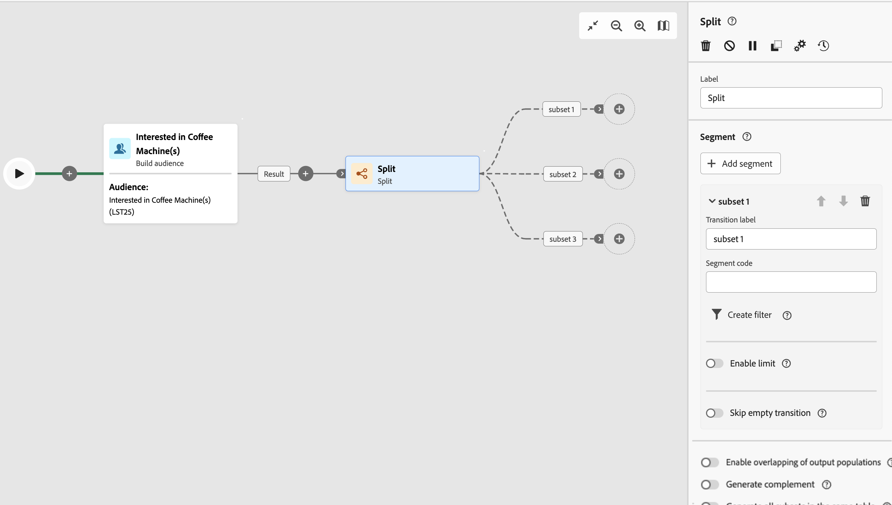

# 分割 {#split}

>[!CONTEXTUALHELP]
>id="ajo_orchestration_split"
>title="分割アクティビティ"
>abstract="**分割**&#x200B;アクティビティを使用すると、フィルタリングルールや母集団サイズなどの様々な選択条件に基づいて、流入母集団を複数のサブセットにセグメント化できます。"

+++ 目次

| 調整されたキャンペーンへようこそ | 最初の調整されたキャンペーンの開始 | データベースのクエリ | キャンペーンアクティビティをキャンセル |
|---|---|---|---|
| [ オーケストレーションされたキャンペーンの概要 ](../gs-orchestrated-campaigns.md)  [ 設定手順 ](../configuration-steps.md)  [ オーケストレーションされたキャンペーンを作成するための主な手順 ](../gs-campaign-creation.md) | [ オーケストレーションされたキャンペーンの作成 ](../create-orchestrated-campaign.md)  [ アクティビティのオーケストレーション ](../orchestrate-activities.md)  [ オーケストレーションされたキャンペーンでのメッセージの送信 ](../send-messages.md)  [ キャンペーンの開始および監視 ](../start-monitor-campaigns.md)  [ レポート ](../reporting-campaigns.md) | [ クエリの操作Modeler](../orchestrated-query-modeler.md)  [ 最初のクエリ ](../build-query.md)  [ 編集式を作成 ](../edit-expressions.md) | [ アクティビティの基本を学ぶ ](about-activities.md)   アクティビティ： [AND 結合 ](and-join.md) - [ オーディエンスを作成 ](build-audience.md) - [ ディメンションを変更 ](change-dimension.md) - [ 結合 ](combine.md) - [ 重複排除 ](deduplication.md) - [ エンリッチメント ](enrichment.md) - [ 分岐 ](fork.md) - [ 紐付け ](reconciliation.md) - [ 分割 ](split.md) [&#128279;](wait.md) - |

{style="table-layout:fixed"}

+++

 

**分割**&#x200B;アクティビティは、フィルタリングルールや母集団サイズなどの様々な選択条件に基づいて、流入母集団を複数のサブセットにセグメント化できる&#x200B;**ターゲティング**&#x200B;アクティビティです。

## 分割アクティビティの設定 {#split-configuration}

>[!CONTEXTUALHELP]
>id="ajo_orchestration_split_segments"
>title="分割アクティビティのセグメント"
>abstract="入力母集団をセグメント化するのに必要な数のサブセットを追加します。  「**分割**」アクティビティを実行すると、母集団はアクティビティに追加された順序で様々なサブセットに分割されます。 調整されたキャンペーンを開始する前に、矢印ボタンを使用して、サブセットをニーズに合う順番に並べ替えておきます。"

>[!CONTEXTUALHELP]
>id="ajo_orchestration_split_filter"
>title="分割アクティビティのフィルター"
>abstract="サブセットにフィルタリング条件を適用するには、「**[!UICONTROL フィルターを作成]**」をクリックし、クエリモデラーを使用して目的のフィルタリングルールを設定します。例えば、データベースにメールアドレスが存在する入力母集団のプロファイルを含めます。"

>[!CONTEXTUALHELP]
>id="ajo_orchestration_split_limit"
>title="分割アクティビティの制限"
>abstract="サブセットで選択するプロファイル数を制限するには、「**[!UICONTROL 制限を有効にする]**」オプションの切替スイッチをオンにし、含める母集団の数または割合を指定します。"

>[!CONTEXTUALHELP]
>id="ajo_orchestration_split_sorting"
>title="分割アクティビティの並べ替え"
>abstract="サブセットの母集団制限を設定する場合、特定のプロファイル属性に基づいて、選択したプロファイルを昇順または降順にランク付けできます。 これを行うには、「**並べ替えを有効にする**」オプションの切替スイッチをオンにします。 例えば、購入金額が最も高い上位 50 のプロファイルのみを含むようにサブセットを制限できます。"

>[!CONTEXTUALHELP]
>id="ajo_orchestration_split_complement"
>title="分割で補集合を生成"
>abstract="すべてのサブセットを設定したら、どのサブセットにも一致しなかった残りの母集団を選択し、追加のアウトバウンドトランジションに含めることができます。 これを行うには、「**補集合を生成**」オプションの切替スイッチをオンにします。"

>[!CONTEXTUALHELP]
>id="ajo_orchestration_split_generatesubsets"
>title="同じテーブルにすべてのサブセットを生成"
>abstract="このオプションをオンに切り替えると、すべてのサブセットが 1 つの出力トランジションにグループ化されます。"

>[!CONTEXTUALHELP]
>id="ajo_orchestration_split_emptytransition"
>title="空のトランジションをスキップ"
>abstract="「**[!UICONTROL 空のトランジションをスキップ]**」オプションをオンに切り替えると、入力母集団が空の場合に、このサブセットの出力トランジションが無効になります。"

>[!CONTEXTUALHELP]
>id="ajo_orchestration_split_enable_overlapping"
>title="出力母集団の重複を有効にする"
>abstract=" 「**[!UICONTROL 出力母集団の重複を有効にする]**」オプションにより、複数のサブセットに属している母集団を管理できます。このオプションを選択していない場合、サブセットの条件を複数満たす場合でも、複数の出力トランジションに受信者が表示されません。受信者は、一致した基準の 1 番目のタブのターゲットになります。チェックボックスをオンにすると、受信者がフィルター条件を満たす場合、複数のサブセットで受信者を検索できます。"

**分割**&#x200B;アクティビティを設定するには、次の手順に従います。

1. オーケストレーションされたキャンペーンに **分割** アクティビティを追加します。

1. アクティビティ設定パネルが開き、デフォルトのサブセットが表示されます。「**セグメントを追加**」ボタンをクリックして、入力母集団をセグメント化する必要な数のサブセットを追加します。

   

   >[!IMPORTANT]
   >
   >**分割**&#x200B;アクティビティを実行すると、母集団はアクティビティに追加された順序で様々なサブセットに分割されます。例えば、最初のサブセットが初期母集団の 70％を回復した場合、次に追加されたサブセットの選択条件は残りの 30％にのみ適用されます。
   >
   >調整したキャンペーンを開始する前に、ニーズに合った順序でサブセットを注文したことを確認します。 これを行うには、矢印ボタンを使用して、サブセットの位置を変更します。

1. サブセットを追加したら、アクティビティにはサブセットと同数の出力トランジションが表示されます。調整されたキャンペーンキャンバスでサブセットを簡単に識別できるように、各サブセットのラベルを変更することを強くお勧めします。

1. 各サブセットで入力母集団をフィルタリングする方法を設定します。それには、次の手順に従います。

   1. サブセットを開いて、そのプロパティを表示します。

   1. サブセットにフィルタリング条件を適用するには、「**[!UICONTROL フィルターを作成]**」をクリックし、クエリモデラーを使用して目的のフィルタリングルールを設定します。例えば、データベースにメールアドレスが存在する入力母集団のプロファイルを含めます。

   1. サブセットで選択するプロファイル数を制限するには、「**[!UICONTROL 制限を有効にする]**」オプションの切替スイッチをオンにし、含める母集団の数または割合を指定します。

   1. 入力母集団が空の場合にトランジションを無効にするには、「**[!UICONTROL 空のトランジションをスキップ]**」オプションをオンに切り替えます。サブセットに一致するプロファイルがない場合、オーケストレーションされたキャンペーンは次のアクティビティに移行しません。

      

1. すべてのサブセットを設定したら、どのサブセットにも一致しなかった残りの母集団を選択し、追加のアウトバウンドトランジションに含めることができます。 これを行うには、「**[!UICONTROL 補集合を生成]**」オプションの切替スイッチをオンにします。

   

   >[!NOTE]
   >
   >「**[!UICONTROL 同じテーブル内のすべてのサブセットを生成]**」オプションを使用して、すべてのサブセットを 1 つの出力トランジションにグループ化できるようになりました。

1. 「**[!UICONTROL 出力母集団の重複を有効にする]**」オプションにより、複数のサブセットに属している母集団を管理できます。

   * このオプションを選択していない場合、サブセットの条件を複数満たす場合でも、複数の出力トランジションに受信者が表示されません。受信者は、一致した基準の 1 番目のタブのターゲットになります。
   * チェックボックスをオンにすると、受信者がフィルター条件を満たす場合、複数のサブセットで受信者を検索できます。ベストプラクティスは、排他的な条件を使用することです。

これでアクティビティが設定されました。キャンペーンの実施時に、母集団は、アクティビティに追加された順序で、様々なサブセットにセグメント化されます。

## 例{#split-example}

次の例では、**[!UICONTROL 分割]**&#x200B;アクティビティを使用して、使用する通信チャネルに基づいて、オーディエンスを個別のサブセットにセグメント化します。

* **サブセット 1 「プッシュ」**：このサブセットは、モバイルアプリケーションをインストールしたすべてのプロファイルで構成されます。
* **サブセット 2 「sms」**：携帯電話ユーザー：サブセット 1 に該当しなかった残りの母集団については、サブセット 2 がフィルタールールを適用して、データベース内の携帯電話を含むプロファイルを選択します。
* **補集合トランジション**：このトランジションは、サブセット 1 またはサブセット 2 に一致しなかった残りのプロファイルをすべてキャプチャします。特に、モバイルアプリをインストールしていないユーザーや携帯電話番号を登録していないユーザーなど、モバイルアプリケーションをインストールしていないか、携帯電話を持っていないプロファイルが含まれます。

