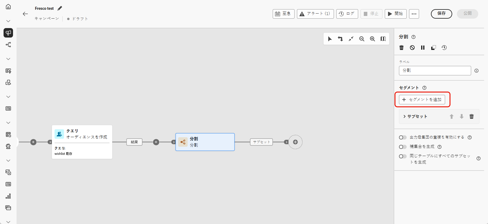
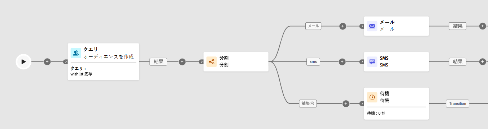

# 分割 {#split}

>[!CONTEXTUALHELP]
>id="ajo_orchestration_split"
>title="分割アクティビティ"
>abstract="**分割**&#x200B;アクティビティを使用すると、フィルタリングルールや母集団サイズなどの様々な選択条件に基づいて、流入母集団を複数のサブセットにセグメント化できます。"

+++ 目次

| 調整されたキャンペーンへようこそ | 最初の調整されたキャンペーンの開始 | データベースのクエリ | 調整されたキャンペーンアクティビティ |
|---|---|---|---|
| [ オーケストレーションされたキャンペーンの基本を学ぶ ](../gs-orchestrated-campaigns.md)  [ 設定手順 ](../configuration-steps.md)  [ オーケストレーションされたキャンペーンへのアクセスと管理 ](../access-manage-orchestrated-campaigns.md) | [ オーケストレーションされたキャンペーンを作成 ](../gs-campaign-creation.md)  [ キャンペーンを作成およびスケジュール ](../create-orchestrated-campaign.md)  [ アクティビティをオーケストレーション ](../orchestrate-activities.md)  [ キャンペーンを開始および監視 ](../start-monitor-campaigns.md)  [ レポート ](../reporting-campaigns.md) 主な手順 | [ ルールビルダーの操作 ](../orchestrated-rule-builder.md)  [ 最初のクエリの作成 ](../build-query.md)  [ 式の編集 ](../edit-expressions.md)  [ リターゲティング ](../retarget.md) | [ アクティビティの基本を学ぶ ](about-activities.md)   アクティビティ： [AND 結合 ](and-join.md) - [ オーディエンスを作成 ](build-audience.md) - [ ディメンションの変更 ](change-dimension.md) - [ チャネルアクティビティ ](channels.md) - [ 結合 ](combine.md) - [ 重複排除 ](deduplication.md) - [ エンリッチメント ](enrichment.md) - [ 分岐 ](fork.md) - [ 紐付け ](reconciliation.md)  <b></b>  - |

{style="table-layout:fixed"}

+++

 

**[!UICONTROL 分割]** アクティビティは、フィルタリングルールや母集団のサイズなどの定義済みの選択条件に基づいて、取り込む母集団を複数のサブセットにセグメント化する **[!UICONTROL ターゲティング]** アクティビティです。

## 分割アクティビティの設定 {#split-configuration}

>[!CONTEXTUALHELP]
>id="ajo_orchestration_split_segments"
>title="分割アクティビティのセグメント"
>abstract="入力母集団をセグメント化するのに必要な数のサブセットを追加します。  「**分割**」アクティビティを実行すると、母集団はアクティビティに追加された順序で様々なサブセットに分割されます。 調整されたキャンペーンを開始する前に、矢印ボタンを使用して、サブセットをニーズに合う順番に並べ替えておきます。"

>[!CONTEXTUALHELP]
>id="ajo_orchestration_split_filter"
>title="分割アクティビティのフィルター"
>abstract="サブセットにフィルタリング条件を適用するには、「**[!UICONTROL フィルターを作成]**」をクリックし、クエリモデラーを使用して目的のフィルタリングルールを設定します。例えば、データベースにメールアドレスが存在する入力母集団のプロファイルを含めます。"

>[!CONTEXTUALHELP]
>id="ajo_orchestration_split_limit"
>title="分割アクティビティの制限"
>abstract="サブセットで選択するプロファイル数を制限するには、「**[!UICONTROL 制限を有効にする]**」オプションの切替スイッチをオンにし、含める母集団の数または割合を指定します。"

>[!CONTEXTUALHELP]
>id="ajo_orchestration_split_sorting"
>title="分割アクティビティの並べ替え"
>abstract="サブセットの母集団制限を設定する場合、特定のプロファイル属性に基づいて、選択したプロファイルを昇順または降順にランク付けできます。 これを行うには、「**並べ替えを有効にする**」オプションの切替スイッチをオンにします。 例えば、購入金額が最も高い上位 50 のプロファイルのみを含むようにサブセットを制限できます。"

>[!CONTEXTUALHELP]
>id="ajo_orchestration_split_complement"
>title="分割で補集合を生成"
>abstract="すべてのサブセットを設定したら、どのサブセットにも一致しなかった残りの母集団を選択し、追加のアウトバウンドトランジションに含めることができます。 これを行うには、「**補集合を生成**」オプションの切替スイッチをオンにします。"

>[!CONTEXTUALHELP]
>id="ajo_orchestration_split_generatesubsets"
>title="同じテーブルにすべてのサブセットを生成"
>abstract="このオプションをオンに切り替えると、すべてのサブセットが 1 つの出力トランジションにグループ化されます。"

>[!CONTEXTUALHELP]
>id="ajo_orchestration_split_emptytransition"
>title="空のトランジションをスキップ"
>abstract="「**[!UICONTROL 空のトランジションをスキップ]**」オプションをオンに切り替えると、入力母集団が空の場合に、このサブセットの出力トランジションが無効になります。"

>[!CONTEXTUALHELP]
>id="ajo_orchestration_split_enable_overlapping"
>title="出力母集団の重複を有効にする"
>abstract=" 「**[!UICONTROL 出力母集団の重複を有効にする]**」オプションにより、複数のサブセットに属している母集団を管理できます。このオプションを選択していない場合、サブセットの条件を複数満たす場合でも、複数の出力トランジションに受信者が表示されません。受信者は、一致した基準の 1 番目のタブのターゲットになります。チェックボックスをオンにすると、受信者がフィルター条件を満たす場合、複数のサブセットで受信者を検索できます。"

**[!UICONTROL 分割]**&#x200B;アクティビティを設定するには、次の手順に従います。

1. オーケストレーションされたキャンペーンに **[!UICONTROL 分割]** アクティビティを追加します。

1. アクティビティ設定パネルが開き、デフォルトのサブセットが表示されます。「**[!UICONTROL セグメントを追加]**」ボタンをクリックして、入力母集団をセグメント化する必要な数のサブセットを追加します。

   

   >[!IMPORTANT]
   >
   >**分割** アクティビティでは、サブセットが追加された順序で処理されます。 例えば、最初のサブセットが母集団の 70% を取得した場合、次は、残りの 30% に条件を適用します。
   >
   >調整したキャンペーンを実行する前に、サブセットが意図したとおりに並べ替えられていることを確認します。 矢印ボタンを使用して、位置を調整します。

1. サブセットを追加したら、アクティビティにはサブセットと同数の出力トランジションが表示されます。調整されたキャンペーンキャンバスでサブセットを簡単に識別できるように、各サブセットのラベルを変更することを強くお勧めします。

1. 各サブセットに対するフィルターの設定：

   1. サブセットをクリックして、設定を開きます。

   1. 「**[!UICONTROL フィルターを作成]**」をクリックし、クエリモデラーを使用してフィルタリングルールを定義します（例：有効なメールアドレスを持つプロファイルを選択）。

      

   1. 選択するプロファイルの数を制限するには、「**[!UICONTROL 制限を有効にする]** を有効にして、数または割合を指定します。

   1. サブセットが空の場合にトランジションをスキップするには、「**[!UICONTROL 空のトランジションをスキップ ].** を有効にします。

1. どのサブセットにも一致しないプロファイルを含めるには、「**[!UICONTROL 補集合を生成]**」を有効にします。 これにより、残りの母集団に追加のアウトバウンドトランジションが作成されます。

   >[!NOTE]
   >
   >**[!UICONTROL 同じテーブル内のすべてのサブセットを生成]** を有効にして、すべてのサブセットを 1 つのトランジションにグループ化します。

1. **[!UICONTROL 出力母集団の重複を有効にする]** を使用して、プロファイルを複数のサブセットに表示できます。

   * **オフの場合**、各プロファイルは 1 つのサブセットにのみ割り当てられ、最初のサブセットは、他のサブセットの対象であっても条件が一致します。

   * **オンの場合**、プロファイルがそれぞれの条件を満たす場合、複数のサブセットに含めることができます。

これでアクティビティが設定されました。キャンペーンの実施時に、母集団は、アクティビティに追加された順序で、様々なサブセットにセグメント化されます。

## 例{#split-example}

次の例では、**[!UICONTROL 分割]**&#x200B;アクティビティを使用して、使用する通信チャネルに基づいて、オーディエンスを個別のサブセットにセグメント化します。

* **サブセット 1 「メール」**：電話番号を指定したプロファイルを含みます。

* **サブセット 2 「sms」**：データベースに保存されている携帯電話番号を持つプロファイルをターゲットにします。

* **補集合トランジション**：いずれかのサブセットの条件を満たさない、残りのプロファイルをキャプチャします。

