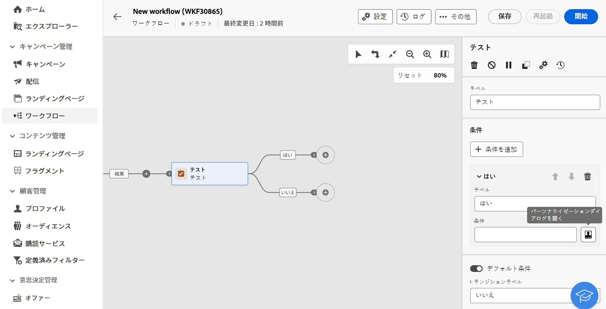
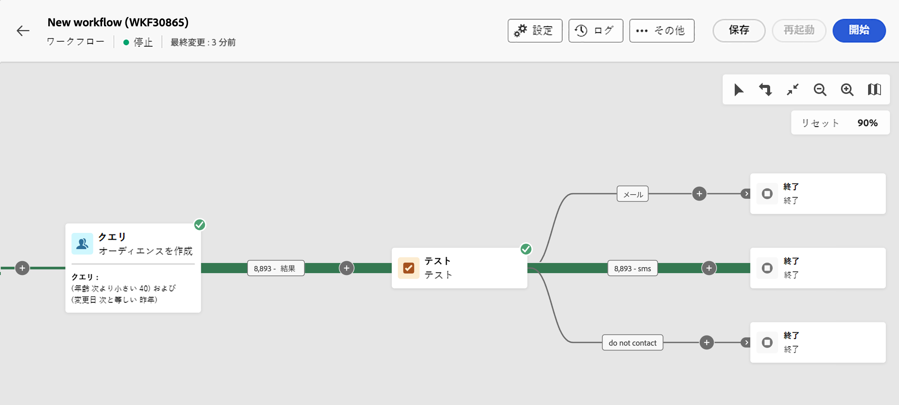
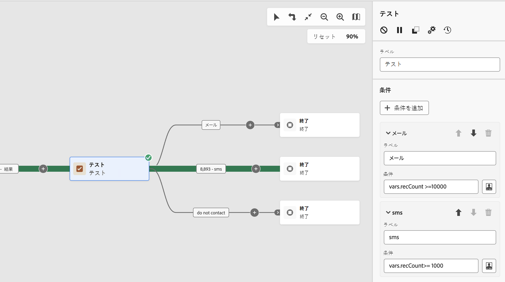

# テスト {#test}

>[!CONTEXTUALHELP]
>id="ajo_orchestration_test"
>title="テストアクティビティ"
>abstract="**テスト**&#x200B;アクティビティは&#x200B;**フロー制御**&#x200B;アクティビティです。指定した条件に基づいたトランジションを有効にできます。"

>[!CONTEXTUALHELP]
>id="ajo_orchestration_test_conditions"
>title="条件"
>abstract="**テスト**&#x200B;アクティビティには、複数の出力トランジションを含めることができます。調整されたキャンペーンの実行中、各条件はいずれか 1 つが満たされるまで順番にテストされます。どの条件も満たされない場合、調整されたキャンペーンは&#x200B;**[!UICONTROL デフォルト条件]**&#x200B;のパスに沿って続行されます。デフォルト条件がアクティブ化されていない場合、調整されたキャンペーンはこの時点で停止します。"

+++ 目次

| 調整されたキャンペーンへようこそ | 最初の調整されたキャンペーンの開始 | データベースのクエリ | キャンペーンアクティビティをキャンセル |
|---|---|---|---|
| [ オーケストレーションされたキャンペーンの概要 ](gs-orchestrated-campaigns.md)  [ 設定手順 ](configuration-steps.md)  [ オーケストレーションされたキャンペーンを作成するための主な手順 ](gs-campaign-creation.md) | [ オーケストレーションされたキャンペーンの作成 ](create-orchestrated-campaign.md)  [ アクティビティのオーケストレーション ](orchestrate-activities.md)  [ オーケストレーションされたキャンペーンでのメッセージの送信 ](send-messages.md)  [ キャンペーンの開始および監視 ](start-monitor-campaigns.md)  [ レポート ](reporting-campaigns.md) | [ クエリの操作Modeler](orchestrated-query-modeler.md)  [ 最初のクエリ ](build-query.md)  [ 編集式を作成 ](edit-expressions.md) | [ アクティビティの基本を学ぶ ](activities/about-activities.md)   アクティビティ： [AND 結合 ](activities/and-join.md) - [ オーディエンスを作成 ](activities/build-audience.md) - [ ディメンションを変更 ](activities/change-dimension.md) - [ 結合 ](activities/combine.md) - [ 重複排除 ](activities/deduplication.md) - [ エンリッチメント ](activities/enrichment.md) - [ 分岐 ](activities/fork.md) - [ 紐付け ](activities/reconciliation.md) - [ 分割 ](activities/split.md) [&#128279;](activities/wait.md) - |

{style="table-layout:fixed"}

+++

  

**テスト**&#x200B;アクティビティは&#x200B;**フロー制御**&#x200B;アクティビティです。指定した条件に基づいたトランジションを有効にできます。

## テストアクティビティの設定 {#test-configuration}

**テスト**&#x200B;アクティビティを設定するには、次の手順に従います。

1. 調整したキャンペーンに **テスト** アクティビティを追加します。

1. デフォルトでは、**[!UICONTROL テスト]**&#x200B;アクティビティは、単純なブール値テストを提示します。「True」トランジションで定義された条件が満たされると、このトランジションがアクティブ化されます。それ以外の場合は、デフォルトの「False」トランジションがアクティブ化されます。

1. トランジションに関連付けられた条件を設定するには、**[!UICONTROL パーソナライズ機能ダイアログを開く]**&#x200B;アイコンをクリックします。式エディターを使用して、このトランジションをアクティブ化するために必要なルールを定義します。また、イベント変数、条件、日時関数も利用できます。

   さらに、「**[!UICONTROL ラベル]**」フィールドを変更して、調整されたキャンペーンキャンバス上でトランジションの名前をパーソナライズできます。

   

1. 複数の出力トランジションを&#x200B;**[!UICONTROL テスト]**&#x200B;アクティビティに追加できます。これを行うには、「**[!UICONTROL 条件を追加]**」ボタンをクリックし、ラベルと、各トランジションに関連付けられた条件を設定します。
v
1. 調整されたキャンペーンの実行中、各条件はいずれか 1 つが満たされるまで順番にテストされます。どの条件も満たさない場合、オーケストレーションされたキャンペーンは **[!UICONTROL デフォルトの条件]** のパスに沿って続行します。 デフォルト条件がアクティブ化されていない場合、ワークフローはこの時点で停止します。

## 例 {#example}

この例では、**[!UICONTROL オーディエンスを作成]**&#x200B;アクティビティがターゲットとするプロファイルの数に基づいて、様々なトランジションが有効化されます。

* ターゲットとするプロファイルが 10,000 個以上の場合は、メールメッセージが送信されます。
* 1,000～10,000 個のプロファイルの場合、SMS が送信されます。
* ターゲットプロファイルが 1,000 個未満に該当する場合は、「連絡しない」トランジションに送信されます。

これを行うには、`vars.recCount` イベント変数を「メール」および「sms」条件で活用して、ターゲットプロファイルの数をカウントし、適切なトランジションをアクティブ化します。

