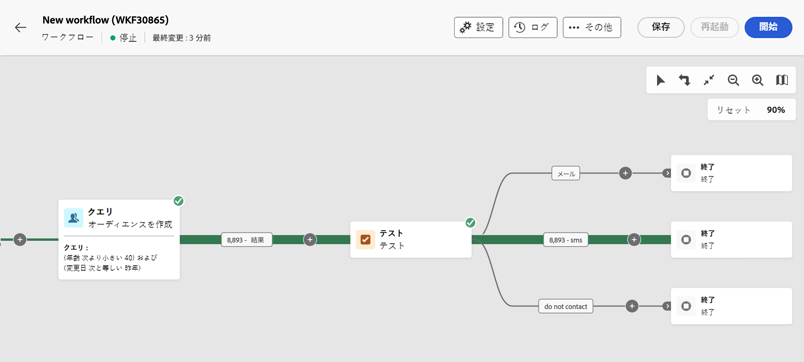

# テスト {#test}

>[!CONTEXTUALHELP]
>id="ajo_orchestration_test"
>title="テストアクティビティ"
>abstract="**テスト**&#x200B;アクティビティは&#x200B;**フロー制御**&#x200B;アクティビティです。指定した条件に基づいたトランジションを有効にできます。"

>[!CONTEXTUALHELP]
>id="ajo_orchestration_test_conditions"
>title="条件"
>abstract="**テスト**&#x200B;アクティビティには、複数の出力トランジションを含めることができます。オーケストレーションキャンペーンの実行中、各条件はいずれか 1 つが満たされるまで順番にテストされます。どの条件も満たされない場合、調整されたキャンペーンは&#x200B;**[!UICONTROL デフォルト条件]**&#x200B;のパスに沿って続行されます。デフォルト条件がアクティブ化されていない場合、調整されたキャンペーンはこの時点で停止します。"

**[!UICONTROL テスト]**&#x200B;アクティビティは&#x200B;**[!UICONTROL フロー制御]**&#x200B;アクティビティです。定義した条件に応じて異なるトランジションをアクティブ化することで、キャンペーンフローを分岐するために使用します。 各条件は、インバウンドトランジションのデータを評価でき、条件を評価する順序で、最初に実行するトランジションを選択できます。

## テストアクティビティの設定 {#test-configuration}

**[!UICONTROL テスト]** アクティビティを設定するには：

1. **[!UICONTROL テスト]** アクティビティをオーケストレーション済みキャンペーンキャンバスにドロップします。

1. デフォルトでは、アクティビティは単一のブール値テストを提供します。「True」条件が満たされると、そのトランジションがアクティブになります。そうでない場合、「False」（デフォルト）トランジションがアクティブになります。

   

1. 次のフィールドを入力して、トランジションの条件を定義します。

   * **ラベル**: キャンバス上でトランジションを識別できるように、トランジションの名前。

   * **条件の種類**：既定で母集団数を評価するデータ。

   * **演算子**：適用する比較（例：次と等しい、より大きい、より小さい）。 演算子のリストは、条件タイプのデータタイプによって異なります。

   * **値**：条件タイプを比較する値。

   

1. 2つ以上の結果に分岐するには、**[!UICONTROL 条件を追加]**&#x200B;をクリックし、追加の遷移ごとにラベルと条件を定義します。

1. 実行時に、キャンペーンは条件を順番に評価し、一致する最初の条件に従います。 条件が一致しない場合、実行は&#x200B;**[!UICONTROL デフォルトの条件]**&#x200B;に従います。設定されていない場合、キャンペーンは&#x200B;**[!UICONTROL テスト]** アクティビティで停止します。

## 例 {#example}

この例では、**[!UICONTROL オーディエンスを構築]** アクティビティでターゲットにしたプロファイルの数に基づいて、異なるトランジションがアクティブ化されます。 条件は順番に評価されます。最後のトランジションはデフォルトで、以前の条件が一致しない場合に使用されます。

* ターゲットとするプロファイルが 10,000 個以上の場合は、メールメッセージが送信されます。
* デフォルト（条件が一致しない）：カウントが10,000以下の場合、母集団は「非接触」トランジションに誘導されます。

