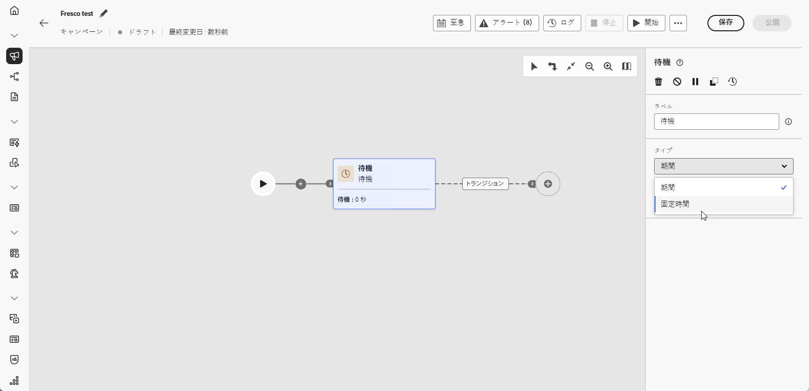
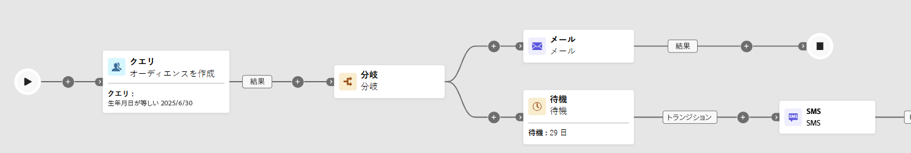

# 待機 {#wait}

>[!CONTEXTUALHELP]
>id="ajo_orchestration_wait"
>title="待機アクティビティ"
>abstract="**待機**&#x200B;アクティビティは、アクティビティ間のトランジションを遅延させるために使用します。"

+++ 目次

| 調整されたキャンペーンへようこそ | 最初の調整されたキャンペーンの開始 | データベースのクエリ | 調整されたキャンペーンアクティビティ |
|---|---|---|---|
| [ オーケストレーションされたキャンペーンの基本を学ぶ ](gs-orchestrated-campaigns.md)  [ 設定手順 ](configuration-steps.md)  [ オーケストレーションされたキャンペーンへのアクセスと管理 ](access-manage-orchestrated-campaigns.md) | [ キャンペーンの作成を調整するための主な手順 ](gs-campaign-creation.md)  [ キャンペーンの作成およびスケジュール設定 ](create-orchestrated-campaign.md)  [ アクティビティの調整 ](orchestrate-activities.md)  <b>[ キャンペーンの開始および監視 ](start-monitor-campaigns.md)</b>  [ レポート ](reporting-campaigns.md) | [ ルールビルダーの操作 ](orchestrated-rule-builder.md)  [ 最初のクエリの作成 ](build-query.md)  [ 式の編集 ](edit-expressions.md)  [ リターゲティング ](retarget.md) | [ アクティビティの基本を学ぶ ](activities/about-activities.md)   アクティビティ： [AND 結合 ](activities/and-join.md) - [ オーディエンスを作成 ](activities/build-audience.md) - [ ディメンションの変更 ](activities/change-dimension.md) - [ チャネルアクティビティ ](activities/channels.md) - [ 結合 ](activities/combine.md) - [ 重複排除 ](activities/deduplication.md) - [ エンリッチメント ](activities/enrichment.md) - [ 分岐 ](activities/fork.md) - [ 紐付け ](activities/reconciliation.md)    - |

{style="table-layout:fixed"}

+++

 

**[!UICONTROL 待機]** アクティビティは、調整されたキャンペーンで 2 つのアクティビティ間に遅延を導入するために使用される **[!UICONTROL フロー制御]** コンポーネントです。 これにより、フォローアップアクティビティの時間を短縮し、ユーザーエンゲージメントとの関連性を高めることができます。

例えば、メール配信の数日後に開封数とクリック数のトラックを待機してから、フォローアップメッセージを送信することができます。

## 設定{#wait-configuration}

**[!UICONTROL 待機]**&#x200B;アクティビティを設定するには、次の手順に従います。

1. **[!UICONTROL 待機]** アクティビティを、調整したキャンペーンに追加します。

1. ニーズに最適な待機タイプを選択します。

   * **[!UICONTROL 期間]**：次のアクティビティに進むまでの遅延時間を、秒、分、時間、日で指定します。

   * **[!UICONTROL 固定時間]**：次のアクティビティを開始するまでの特定の日時を設定します。

   

## 例{#wait-example}

以下に、**[!UICONTROL 待機]** アクティビティの一般的なユースケースを示します。  プロモーションコードを含むメールが、誕生日を祝うプロファイルに送信されます。 29 日後、誕生日のプロモーションコードの有効期限が近づいていることを示すリマインダーとして、SMS が同じグループに送信されます。

