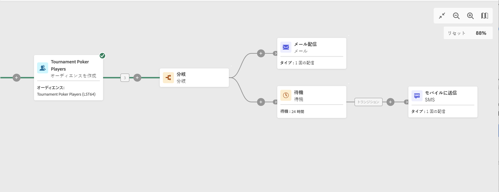

# 待機 {#wait}

>[!CONTEXTUALHELP]
>id="ajo_orchestration_wait"
>title="待機アクティビティ"
>abstract="**待機**&#x200B;アクティビティは、アクティビティ間のトランジションを遅延させるために使用します。"

+++ 目次

| 調整されたキャンペーンへようこそ | 最初の調整されたキャンペーンの開始 | データベースのクエリ | キャンペーンアクティビティをキャンセル |
|---|---|---|---|
| [ オーケストレーションされたキャンペーンの概要 ](../gs-orchestrated-campaigns.md)  [ 設定手順 ](../configuration-steps.md)  [ オーケストレーションされたキャンペーンを作成するための主な手順 ](../gs-campaign-creation.md) | [ オーケストレーションされたキャンペーンの作成 ](../create-orchestrated-campaign.md)  [ アクティビティのオーケストレーション ](../orchestrate-activities.md)  [ オーケストレーションされたキャンペーンでのメッセージの送信 ](../send-messages.md)  [ キャンペーンの開始および監視 ](../start-monitor-campaigns.md)  [ レポート ](../reporting-campaigns.md) | [ クエリの操作Modeler](../orchestrated-query-modeler.md)  [ 最初のクエリ ](../build-query.md)  [ 編集式を作成 ](../edit-expressions.md) | [ アクティビティの基本を学ぶ ](about-activities.md)   アクティビティ： [AND 結合 ](and-join.md) - [ オーディエンスを作成 ](build-audience.md) - [ ディメンションを変更 ](change-dimension.md) - [ 結合 ](combine.md) - [ 重複排除 ](/deduplication.md) - [ エンリッチメント ](enrichment.md) - [ 分岐 ](fork.md) - [ 紐付け ](reconciliation.md) - [ 分割 ](split.md) [&#128279;](wait.md) - |

{style="table-layout:fixed"}

+++

  

**待機**&#x200B;アクティビティは、**フロー制御**&#x200B;アクティビティです。これは、実行する 2 つのアクティビティ間に一定の時間間隔を設定するために使用します。例えば、メール配信アクティビティを実行したあと数日間待機し、この期間中に発生した開封数とクリック数を分析してから、フォローアップ操作（リマインダーメール、オーディエンスの作成など）を実行します。

## 設定{#wait-configuration}

**待機**&#x200B;アクティビティを設定するには、次の手順に従います。

1. **待機** アクティビティを、調整したキャンペーンに追加します。

1. インバウンドトランジションとアウトバウンドトランジションの間の待機&#x200B;**期間**&#x200B;を指定します。

1. 「**期間**」フィールドで、秒、分、時間、日などの時間単位を選択します。

## 例{#wait-example}

以下に、**待機**&#x200B;アクティビティの一般的なユースケースを示します。イベントへの招待メールを送信します。送信後 24 時間が経過すると、同じ母集団に SMS 配信が送信されます。

