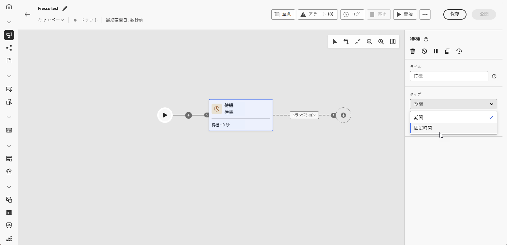

# 待機 {#wait}

>[!CONTEXTUALHELP]
>id="ajo_orchestration_wait"
>title="待機アクティビティ"
>abstract="**待機**&#x200B;アクティビティは、アクティビティ間のトランジションを遅延させるために使用します。"

**[!UICONTROL 待機]**&#x200B;アクティビティは、調整されたキャンペーン内の 2 つのアクティビティ間に遅延を導入するのに使用される&#x200B;**[!UICONTROL フロー制御]**&#x200B;コンポーネントです。 これにより、フォローアップアクティビティの時間を短縮し、ユーザーエンゲージメントとの関連性を高めることができます。

例えば、メール配信後に数日待機して、開封数とクリック数を追跡してから、フォローアップメッセージを送信できます。

## 設定{#wait-configuration}

>[!IMPORTANT]
>
>一時テーブルのデータは&#x200B;**5日**&#x200B;以降は保持されません。 **[!UICONTROL 期間]**&#x200B;または&#x200B;**[!UICONTROL 固定時間]**&#x200B;待機を使用する場合は、中間データが引き続き利用できるように、次のアクティビティがその制限内で完了するまで経過時間を確保してください。

**[!UICONTROL 待機]**&#x200B;アクティビティを設定するには、次の手順に従います。

1. **[!UICONTROL 待機]**&#x200B;アクティビティを調整されたキャンペーンに追加します。

1. ニーズに最適な待機タイプを選択します。

   * **[!UICONTROL 期間]**：次のアクティビティに進む前に、秒、分、時間、日で遅延を指定します。

   * **[!UICONTROL 固定時間]**：次のアクティビティが開始される特定の日時を設定します。

   

## 例{#wait-example}

次に、**[!UICONTROL 待機]**&#x200B;アクティビティの一般的なユースケースを示します。  誕生日を祝うプロファイルには、プロモーションコードが記載されたメールが送信されます。 2日後、誕生日プロモーションコードの有効期限が近づいたことを知らせるリマインダーとして、SMSが同じグループに送信されます。

