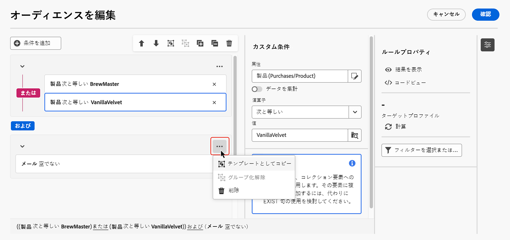

# 最初のルールを作成 {#build-query}

+++ 目次

| 調整されたキャンペーンへようこそ | 最初の調整されたキャンペーンの開始 | データベースのクエリ | キャンペーンアクティビティをキャンセル |
|---|---|---|---|
| [ オーケストレーションされたキャンペーンの概要 ](gs-orchestrated-campaigns.md)  [ 設定手順 ](configuration-steps.md)  [ オーケストレーションされたキャンペーンを作成するための主な手順 ](gs-campaign-creation.md) | [ オーケストレーションされたキャンペーンの作成 ](create-orchestrated-campaign.md)  [ オーケストレーションされたキャンペーンの設定 ](orchestrated-campaign-settings.md)  [ アクティビティのオーケストレーション ](orchestrate-activities.md)  [ オーケストレーションされたキャンペーンを使用したメッセージの送信 ](send-messages.md)  [ キャンペーンの開始と監視 ](start-monitor-campaigns.md)  [ レポート ](reporting-campaigns.md) | [ ルールビルダーの操作 ](orchestrated-rule-builder.md)  <b>[ 最初のクエリの作成 ](build-query.md)</b>  [ 式の編集 ](edit-expressions.md) | [ アクティビティの基本を学ぶ ](activities/about-activities.md)   アクティビティ： [AND 結合 ](activities/and-join.md) - [ オーディエンスを作成 ](activities/build-audience.md) - [ ディメンションを変更 ](activities/change-dimension.md) - [ 結合 ](activities/combine.md) - [ 重複排除 ](activities/deduplication.md) - [ エンリッチメント ](activities/enrichment.md) - [ 分岐 ](activities/fork.md) - [ 紐付け ](activities/reconciliation.md) - [ 分割 ](activities/split.md) [&#128279;](activities/wait.md) - |

{style="table-layout:fixed"}

+++

 

調整されたキャンペーンのルールを作成する主な手順は次のとおりです。

1. **条件の追加** - データベースの属性と高度な式を使用して独自の条件を作成することで、クエリをフィルタリングするカスタム条件を作成します。
1. **条件の組み合わせ** - グループと論理演算子を使用して、キャンバスで条件を配置します。
1. **ルールをチェックして検証する** - ルールを保存する前に、ルールの結果データを確認します。

## 条件の追加 {#conditions}

クエリに条件を追加するには、次の手順に従います。

1. **[!UICONTROL オーディエンスを作成]** アクティビティからルールビルダーにアクセスします。

1. 「**条件を追加**」ボタンをクリックして、クエリの最初の条件を作成します。

   定義済みフィルターを使用してクエリを開始することもできます。 これを行うには、「**[!UICONTROL フィルターを選択または保存]**」ボタンをクリックし、「**[!UICONTROL 定義済みフィルターを選択]** を選択します。

1. 条件の条件として使用する属性をデータベースから特定します。 属性の横にある「i」アイコンは、属性が格納されているテーブルとそのデータタイプに関する情報を提供します。

   

   >[!NOTE]
   >
   >「**式を編集**」ボタンを使用すると、式エディターを使用して、データベース関数とヘルパー関数のフィールドを使用して式を手動で定義できます。 [式の編集方法を学ぶ](../orchestrated/edit-expressions.md)

1. 属性の横にある  ボタンをクリックして、次の追加オプションにアクセスします。

+++ 値の配分

   テーブル内の特定の属性に対する値の分布を分析します。 この機能は、使用可能な値、その数および割合を理解するのに特に役立ちます。また、クエリや式の作成時に、大文字と小文字の区別やスペルの不一致などの問題を回避する上でも役立ちます。

   多数の値を持つ属性の場合、ツールには最初の 20 個のみが表示されます。このような場合、この制限を示す&#x200B;**[!UICONTROL 部分読み込み]**&#x200B;通知が表示されます。詳細フィルターを適用して表示される結果を絞り込み、特定の値やデータのサブセットにフォーカスできます。

   

+++

+++ お気に入りに追加

   お気に入りメニューに属性を追加すると、最も頻繁に使用する属性にすばやくアクセスできます。 最大 20 個の属性をお気に入りに追加できます。 お気に入りと最近使用した属性は、組織内の各ユーザーに関連付けられ、様々なマシンからアクセスできるので、デバイス間でシームレスなエクスペリエンスを実現できます。

   お気に入りの属性にアクセスするには、**[!UICONTROL お気に入りと最近使用したもの]** メニューを使用します。 お気に入りの属性が最初に表示され、その後に最近使用した属性が表示されるので、必要な属性を簡単に見つけることができます。 属性をお気に入りから削除するには、もう一度スターアイコンを選択します。

   

+++

1. 「**[!UICONTROL 確認]**」をクリックして、選択した属性を条件に追加します。

1. プロパティペインが表示され、属性に必要な値を設定できます。

   

1. 適用する **[!UICONTROL オペレーター]** をドロップダウンリストから選択します。

   様々な演算子が使用可能です。ドロップダウンリストで使用できる演算子は、属性のデータタイプによって異なります。

   +++使用可能な演算子のリスト

   | 演算子 | 目的 | 例 |
   |---|---|---|
   | 次と等しい | 2 番目の「値」列に入力されたデータと同一の結果を返します。 | 姓（@lastName）が「佐藤」と等しいは、姓が佐藤の受信者のみを返します。 |
   | 次と等しくない | 入力された値と等しくないすべての値を返します。 | 言語（@language）が「英語」と等しくない。 |
   | 次より大きい | 入力された値より大きい値を返します。 | 年齢（@age）が 50 より大きいは、「50」より大きいすべての値（「51」、「52」など）を返します。 |
   | 次より小さい | 入力された値より小さい値を返します。 | 作成日（@created）が「DaysAgo(100)」より小さいは、過去 100 日以内に作成されたすべての受信者を返します。 |
   | 同じかそれ以上 | 入力された値より大きいか等しいすべての値を返します。 | 年齢（@age）が「30」よりも大きいか等しいは、30 歳以上のすべての受信者を返します。 |
   | 同じかそれ以下 | 入力された値より小さいか等しいすべての値を返します。 | 年齢（@age）が「60」よりも小さいか等しいは、60 歳以下のすべての受信者を返します。 |
   | 次に含まれる | 指定された値に含まれる結果を返します。これらの値はコンマで区切る必要があります。 | 生年月日（@birthDate）が「1979/12/10, 1984/12/10」に含まれるは、これらの日付の間に生まれた受信者を返します。 |
   | 次に含まれない | 「次に含まれる」演算子と同様に機能します。ここでは、入力した値に基づいて受信者が除外されます。 | 生年月日（@birthDate）が「1972/12/10, 1984/12/10」に含まれません。これらの日付に生まれた受信者は返されません。 |
   | 空である | 2 番目の値列で空の値に一致する結果を返します。 | モバイル（@mobilePhone）が空であるは、モバイル番号がないすべての受信者を返します。 |
   | 空でない | 「空である」演算子の逆の機能です。2 番目の「値」列にあるデータを入力する必要はありません。 | メール（@email）は空でない。 |
   | 次で始まる | 入力された値で始まる結果を返します。 | アカウント番号（@account）が「32010」で始まる。 |
   | 次で始まらない | 入力された値で始まらない結果を返します。 | アカウント番号（@account）が「20」で始まりません。 |
   | 次を含む | 入力された値を含む結果を返します。 | メールドメイン（@domain）が「mail」を含むは、「mail」を含むすべてのドメイン名（「gmail.com」など）を返します。 |
   | 次を含まない | 入力された値を含まない結果を返します。 | メールドメイン（@domain）が「vo」を含みません。結果には「vo」を含むドメイン名（「voila.fr」など）は表示されません。 |
   | 次に類似 | 「次を含む」演算子と同様に、値に % ワイルドカード文字を挿入できます。 | 姓（@lastName）が「Jon%s」に類似しています。ワイルドカード文字は、「佐藤」のような名前を見つけるために「ジョーカー」として機能します。 |
   | 次に類似しない | 「次を含む」演算子と同様に、値に % ワイルドカード文字を挿入できます。 | 姓（@lastName）が「Smi%h」に類似していません。姓が「田中」の受信者は返されません。 |

   +++

1. 「**値**」フィールドで、期待値を定義します。また、式エディターを使用して、データベース関数とヘルパー関数のフィールドを使用して、手動で式を定義することもできます。 それには、「 アイコンをクリックします。 [式の編集方法を学ぶ](../orchestrated/edit-expressions.md)

   日付タイプの属性の場合、「**[!UICONTROL プリセット]**」オプションを使用して定義済みの値を使用できます。

   +++例を参照

   

   +++

### リンクされたテーブルのカスタム条件（1 対 1 および 1 対多リンク）{#links}

カスタム条件を使用すると、ルールで現在使用されているテーブルにリンクされたテーブルに対してクエリを実行できます。これには、1 対 1 の基数リンクを持つテーブルや、コレクションテーブル（1 対多リンク）が含まれます。

**1 対 1 リンク**&#x200B;の場合は、リンクされたテーブルに移動し、目的の属性を選択して、期待される値を定義します。

また、**値**&#x200B;ピッカーでテーブルリンクを直接選択して確認することもできます。その場合、次の例に示すように、専用のピッカーを使用して、選択したテーブルで使用可能な値を選択する必要があります。

+++クエリの例

ここでは、クエリは、ラベルが「実行中」であるブランドをターゲットにしています。

1. **ブランド**&#x200B;テーブル内に移動し、**ラベル**&#x200B;属性を選択します。

   

1. 属性の期待値を定義します。

   

テーブルリンクを直接選択したクエリのサンプルを以下に示します。このテーブルで使用可能な値は、専用のピッカーから選択する必要があります。

+++

**1 対多リンク**&#x200B;の場合は、次の例に示すように、サブ条件を定義してクエリを絞り込むことができます。

+++クエリの例

ここでは、クエリは、Brewmsaster 製品に関連する購入を行った受信者を 100 ドル以上ターゲティングしています。

1. **購入**&#x200B;テーブルを選択し、確定します。

1. 「**[!UICONTROL 条件を追加]**」をクリックして、選択したテーブルに適用するサブ条件を定義します。

   

1. ニーズに合わせてサブ条件を追加します。

   

+++

### 集計データを使用したカスタム条件 {#aggregate}

カスタム条件を使用すると、集計操作を実行できます。これを行うには、コレクション テーブルから属性を直接選択する必要があります。

1. 目的のコレクションテーブル内に移動し、集計操作を実行する属性を選択します。

1. プロパティパネルで、「**データを集計**」オプションの切替スイッチをオンにして、目的の集計関数を選択します。

   

## 演算子を使用して条件を組み合わせる {#operators}

ルールに新しい条件を追加するたびに、**AND** 演算子によって既存の条件に自動的にリンクされます。 つまり、2 つの条件の結果が結合されます。

条件間で演算子を変更するには、条件間で演算子をクリックし、目的の演算子を選択します。

使用可能な演算子を以下に示します。

* **AND（積集合）**：アウトバウンドトランジション内のすべてのフィルタリングコンポーネントと一致する結果を結合します。
* **OR（和集合）**：アウトバウンドトランジション内のフィルタリングコンポーネントの 1 つ以上と一致する結果が含まれます。
* **EXCEPT （除外）**：アウトバウンドトランジションですべてのフィルタリングコンポーネントに一致する結果を除外します。

## 条件の操作 {#manipulate}

ルールビルダーのキャンバスツールバーには、ルール内の条件を簡単に操作できるオプションが用意されています。

| ツールバーアイコン | 説明 |
|--- |--- |
|  | コンポーネントを 1 行上に移動します。 |
|  | コンポーネントを行下に移動します。 |
|  | 2 つのコンポーネントを 1 つのグループに配置します。 |
|  | 単一グループのコンポーネントを分離します。 |
|  | すべてのグループを展開します。 |
|  | すべてのグループを折りたたみます。 |
|  | すべてのグループとコンポーネントを削除します。 |

必要に応じて、コンポーネントを同じグループにグループ化し、それらをリンクすることで、コンポーネントの中間グループを作成する必要が生じる場合があります。

* 既存の 2 つの条件をグループ化するには、2 つの条件の 1 つを選択し、 または  ボタンをクリックして、上または下にある条件でグループ化します。

* 既存の条件を新しい条件でグループ化するには、条件を選択し、「その他のアクション  ボタンをクリックして、「**[!UICONTROL グループを追加]**」を選択します。 グループに追加する新しい属性を選択して、確認します。

  

次の例では、BrewMaster 製品または VanillaVelvet 製品を購入したお客様をターゲットとする中間グループを作成しました。

## クエリを確認および検証

キャンバスにクエリを作成したら、**ルールのプロパティ** ペインを使用して確認できます。 使用可能な操作を以下に示します。

* **結果を表示：**&#x200B;クエリから生成されたデータを表示します。
* **コードビュー**：クエリのコードベースバージョンを SQL で表示します。
* **計算**：ルールのターゲットとなるレコード数を更新および表示します。
* **フィルターを選択または保存**：キャンバスで使用する既存の定義済みフィルターを選択するか、後で再利用できるように、クエリを定義済みフィルターとして保存します。

  >[!IMPORTANT]
  >
  >「ルールのプロパティ」ペインから定義済みフィルターを選択すると、キャンバスで作成されたルールが選択したフィルターに置き換わります。

ルールの準備が整ったら、の **[!UICONTROL 確認]** ボタンをクリックしてルールを保存します。
