# 設定の手順 {#configuration-steps}

+++ 目次

| 調整されたキャンペーンへようこそ | 最初の調整されたキャンペーンの開始 | データベースのクエリ | 調整されたキャンペーンアクティビティ |
|---|---|---|---|
| [ オーケストレーションされたキャンペーンの基本を学ぶ ](gs-orchestrated-campaigns.md)<br/><br/>[ 設定手順 ](configuration-steps.md)<br/><br/>[ オーケストレーションされたキャンペーンへのアクセスと管理 ](access-manage-orchestrated-campaigns.md) | [ キャンペーンの作成を調整するための主な手順 ](gs-campaign-creation.md)<br/><br/>[ キャンペーンの作成およびスケジュール設定 ](create-orchestrated-campaign.md)<br/><br/>[ アクティビティの調整 ](orchestrate-activities.md)<br/><br/><b>[ キャンペーンの開始および監視 ](start-monitor-campaigns.md)</b><br/><br/>[ レポート ](reporting-campaigns.md) | [ ルールビルダーの操作 ](orchestrated-rule-builder.md)<br/><br/>[ 最初のクエリの作成 ](build-query.md)<br/><br/>[ 式の編集 ](edit-expressions.md)<br/><br/>[ リターゲティング ](retarget.md) | [ アクティビティの基本を学ぶ ](activities/about-activities.md)<br/><br/> アクティビティ：<br/>[AND 結合 ](activities/and-join.md) - [ オーディエンスを作成 ](activities/build-audience.md) - [ ディメンションの変更 ](activities/change-dimension.md) - [ チャネルアクティビティ ](activities/channels.md) - [ 結合 ](activities/combine.md) - [ 重複排除 ](activities/deduplication.md) - [ エンリッチメント ](activities/enrichment.md) - [ 分岐 ](activities/fork.md) - [ 紐付け ](activities/reconciliation.md) [&#128279;](save-audience.md) [&#128279;](activities/split.md) [&#128279;](activities/wait.md) - |

{style="table-layout:fixed"}

+++

</br>

>[!BEGINSHADEBOX]

ドキュメントを処理中

>[!ENDSHADEBOX]

このガイドでは、リレーショナルスキーマの作成、オーケストレートキャンペーン用のデータセットの設定、S3 ソースを介したデータの取り込み、AP プラットフォームで取り込んだデータのクエリのプロセスについて説明します。

この例では、設定に 2 つの主要なエンティティ **ロイヤルティトランザクション** と **ロイヤルティ報酬** の統合が含まれており、それらを既存のコアエンティティ **受信者** と **ブランド** にリンクしています。


1. [DDL ファイルのアップロード](#upload-ddl)

   **ロイヤルティトランザクション** および **ロイヤルティ報酬** エンティティを、必要なキーとバージョン属性を含め、調整されたキャンペーンのリレーショナルデータモデルを定義します。

1. [エンティティを選択](#entities)

   スキーマ内のテーブル間に意味のある関係を確立し、凝集した相互接続されたデータモデルを作成します。

1. [スキーマをリンク](#link-schema)

   **ロイヤルティトランザクション** エンティティを **受信者** に、**ロイヤルティ報酬** を **ブランド** にリンクして、パーソナライズされたカスタマージャーニーをサポートする接続されたデータモデルを作成します。

1. [データの取り込み](#ingest)

   SFTP、クラウドストレージ、データベースなど、サポートされているソースからAdobe Experience Platformにデータを取り込みます。

## DDL ファイルをアップロード {#upload-ddl}

この節では、DDL （Data Definition Language）ファイルをアップロードしてAdobe Experience Platform内にリレーショナルスキーマを作成する手順を説明します。 DDL ファイルを使用すると、テーブル、属性、キー、関係など、データモデルの構造を事前に定義できます。

1. AP プラットフォームにログインします。

1. **データ管理**/**スキーマ** に移動します。

1. **スキーマを作成** をクリックします。

1. 次の 2 つのスキーマタイプから選択するように求められます。

   * **標準**
   * **リレーショナル**、オーケストレートキャンペーン専用

   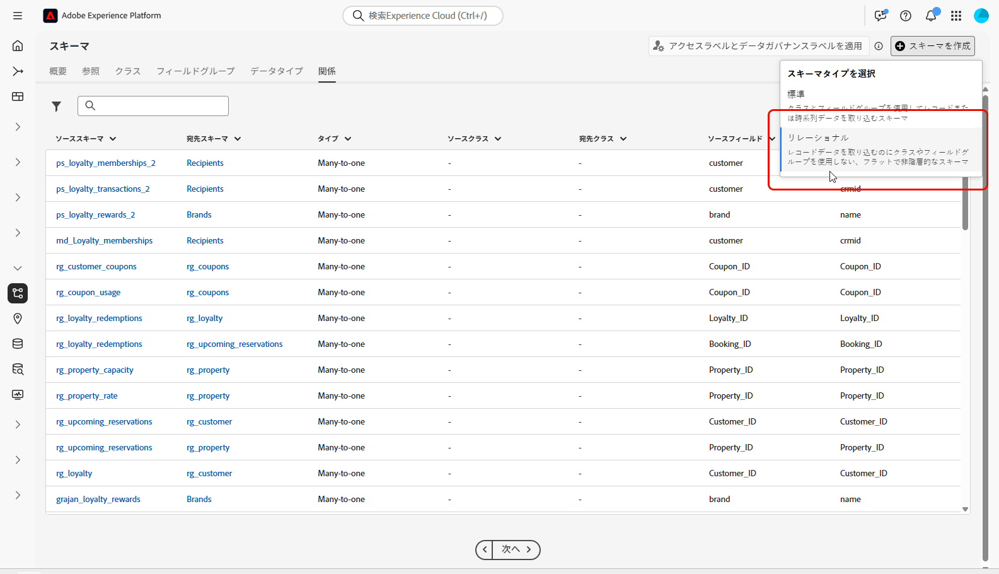

1. **DDL ファイルをアップロード** を選択して、エンティティ関係図を定義し、スキーマを作成します。

   テーブル構造には、次の内容を含める必要があります。
   * 1 つ以上のプライマリキー
   * バージョン識別子（`lastmodified` タイプまたは `datetime` タイプの `number` フィールドなど）。

1. DDL ファイルをドラッグ&amp;ドロップし、「**[!UICONTROL 次へ]**」をクリックします。

1. **[!UICONTROL スキーマ名]** を入力します。

1. 各スキーマとその列を設定し、プライマリキーが指定されていることを確認します。

   `lastmodified` などの 1 つの属性をバージョン記述子として指定する必要があります。 この属性は、通常 `datetime`、`long` または `int` のタイプで、データセットが最新のデータバージョンで更新されていることを確認するための取り込みプロセスに不可欠です。

   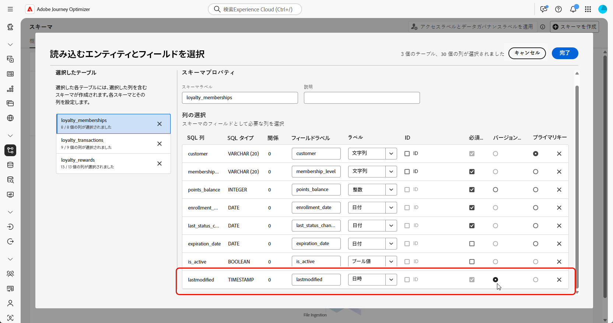

1. 完了したら **[!UICONTROL 完了]** をクリックします。

キャンバス内のテーブルとフィールドの定義を確認できるようになりました。 [ 詳しくは、以下の節を参照してください ](#entities)

## エンティティを選択 {#entities}

スキーマ内のテーブル間の論理接続を定義するには、次の手順に従います。

1. データモデルのキャンバスビューにアクセスし、リンクする 2 つのテーブルを選択します

1. ソース結合の横にある「」ボタンをクリックし、矢印をドラッグしてターゲット結合の方向に誘導し、接続を確立します。

   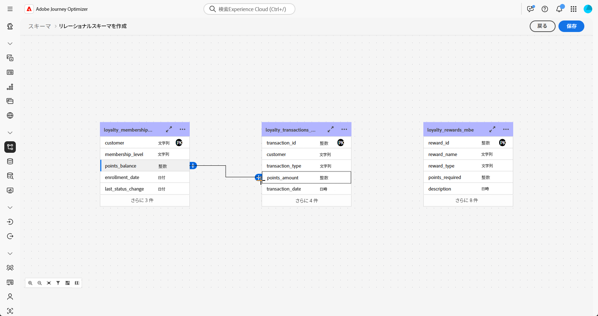

1. 指定されたフォームに入力してリンクを定義し、設定が完了したら「**適用**」をクリックします。

   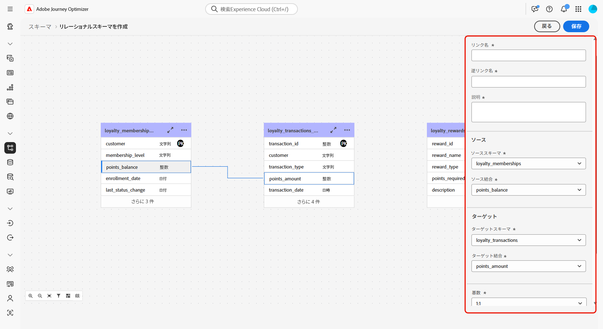

   **カーディナリティ**:

   * **一対多**：ソーステーブルの 1 つのオカレンスは、ターゲットテーブルの複数のオカレンスに対応させることができますが、ターゲットテーブルの 1 つのオカレンスは、ソーステーブルの最大 1 つのオカレンスにのみ対応させることができます。

   * **多対一**：ターゲットテーブルの 1 つのオカレンスは、ソーステーブルの複数のオカレンスに対応させることができますが、ソーステーブルの 1 つのオカレンスは、ターゲットテーブルの最大 1 つのオカレンスにのみ対応させることができます。

   * **一対一**：ソーステーブルの 1 つのオカレンスは、最大でターゲットテーブルの 1 つのオカレンスに対応させることができます。

1. データモデルで定義されたすべてのリンクは、キャンバス表示では矢印として表されます。必要に応じて、詳細を表示したり、編集したり、リンクを削除したりするには、2 つのテーブル間の矢印をクリックします。

   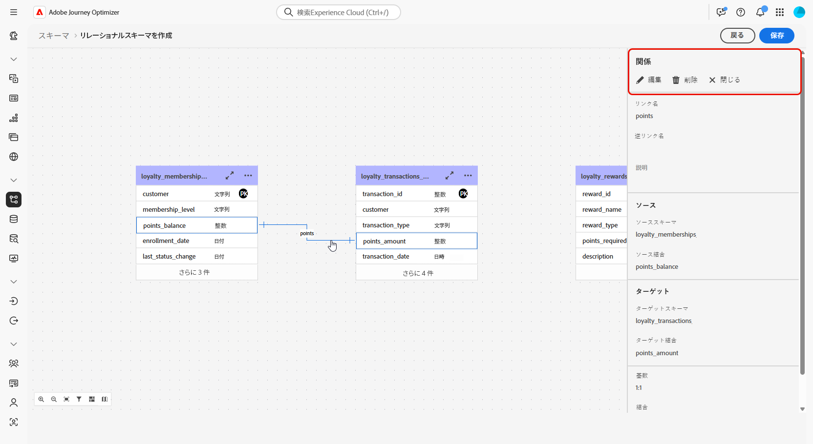

1. ツールバーを使用して、キャンバスをカスタマイズおよび調整します。

   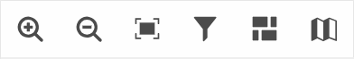

   * **ズームイン**：データモデルの詳細がより明確に表示するには、キャンバスを拡大します。

   * **ズームアウト**：データモデルをより広く表示するには、キャンバスサイズを縮小します。

   * **ビューに合わせる**：表示領域内のすべてのスキーマに合わせてズームを調整します。

   * **フィルター**：キャンバス内に表示するスキーマを選択します。

   * **自動レイアウトを強制**：スキーマを自動的に配置して、整理を強化します。

   * **マップを表示**：ミニマップオーバーレイを切り替えて、大きなスキーマレイアウトや複雑なスキーマレイアウトをより簡単に移動できるようにします。

1. 完了したら **保存** をクリックします。 このアクションにより、スキーマおよび関連するデータセットが作成され、オーケストレートキャンペーンで使用するためのデータセットが有効になります。

1. **[!UICONTROL ジョブを開く]** をクリックして、作成ジョブの進行状況を監視します。 このプロセスには、DDL ファイルで定義されたテーブルの数に応じて、数分かかる場合があります。

   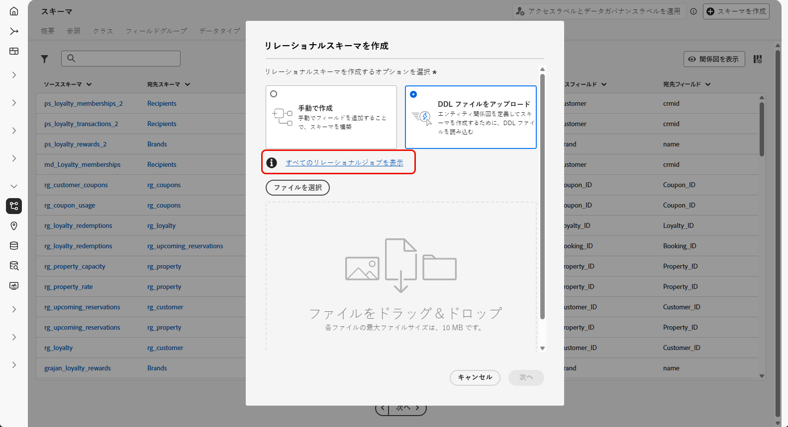

## スキーマをリンク {#link-schema}

**ロイヤルティトランザクション** スキーマと **受信者** スキーマの関係を確立して、各トランザクションを正しい顧客レコードに関連付けます。

1. **[!UICONTROL スキーマ]** に移動し、以前に作成した **ロイヤルティトランザクション** を開きます。

1. 顧客 **[!UICONTROL フィールドプロパティ]** から「**[!UICONTROL 関係を追加]**」をクリックします。

   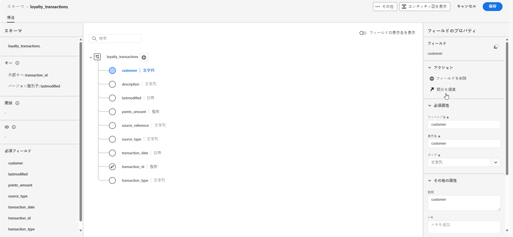

1. 関係 **[!UICONTROL タイプ]** として「**[!UICONTROL 多対 1]**」を選択します。

1. 既存の **受信者** スキーマにリンクします。

   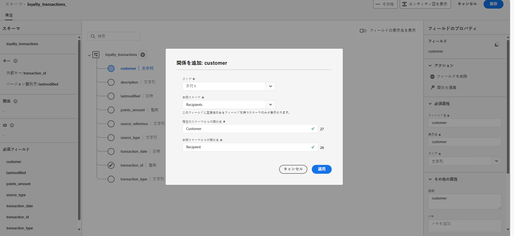

1. **[!UICONTROL 現在のスキーマからの関係名]** および **[!UICONTROL 参照スキーマからの関係名]** を入力します。

1. 「**[!UICONTROL 適用]**」をクリックして変更を保存します。

**ロイヤルティ報酬** スキーマと **ブランド** スキーマの間の関係を作成し、各報酬エントリを適切なブランドに関連付けて続行します。

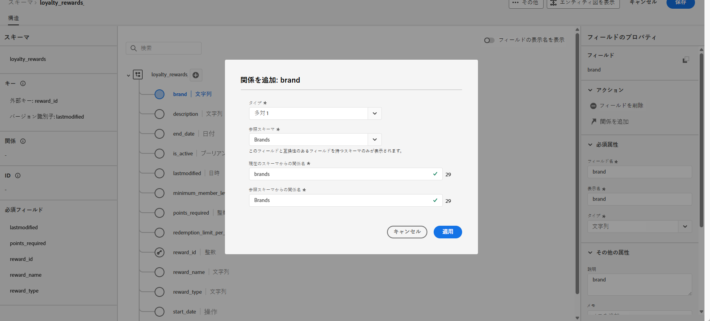

## データの取得 {#ingest}

Adobe Experience Platformを使用すると、データを外部ソースから取得しながら、Experience Platform サービスを使用して、受信データの構造化、ラベル付け、拡張を行うことができます。 アドビのアプリケーション、クラウドベースのストレージ、データベースなど、様々なソースからデータを取り込むことができます。

1. **[!UICONTROL 接続]** メニューから **[!UICONTROL ソース]** メニューにアクセスします。

1. 「**[!UICONTROL クラウドストレージ]**」カテゴリを選択し、「Amazon S3」を選択して、「**[!UICONTROL データを追加]**」をクリックします。

   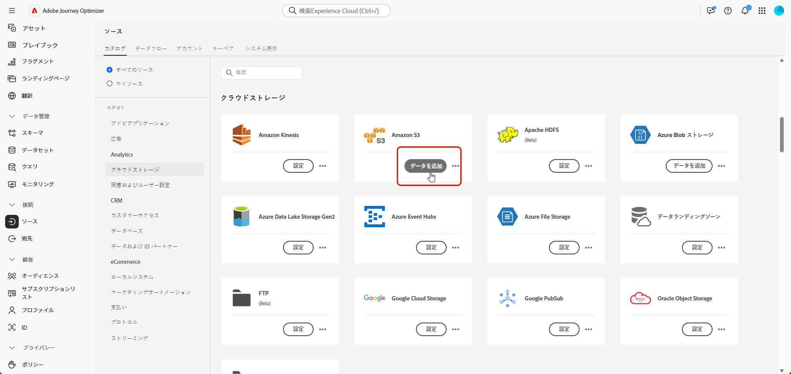

1. S3 アカウントの接続：

   * 既存のアカウントで

   * 新しいアカウントで

   [詳しくは、Adobe Experience Platform ドキュメントを参照してください](https://experienceleague.adobe.com/en/docs/experience-platform/destinations/catalog/cloud-storage/amazon-s3#connect)

   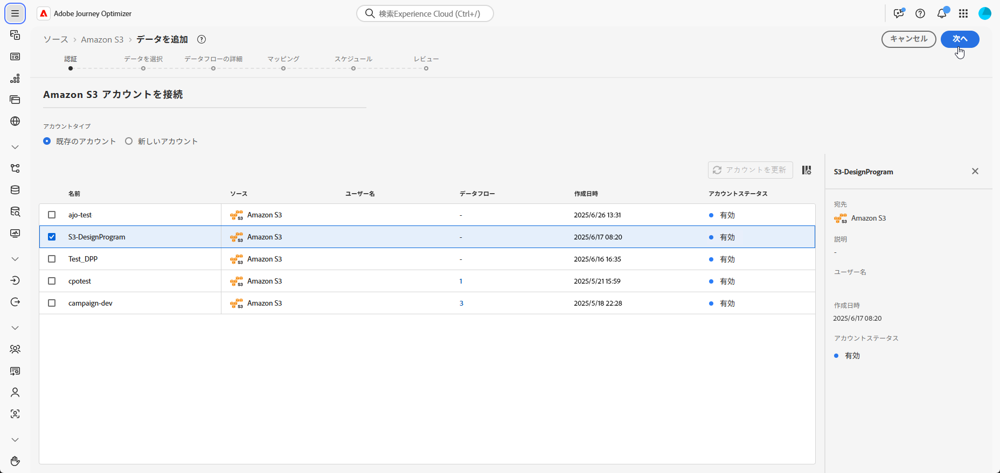

1. フォルダー **[!UICONTROL データフォーマット]**、**[!UICONTROL 区切り文字]** および **[!UICONTROL 圧縮タイプ]** を選択します。

1. 接続された S3 ソースをナビゲートして、以前に作成した 2 つのフォルダー（**ロイヤルティ報酬** と **ロイヤルティトランザクション** を見つけます。

1. データを含むフォルダーを選択します。

   フォルダーを選択すると、同じ構造を持つ現在のファイルと今後のファイルがすべて自動的に処理されます。 ただし、1 つのファイルを選択する場合は、新しいデータ増分ごとに手動でアップロードする必要があります。

   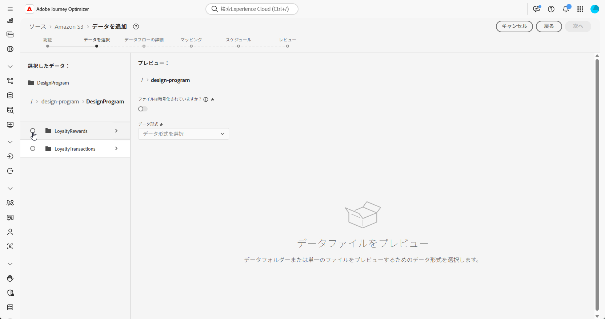

1. フォルダー **[!UICONTROL データフォーマット]**、**[!UICONTROL 区切り文字]** および **[!UICONTROL 圧縮タイプ]** を選択します。 サンプルデータの精度を確認し、「**[!UICONTROL 次へ]**」をクリックします。

   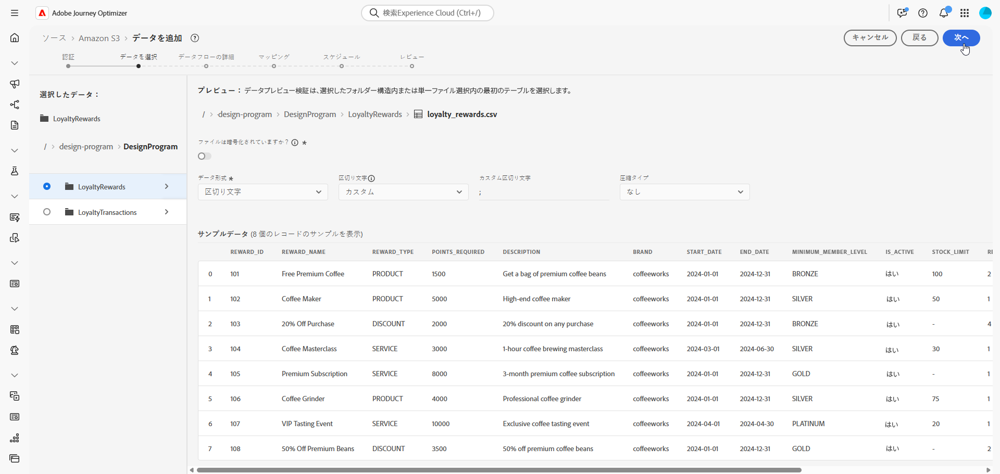

1. 「**[!UICONTROL チェンジ・データ・キャプチャを使用可能]**」にチェックを入れると、リレーショナル・スキーマにマッピングされ、プライマリ・キーとバージョン記述子の両方が定義されているデータセットから選択できます。

1. [ 以前に作成したデータセット ](#entities) を選択し、「**[!UICONTROL 次へ]**」をクリックします。

   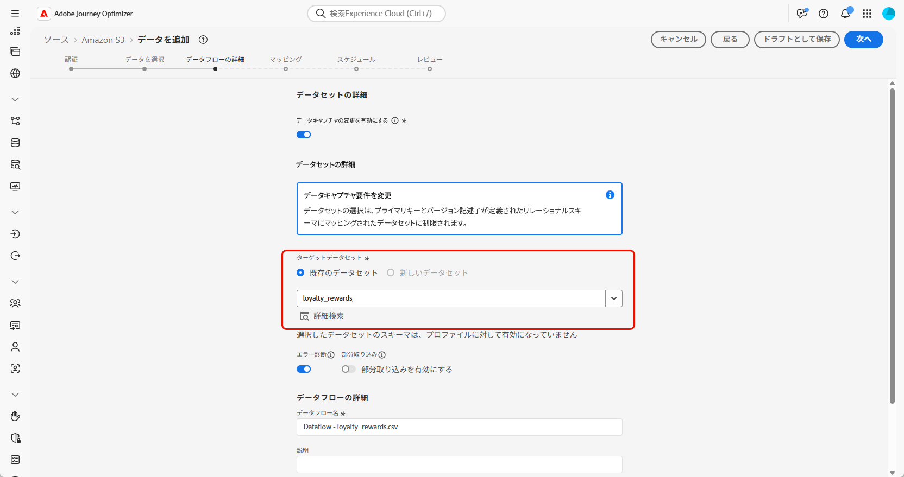

1. **[!UICONTROL マッピング]** ウィンドウで、各ソースファイル属性がターゲットスキーマの対応するフィールドに正しくマッピングされていることを確認します。

   完了したら、「**[!UICONTROL 次へ]**」をクリックします。

   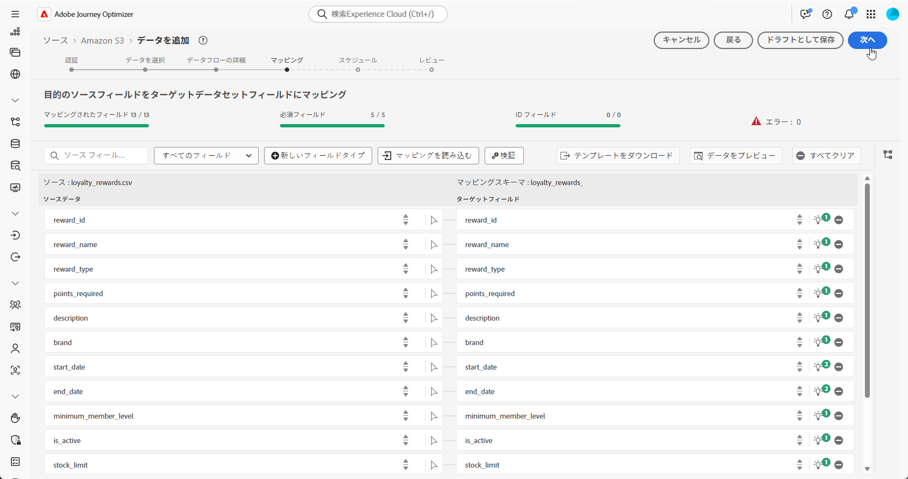

1. 目的の頻度に基づいてデータフロー **[!UICONTROL スケジュール]** を設定します。

1. **[!UICONTROL 終了]** をクリックして、データフローを作成します。 定義されたスケジュールに従って自動的に実行されます。

1. **[!UICONTROL 接続]** メニューから **[!UICONTROL ソース]** を選択し、「**[!UICONTROL データフロー]**」タブにアクセスしてフローの実行を追跡、取り込んだレコードを確認し、エラーのトラブルシューティングを行います。

   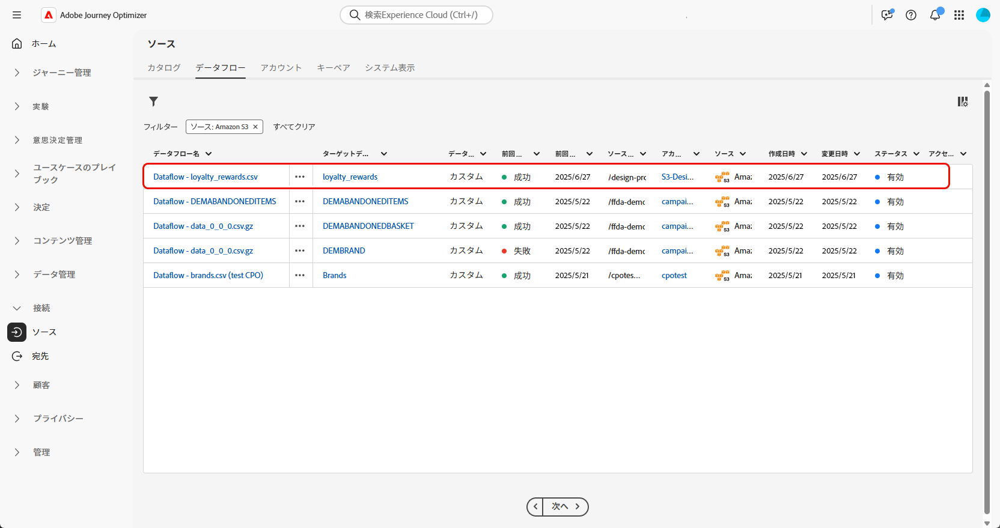

<!--manual
## Create a relational schema manual


1. Log in to the AP Platform.
1. Navigate to the **Schema Management** section.
1. Click on **Create Schema**.

1. You will be prompted to select between two schema types:
    * **Standard**
    * **Relational** (used specifically for AGO campaigns)

1. Click on **Create Manual**.
1. Provide a **Schema Name** (e.g., `test_demo_ck001`).
1. Choose **Schema Type**:
    - **Record Type** (required for AGO campaigns)
    - **Time Series** (not applicable here)
1. Click **Finish** to proceed to the schema design canvas.

## Select entities and fields to import

1. In the canvas, add attributes (fields) to your schema.
1. Add a **Primary Key** (mandatory).
1. Add a **Version Descriptor** attribute (for CDC support):
    - This must be of type **DateTime** or **Numeric** (Integer, Long, Short, Byte).
    - Common example: `last_modified`

> **Why?** The **Primary Key** uniquely identifies each record, and the **Version Descriptor** tracks changes, supporting CDC (Change Data Capture) and data mirroring.

1. Mark the appropriate fields as **Primary Key** and **Version Descriptor**.
1. Click **Save**.

---


## 5. Creating a Dataset

1. Navigate to **Datasets**.
1. Click on **Create Dataset**.
1. Select the schema you just created.
1. Assign a **Dataset Name** (same as schema is fine).
1. Optionally, add tags (e.g., `AGO_campaigns`).
6. Ensure the checkbox **"Relational Schema"** is checked.
7. Click **Finish**.

> **Note:** Only one dataset can be created per relational schema.


## 6. Enabling the Dataset

1. Click **Enable** for the dataset.
1. Wait a few moments for the status to show **Enabled**.

> **Why?** Without enabling, the dataset cannot be used in orchestrated campaigns or ingest data.

## 7. Creating a Data Source (S3)

1. Navigate to **Sources**.
1. Click **Create Source**.
1. Choose the source type (e.g., **S3 Bucket**).
1. Provide connection details:
    - Bucket Path (optionally include subfolder path)
1. Save the source.

## 8. Preparing and Uploading Data

1. Prepare your CSV file with:
    - Column headers matching your schema attributes
    - `last_modified` column
    - `change_type` column (`U`/`DU` for upsert, `D` for delete)

> **Important:** `change_type` is required but does not need to be defined in the schema.

1. Save the file as `.csv`.

1. Upload the file to the specified folder in your S3 bucket.


## 9. Ingesting Data from S3

1. Go to **Sources** and find your S3 source.
1. Click **Add Data**.
1. Select the uploaded file.
1. Specify the file format as **CSV** and any compression type if applicable.
1. Review the data preview (ensure `change_type`, `last_modified`, and primary key are visible).
1. Click **Next**.

### Enable Change Data Capture (CDC)

- Check **Enable Change Data Capture**.
- Select the dataset enabled for AGO campaigns.

### Field Mapping

- Fields are auto-mapped (note that `change_type` is not mapped and that's expected).
- Click **Next**.

### Scheduling

- Schedule ingestion frequency (minute, hour, day, week).
- Set start time (immediate or future).
- Click **Finish** to create the data flow.

## 10. Monitoring Data Flow

1. Navigate back to **Sources > Data Flows**.
1. Wait 4–5 minutes for the first run (initial overhead).
1. Monitor:
    - Status (Started, Completed)
    - Number of records ingested
    - Errors (if any)

> **Tip:** Ingested data first lands in the **Data Lake**.

## 11. Data Replication to Data Store

The **Data Store** is updated:

- Every **15 minutes**, or

- If **Data Lake size exceeds 5MB**

This is a background replication process.


## 12. Querying the Dataset

1. Navigate to **Query Services**.
1. Click **Create Query**.
1. Example query:

   ```sql
   SELECT * FROM test_demo_ck001;
   ```

1. Run the query.

> **Note:** If ingestion is incomplete, query will return an error. Check data flow status.

-->