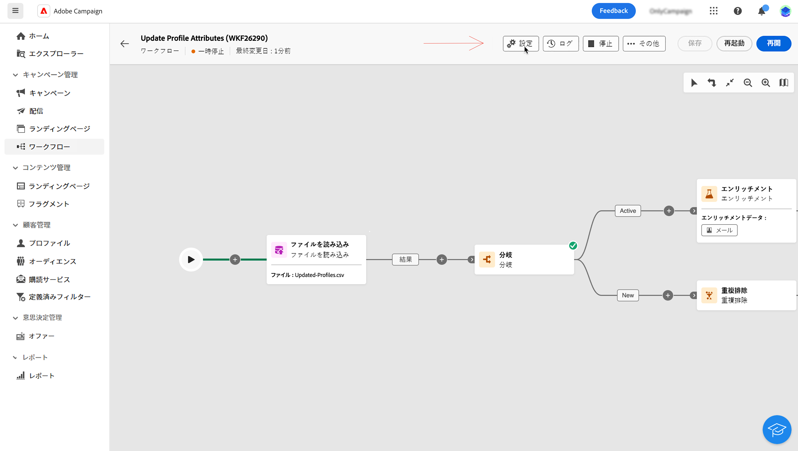
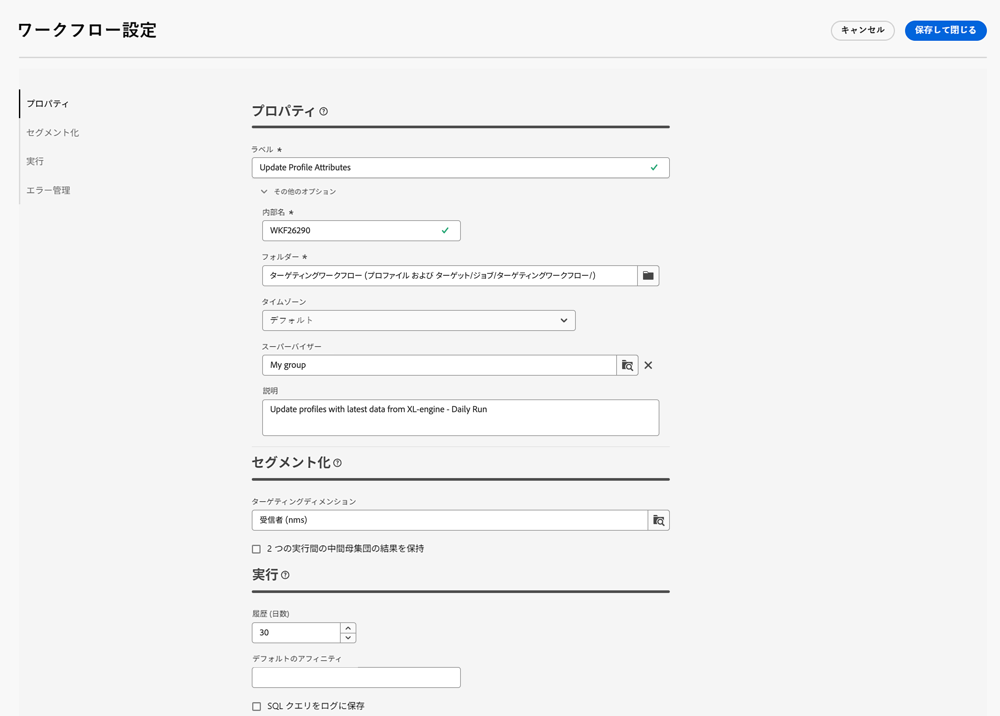

# 調整されたキャンペーンの作成 {#create-first-campaign}

>[!CONTEXTUALHELP]
>id="ajo_campaign_creation_workflow"
>title="調整されたキャンペーンのリスト"
>abstract="「**マルチステップ**」タブには、すべての調整されたキャンペーンが一覧表示されます。調整されたキャンペーンの名前をクリックして編集します。「**調整されたキャンペーンを作成**」ボタンを使用して、新しい調整されたキャンペーンを追加します。"

+++ 目次

| 調整されたキャンペーンへようこそ | 最初の調整されたキャンペーンの開始 | データベースのクエリ | キャンペーンアクティビティをキャンセル |
|---|---|---|---|
| [ オーケストレーションされたキャンペーンの基本を学ぶ ](gs-orchestrated-campaigns.md)  [ 設定手順 ](configuration-steps.md)  [ オーケストレーションされたキャンペーンへのアクセスと管理 ](access-manage-orchestrated-campaigns.md) | [ オーケストレーションされたキャンペーンの作成 ](gs-campaign-creation.md)  <b>[ キャンペーンの作成と設定 ](create-orchestrated-campaign.md)</b>  [ アクティビティのオーケストレーション ](orchestrate-activities.md)  [ オーケストレーションされたキャンペーンでのメッセージの送信 ](send-messages.md)  [ キャンペーンの開始と監視 ](start-monitor-campaigns.md)  [ レポート ](reporting-campaigns.md) | [ ルールビルダーの操作 ](orchestrated-rule-builder.md)  [ 最初のクエリの作成 ](build-query.md)  [ 式の編集 ](edit-expressions.md) | [ アクティビティの基本を学ぶ ](activities/about-activities.md)   アクティビティ： [AND 結合 ](activities/and-join.md) - [ オーディエンスを作成 ](activities/build-audience.md) - [ ディメンションを変更 ](activities/change-dimension.md) - [ 結合 ](activities/combine.md) - [ 重複排除 ](activities/deduplication.md) - [ エンリッチメント ](activities/enrichment.md) - [ 分岐 ](activities/fork.md) - [ 紐付け ](activities/reconciliation.md) - [ 分割 ](activities/split.md) [&#128279;](activities/wait.md) - |

{style="table-layout:fixed"}

+++

 

## キャンペーンの作成 {#create}

オーケストレーションされたキャンペーンを作成するには、次の手順に従います。

1. **キャンペーン** メニューを参照します。

1. 画面の右上隅にある **[!UICONTROL オーケストレートキャンペーンを作成]** ボタンをクリックします。

1. オーケストレートキャンペーン **プロパティ** ダイアログで、オーケストレートキャンペーンの作成に使用するテンプレートを選択します（デフォルトのビルトインテンプレートを使用することもできます）。 [ オーケストレーションされたキャンペーンテンプレートの詳細を説明します ](#campaign-templates)。

1. オーケストレーションされたキャンペーンのラベルを入力します。 また、オーケストレーションしたキャンペーンに、画面の **[!UICONTROL その他のオプション]** セクションの専用フィールドに説明を追加することを強くお勧めします。

1. 「**[!UICONTROL その他のオプション]**」セクションを展開すると、オーケストレーションされたキャンペーンの追加の設定を指定できます。

1. 「**[!UICONTROL オーケストレートキャンペーンを作成]**」ボタンをクリックして、オーケストレートキャンペーンの作成を確定します。

これで、調整されたキャンペーンが作成され、ワークフローのリストで使用できるようになります。 これで、ビジュアルキャンバスにアクセスし、実行するタスクの追加、設定および調整を開始できます。[ オーケストレーションされたキャンペーンアクティビティを調整する方法を説明します ](orchestrate-activities.md)。

## キャンペーンの設定 {#settings}

<!--Overview of new admin settings> schemas, execution fields, merge policy. [Learn more](configuration-steps.md)-->

キャンバスでオーケストレートキャンペーンを作成したり、オーケストレートキャンペーンアクティビティをオーケストレーションする際に、オーケストレートキャンペーンに関連する詳細設定にアクセスできます。 例えば、オーケストレーションされたキャンペーンの特定のタイムゾーンを設定したり、エラーが発生した場合のオーケストレーションされたキャンペーンの動作を管理したり、オーケストレーションされたキャンペーンの履歴をパージする遅延時間を管理したりできます。

これらの設定は、オーケストレートキャンペーンの作成時に選択したテンプレートで事前に設定されていますが、この特定のオーケストレートキャンペーンで必要に応じて編集できます。

{zoomable="yes"}{width="70%" align="left"}

### 調整されたキャンペーンプロパティ {#properties}

>[!CONTEXTUALHELP]
>id="ajo_workflow_settings_properties"
>title="調整されたキャンペーンプロパティ"
>abstract="このセクションでは、調整されたキャンペーンの作成時にもアクセスできる一般的な調整されたキャンペーンプロパティを提供します。調整されたキャンペーンの作成に使用するテンプレートを選択し、ラベルを指定できます。「その他のオプション」セクションを展開して、調整されたキャンペーン保存フォルダーやタイムゾーンなどの特定の設定を構成します。"

**[!UICONTROL プロパティ]** セクションには、調整されたキャンペーンの作成時に設定できる一般的な設定が用意されています。 既存のオーケストレーションされたキャンペーンのプロパティにアクセスするには、オーケストレーションされたキャンペーンキャンバスの上のアクションバーにある「**[!UICONTROL 設定]**」ボタンをクリックします。

{zoomable="yes"}{width="70%" align="left"}

これらのプロパティは次のとおりです。

* リストに表示されるオーケストレーションされたキャンペーンの **[!UICONTROL ラベル]**。
* オーケストレーションされたキャンペーンの **[!UICONTROL 内部名]**。
* オーケストレーションされたキャンペーンを保存する **[!UICONTROL フォルダー]**。
* オーケストレーションされたすべてのキャンペーンのアクティビティで使用されるデフォルトの **[!UICONTROL タイムゾーン]**。 デフォルトでは、オーケストレーションされたキャンペーンのタイムゾーンは、現在の Campaign オペレーターに対して定義されたタイムゾーンになります。
使用可能な値：
   * **サーバータイムゾーン**:Adobe Experience Platform組織のタイムゾーンを使用します
   * **オペレータータイムゾーン**：オーケストレーションされたキャンペーンを実行するオペレーターのタイムゾーンを使用します
   * **データベースのタイムゾーン**：データベースサーバーのタイムゾーンを使用します
   * 特定のタイムゾーン
* オーケストレーションされたキャンペーンが失敗すると、「**[!UICONTROL スーパーバイザー]**」フィールドで選択されたオペレーターグループに属するオペレーターにメールで通知されます。
* また、オーケストレーションしたキャンペーンの **[!UICONTROL 説明]** を入力することもできます。

### セグメント化の設定  {#segmentation-settings}

>[!CONTEXTUALHELP]
>id="ajo_workflow_settings_segmentation"
>title="セグメント化の設定"
>abstract="このセクションでは、調整されたキャンペーンでプロファイルをターゲットにするターゲティングディメンションを選択し、2 回の実行の間にワークフローの結果を保持するように選択できます。このオプションは、テスト目的でのみ使用し、実稼動の調整されたキャンペーンでは絶対に有効にしないでください。"

* **[!UICONTROL ターゲティングディメンション]**：プロファイルのターゲットに使用するターゲティングディメンションを受信者、契約の受益者、オペレーター、サブスクライバーなどから選択します。

* **[!UICONTROL 2 つの実行間の中間母集団の結果を保持]**: デフォルトでは、調整されたキャンペーンの最後の実行の作業用テーブルのみが保持されます。 それ以前に実行した分の作業用テーブルは、毎日実行される、技術的に調整されたキャンペーンによりパージされます。

  このオプションを有効にした場合、作業用テーブルは、オーケストレーションされたキャンペーンが実行された後も保持されます。 テスト目的で使用できるので、開発環境またはステージング環境で&#x200B;**のみ**&#x200B;使用する必要があります。実稼動用に調整されたキャンペーンでは絶対にオンにしないでください。

### 実行設定  {#exec-settings}

>[!CONTEXTUALHELP]
>id="ajo_workflow_settings_execution"
>title="実行設定"
>abstract="このセクションでは、調整されたキャンペーンの履歴を保持する日数など、ワークフローの実行に関する設定を構成できます。"

* **[!UICONTROL 履歴（日数）]**：履歴をパージする必要があるまでの日数を指定します。履歴には、ログ、タスク、イベント（オーケストレーションされたキャンペーン操作にリンクされた技術的なオブジェクト）など、オーケストレーションされたキャンペーンに関連する要素が含まれます。 標準のオーケストレーションされたキャンペーンテンプレートのデフォルト値は 30 日です。 履歴のパージは、デフォルトで毎日実行されるデータベースクリーンアップテクニカルオーケストレートキャンペーンによって実行されます

  >[!IMPORTANT]
  >
  >「**[!UICONTROL 履歴（日数）]**」フィールドが空白のままの場合、その値は「1」と見なされます。つまり、履歴は 1 日後にパージされます。

* **[!UICONTROL デフォルトのアフィニティ]**：オーケストレーションされた複数の Campaign サーバーがインストールにある場合、このフィールドを使用して、オーケストレーションされたキャンペーンを実行するサーバーを指定します。 これにより、特定のサーバーで調整されたキャンペーンを強制的に実行します。 既存のアフィニティ名を選択できますが、スペースや句読点を使用しないようにしてください。異なるサーバーを使用する場合は、異なる名前をコンマで区切って指定します。

  >[!IMPORTANT]
  >
  >このフィールドで定義した値がどのサーバーにも存在しない場合、オーケストレーションされたキャンペーンは保留されたままになります。

* **[!UICONTROL SQL クエリをログに保存]**:workflmulti-step キャンペーンからの SQL クエリをログに保存する場合は、このオプションをオンにします。 この機能を設定できるのは上級ユーザーに限られます。**[!UICONTROL オーディエンスの作成]** などのターゲティングアクティビティを含んだオーケストレーションされたキャンペーンに適用されます。 このオプションを有効にすると、オーケストレートキャンペーンの実行中にデータベースに送信された SQL クエリがオーケストレートキャンペーンのログに表示され、クエリを分析して最適化や問題の診断が可能になります。

### エラー管理設定  {#error-settings}

>[!CONTEXTUALHELP]
>id="ajo_workflow_settings_error"
>title="エラー管理設定"
>abstract="このセクションでは、調整されたキャンペーンで実行中のエラーを管理する方法を定義できます。プロセスの一時停止、一定数のエラーの無視または調整されたキャンペーンの実行の停止を選択できます。"

* **[!UICONTROL エラー管理]**：このフィールドでは、調整されたキャンペーンタスクにエラーが発生した場合に行うアクションを定義できます。 次の 3 つのオプションが使用可能です。

   * **[!UICONTROL プロセスを中断]**：オーケストレーションされたキャンペーンは自動的に一時停止され、ステータスは **[!UICONTROL 失敗]** に変わります。 問題が解決したら、「再開 **[!UICONTROL ボタンを使用して、オーケストレーションされたキャンペーンを再開]** ます。
   * **[!UICONTROL 無視]**：エラーをトリガーしたタスクのステータスは「**[!UICONTROL 失敗]** に変わりますが、オーケストレーションされたキャンペーンのステータスは「**[!UICONTROL 開始済み]** のままです。<!-- TO ADD ONCE SCHEUDLER IS AVAILABLE This configuration is relevant for recurring tasks: if the branch includes a scheduler, it will start normally next time the workflow is executed.-->
   * **[!UICONTROL プロセスを中止]**：オーケストレーションされたキャンペーンは自動的に停止し、ステータスは **[!UICONTROL 失敗]** に変わります。 問題が解決したら、「開始 **[!UICONTROL ボタンを使用してオーケストレーションしたキャンペーンを再開]** ます。

* **[!UICONTROL 連続エラー]**：このフィールドは、「**[!UICONTROL エラーの場合]**」フィールドで「**[!UICONTROL 無視]**」の値が選択されたときに有効になります。プロセスを停止するまでに無視するエラーの数を指定できます。この数に達すると、オーケストレーションされたキャンペーンのステータスが **[!UICONTROL 失敗]** に変わります。 このフィールドの値が 0 の場合、エラーの数にかかわらず、オーケストレーションされたキャンペーンは停止しません。

## 調整されたキャンペーンテンプレートの操作 {#campaign-templates}

>[!CONTEXTUALHELP]
>id="ajo_workflow_template_for_campaign"
>title="調整されたキャンペーンテンプレート"
>abstract="調整されたキャンペーンテンプレートには、新しい調整されたキャンペーンの作成に再利用できる事前設定済みの設定とアクティビティが含まれています。"

>[!CONTEXTUALHELP]
>id="ajo_workflow_template_creation_properties"
>title="調整されたキャンペーンプロパティ"
>abstract="調整されたキャンペーンテンプレートには、新しい調整されたキャンペーンの作成に再利用できる事前設定済みの設定とアクティビティが含まれています。この画面では、調整されたキャンペーンテンプレートのラベルを入力し、内部名、フォルダーと実行フォルダー、タイムゾーン、スーパーバイザーグループなどの設定を行います。"

調整されたキャンペーンテンプレートには、新しい調整されたキャンペーンの作成に再利用できる事前設定済みの設定とアクティビティが含まれています。オーケストレーションされたキャンペーンを作成する際に、オーケストレーションされたキャンペーンプロパティからオーケストレーションされたキャンペーンのテンプレートを選択できます。 デフォルトでは、空のテンプレートが提供されます。

テンプレートは、既存のオーケストレーション済みキャンペーンから作成することも、新しいテンプレートをゼロから作成することもできます。 両方の方法について、以下で詳しく説明します。

>[!BEGINTABS]

>[!TAB  既存のオーケストレートキャンペーンからテンプレートを作成する ]

既存のオーケストレートキャンペーンからオーケストレートキャンペーンテンプレートを作成するには、次の手順に従います。

1. **キャンペーン** メニューを開き、テンプレートとして保存するオーケストレーションされたキャンペーンを参照します。
1. オーケストレーションされたキャンペーンの名前の右側にある 3 ドットアイコンをクリックし、「テンプレートとしてコピー **を選択し** す。
1. ポップアップウィンドウで、テンプレートの作成を確認します。
1. 調整されたキャンペーンテンプレートキャンバスで、必要に応じてアクティビティを確認、追加および設定します。
1. **設定** ボタンから設定を参照して、オーケストレーションされたキャンペーンテンプレートの名前を変更し、説明を入力します。
1. テンプレートの&#x200B;**フォルダー**&#x200B;と&#x200B;**実行フォルダー**&#x200B;を選択します。オーケストレーションされたキャンペーンテンプレートが保存される場所はフォルダーです。 実行フォルダーは、このテンプレートに基づいて作成されたオーケストレートキャンペーンが保存されるフォルダーです。
1. 変更を保存します。

これで、オーケストレーションされたキャンペーンテンプレートをテンプレートリストで使用できるようになります。 このテンプレートに基づいて、オーケストレーションされたキャンペーンを作成できます。 このオーケストレーションされたキャンペーンは、テンプレートで定義された設定とアクティビティで事前設定されます。

>[!TAB テンプレートをゼロから作成]

オーケストレーションされたキャンペーンテンプレートをゼロから作成するには、次の手順に従います。

1. **Campaign** メニューを開き、「**テンプレート**」タブを参照します。 使用可能なオーケストレーションされたキャンペーンテンプレートのリストを確認できます。
1. 画面の右上隅にある「**[!UICONTROL テンプレートを作成]**」ボタンをクリックします。
1. ラベルを入力し、その他のオプションを開いて、オーケストレーションされたキャンペーンテンプレートの説明を入力します。
1. テンプレートのフォルダーと実行フォルダーを選択します。オーケストレーションされたキャンペーンテンプレートが保存される場所はフォルダーです。 実行フォルダーは、このテンプレートに基づいて作成されたオーケストレートキャンペーンが保存されるフォルダーです。
1. 「**作成**」ボタンをクリックして設定を確認します。
1. 調整したキャンペーンテンプレートキャンバスで、必要に応じてアクティビティを追加して設定します。

   {zoomable="yes"}

1. 変更を保存します。

これで、オーケストレーションされたキャンペーンテンプレートをテンプレートリストで使用できるようになります。 このテンプレートに基づいて、オーケストレーションされたキャンペーンを作成できます。 このオーケストレーションされたキャンペーンは、テンプレートで定義された設定とアクティビティで事前設定されます。

>[!ENDTABS]
