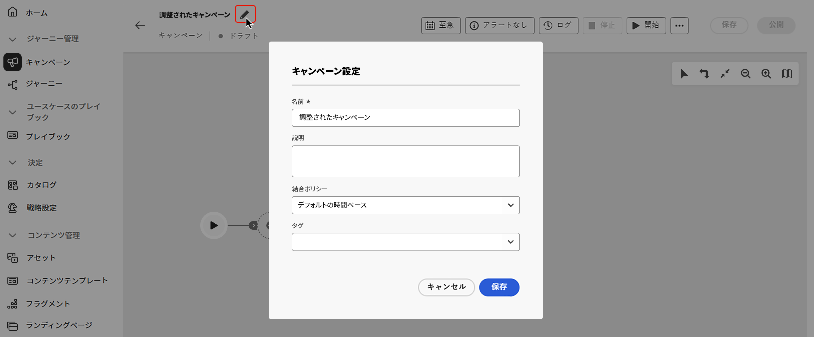
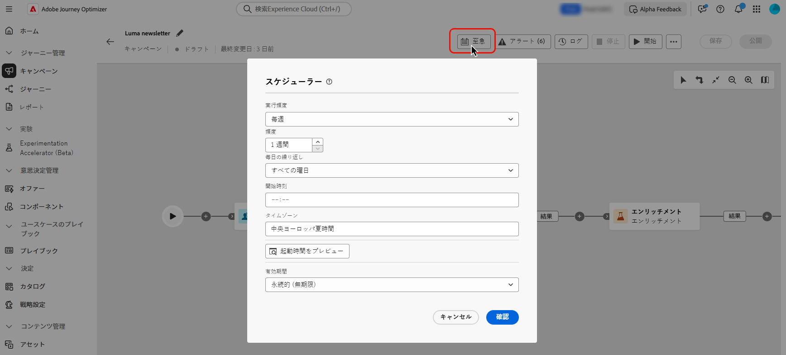

# 調整されたキャンペーンの作成とスケジュール {#create-first-campaign}

>[!CONTEXTUALHELP]
>id="ajo_campaign_creation_workflow"
>title="調整されたキャンペーンのリスト"
>abstract="**オーケストレーション** タブには、オーケストレーションされたすべてのキャンペーンがリストされます。 調整されたキャンペーンの名前をクリックして編集します。「**調整されたキャンペーンを作成**」ボタンを使用して、新しい調整されたキャンペーンを追加します。"

+++ 目次

| 調整されたキャンペーンへようこそ | 最初の調整されたキャンペーンの開始 | データベースのクエリ | キャンペーンアクティビティをキャンセル |
|---|---|---|---|
| [ オーケストレーションされたキャンペーンの基本を学ぶ ](gs-orchestrated-campaigns.md)  [ 設定手順 ](configuration-steps.md)  [ オーケストレーションされたキャンペーンへのアクセスと管理 ](access-manage-orchestrated-campaigns.md) | [ オーケストレーションされたキャンペーンの作成 ](gs-campaign-creation.md)  <b>[ キャンペーンの作成とスケジュール設定 ](create-orchestrated-campaign.md)</b>  [ アクティビティのオーケストレーション ](orchestrate-activities.md)  [ オーケストレーションされたキャンペーンでのメッセージの送信 ](send-messages.md)  [ キャンペーンの開始と監視 ](start-monitor-campaigns.md)  [ レポート ](reporting-campaigns.md) | [ ルールビルダーの操作 ](orchestrated-rule-builder.md)  [ 最初のクエリの作成 ](build-query.md)  [ 式の編集 ](edit-expressions.md) | [ アクティビティの基本を学ぶ ](activities/about-activities.md)   アクティビティ： [AND 結合 ](activities/and-join.md) - [ オーディエンスを作成 ](activities/build-audience.md) - [ ディメンションを変更 ](activities/change-dimension.md) - [ 結合 ](activities/combine.md) - [ 重複排除 ](activities/deduplication.md) - [ エンリッチメント ](activities/enrichment.md) - [ 分岐 ](activities/fork.md) - [ 紐付け ](activities/reconciliation.md) - [ 分割 ](activities/split.md)  - |

{style="table-layout:fixed"}

+++

 

>[!BEGINSHADEBOX]

ドキュメントを処理中

>[!ENDSHADEBOX]

## キャンペーンの作成 {#create}

オーケストレーションされたキャンペーンを作成するには、次の手順に従います。

1. **[!UICONTROL キャンペーン]** メニューを参照し、「**[!UICONTROL オーケストレーション]**」タブを選択して、「**[!UICONTROL キャンペーンを作成]**」を選択します。

   

1. オーケストレーションされたキャンペーンの名前を入力します。 また、専用のフィールドに説明を追加することを強くお勧めします。

1. （オプション）「**タグ**」フィールドを使用して、Adobe Experience Platform統合タグをオーケストレーションされたキャンペーンに割り当てます。 これにより、キャンペーンを簡単に分類し、キャンペーンリストからの検索を改善できます。[詳しくは、タグの操作方法を参照してください](../start/search-filter-categorize.md#tags)。

1. 「**[!UICONTROL 作成]**」ボタンをクリックして確定します。

これで、調整されたキャンペーンが作成され、キャンペーンのリストで使用できるようになります。 これらのプロパティは、キャンペーンキャンバスで  アイコンをクリックすることで、いつでも変更できます。

## キャンペーンのスケジュール {#schedule}

デフォルトでは、調整されたキャンペーンは手動でアクティブ化すると開始され、アクティビティが実行されるとすぐに終了します。

アクティブ化直後にオーケストレーションされたキャンペーンを実行しない場合は、実行する日時を指定できます。 また、様々な条件に基づいて、一定の頻度でキャンペーンを実行することもできます。

キャンペーンのスケジュールを設定するには、調整したキャンペーンを開いて「**[!UICONTROL できるだけ早く]**」ボタンをクリックします。

<!--In the Execution frequency field, select 

time zone

daily, weekly, monthly
several times a day based on specific hours or periodically

recurring frequencies (all except as soon and once)
preview launch times
validity period

>[!NOTE]
>
>When scheduling campaigns in [!DNL Adobe Journey Optimizer], ensure your start date/time aligns with the desired first delivery. For recurring campaigns, if the initial scheduled time has already passed, the campaigns will roll over to the next available time slot according to their recurrence rules.

## Work with orchestrated campaign templates {#campaign-templates}

>[!CONTEXTUALHELP]
>id="ajo_workflow_template_for_campaign"
>title="Orchestrated campaign templates"
>abstract="Orchestrated campaign templates contain pre-configured settings and activities which can be reused for creating new orchestrated campaign."

>[!CONTEXTUALHELP]
>id="ajo_workflow_template_creation_properties"
>title="Orchestrated campaign properties"
>abstract="Orchestrated campaign templates contain pre-configured settings and activities which can be reused for creating new orchestrated campaigns. In this screen, enter the label of the orchestrated campaign template and configure its settings such as its internal name, folder and execution folders, timezone, and supervisor group."

Orchestrated campaign templates contain pre-configured settings and activities which can be reused for creating new orchestrated campaigns. You can select the template of your orchestrated campaign from the orchestrated campaign properties, when creating an orchestrated campaign. An empty template is provided by default.

You can create a template from an existing orchestrated campaign, or create a new template from scratch. Both methods are detailed below.

>[!BEGINTABS]

>[!TAB Create a template from an existing orchestrated campaign]

To create an orchestrated campaign template from an existing orchestrated campaign, follow these steps:

1. Open to the **Campaign** menu and browse to the orchestrated campaign to save as a template.
1. Click the three dots on the right of the name of the orchestrated campaign, and choose **Copy as template**.
1. In the popup window, confirm the template creation.
1. In the orchestrated campaign template canvas, check, add, and configure the activities as needed.
1. Browse to the settings, from the **Settings** button, to change the name of the orchestrated campaign template, and enter a description.
1. Select the **folder** and **execution folder** of the template. The folder is the location where the orchestrated campaign template is saved. The execution folder is the folder where orchestrated campaigns created based on this template are saved.
1. Save your changes. 

The orchestrated campaign template is now available in the template list. You can create an orchestrated campaign based on this template. This orchestrated campaign will be pre-configured with the settings and activities defined in the template.

>[!TAB Create a template from scratch]

To create an orchestrated campaign template from scratch, follow these steps:

1. Open to the **Campaign** menu and browse to the **Templates** tab. You can see the list of available orchestrated campaign templates.
1. Click the **[!UICONTROL Create template]** button in the upper-right corner of the screen.
1. Enter the label and open the additional options to enter a description of your orchestrated campaign template.
1. Select the folder and execution folder of the template. The folder is the location where the orchestrated campaign template is saved. The execution folder is the folder where orchestrated campaigns created based on this template are saved.
1. Click the **Create** button to confirm your settings.
1. In the orchestrated campaign template canvas, add and configure the activities as needed.

     {zoomable="yes"}

1. Save your changes. 

The orchestrated campaign template is now available in the template list. You can create an orchestrated campaign based on this template. This orchestrated campaign will be pre-configured with the settings and activities defined in the template.

>[!ENDTABS]

## Next steps {#next}

Once your campaign configuration and content are ready, you can review and activate it. [Learn more](review-activate-campaign.md)

-->