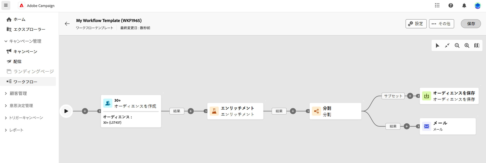

# 調整されたキャンペーンの作成 {#create-first-campaign}

>[!CONTEXTUALHELP]
>id="ajo_campaign_creation_workflow"
>title="調整されたキャンペーンのリスト"
>abstract="「**マルチステップ**」タブには、すべての調整されたキャンペーンが一覧表示されます。調整されたキャンペーンの名前をクリックして編集します。「**調整されたキャンペーンを作成**」ボタンを使用して、新しい調整されたキャンペーンを追加します。"

+++ 目次

| 調整されたキャンペーンへようこそ | 最初の調整されたキャンペーンの開始 | データベースのクエリ | キャンペーンアクティビティをキャンセル |
|---|---|---|---|
| [ オーケストレーションされたキャンペーンの概要 ](gs-orchestrated-campaigns.md)  [ 設定手順 ](configuration-steps.md)  [ オーケストレーションされたキャンペーンを作成するための主な手順 ](gs-campaign-creation.md) | [ オーケストレーションされたキャンペーンの作成 ](create-orchestrated-campaign.md)  [ アクティビティのオーケストレーション ](orchestrate-activities.md)  [ オーケストレーションされたキャンペーンでのメッセージの送信 ](send-messages.md)  [ キャンペーンの開始および監視 ](start-monitor-campaigns.md)  [ レポート ](reporting-campaigns.md) | [ ルールビルダーの操作 ](orchestrated-rule-builder.md)  [ 最初のクエリの作成 ](build-query.md)  [ 式の編集 ](edit-expressions.md) | [ アクティビティの基本を学ぶ ](activities/about-activities.md)   アクティビティ： [AND 結合 ](activities/and-join.md) - [ オーディエンスを作成 ](activities/build-audience.md) - [ ディメンションを変更 ](activities/change-dimension.md) - [ 結合 ](activities/combine.md) - [ 重複排除 ](activities/deduplication.md) - [ エンリッチメント ](activities/enrichment.md) - [ 分岐 ](activities/fork.md) - [ 紐付け ](activities/reconciliation.md) - [ 分割 ](activities/split.md) [&#128279;](activities/wait.md) - |

{style="table-layout:fixed"}

+++

 

## キャンペーンの作成

オーケストレーションされたキャンペーンを作成するには、次の手順に従います。

1. **オーケストレーションされたキャンペーン** を作成するには、**キャンペーン** メニューを参照します。

1. 画面の右上隅にある **[!UICONTROL オーケストレートキャンペーンを作成]** ボタンをクリックします。

1. オーケストレートキャンペーン **プロパティ** ダイアログで、オーケストレートキャンペーンの作成に使用するテンプレートを選択します（デフォルトのビルトインテンプレートを使用することもできます）。 [ オーケストレーションされたキャンペーンテンプレートの詳細を説明します ](#campaign-templates)。

1. オーケストレーションされたキャンペーンのラベルを入力します。 また、オーケストレーションしたキャンペーンに、画面の **[!UICONTROL その他のオプション]** セクションの専用フィールドに説明を追加することを強くお勧めします。

1. 「**[!UICONTROL その他のオプション]**」セクションを展開すると、オーケストレーションされたキャンペーンの追加の設定を指定できます。

1. 「**[!UICONTROL オーケストレートキャンペーンを作成]**」ボタンをクリックして、オーケストレートキャンペーンの作成を確定します。

これで、調整されたキャンペーンが作成され、ワークフローのリストで使用できるようになります。 これで、ビジュアルキャンバスにアクセスし、実行するタスクの追加、設定および調整を開始できます。[ オーケストレーションされたキャンペーンアクティビティを調整する方法を説明します ](orchestrate-activities.md)。

## キャンペーンの設定

新しい管理設定の概要/スキーマ、実行フィールド、結合ポリシー。 [詳細情報](configuration-steps.md)

## 調整されたキャンペーンテンプレートの操作 {#campaign-templates}

>[!CONTEXTUALHELP]
>id="ajo_workflow_template_for_campaign"
>title="調整されたキャンペーンテンプレート"
>abstract="調整されたキャンペーンテンプレートには、新しい調整されたキャンペーンの作成に再利用できる事前設定済みの設定とアクティビティが含まれています。"

>[!CONTEXTUALHELP]
>id="ajo_workflow_template_creation_properties"
>title="調整されたキャンペーンプロパティ"
>abstract="調整されたキャンペーンテンプレートには、新しい調整されたキャンペーンの作成に再利用できる事前設定済みの設定とアクティビティが含まれています。この画面では、調整されたキャンペーンテンプレートのラベルを入力し、内部名、フォルダーと実行フォルダー、タイムゾーン、スーパーバイザーグループなどの設定を行います。"

調整されたキャンペーンテンプレートには、新しい調整されたキャンペーンの作成に再利用できる事前設定済みの設定とアクティビティが含まれています。オーケストレーションされたキャンペーンを作成する際に、オーケストレーションされたキャンペーンプロパティからオーケストレーションされたキャンペーンのテンプレートを選択できます。 デフォルトでは、空のテンプレートが提供されます。

テンプレートは、既存のオーケストレーション済みキャンペーンから作成することも、新しいテンプレートをゼロから作成することもできます。 両方の方法について、以下で詳しく説明します。

>[!BEGINTABS]

>[!TAB  既存のオーケストレートキャンペーンからテンプレートを作成する ]

既存のオーケストレートキャンペーンからオーケストレートキャンペーンテンプレートを作成するには、次の手順に従います。

1. **キャンペーン** メニューを開き、テンプレートとして保存するオーケストレーションされたキャンペーンを参照します。
1. オーケストレーションされたキャンペーンの名前の右側にある 3 ドットアイコンをクリックし、「テンプレートとしてコピー **を選択し** す。
1. ポップアップウィンドウで、テンプレートの作成を確認します。
1. 調整されたキャンペーンテンプレートキャンバスで、必要に応じてアクティビティを確認、追加および設定します。
1. **設定** ボタンから設定を参照して、オーケストレーションされたキャンペーンテンプレートの名前を変更し、説明を入力します。
1. テンプレートの&#x200B;**フォルダー**&#x200B;と&#x200B;**実行フォルダー**&#x200B;を選択します。オーケストレーションされたキャンペーンテンプレートが保存される場所はフォルダーです。 実行フォルダーは、このテンプレートに基づいて作成されたオーケストレートキャンペーンが保存されるフォルダーです。
1. 変更を保存します。

これで、オーケストレーションされたキャンペーンテンプレートをテンプレートリストで使用できるようになります。 このテンプレートに基づいて、オーケストレーションされたキャンペーンを作成できます。 このオーケストレーションされたキャンペーンは、テンプレートで定義された設定とアクティビティで事前設定されます。

>[!TAB テンプレートをゼロから作成]

オーケストレーションされたキャンペーンテンプレートをゼロから作成するには、次の手順に従います。

1. **Campaign** メニューを開き、「**テンプレート**」タブを参照します。 使用可能なオーケストレーションされたキャンペーンテンプレートのリストを確認できます。
1. 画面の右上隅にある「**[!UICONTROL テンプレートを作成]**」ボタンをクリックします。
1. ラベルを入力し、その他のオプションを開いて、オーケストレーションされたキャンペーンテンプレートの説明を入力します。
1. テンプレートのフォルダーと実行フォルダーを選択します。オーケストレーションされたキャンペーンテンプレートが保存される場所はフォルダーです。 実行フォルダーは、このテンプレートに基づいて作成されたオーケストレートキャンペーンが保存されるフォルダーです。
1. 「**作成**」ボタンをクリックして設定を確認します。
1. 調整したキャンペーンテンプレートキャンバスで、必要に応じてアクティビティを追加して設定します。

   {zoomable="yes"}

1. 変更を保存します。

これで、オーケストレーションされたキャンペーンテンプレートをテンプレートリストで使用できるようになります。 このテンプレートに基づいて、オーケストレーションされたキャンペーンを作成できます。 このオーケストレーションされたキャンペーンは、テンプレートで定義された設定とアクティビティで事前設定されます。

>[!ENDTABS]
