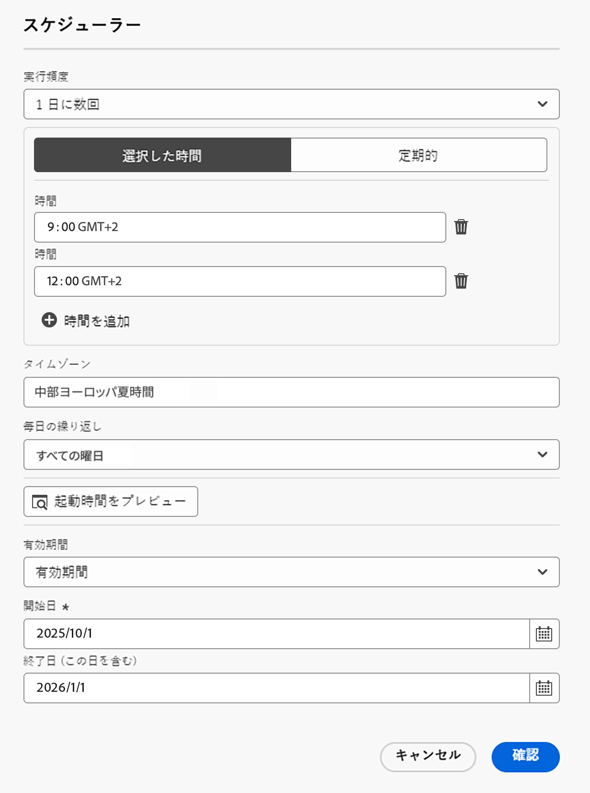

# 調整されたキャンペーンの作成とスケジュール {#create-first-campaign}

+++ 目次

| 調整されたキャンペーンへようこそ | 最初の調整されたキャンペーンの開始 | データベースのクエリ | 調整されたキャンペーンアクティビティ |
|---|---|---|---|
| [ 調整されたキャンペーンの基本を学ぶ ](gs-orchestrated-campaigns.md)   リレーショナルスキーマとデータセットの作成および管理：  <ul><li>[ スキーマとデータセットの概要 ](gs-schemas.md)</li><li>[ 手動スキーマ ](manual-schema.md)</li><li>[ ファイルアップロードスキーマ ](file-upload-schema.md)</li><li>[ データの取り込み ](ingest-data.md)</li></ul>[ オーケストレーションされたキャンペーンへのアクセスと管理 ](access-manage-orchestrated-campaigns.md)  [ オーケストレーションされたキャンペーンを作成するための主な手順 ](gs-campaign-creation.md) | <b>[キャンペーンの作成とスケジュール](create-orchestrated-campaign.md)</b>  [アクティビティの調整](orchestrate-activities.md)  [キャンペーンの開始と監視](start-monitor-campaigns.md)  [レポート](reporting-campaigns.md) | [ルールビルダーの操作](orchestrated-rule-builder.md)  [最初のクエリの作成](build-query.md)  [式の編集](edit-expressions.md)  [リターゲティング](retarget.md) | [アクティビティの基本を学ぶ](activities/about-activities.md)  アクティビティ： [AND 結合](activities/and-join.md) - [オーディエンスを作成](activities/build-audience.md) - [ディメンションを変更](activities/change-dimension.md) - [チャネルアクティビティ](activities/channels.md) - [結合](activities/combine.md) - [重複排除](activities/deduplication.md) - [エンリッチメント](activities/enrichment.md) - [分岐](activities/fork.md) - [紐付け](activities/reconciliation.md) - [オーディエンスを保存](activities/save-audience.md) - [分割](activities/split.md) - [待機](activities/wait.md) |

{style="table-layout:fixed"}

+++
 

>[!BEGINSHADEBOX]

 

このページのコンテンツは最終的なものではなく、変更される場合があります。

>[!ENDSHADEBOX]

[!DNL Adobe Journey Optimizer] で調整されたキャンペーンを作成し、その実行スケジュールを設定して、キャンペーンの開始時期と実行頻度を制御します。キャンペーンをすぐに開始するか、特定の日時に開始するか、毎日、毎週、毎月の頻度などの柔軟なスケジュールオプションを使用して繰り返し開始するかを選択します。

## キャンペーンの作成 {#create}

>[!CONTEXTUALHELP]
>id="ajo_campaign_creation_workflow"
>title="調整されたキャンペーンのリスト"
>abstract="「**オーケストレーション**」タブには、すべての調整されたキャンペーンが一覧表示されます。調整されたキャンペーンの名前をクリックして編集します。「**調整されたキャンペーンを作成**」ボタンを使用して、新しい調整されたキャンペーンを追加します。"

調整されたキャンペーンを作成するには、次の手順に従います。

1. **[!UICONTROL キャンペーン]** メニューを参照し、「**[!UICONTROL オーケストレーション]**」タブを選択します。

1. 「**[!UICONTROL キャンペーンを作成]**」ボタンをクリックし、「**[!UICONTROL オーケストレーション – マーケティング]** キャンペーンタイプを選択します。

   

1. キャンペーンプロパティを定義します。 これを行うには、キャンペーン名の横にある  ボタンをクリックします。

   

   1. キャンペーンの **[!UICONTROL 名前]** と **[!UICONTROL 説明]** を入力します。

   1. キャンペーンの **[!UICONTROL 結合ポリシー]** を選択します。

      [!DNL Adobe Experience Platform] では、各オーディエンスは特定の結合ポリシーに関連付けられています。このポリシーは、プロファイル情報を組み合わせて結合プロファイルを形成する方法を定義します。 オーディエンスを読み取りアクティビティで結合ポリシーを選択した場合、同じ結合ポリシーに基づくオーディエンスのみを使用できます。 デフォルトでは、デフォルトの結合ポリシーが使用されますが、必要に応じて変更できます。 結合ポリシーについて詳しくは、[Adobe Experience Platform ドキュメント ](https://experienceleague.adobe.com/ja/docs/experience-platform/profile/merge-policies/overview){target="_blank"} を参照してください。

   1. 「**[!UICONTROL タグ]**」フィールドを使用すると、Adobe Experience Platform統合タグをキャンペーンに割り当てることができます。 これにより、キャンペーンを簡単に分類し、調整されたキャンペーンリストからの検索を改善できます。[詳しくは、タグの操作方法を参照してください](../start/search-filter-categorize.md#tags)。

   1. 「**[!UICONTROL 保存]**」をクリックします。

## キャンペーンのスケジュール {#schedule}

>[!CONTEXTUALHELP]
>id="ajo_orchestration_scheduler"
>title="スケジューラー"
>abstract="キャンペーンマネージャーは、キャンペーンを特定の時間に自動的に開始するようにスケジュールできるので、マーケティングコミュニケーション用の正確なタイミングと正確なターゲティングデータが可能になります。"

>[!CONTEXTUALHELP]
>id="ajo_orchestration_schedule_validity"
>title="スケジューラーの有効性"
>abstract="スケジューラーの有効期間を定義できます。永続的（デフォルト）にすることも、特定の日付まで有効にすることもできます。"

>[!CONTEXTUALHELP]
>id="ajo_orchestration_schedule_options"
>title="スケジューラーオプション"
>abstract="スケジューラーの頻度を定義します。特定の時点で、1 日、1 週間、1 か月に 1 回または数回実行できます。"

デフォルトでは、調整されたキャンペーンは手動でアクティブ化する際に開始され、関連するアクティビティを実行すると終了します。実行を遅らせたり、キャンペーンを繰り返し実行したりする場合は、キャンペーンのスケジュールを定義できます。

最適なパフォーマンスと期待される動作を確保するために、調整されたキャンペーンをスケジュールする際は、次のベストプラクティスを考慮します。

* システム全体のパフォーマンスが落ちたり、データベースにブロックが作成されたりする可能性があるので、調整されたキャンペーンを 15 分以上の間隔で実行するようにスケジュールしないでください。
* 調整されたキャンペーンで 1 回限りのメッセージを送信する場合は、そのメッセージを&#x200B;**1 回**&#x200B;実行するように設定できます。
* 調整されたキャンペーンで繰り返しメッセージを送信する場合は、「**スケジュール**」オプションを使用して実行頻度を設定する必要があります。繰り返し配信アクティビティでは、スケジュールを定義できません。

キャンペーンスケジュールを設定するには、次の手順に従います。

1. キャンペーンを開き、「**[!UICONTROL できるだけ早く]**」ボタンをクリックします。

   

1. キャンペーンの実行頻度を選択し、使用可能なオプションを設定します。設定は、選択した頻度によって異なります。

   +++1 回

   指定した日時にキャンペーンを 1 回実行します。

   * **[!UICONTROL 日付]**：キャンペーンを実行する日付を選択します。
   * **[!UICONTROL 時間]**：キャンペーンを実行する特定の時間を選択します。

+++

   +++毎日

   毎日または選択した日にキャンペーンを実行します。

   * **[!UICONTROL 毎日の繰り返し]**：キャンペーンの実行頻度を選択します。
      * **[!UICONTROL 毎日]**：週末を含むすべての曜日にキャンペーンを実行します。
      * **[!UICONTROL 平日]**：月曜日から金曜日にのみキャンペーンを実行します。
      * **[!UICONTROL 特定の期間を通じて]**：定義済みの日付範囲（例：7月1日から 7月15日まで）内で毎日キャンペーンを実行します。キャンペーンは、この範囲外では実行されません。
      * **[!UICONTROL 選択した曜日]**：指定した曜日（例：月曜日、水曜日、金曜日）にのみキャンペーンを実行します。

   * **[!UICONTROL 開始時間]**：毎日キャンペーンを実行する時間を定義します。

+++

   +++1 日に数回

   同じ日内にキャンペーンを複数回実行します。 特定の時間を選択するか、定期的な頻度を設定できます。

   * **[!UICONTROL 選択した時間]**：キャンペーンを実行する特定の時間を選択し、毎日の繰り返しを設定します（すべての曜日または特定の日に実行）。
   * **[!UICONTROL 定期的]**：n 分または n 時間ごとにキャンペーンを実行するように選択します。また、実行が許可される日内の時間範囲を定義することもできます。

+++

   +++毎週

   特定の曜日のオプションを使用して、毎週キャンペーンを実行します。

   * **[!UICONTROL 頻度]**：キャンペーンの実行頻度を選択します（例：毎週、2 週間ごと）。
   * **[!UICONTROL 開始日]**：繰り返しを開始する日付を選択します。
   * **[!UICONTROL 毎日の繰り返し]**：実行する特定の曜日を選択します（例：毎週月曜日と木曜日）。
   * **[!UICONTROL 開始時間]**：選択した曜日にキャンペーンを実行する時間を設定します。

+++

   +++毎月

   特定の日のオプションを使用して、毎月キャンペーンを実行します。

   * **[!UICONTROL 毎月の繰り返し]**：毎月キャンペーンを実行するか、特定の月にのみ実行するかを選択します。
   * **[!UICONTROL 毎日の繰り返し]**：
      * **[!UICONTROL 毎日]**：週末を含む毎月のカレンダー日にキャンペーンを実行します。
      * **[!UICONTROL 月の最終日]**：各月の最終カレンダー日（例：1月31日、2月28／29日）にのみキャンペーンを実行します。
      * **[!UICONTROL 月の特定の日（例：15日）]**：指定した日（例：毎月15日）にキャンペーンを実行します。
      * **[!UICONTROL 週の最初／最後または n 番目の曜日]**（例：最初の月曜日）：指定した曜日（例：毎週月曜日）にキャンペーンを実行します。
      * **[!UICONTROL 選択した曜日]**：指定した曜日にキャンペーンを実行します。

   * **[!UICONTROL 開始時間]**：キャンペーンを実行する時間を設定します。

+++

1. **[!UICONTROL 有効期間]**&#x200B;設定を使用して特定の開始日と終了日を定義し、キャンペーンの実行を限られた時間枠に制限します。

1. 繰り返しスケジュールの場合は、「**[!UICONTROL 起動時間をプレビュー]**」ボタンをクリックして、現在の設定に基づいて今後の正確な実行日時をプレビューします。これは、アクティブ化の前にスケジュールを検証し、キャンペーンが期待どおりに実行されることを確認するのに役立ちます。

>[!NOTE]
>
>[!DNL Adobe Journey Optimizer] でキャンペーンをスケジュールする場合は、開始日時が目的の最初の配信に合っていることを確認します。繰り返しキャンペーンで、最初にスケジュールした時間が既に過ぎている場合、キャンペーンは繰り返しルールに従って、次に使用可能な時間スロットに繰り越されます。

次の例では、2025年10月1日から 2026年1月1日まで毎日、調整されたキャンペーンが 1 日に 2 回（午前 9 時と午後 12 時に）実行されるようにアクティビティが設定されています。

{width="50%" align="left"}

## 次の手順 {#next}

キャンペーンの設定とスケジュールを設定したら、実行される様々なタスクの調整を開始する準備が整います。[キャンペーンアクティビティの調整方法の詳細情報](../orchestrated/orchestrate-activities.md)
