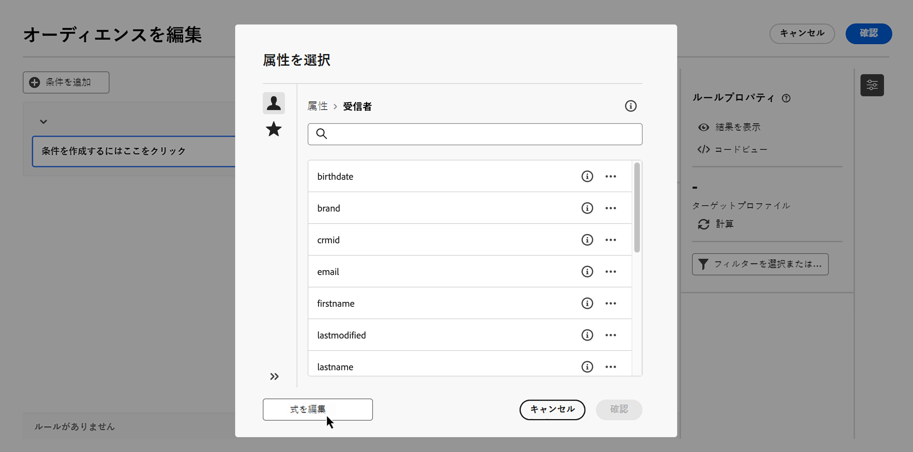
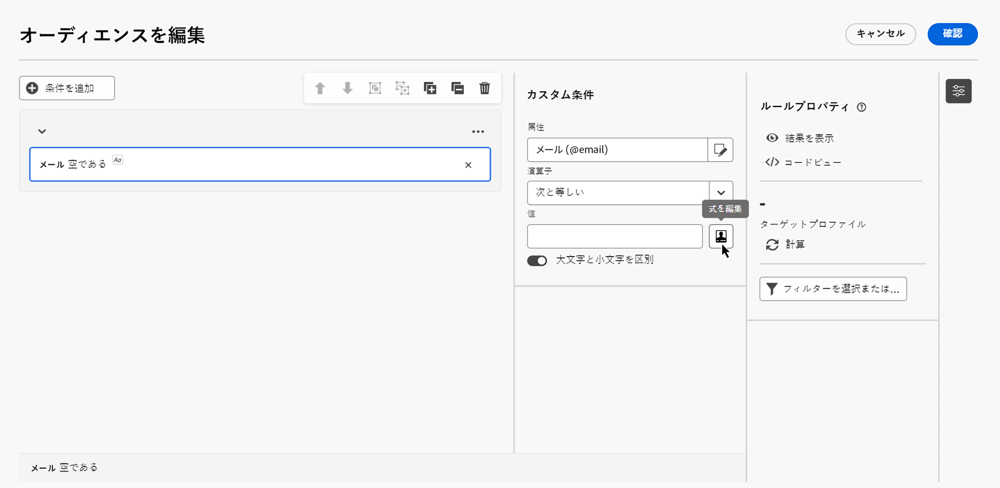
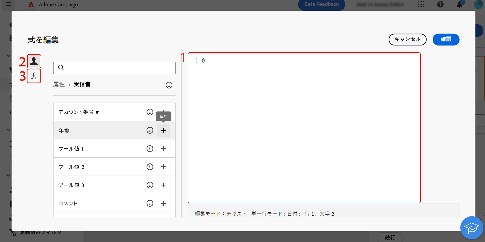

# 式の編集 {#edit-expressions}

+++ 目次

| 調整されたキャンペーンへようこそ | 最初の調整されたキャンペーンの開始 | データベースのクエリ | 調整されたキャンペーンアクティビティ |
|---|---|---|---|
| [ 調整されたキャンペーンの基本を学ぶ ](gs-orchestrated-campaigns.md)   リレーショナルスキーマとデータセットの作成および管理：  <ul><li>[ スキーマとデータセットの概要 ](gs-schemas.md)</li><li>[ 手動スキーマ ](manual-schema.md)</li><li>[ ファイルアップロードスキーマ ](file-upload-schema.md)</li><li>[ データの取り込み ](ingest-data.md)</li></ul>[ オーケストレーションされたキャンペーンへのアクセスと管理 ](access-manage-orchestrated-campaigns.md)  [ オーケストレーションされたキャンペーンを作成するための主な手順 ](gs-campaign-creation.md) | [ キャンペーンの作成とスケジュール設定 ](create-orchestrated-campaign.md)  [ アクティビティのオーケストレーション ](orchestrate-activities.md)  [ キャンペーンの開始と監視 ](start-monitor-campaigns.md)  [ レポート ](reporting-campaigns.md) | [ ルールビルダーの操作 ](orchestrated-rule-builder.md)  [ 最初のクエリの作成 ](build-query.md)  <b>[ 式の編集 ](edit-expressions.md)</b>  [ リターゲティング ](retarget.md) | [ アクティビティの基本を学ぶ ](activities/about-activities.md)   アクティビティ： [AND 結合 ](activities/and-join.md) - [ オーディエンスを作成 ](activities/build-audience.md) - [ ディメンションの変更 ](activities/change-dimension.md) - [ チャネルアクティビティ ](activities/channels.md) - [ 結合 ](activities/combine.md) - [ 重複排除 ](activities/deduplication.md) - [ エンリッチメント ](activities/enrichment.md) - [ 分岐 ](activities/fork.md) - [ 紐付け ](activities/reconciliation.md)    - |

{style="table-layout:fixed"}

+++
 

>[!BEGINSHADEBOX]

 

コンテンツ

このページのコンテンツは最終的なものではなく、変更される場合があります。

>[!ENDSHADEBOX]

>[!NOTE]
>
>以下の節では、式エディターを操作してルールを作成する方法について説明します。ルールの作成に使用する構文は、パーソナライゼーションの追加に使用する構文とは異なることに注意してください。

## 式エディターの操作 {#edit}

式を編集する場合は、条件を手動で入力してルールを作成します。このモードでは、日付、文字列、数値の各フィールドの操作や並べ替えなど、具体的なクエリの実行に使用する値を操作する高度な関数を使用できます。

式エディターは、ルールビルダーの「**[!UICONTROL 式を編集]**」ボタンから使用できます。このボタンは、カスタム条件を設定する際に **[!UICONTROL 属性]** および **[!UICONTROL 値]** フィールドで使用できます。

| 「**属性**」フィールドからのアクセス | 「**値**」フィールドからのアクセス |
| --- | --- |
| {zoomable="yes"}{width="200" align="center" zoomable="yes"} | {zoomable="yes"}{width="200" align="center" zoomable="yes"} |

式エディターには、次の内容があります。

* 式を定義する&#x200B;**入力フィールド（1）**。
* 式で使用でき、かつクエリのターゲティングディメンションに対応する&#x200B;**フィールド（2）**&#x200B;の一覧。
* カテゴリ別に並べ替えられる&#x200B;**ヘルパー関数（3）**。

式を編集するには、入力フィールドに式を直接入力します。フィールドまたはヘルパー関数を追加するには、式内の追加する場所にカーソルを置き、「+」ボタンをクリックします。

{zoomable="yes"}

## ヘルパー関数

クエリ編集ツールを使用すると、高度な関数を使用して、目的の結果や操作対象のデータのタイプに応じて複雑なフィルタリングを実行できます。次の関数を使用できます。

### 集計

集計関数は、一連の値に対して計算を実行します。

<table>
<tbody>
<tr>
<td><strong>名前</strong></td>
<td><strong>説明</strong></td>
<td><strong>構文</strong></td>
</tr>
<tr>
<td><strong>Avg</strong></td>
<td>数値タイプの列の平均を返します</td>
<td>Avg(&lt;値&gt;)</td>
</tr>
<tr>
<td><strong>カウント</strong></td>
<td>列の null でない値をカウントします</td>
<td>Count(&lt;値&gt;)</td>
</tr>
<tr>
<td><strong>CountAll</strong></td>
<td>返される値をカウントします（すべてのフィールド）</td>
<td>CountAll()</td>
</tr>
<tr>
<td><strong>Countdistinct</strong></td>
<td>列の null でないユニーク値をカウントします</td>
<td>Countdistinct(&lt;値&gt;)</td>
</tr>
<tr>
<td><strong>Max</strong></td>
<td>数値、文字列または日付タイプの列の最大値を返します</td>
<td>Max(&lt;値&gt;)</td>
</tr>
<tr>
<td><strong>Min</strong></td>
<td>数値、文字列または日付タイプの列の最小値を返します</td>
<td>Min(&lt;値&gt;)</td>
</tr>
<tr>
<td><strong>StdDev</strong></td>
<td>数値、文字列または日付タイプの列の標準偏差を返します</td>
<td>StdDev(&lt;値&gt;)</td>
</tr>
<tr>
<td><strong>StringAgg</strong></td>
<td>文字列タイプの列の値を、2 番目の引数の文字で区切って連結した結果を返します</td>
<td>StringAgg(&lt;値&gt;, &lt;文字列&gt;)</td>
</tr>
<tr>
<td><strong>合計</strong></td>
<td>数値、文字列または日付タイプの列の値の合計を返します</td>
<td>Sum(&lt;値&gt;)</td>
</tr>
</tbody>
</table>

### 日付

日付関数は、日付や時刻の値を操作します。

<table>
<tbody>
<tr>
<td><strong>名前</strong></td>
<td><strong>説明</strong></td>
<td><strong>構文</strong></td>
</tr>
<tr>
<td><strong>AddDays</strong></td>
<td>日付に日数を追加します</td>
<td>AddDays(&lt;日付&gt;, &lt;数値&gt;)</td>
</tr>
<tr>
<td><strong>AddHours</strong></td>
<td>日付に時間数を追加します</td>
<td>AddHours(&lt;日付&gt;, &lt;数値&gt;)</td>
</tr>
<tr>
<td><strong>AddMinutes</strong></td>
<td>日付に分数を追加します</td>
<td>AddMinutes(&lt;日付&gt;, &lt;数値&gt;)</td>
</tr>
<tr>
<td><strong>AddMonths</strong></td>
<td>日付に月数を追加します</td>
<td>AddMonths(&lt;日付&gt;, &lt;数値&gt;)</td>
</tr>
<tr>
<td><strong>AddSeconds</strong></td>
<td>日付に秒数を追加します</td>
<td>AddSeconds(&lt;日付&gt;, &lt;数値&gt;)</td>
</tr>
<tr>
<td><strong>AddYears</strong></td>
<td>日付に年数を追加します</td>
<td>AddYears(&lt;日付&gt;, &lt;数値&gt;)</td>
</tr>
<tr>
<td><strong>ConvertNTZ</strong></td>
<td>定義されたセッション TZ を適用して、タイムスタンプ NTZ（タイムゾーンなしのタイムスタンプ）を TZ（タイムゾーンありのタイムスタンプ）に変換します</td>
<td>ConvertNTZ (&lt;日付+時間&gt;)</td>
</tr>
<tr>
<td><strong>DateCmp</strong></td>
<td>2 つの日付の比較</td>
<td>DateCmp(&lt;日付&gt;,&lt;日付&gt;)</td>
</tr>
<tr>
<td><strong>DateOnly</strong></td>
<td>日付のみを返します（時刻は 0:00）</td>
<td>DateOnly(&lt;日付&gt;)</td>
</tr>
<tr>
<td><strong>日</strong></td>
<td>日付の日を表す数を返します</td>
<td>Day(&lt;日付&gt;)</td>
</tr>
<tr>
<td><strong>DayOfYear</strong></td>
<td>日付の年の日数を返します</td>
<td>DayOfYear(&lt;日付&gt;)</td>
</tr>
<tr>
<td><strong>DaysAgo</strong></td>
<td>現在の日付 - n 日に対応する日付を返します</td>
<td>DaysAgo(&lt;数値&gt;)</td>
</tr>
<tr>
<td><strong>DaysAgoInt</strong></td>
<td>現在の日付 - n 日に対応する日付（整数 yyyymmdd）を返します</td>
<td>DaysAgoInt(&lt;数値&gt;)</td>
</tr>
<tr>
<td><strong>DaysDiff</strong></td>
<td>2 つの日付の間の日数を返します</td>
<td>DaysDiff(&lt;終了日&gt;, &lt;開始日&gt;)</td>
</tr>
<tr>
<td><strong>DaysOld</strong></td>
<td>年齢（日数）を返します</td>
<td>DaysOld(&lt;日付&gt;)</td>
</tr>
<tr>
<td><strong>GetDate</strong></td>
<td>サーバーの現在のシステム日付を返します</td>
<td>GetDate()</td>
</tr>
<tr>
<td><strong>時間</strong></td>
<td>日付の時間を返します</td>
<td>Hour(&lt;日付&gt;)</td>
</tr>
<tr>
<td><strong>HoursDiff</strong></td>
<td>2 つの日付の間の時間数を返します</td>
<td>HoursDiff(&lt;終了日&gt;, &lt;開始日&gt;)</td>
</tr>
<tr>
<td><strong>分</strong></td>
<td>日付の分を返します</td>
<td>Minute(&lt;日付&gt;)</td>
</tr>
<tr>
<td><strong>MinutesDiff</strong></td>
<td>2 つの日付の間の分数を返します</td>
<td>MinutesDiff(&lt;終了日&gt;, &lt;開始日&gt;)</td>
</tr>
<tr>
<td><strong>月</strong></td>
<td>日付の月を表す数を返します</td>
<td>Month(&lt;日付&gt;)</td>
</tr>
<tr>
<td><strong>MonthsAgo</strong></td>
<td>現在の日付 - n ヶ月に対応する日付を返します</td>
<td>MonthsAgo(&lt;数値&gt;)</td>
</tr>
<tr>
<td><strong>MonthsDiff</strong></td>
<td>2 つの日付の間の月数を返します</td>
<td>MonthsDiff(&lt;終了日&gt;, &lt;開始日&gt;)</td>
</tr>
<tr>
<td><strong>MonthsOld</strong></td>
<td>年齢（月数）を返します</td>
<td>MonthsOld(&lt;日付&gt;)</td>
</tr>
<tr>
<td><strong>Oldest</strong></td>
<td>範囲内の最も古い日付を返します</td>
<td>Oldest (&lt;日付, 日付&gt;)</td>
</tr>
<tr>
<td><strong>Second</strong></td>
<td>日付の秒を返します</td>
<td>Second(&lt;日付&gt;)</td>
</tr>
<tr>
<td><strong>SecondsDiff</strong></td>
<td>2 つの日付の間の秒数を返します</td>
<td>SecondsDiff(&lt;終了日&gt;, &lt;開始日&gt;)</td>
</tr>
<tr>
<td><strong>SubDays</strong></td>
<td>日付から日数を引きます</td>
<td>SubDays(&lt;日付&gt;, &lt;数値&gt;)</td>
</tr>
<tr>
<td><strong>SubHours</strong></td>
<td>日付から時間数を引きます</td>
<td>SubHours(&lt;日付&gt;, &lt;数値&gt;)</td>
</tr>
<tr>
<td><strong>SubMinutes</strong></td>
<td>日付から分数を引きます</td>
<td>SubMinutes(&lt;日付&gt;, &lt;数値&gt;)</td>
</tr>
<tr>
<td><strong>SubMonths</strong></td>
<td>日付から月数を引きます</td>
<td>SubMonths(&lt;日付&gt;, &lt;数値&gt;)</td>
</tr>
<tr>
<td><strong>SubSeconds</strong></td>
<td>日付から秒数を引きます</td>
<td>SubSeconds(&lt;日付&gt;, &lt;数値&gt;)</td>
</tr>
<tr>
<td><strong>SubYears</strong></td>
<td>日付から年数を引きます</td>
<td>SubYears(&lt;日付&gt;, &lt;数値&gt;)</td>
</tr>
<tr>
<td><strong>ToDate</strong></td>
<td>日付 + 時間を日付に変換します</td>
<td>ToDate(&lt;日付 + 時刻&gt;)</td>
</tr>
<tr>
<td><strong>ToDateTime</strong></td>
<td>文字列を日付 + 時刻に変換します</td>
<td>ToDateTime(&lt;文字列&gt;)</td>
</tr>
<tr>
<td><strong>ToTimestamp</strong></td>
<td>文字列をタイムスタンプに変換します</td>
<td>ToTimestamp(&lt;文字列&gt;)</td>
</tr>
<tr>
<td><strong>ToTimeZone</strong></td>
<td>日時をタイムゾーンに変換します</td>
<td>ToTimeZone(&lt;日付&gt;, &lt;タイムゾーン&gt;)</td>
</tr>
<tr>
<td><strong>TruncDate</strong></td>
<td>日付 + 時刻を最も近い秒に四捨五入します</td>
<td>TruncDate(@lastModified, &lt;秒数&gt;)</td>
</tr>
<tr>
<td><strong>TruncDateTZ</strong></td>
<td>日付 + 時刻を指定された精度（秒）に四捨五入します</td>
<td>TruncDateTZ(&lt;日付&gt;, &lt;秒数&gt;, &lt;タイムゾーン&gt;)</td>
</tr>
<tr>
<td><strong>TruncQuarter</strong></td>
<td>日付を四半期に四捨五入します</td>
<td>TruncQuarter(&lt;日付&gt;)</td>
</tr>
<tr>
<td><strong>TruncTime</strong></td>
<td>時刻部分を最も近い秒に四捨五入します</td>
<td>TruncTime(&lt;日付&gt;, &lt;秒数&gt;)</td>
</tr>
<tr>
<td><strong>TruncWeek</strong></td>
<td>日付を週に四捨五入します</td>
<td>TruncWeek(&lt;日付&gt;)</td>
</tr>
<tr>
<td><strong>TruncYear</strong></td>
<td>日付 + 時刻をその年の 1月1日に四捨五入します</td>
<td>TruncYear(&lt;日付&gt;)</td>
</tr>
<tr>
<td><strong>WeekDay</strong></td>
<td>曜日を表す数値を返します（0=月曜日、6=日曜日）</td>
<td>WeekDay(&lt;日付&gt;)</td>
</tr>
<tr>
<td><strong>年</strong></td>
<td>日付の年を表す数を返します</td>
<td>Year(&lt;日付&gt;)</td>
</tr>
<tr>
<td><strong>YearAndMonth</strong></td>
<td>日付の年と月を表す数を返します</td>
<td>YearAndMonth(&lt;日付&gt;)</td>
</tr>
<tr>
<td><strong>YearsAgo</strong></td>
<td>指定された日付と現在の日付の間の年数を返します</td>
<td>YearsAgo(&lt;日付&gt;)</td>
</tr>
<tr>
<td><strong>YearsDiff</strong></td>
<td>2 つの日付の間の年数を返します</td>
<td>YearsDiff(&lt;終了日&gt;, &lt;開始日&gt;)</td>
</tr>
<tr>
<td><strong>YearsOld</strong></td>
<td>満年齢を返します</td>
<td>YearsOld(&lt;日付&gt;)</td>
</tr>
</tbody>
</table>

>[!NOTE]
>
>**DateOnly** 関数はオペレーターのタイムゾーンではなく、サーバーのタイムゾーンを考慮することに注意してください。

### ジオマーケティング

ジオマーケティング関数は、地理に関する値を操作する場合に使用します。

<table> 
 <tbody> 
  <tr> 
   <td> <strong>名前</strong>  </td> 
   <td> <strong>説明</strong>  </td> 
   <td> <strong>構文</strong>  </td> 
  </tr> 
  <tr> 
   <td> <strong>Distance</strong>  </td> 
   <td> 経度と緯度で定義された 2 つのポイントの距離を返します。  </td> 
   <td> Distance(&lt;経度 A&gt;, &lt;緯度 A&gt;, &lt;経度 B&gt;, &lt;緯度 B&gt;)  </td>  
  </tr> 
 </tbody> 
</table>

### 数値

数値関数は、テキストを数値に変換する場合に使用します。

<table> 
 <tbody> 
  <tr> 
   <td> <strong>名前</strong>  </td> 
   <td> <strong>説明</strong>  </td> 
   <td> <strong>構文</strong>  </td> 
  </tr> 
  <tr> 
   <td> <strong>Abs</strong>  </td> 
   <td> 数値の絶対値を返します  </td> 
   <td> Abs(&lt;数値&gt;)  </td>  
  </tr> 
  <tr> 
   <td> <strong>Ceil</strong>  </td> 
   <td> ある特定の数値以上の最小の整数を返します  </td> 
   <td> Ceil(&lt;数値&gt;)  </td>  
  </tr> 
  <tr> 
   <td> <strong>Floor</strong>  </td> 
   <td> ある特定の数値以上の最大の整数を返します  </td> 
   <td> Floor(&lt;数値&gt;)  </td>  
  </tr> 
  <tr> 
   <td> <strong>Greatest</strong>  </td> 
   <td> 2 つの数のうち大きい方を返します  </td> 
   <td> Greatest(&lt;数値 1&gt;, &lt;数値 2&gt;)  </td>  
  </tr> 
  <tr> 
   <td> <strong>Least</strong>  </td> 
   <td> 2 つの数のうち小さい方を返します  </td> 
   <td> Least(&lt;数値 1&gt;, &lt;数値 2&gt;)  </td>  
  </tr> 
  <tr> 
   <td> <strong>Mod</strong>  </td> 
   <td> 整数の割り算 n1 ÷ n2 の余りを返します  </td> 
   <td> Mod(&lt;数値 1&gt;, &lt;数値 2&gt;)  </td>  
  </tr> 
  <tr> 
   <td> <strong>Percent</strong>  </td> 
   <td> 割合で表される 2 つの数の比率を返します  </td> 
   <td> Percent(&lt;数値 1&gt;, &lt;数値 2&gt;)  </td>  
  </tr> 
  <tr> 
   <td> <strong>Random</strong>  </td> 
   <td> ランダムな値を返します  </td> 
   <td> Random()  </td> 
  </tr> 
  <tr> 
   <td> <strong>Round</strong>  </td> 
   <td> 数値を n 桁に丸めます  </td> 
   <td> Round(&lt;数値&gt;, &lt;小数点以下の桁数&gt;)  </td>  
  </tr> 
  <tr> 
   <td> <strong>Sign</strong>  </td> 
   <td> 数値の符号を返します  </td> 
   <td> Sign(&lt;数値&gt;)  </td>  
  </tr> 
  <tr> 
   <td> <strong>ToDouble</strong>  </td> 
   <td> 整数を浮動小数に変換します  </td> 
   <td> ToDouble(&lt;数値&gt;)  </td>  
  </tr> 
  <tr> 
   <td> <strong>ToInt64</strong>  </td> 
   <td> 浮動小数を 64 ビットの整数に変換します  </td> 
   <td> ToInt64(&lt;数値&gt;)  </td>  
  </tr> 
  <tr> 
   <td> <strong>ToInteger</strong>  </td> 
   <td> 浮動小数を整数に変換します  </td> 
   <td> ToInteger(&lt;数値&gt;)  </td>  
  </tr> 
  <tr> 
   <td> <strong>Trunc</strong>  </td> 
   <td> n1 を n2 の桁数に切り捨てます  </td> 
   <td> Trunc(&lt;n1&gt;, &lt;n2&gt;)  </td>  
  </tr> 
 </tbody> 
</table>

### その他

以下の表には、上記以外の使用可能な関数が記載されています。

<table> 
 <tbody> 
  <tr> 
   <td> <strong>名前</strong>  </td> 
   <td> <strong>説明</strong>  </td> 
   <td> <strong>構文</strong>  </td> 
  </tr> 
  <tr> 
   <td> <strong>AESEncrypt</strong>  </td> 
   <td> 引数で指定された文字列を暗号化  </td> 
   <td> AESEncrypt(&lt;値&gt;)  </td> 
  </tr>
  <tr> 
   <td> <strong>Case</strong>  </td> 
   <td> 条件が true の場合は値 1 を返します。そうでない場合は値 2 を返します  </td> 
   <td> (When(&lt;条件&gt;, &lt;値 1&gt;), Else(&lt;値 2&gt;))  </td> 
  </tr> 
  <tr> 
   <td> <strong>ClearBit</strong>  </td> 
   <td> 値のフラグを削除します  </td> 
   <td> ClearBit(&lt;識別子&gt;, &lt;フラグ&gt;)  </td>  
  </tr> 
  <tr> 
   <td> <strong>Coalesce</strong>  </td> 
   <td> 値 1 がゼロまたは null の場合は値 2 を返し、それ以外の場合は値 1 を返します  </td> 
   <td> Coalesce(&lt;値 1&gt;, &lt;値 2&gt;)  </td>  
  </tr> 
  <tr> 
   <td> <strong>Decode</strong>  </td> 
   <td> 値 1 = 値 2 の場合は値 3 を返します。そうでない場合は値 4 を返します  </td> 
   <td> Decode(&lt;値 1&gt;, &lt;値 2&gt;, &lt;値 3&gt;, &lt;値 4&gt;)  </td>  
  </tr>

<tr> 
   <td> <strong>Else</strong>  </td> 
   <td> 値 1 を返します（case 関数のパラメーターとしてのみ使用できます）  </td> 
   <td> Else(&lt;値 1&gt;, &lt;値 2&gt;)  </td>  
  </tr> 
  <tr> 
   <td> <strong>GetEmailDomain</strong>  </td> 
   <td> メールアドレスからドメインを抽出します  </td> 
   <td> GetEmailDomain(&lt;値&gt;)  </td>  
  </tr> 
  <tr> 
   <td> <strong>GetMirrorURL</strong>  </td> 
   <td> ミラーページサーバーの URL を取得します  </td> 
   <td> GetMirrorURL(&lt;値&gt;)  </td>  
  </tr> 
  <tr> 
   <td> <strong>Iif</strong>  </td> 
   <td> 式が true の場合は値 1 を返します。そうでない場合は値 2 を返します  </td> 
   <td> Iif(&lt;条件&gt;, &lt;値 1&gt;, &lt;値 2&gt;)  </td>  
  </tr> 
  <tr> 
   <td> <strong>IsBitSet</strong>  </td> 
   <td> 値にフラグが含まれているかどうかを示します  </td> 
   <td> IsBitSet(&lt;識別子&gt;, &lt;フラグ&gt;)  </td>  
  </tr> 
  <tr> 
   <td> <strong>IsEmptyString</strong>  </td> 
   <td> 文字列 1 が空の場合は値 2 を返し、それ以外の場合は値 3 を返します  </td> 
   <td> IsEmptyString(&lt;値 1&gt;, &lt;値 2&gt;, &lt;値 3&gt;)  </td>  
  </tr> 
  <tr> 
   <td> <strong>NewUUID</strong>  </td> 
   <td> 一意の ID を返します  </td> 
   <td> NewUUID()  </td>  
  </tr> 
  <tr> 
   <td> <strong>NoNull</strong>  </td> 
   <td> 引数が NULL の場合は、空の文字列を返します  </td> 
   <td> NoNull(&lt;値&gt;)  </td>   
  </tr> 
  <tr> 
   <td> <strong>RowId</strong>  </td> 
   <td> ライン番号を返します  </td> 
   <td> RowId  </td> 
  </tr> 
  <tr> 
   <td> <strong>SetBit</strong>  </td> 
   <td> 値に強制的にフラグを指定します  </td> 
   <td> SetBit(&lt;識別子&gt;, &lt;フラグ&gt;)  </td>  
  </tr> 
  <tr> 
   <td> <strong>ToBoolean</strong>  </td> 
   <td> 数値をブール値に変換します  </td> 
   <td> ToBoolean(&lt;数値&gt;)  </td>   
  </tr> 
  <tr> 
   <td> <strong>When</strong>  </td> 
   <td> 式が true の場合は値 1 を返します。そうでない場合は値 2 を返します（case 関数のパラメーターとしてのみ使用できます）  </td> 
   <td> When(&lt;条件&gt;, &lt;値 1&gt;)  </td>  
  </tr> 
 </tbody> 
</table>

### 文字列

文字列関数は、一連の文字列を操作する場合に使用します。

<table> 
 <tbody> 
  <tr> 
   <td> <strong>名前</strong>  </td> 
   <td> <strong>説明</strong>  </td> 
   <td> <strong>構文</strong>  </td> 
  </tr> 
  <tr> 
   <td> <strong>AllNonNull2</strong>  </td> 
   <td> すべてのパラメーターが null でなく空でもないかどうかを示します  </td> 
   <td> AllNonNull2(&lt;文字列&gt;, &lt;文字列&gt;) </td> 
  </tr> 
  <tr> 
   <td> <strong>AllNonNull3</strong>  </td> 
   <td> すべてのパラメーターが null でなく空でもないかどうかを示します  </td> 
   <td> AllNonNull3(&lt;文字列&gt;, &lt;文字列&gt;, &lt;文字列&gt;) </td> 
  </tr> 
  <tr> 
   <td> <strong>Ascii</strong>  </td> 
   <td> 文字列の最初の文字の ASCII 値を返します  </td> 
   <td> Ascii(&lt;文字列&gt;) </td> 
  </tr> 
  <tr> 
   <td> <strong>Char</strong>  </td> 
   <td> ASCII コード「n」に対応する文字を返します  </td> 
   <td> Char(&lt;数値&gt;) </td>  
  </tr> 
  <tr> 
   <td> <strong>Charindex</strong>  </td> 
   <td> 文字列 1 における文字列 2 の位置を返します  </td> 
   <td> Charindex(&lt;文字列&gt;, &lt;文字列&gt;) </td> 
  </tr> 
  <tr> 
   <td> <strong>dataLength</strong>  </td> 
   <td> 文字列のサイズをバイト単位で返します  </td> 
   <td> dataLength(&lt;文字列&gt;) </td> 
  </tr> 
  <tr> 
   <td> <strong>GetLine</strong>  </td> 
   <td> 文字列の n 番目（1 から n）のラインを返します  </td> 
   <td> GetLine(&lt;文字列&gt;) </td> 
  </tr> 
  <tr> 
   <td> <strong>IfEquals</strong>  </td> 
   <td> 最初の 2 つのパラメーターが等しい場合に、3 番目のパラメーターを返します。等しくない場合は、最後のパラメーターを返します  </td> 
   <td> IfEquals(&lt;文字列&gt;, &lt;文字列&gt;, &lt;文字列&gt;, &lt;文字列&gt;) </td> 
  </tr> 
  <tr> 
   <td> <strong>IsMemoNull</strong>  </td> 
   <td> パラメーターとして渡されたメモが null かどうかを示します  </td> 
   <td> IsMemoNull(&lt;メモ&gt;) </td> 
  </tr> 
  <tr> 
   <td> <strong>JuxtWords</strong>  </td> 
   <td> パラメーターとして渡された文字列を連結します。必要に応じて、文字列間にスペースを追加します.  </td> 
   <td> JuxtWords(&lt;文字列&gt;, &lt;文字列&gt;) </td> 
  </tr> 
  <tr> 
   <td> <strong>JuxtWords3</strong>  </td> 
   <td> パラメーターとして渡された文字列を連結します。必要に応じて、文字列間にスペースを追加します  </td> 
   <td> JuxtWords3(&lt;文字列&gt;, &lt;文字列&gt;, &lt;文字列&gt;) </td>  
  </tr> 
  <tr> 
   <td> <strong>Left</strong>  </td> 
   <td> 文字列の最初の n 文字を返します  </td> 
   <td> Left(&lt;文字列&gt;, &lt;数値&gt;) </td> 
  </tr> 
  <tr> 
   <td> <strong>Length</strong>  </td> 
   <td> 文字列の長さを返します  </td> 
   <td> Length(&lt;文字列&gt;) </td> 
  </tr> 
  <tr> 
   <td> <strong>行</strong>  </td> 
   <td> 文字列から n 行目を抽出  </td> 
   <td> Line(&lt;文字列&gt;,&lt;数値&gt;) </td> 
  </tr>
  <tr> 
   <td> <strong>Lower</strong>  </td> 
   <td> 文字列を小文字で返します  </td> 
   <td> Lower(&lt;文字列&gt;) </td> 
  </tr> 
  <tr> 
   <td> <strong>LPad</strong>  </td> 
   <td> 左側の完成した文字列を返します  </td> 
   <td> LPad (&lt;文字列&gt;, &lt;数値&gt;, &lt;文字数&gt;) </td> 
  </tr> 
  <tr> 
   <td> <strong>Ltrim</strong>  </td> 
   <td> 文字列の左側の空白を削除します  </td> 
   <td> Ltrim(&lt;文字列&gt;) </td> 
  </tr> 
  <tr> 
   <td> <strong>Md5Digest</strong>  </td> 
   <td> 文字列の MD5 キーの 16 進数表現を返します  </td> 
   <td> Md5Digest(&lt;文字列&gt;) </td> 
  </tr> 
  <tr> 
   <td> <strong>MemoContains</strong>  </td> 
   <td> パラメーターとして渡す文字列をメモに含めるかどうかを指定します  </td> 
   <td> MemoContains(&lt;メモ&gt;、&lt;文字列&gt;) </td> 
  </tr> 
  <tr> 
   <td> <strong>NodeValue</strong>  </td> 
   <td> XPath とフィールドデータから XML フィールドの値を抽出します  </td> 
   <td> NodeValue (&lt;文字列&gt;, &lt;文字列&gt;) </td> 
  </tr> 
  <tr> 
   <td> <strong>置換</strong>  </td> 
   <td> 指定された文字列値のすべての発生を別の文字列値に置き換えます。  </td> 
   <td> Replace(&lt;文字列&gt;,&lt;文字列&gt;,&lt;文字列&gt;) </td> 
  </tr> 
  <tr> 
   <td> <strong>Right</strong>  </td> 
   <td> 文字列の最後の n 文字を返します  </td> 
   <td> Right(&lt;文字列&gt;)  </td> 
  </tr> 
  <tr> 
   <td> <strong>RPad</strong>  </td> 
   <td> 右側の完成した文字列を返します  </td> 
   <td> RPad(&lt;文字列&gt;, &lt;数値&gt;, &lt;文字&gt;) </td> 
  </tr> 
  <tr> 
   <td> <strong>Rtrim</strong>  </td> 
   <td> 文字列の右側の空白を削除します  </td> 
   <td> Rtrim(&lt;文字列&gt;)  </td> 
  </tr> 
  <tr> 
   <td> <strong>Sha256Digest</strong>  </td> 
   <td> 文字列の SHA256 キーの 16 進数表現。  </td> 
   <td> Sha256Digest (&lt;文字列&gt;)  </td> 
  </tr> 
  <tr> 
   <td> <strong>Sha512Digest</strong>  </td> 
   <td> 文字列の SHA512 キーの 16 進数表現。  </td> 
   <td> Sha512Digest (&lt;文字列&gt;)  </td> 
  </tr> 
  <tr> 
   <td> <strong>Smart</strong>  </td> 
   <td> 各単語の最初の文字を大文字にして文字列を返します  </td> 
   <td> Smart(&lt;文字列&gt;)  </td> 
  </tr> 
  <tr> 
   <td> <strong>Substring</strong>  </td> 
   <td> 文字列の n1 文字目から始まる長さ n2 文字の部分文字列を抽出します  </td> 
   <td> Substring(&lt;文字列&gt;, &lt;オフセット&gt;, &lt;長さ&gt;)  </td>  
  </tr> 
  <tr> 
   <td> <strong>ToString</strong>  </td> 
   <td> 数値を文字列に変換します  </td> 
   <td> ToString(&lt;数値&gt;, &lt;数値&gt;)  </td>  
  </tr> 
  <tr> 
   <td> <strong>Upper</strong>  </td> 
   <td> 文字列を大文字で返します  </td> 
   <td> Upper(&lt;文字列&gt;)  </td>  
  </tr> 
  <tr> 
   <td> <strong>VirtualLink</strong>  </td> 
   <td> 他の 2 つのパラメーターが等しい場合に、パラメーターとして渡されたリンクの外部キーを返します  </td> 
   <td> VirtualLink(&lt;数値&gt;, &lt;数値&gt;, &lt;数値&gt;)  </td>  
  </tr> 
  <tr> 
   <td> <strong>VirtualLinkStr</strong>  </td> 
   <td> 他の 2 つのパラメーターが等しい場合に、パラメーターとして渡されたリンクの外部（テキスト）キーを返します  </td> 
   <td> VirtualLinkStr(&lt;文字列&gt;, &lt;数値&gt;, &lt;数値&gt;)  </td>  
  </tr> 
 </tbody> 
</table>

### ウィンドウ

<table> 
 <tbody> 
  <tr> 
   <td> <strong>名前</strong>  </td> 
   <td> <strong>説明</strong>  </td> 
   <td> <strong>構文</strong>  </td> 
  </tr> 
  <tr> 
   <td> <strong>_Over__</strong>  </td> 
   <td> 第 1 パラメーターとして入力された SQL 関数呼び出しを、第 2 パラメーターとして入力された「パーティション」または「並べ替え順」フィールドより優先して実行します  </td> 
   <td> _Over_(&lt;値&gt;, &lt;値&gt;)  </td>  
  </tr> 
  <tr> 
   <td> <strong>Desc</strong>  </td> 
   <td> 降順ソートを適用します  </td> 
   <td> Desc(&lt;値 1&gt;)  </td>  
  </tr> 
  <tr> 
   <td> <strong>OrderBy</strong>  </td> 
   <td> パーティション内の結果を並べ替えます  </td> 
   <td> OrderBy(&lt;値 1&gt;)  </td>  
  </tr> 
  <tr> 
   <td> <strong>PartitionBy</strong>  </td> 
   <td> テーブルのクエリの結果を区分します  </td> 
   <td> PartitionBy(&lt;値 1&gt;)  </td>  
  </tr> 
  <tr> 
   <td> <strong>RowNum</strong>  </td> 
   <td> テーブルのパーティションと並べ替えシーケンスに基づいてライン番号を生成します  </td> 
   <td> RowNum(PartitionBy(&lt;値 1&gt;), OrderBy(&lt;値 1&gt;))  </td> 
  </tr> 
 </tbody> 
</table>
