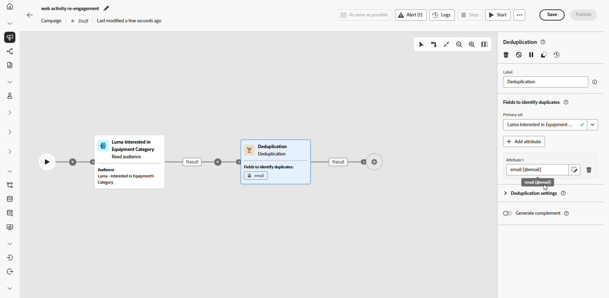
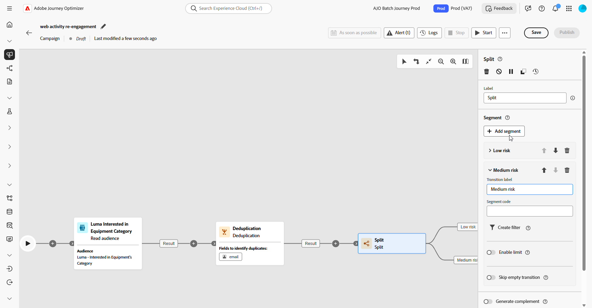

# 閲覧行動で顧客を惹きつける {#engage-customers-uc}

>[!BEGINSHADEBOX]

このユースケースは、Experience Platformにすでに存在するオーディエンス、特に閲覧中のアクティビティを収集するリアルタイムのweb ビヘイビアーオーディエンスから始まります。 [Adobe Experience Platformの詳細](https://experienceleague.adobe.com/ja/docs/experience-platform/rtcdp/intro/rtcdp-intro/get-started#audiences)

**この使用例に必要なスキーマ：**

* **受信者**: ターゲティングディメンションとして使用され、フィールド：`email`、`churnprop`
* **Wishlist**: フィールド：`description`、`priceref`、`imageurl`

➡️ [&#x200B; リレーショナルスキーマの設定方法を学ぶ](gs-schemas.md)

>[!ENDSHADEBOX]

{zoomable="yes"}

このキャンペーンは、エクササイズ用品カテゴリを閲覧した顧客をターゲットにしています。 オーディエンスは重複が排除され、解約リスク（エンゲージメントや購入を停止する可能性）によってセグメント化されます。

リスクの高い顧客を別の新しいオーディエンスに集約し、後で特定のコミュニケーションに使用します。一方、リスクの低い顧客は、パーソナライズされた電子メールやフォローアップを通じて、複数のステップを経ます

1. まず、**ウィッシュリストの再エンゲージメント**&#x200B;を目的とした新しいキャンペーンを設定します。 これにより、既に購入意思を示した顧客に焦点を当てたメッセージを配信し、商品をウィッシュリストに保存できます。

   {zoomable="yes"}

1. キャンペーン名、説明、開始日と終了日、関連するタグなど、**[!UICONTROL キャンペーン設定]**&#x200B;を入力します。

1. Adobe Experience Platformから事前定義済みのオーディエンスを選択するには、**[!UICONTROL オーディエンスを読み取り]** アクティビティを追加します。ここでは、web サイトのエクササイズ機器カテゴリを閲覧したお客様です。

   受信者は、**[!UICONTROL エンティティ]** フィールドから選択した電子メールアドレスで識別されます。

   {zoomable="yes"}

1. **[!UICONTROL 重複排除]** アクティビティを追加して、オーディエンスから重複するメールアドレスを削除し、各顧客が1つのメッセージのみを受信するようにします。

1. **[!UICONTROL 属性を追加]**&#x200B;をクリックし、重複排除の属性としてメールを選択します。

   {zoomable="yes"}

1. 次に、**[!UICONTROL 分割]** アクティビティを追加して、顧客が解約する可能性によってセグメンテーションし、各顧客グループに合わせてパーソナライズされたエクスペリエンスを提供できるようにします。

   {zoomable="yes"}

1. 「**[!UICONTROL セグメントを追加]**」をクリックして、3つのグループを作成します。

   * 低リスク

   * Mediumのリスク

   * 高リスク

   {zoomable="yes"}

1. 「**[!UICONTROL フィルターを作成]**」をクリックして、各グループの解約確率を定義します。

   **条件エディター**&#x200B;を使用して、各顧客の解約リスクを決定する特定の値を設定します。

   {zoomable="yes"}

1. 各セグメントの扱いは異なります。

   * [低/中程度のリスク](#low-medium-risk)
   * [高リスク](#high-risk)

1. キャンペーンをテストして準備ができたら、**[!UICONTROL 公開]**&#x200B;をクリックして公開します。

キャンペーンが実行されたら、レポートダッシュボードを探索して、パフォーマンス指標と主要インサイトを確認します。

➡️ [&#x200B; レポートの詳細](../reports/campaign-global-report-cja.md)

## 高リスクのセグメント {#high-risk}

解約リスクが高いと特定された顧客については、専用のオーディエンスセグメントを作成します。 このオーディエンスは、後でターゲットを絞った個別のコミュニケーションに使用されます。

1. **[!UICONTROL オーディエンスを保存]**&#x200B;を追加します。

   {zoomable="yes"}

1. オーディエンスに&#x200B;**[!UICONTROL ラベル]**&#x200B;を追加し、**[!UICONTROL プロファイルマッピングフィールド]**、ここ&#x200B;**受信者 – 電子メール**&#x200B;を選択します。

   {zoomable="yes"}

このオーディエンスはExperience Cloudに保存され、後で特定のターゲットキャンペーンに使用できます。

## 低/中程度のリスクセグメント {#low-medium-risk}

解約のリスクが低い顧客と中程度の顧客の場合は、エンゲージメントを強化することを目的としたマルチステップの施策を設定します。

1. 低リスクとMedium リスクの両方を&#x200B;**[!UICONTROL Union]** アクティビティと組み合わせます。

   {zoomable="yes"}

1. ウィッシュリストと製品情報を使用してキャンペーンをパーソナライズするために、**[!UICONTROL エンリッチメント]** アクティビティを追加します。

1. 「**[!UICONTROL 属性を追加]**」をクリックして、次の3つの属性を作成します。

   * `Wishlist > description`
   * `Wishlist > priceref`
   * `Wishlist > imageurl`

   これにより、ウィッシュリストの詳細情報を含むメッセージが充実します。

   {zoomable="yes"}

1. 電子メールでのエンゲージメントにもとづいて、リターゲティング用の新しいオーディエンスを作成します。

   ここでは、メールのクリックイベントにもとづいてオーディエンスを作成し、以前に送信されたメールでインタラクションしたあらゆる顧客をリターゲティングします。具体的には、メッセージ内のリンクをクリックしました。

   {zoomable="yes"}

1. エンゲージメントを均等に分割し、SMSやプッシュ通知でフォローアップを送信してコンバージョンを促進します。

   {zoomable="yes"}

1. 受信者の名前などのプロファイル属性と、ウィッシュリストのアイテムなどのエンリッチメントデータを含む、各チャネルのメッセージコンテンツを作成し、各メッセージをパーソナライズします。

   {zoomable="yes"}
