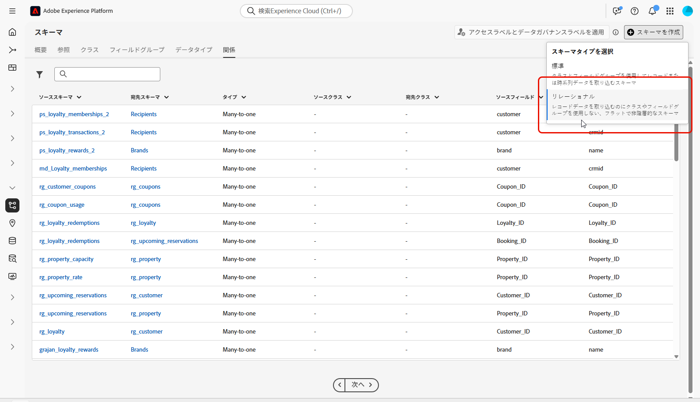
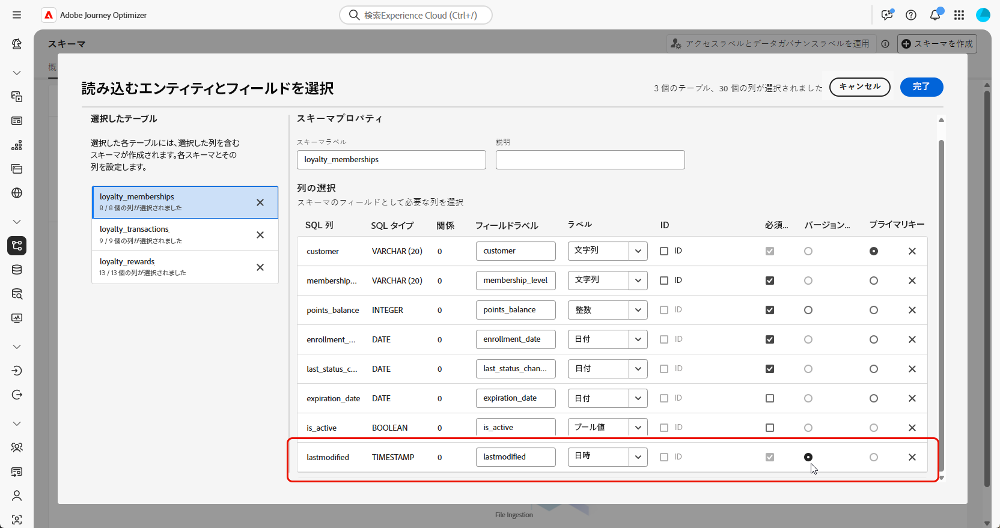
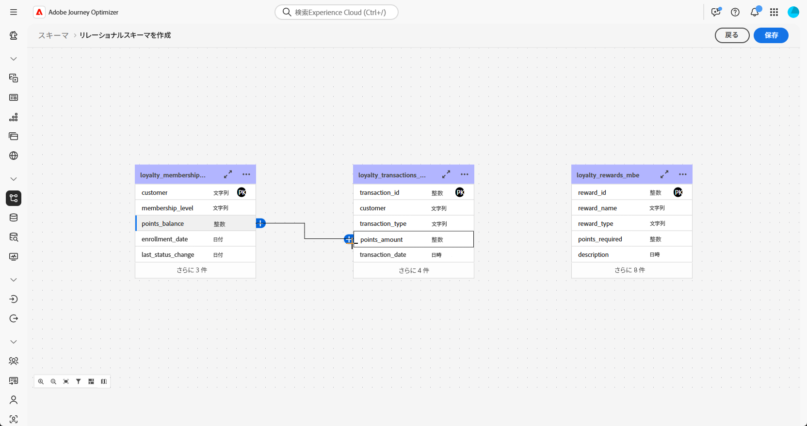
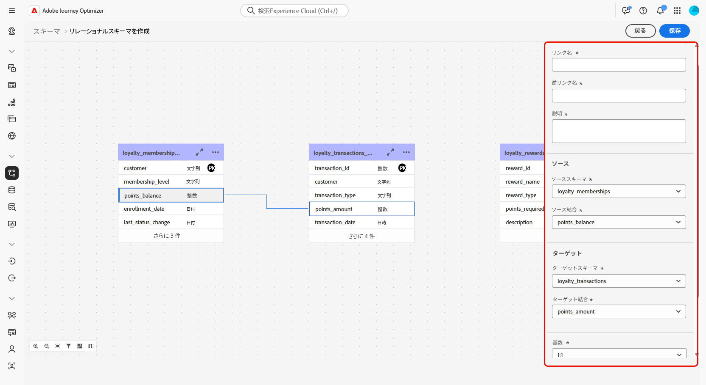
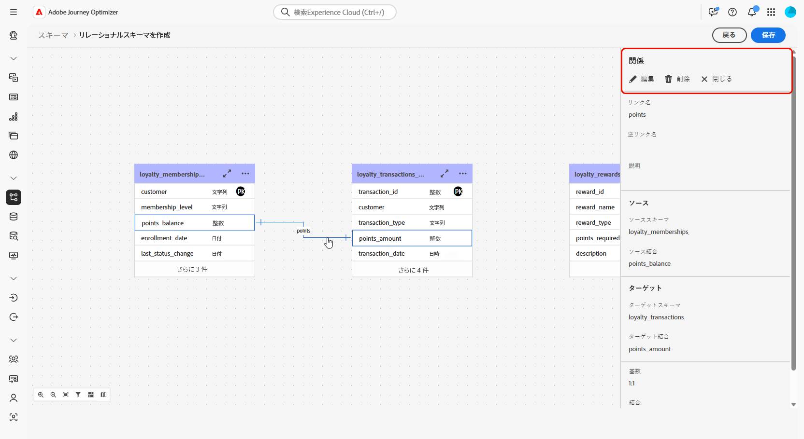
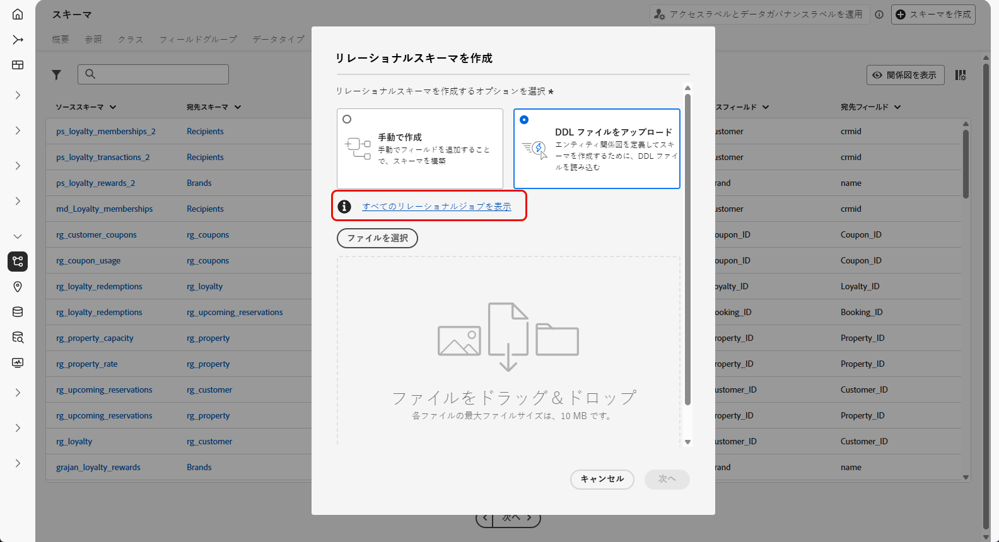
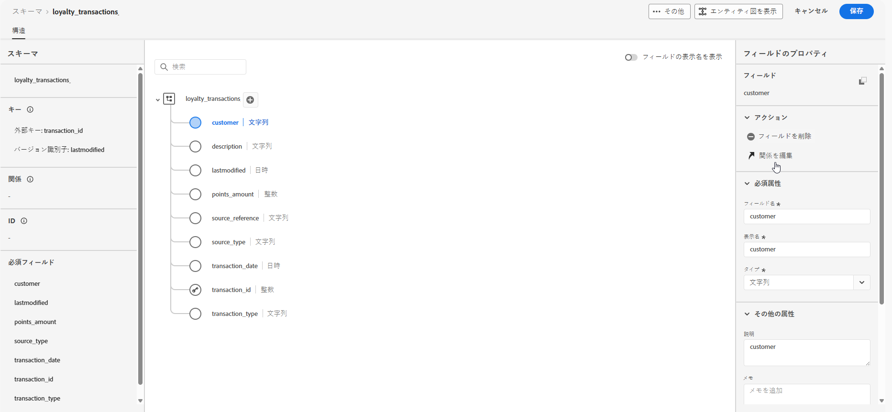
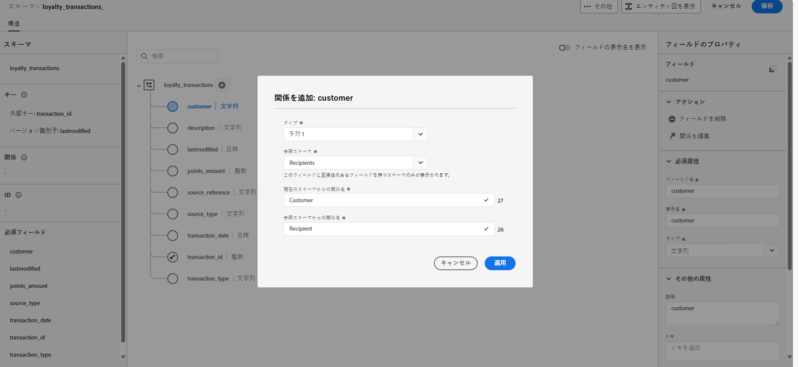
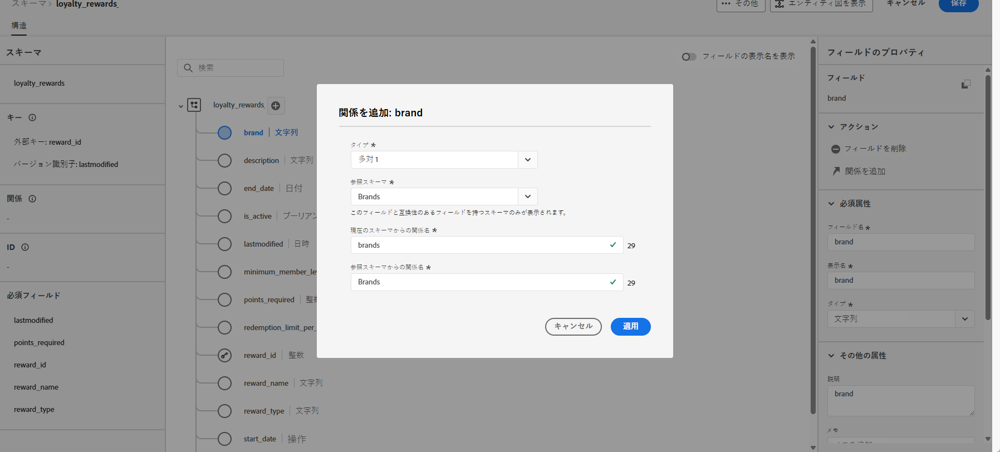

# DDL ファイルを使用したリレーショナルスキーマの作成 {#file-upload-schema}

**ロイヤルティメンバーシップ**、**ロイヤルティトランザクション**、**ロイヤルティリワード**&#x200B;などのスキーマを作成することで、オーケストレーションされたキャンペーンに必要なリレーショナルデータモデルを定義します。 各スキーマには、プライマリキー、バージョン管理属性、および&#x200B;**受信者**&#x200B;や&#x200B;**ブランド**&#x200B;などの参照エンティティへの適切な関係が含まれている必要があります。

スキーマは、インターフェイスを使用して手動で作成することも、DDL ファイルを使用して一括インポートすることもできます。

この節では、DDL （Data Definition Language）ファイルをアップロードしてAdobe Experience Platform内にリレーショナルスキーマを作成する手順を説明します。 DDL ファイルを使用すると、テーブル、属性、キー、関係など、データモデルの構造を事前に定義できます。

1. [DDL ファイル &#x200B;](#ddl-upload)をアップロードして、リレーショナルスキーマを作成し、それらの構造を定義します。

1. データモデル内のテーブル間の[関係](#relationships)を定義します。

1. [&#x200B; スキーマ &#x200B;](#link-schema)をリンクして、関係データを受信者やブランドなどの既存のプロファイルエンティティに接続します。

1. [&#x200B; サポートされているソースからデータセットにデータ &#x200B;](ingest-data.md)を取り込みます。

➡️ [&#x200B; リレーショナルスキーマについて詳しくは、Adobe Experience Platform ドキュメント &#x200B;](https://experienceleague.adobe.com/ja/docs/experience-platform/xdm/schema/relational)を参照してください

## DDL ファイルのアップロード{#ddl-upload}

DDL ファイルをアップロードすることで、テーブル、属性、キー、関係など、データモデルの構造を事前に定義できます。

Excel ベースのスキーマファイルのアップロードがサポートされています。 [が提供するテンプレート &#x200B;](assets/template.zip)をダウンロードして、スキーマ定義を簡単に準備できます。

+++Adobe Experience Platformでリレーショナルスキーマを作成する場合は、次の機能がサポートされています

* **列挙**\
  ENUM フィールドは、DDL ベースのスキーマ作成と手動のスキーマ作成の両方でサポートされています。 DDL ファイルからスキーマを読み込むと、ファイルで定義された列挙が自動的に読み込まれるため、許可される値の固定セットを持つ属性を定義できます。

  例を次に示します。

  ```
  CREATE TABLE orders (
  order_id     INT NOT NULL,
  product_id   INT NOT NULL,
  order_date   DATE NOT NULL,
  customer_id  INT NOT NULL,
  quantity     INT NOT NULL,
  order_status enum ('PENDING', 'SHIPPED', 'DELIVERED', 'CANCELLED'),
  PRIMARY KEY (order_id, product_id)
  );
  ```

* **複合キー**&#x200B;および&#x200B;**複合関係**

  複数のフィールドにまたがる複合プライマリキーは、関係スキーマ定義でサポートされており、複数のフィールドを組み合わせてレコードを一意に識別できます。

  DDLまたはExcel ファイルからスキーマを読み込むと、テーブル間の複合関係が自動的に作成されます。 エンティティ関係ビューでは、各複合リンクに、リンクされたテーブル間のフィールドペアリングの完全なセットが表示されます。

* データガバナンス用&#x200B;**スキーマラベル**\
  ラベル付けは、アクセス制御や使用制限などのデータガバナンスポリシーを適用するために、スキーマフィールドレベルでサポートされています。 詳しくは、[Adobe Experience Platform ドキュメント &#x200B;](https://experienceleague.adobe.com/docs/experience-platform/xdm/home.html?lang=ja)を参照してください。

+++

1. Adobe Experience Platformにログインします。

1. **データ管理** > **スキーマ** メニューに移動します。

1. 「**スキーマを作成**」をクリックします。

1. **[!UICONTROL リレーショナル]**&#x200B;を&#x200B;**スキーマタイプ**&#x200B;として選択します。

   

1. 「**[!UICONTROL DDL ファイルをアップロード]**」を選択して、エンティティ関係図を定義し、スキーマを作成します。

   テーブル構造には、次の要素を含める必要があります。
   * 少なくとも1つのプライマリキー。
   * バージョン識別子（タイプ `datetime`または`number`の`lastmodified` フィールドなど）。
   * Change Data Capture （CDC）取り込みの場合、データ変更の種類（挿入、更新、削除など）を示す`_change_request_type`という名前の特殊な列が追加の処理を有効にします。`String`
   * DDL ファイルで定義できるテーブルの数は200を超えることはできません。


   >[!IMPORTANT]
   >
   > ターゲティングに使用するスキーマには、関連付けられた&#x200B;**ID名前空間**&#x200B;を持つタイプ `String`のID フィールドを少なくとも1つ含める必要があります。\
   >これにより、Adobe Journey OptimizerのターゲティングおよびID解決機能との互換性が確保されます。

1. DDL ファイルをドラッグ&amp;ドロップし、**[!UICONTROL 次へ]**&#x200B;をクリックします。

   DDL ファイルでサポートされる最大サイズは10 MBです。

1. **[!UICONTROL スキーマ名]**&#x200B;を入力します。

1. 各スキーマとその列を設定し、プライマリキーとバージョン記述子が指定されるようにします。

   データセットが最新のデータで更新されるようにするには、`lastmodified`などの1つの属性をバージョン記述子（`datetime`、`long`、または`int`）として指定する必要があります。 ユーザーはバージョン記述子を変更できます。これは、設定が完了すると必須になります。 属性をプライマリキー（PK）とバージョン記述子の両方にすることはできません。

   

1. 属性に`identity`というマークを付けて、定義されたID名前空間にマッピングします。

1. 各テーブルの名前を変更、削除、または説明を追加します。

1. 完了したら、**[!UICONTROL 完了]**&#x200B;をクリックします。

カンバス内でテーブルとフィールドの定義を検証できるようになりました。 [詳細については、以下の節を参照してください](#entities)

## 関係の定義 {#relationships}

スキーマの作成時に、DDL ファイル内で直接関係を指定できます。 ファイル以外で関係を定義する場合は、次の手順に従ってインターフェイスで定義できます。

1. データモデルのカンバスビューにアクセスし、リンクする2つのテーブルを選択します

1. Source結合の横にある「」ボタンをクリックし、矢印をTarget結合に向かってドラッグ&amp;ガイドして接続を確立します。

   >[!NOTE]
   >
   >複数のフィールドにまたがる複合キーは、DDL ファイルで定義する場合にサポートされます。 DDLまたはExcel ファイルから読み込むと、テーブル間の複合関係が自動的に作成されます。 エンティティ関係ビューでは、複合リンクによって、リンクされたテーブル間のフィールドペアリングの完全なセットが表示されます。

   

1. 指定されたフォームに入力してリンクを定義し、設定が完了したら「**適用**」をクリックします。

   

   **基数**:

   * **1-N**: ソース テーブルの1つの出現には、ターゲット テーブルの複数の対応する出現を含めることができますが、ターゲット テーブルの1つの出現には、ソース テーブルの1つの対応する出現を含めることができます。

   * **N-1**：対象テーブルの1つの出現箇所に対応する複数のソース テーブルを含めることができますが、対象テーブルの1つの出現箇所に対応するターゲット テーブルの出現箇所を最大1つ含めることができます。

   * **1-1**: ソース テーブルの1つの出現には、ターゲット テーブルの対応する1つの出現を最大で含めることができます。

1. データモデルで定義されているすべてのリンクは、カンバスビューでは矢印で表されます。 2つのテーブル間の矢印をクリックして、詳細を表示したり、編集したり、必要に応じてリンクを削除したりします。

   

1. ツールバーを使用して、カンバスをカスタマイズおよび調整します。

   

   * **ズームイン**: キャンバスを拡大して、データモデルの詳細をより明確に表示します。

   * **ズームアウト**: データモデルをより広く見るために、カンバスサイズを小さくします。

   * **ビューの調整**：表示領域内のすべてのスキーマに合わせてズームを調整します。

   * **フィルター**: キャンバス内に表示するスキーマを選択します。

   * **自動レイアウトを強制**：より優れた整理のために、スキーマを自動的に配置します。

   * **マップを表示**：大きなスキーマレイアウトや複雑なスキーマレイアウトをより簡単に操作できるように、ミニマップオーバーレイを切り替えます。

   * **すべてを展開/すべてを折りたたむ**：すべてのスキーマノードをすばやく展開または折りたたんで、属性を表示または非表示にします。

   * **ダウンロード**: ER図を.png ファイルとしてダウンロードします。

1. 完了したら、**保存**&#x200B;をクリックします。 このアクションは、スキーマと関連するデータセットを作成し、オーケストレーションされたキャンペーンで使用するデータセットを有効にします。

1. 「**[!UICONTROL ジョブを開く]**」をクリックして、作成ジョブの進行状況を監視します。 このプロセスは、DDL ファイルで定義されているテーブルの数に応じて、数分かかる場合があります。

   また、**[!UICONTROL DDL ファイルをアップロード]** ウィンドウを開き、**[!UICONTROL すべてのDDL インポートジョブを表示]**&#x200B;を選択すると、DDL インポートジョブにアクセスできます。

   

## リンクスキーマ {#link-schema}

>[!IMPORTANT]
>
> DDL ファイル内で明示的に定義された関係のみが、システムで認識されます。 DDL ファイル以外に存在するエンティティ関係は無視され、処理されません。

**ロイヤルティトランザクション** スキーマと&#x200B;**受信者** スキーマの関係を確立して、各トランザクションを正しい顧客レコードに関連付けます。

1. **[!UICONTROL スキーマ]**&#x200B;に移動し、以前に作成した&#x200B;**ロイヤルティトランザクション**&#x200B;を開きます。

1. 顧客&#x200B;**[!UICONTROL フィールドプロパティ]**&#x200B;から「**[!UICONTROL 関係を追加]**」をクリックします。

   

1. **[!UICONTROL Many-to-One]**&#x200B;を関係&#x200B;**[!UICONTROL Type]**&#x200B;として選択します。

1. 既存の&#x200B;**受信者** スキーマにリンクします。

   

1. 現在のスキーマ **の**&#x200B;[!UICONTROL &#x200B;関係名と、参照スキーマ &#x200B;]&#x200B;**の**&#x200B;関係名を入力します。

1. **[!UICONTROL 適用]**&#x200B;をクリックして変更を保存します。

続いて、**ロイヤルティ報酬** スキーマと&#x200B;**ブランド** スキーマの関係を作成し、各報酬エントリを適切なブランドに関連付けます。


