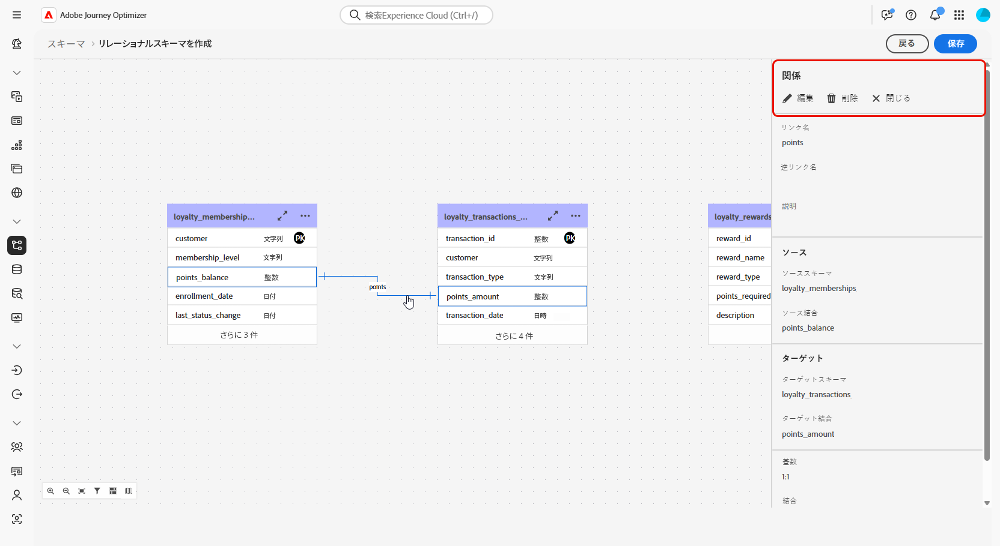

# DDL ファイルを使用したリレーショナルスキーマの作成 {#file-upload-schema}

+++ 目次

| 調整されたキャンペーンへようこそ | 最初の調整されたキャンペーンの開始 | データベースのクエリ | 調整されたキャンペーンアクティビティ |
|---|---|---|---|
| [ 調整されたキャンペーンの基本を学ぶ ](gs-orchestrated-campaigns.md)   リレーショナルスキーマとデータセットの作成および管理：  <ul><li>[ スキーマとデータセットの概要 ](gs-schemas.md)</li><li>[ 手動スキーマ ](manual-schema.md)</li><li>[ ファイルアップロードスキーマ ](file-upload-schema.md)</li><li>[ データの取り込み ](ingest-data.md)</li></ul>[ オーケストレーションされたキャンペーンへのアクセスと管理 ](access-manage-orchestrated-campaigns.md)  [ オーケストレーションされたキャンペーンを作成するための主な手順 ](gs-campaign-creation.md) | [ キャンペーンの作成とスケジュール設定 ](create-orchestrated-campaign.md)  [ アクティビティのオーケストレーション ](orchestrate-activities.md)  [ キャンペーンの開始と監視 ](start-monitor-campaigns.md)  [ レポート ](reporting-campaigns.md) | [ ルールビルダーの操作 ](orchestrated-rule-builder.md)  [ 最初のクエリの作成 ](build-query.md)  [ 式の編集 ](edit-expressions.md)  [ リターゲティング ](retarget.md) | [ アクティビティの基本を学ぶ ](activities/about-activities.md)   アクティビティ： [AND 結合 ](activities/and-join.md) - [ オーディエンスを作成 ](activities/build-audience.md) - [ ディメンションの変更 ](activities/change-dimension.md) - [ チャネルアクティビティ ](activities/channels.md) - [ 結合 ](activities/combine.md) - [ 重複排除 ](activities/deduplication.md) - [ エンリッチメント ](activities/enrichment.md) - [ 分岐 ](activities/fork.md) - [ 紐付け ](activities/reconciliation.md)    - |

{style="table-layout:fixed"}

+++

 

>[!BEGINSHADEBOX]

 

このページのコンテンツは最終的なものではなく、変更される場合があります。

>[!ENDSHADEBOX]

**ロイヤルティメンバーシップ**、**ロイヤルティトランザクション**、**ロイヤルティ報酬** などのスキーマを作成して、調整されたキャンペーンに必要なリレーショナルデータモデルを定義します。 各スキーマには、プライマリキー、バージョン管理属性、参照エンティティへの適切な関係（**Recipients** や **Brands** など）を含める必要があります。

スキーマは、インターフェイスを通じて手動で作成することも、DDL ファイルを使用して一括で読み込むこともできます。

この節では、DDL （Data Definition Language）ファイルをアップロードしてAdobe Experience Platform内にリレーショナルスキーマを作成する手順を説明します。 DDL ファイルを使用すると、テーブル、属性、キー、関係など、データモデルの構造を事前に定義できます。

1. [DDL ファイルをアップロード ](#ddl-upload) して、リレーショナルスキーマを作成し、その構造を定義します。

1. データモデルのテーブル間の [ 関係の定義 ](#relationships)。

1. [ スキーマをリンク ](#link-schema)：リレーショナルデータを既存のプロファイルエンティティ（受信者やブランドなど）に接続します。

1. サポートされているソースからデータセットへの [ データの取り込み ](ingest-data.md)。

## DDL ファイルのアップロード{#ddl-upload}

DDL ファイルをアップロードすることで、テーブル、属性、キー、関係など、データモデルの構造を事前に定義できます。

1. Adobe Experience Platformにログインします。

1. **データ管理**/**スキーマ** メニューに移動します。

1. **スキーマを作成** をクリックします。

1. **[!UICONTROL スキーマタイプ]** として **リレーショナル** を選択します。

   

1. **[!UICONTROL DDL ファイルをアップロード]** を選択して、エンティティ関係図を定義し、スキーマを作成します。

   テーブル構造には、次の内容を含める必要があります。
   * 1 つ以上のプライマリキー
   * バージョン識別子（`lastmodified` タイプまたは `datetime` タイプの `number` フィールドなど）。

1. DDL ファイルをドラッグ&amp;ドロップし、「**[!UICONTROL 次へ]**」をクリックします。

1. **[!UICONTROL スキーマ名]** を入力します。

1. 各スキーマとその列を設定し、プライマリキーが指定されていることを確認します。

   `lastmodified` などの 1 つの属性をバージョン記述子として指定する必要があります。 この属性は、通常 `datetime`、`long` または `int` のタイプで、データセットが最新のデータバージョンで更新されていることを確認するための取り込みプロセスに不可欠です。

   

1. 完了したら **[!UICONTROL 完了]** をクリックします。

キャンバス内のテーブルとフィールドの定義を確認できるようになりました。 [ 詳しくは、以下の節を参照してください ](#entities)

## 関係の定義 {#relationships}

スキーマ内のテーブル間の論理接続を定義するには、次の手順に従います。

1. データモデルのキャンバスビューにアクセスし、リンクする 2 つのテーブルを選択します

1. ソース結合の横にある「」ボタンをクリックし、矢印をドラッグしてターゲット結合の方向に誘導し、接続を確立します。

   

1. 指定されたフォームに入力してリンクを定義し、設定が完了したら「**適用**」をクリックします。

   

   **カーディナリティ**:

   * **一対多**：ソーステーブルの 1 つのオカレンスは、ターゲットテーブルの複数のオカレンスに対応させることができますが、ターゲットテーブルの 1 つのオカレンスは、ソーステーブルの最大 1 つのオカレンスにのみ対応させることができます。

   * **多対一**：ターゲットテーブルの 1 つのオカレンスは、ソーステーブルの複数のオカレンスに対応させることができますが、ソーステーブルの 1 つのオカレンスは、ターゲットテーブルの最大 1 つのオカレンスにのみ対応させることができます。

   * **一対一**：ソーステーブルの 1 つのオカレンスは、最大でターゲットテーブルの 1 つのオカレンスに対応させることができます。

1. データモデルで定義されたすべてのリンクは、キャンバス表示では矢印として表されます。必要に応じて、詳細を表示したり、編集したり、リンクを削除したりするには、2 つのテーブル間の矢印をクリックします。

   

1. ツールバーを使用して、キャンバスをカスタマイズおよび調整します。

   

   * **ズームイン**：データモデルの詳細がより明確に表示するには、キャンバスを拡大します。

   * **ズームアウト**：データモデルをより広く表示するには、キャンバスサイズを縮小します。

   * **ビューに合わせる**：表示領域内のすべてのスキーマに合わせてズームを調整します。

   * **フィルター**：キャンバス内に表示するスキーマを選択します。

   * **自動レイアウトを強制**：スキーマを自動的に配置して、整理を強化します。

   * **マップを表示**：ミニマップオーバーレイを切り替えて、大きなスキーマレイアウトや複雑なスキーマレイアウトをより簡単に移動できるようにします。

1. 完了したら **保存** をクリックします。 このアクションにより、スキーマおよび関連するデータセットが作成され、オーケストレートキャンペーンで使用するためのデータセットが有効になります。

1. **[!UICONTROL ジョブを開く]** をクリックして、作成ジョブの進行状況を監視します。 このプロセスには、DDL ファイルで定義されたテーブルの数に応じて、数分かかる場合があります。

   

## リンクスキーマ {#link-schema}

**ロイヤルティトランザクション** スキーマと **受信者** スキーマの関係を確立して、各トランザクションを正しい顧客レコードに関連付けます。

1. **[!UICONTROL スキーマ]** に移動し、以前に作成した **ロイヤルティトランザクション** を開きます。

1. 顧客 **[!UICONTROL フィールドプロパティ]** から「**[!UICONTROL 関係を追加]**」をクリックします。

   

1. 関係 **[!UICONTROL タイプ]** として「**[!UICONTROL 多対 1]**」を選択します。

1. 既存の **受信者** スキーマにリンクします。

   

1. **[!UICONTROL 現在のスキーマからの関係名]** および **[!UICONTROL 参照スキーマからの関係名]** を入力します。

1. 「**[!UICONTROL 適用]**」をクリックして変更を保存します。

**ロイヤルティ報酬** スキーマと **ブランド** スキーマの間の関係を作成し、各報酬エントリを適切なブランドに関連付けて続行します。

<!--### Setting Up Change data capture ingestion {#cdc-ingestion}

If you need to change the data source, you must delete the existing dataflow and create a new one pointing to the same dataset with the new source.

When using Change Data Capture (CDC), it is essential that the source and dataset remain in sync to ensure accurate incremental updates. Follow the steps below:

1. **Schema Requirements**
   - Your schema must include:
     - A **primary key** (e.g., `transaction_id`)
     - A **versioning field** (e.g., `lastmodified` or an incrementing `version_id`)
   - Enable the dataset for **Orchestrated Campaigns** if needed.

2. **CDC Dataflow Setup**
   - During dataflow creation, after choosing your source and files:
     - **Enable the CDC option**
     - Select your CDC-ready dataset
     - Confirm field mappings (especially version field)

3. **Keep Source and Target in Sync**
   - The source system must consistently update the version field so the platform can detect changes accurately.

Once set up, the platform will automatically ingest **only changed or new records** each time the flow runs.
-->
