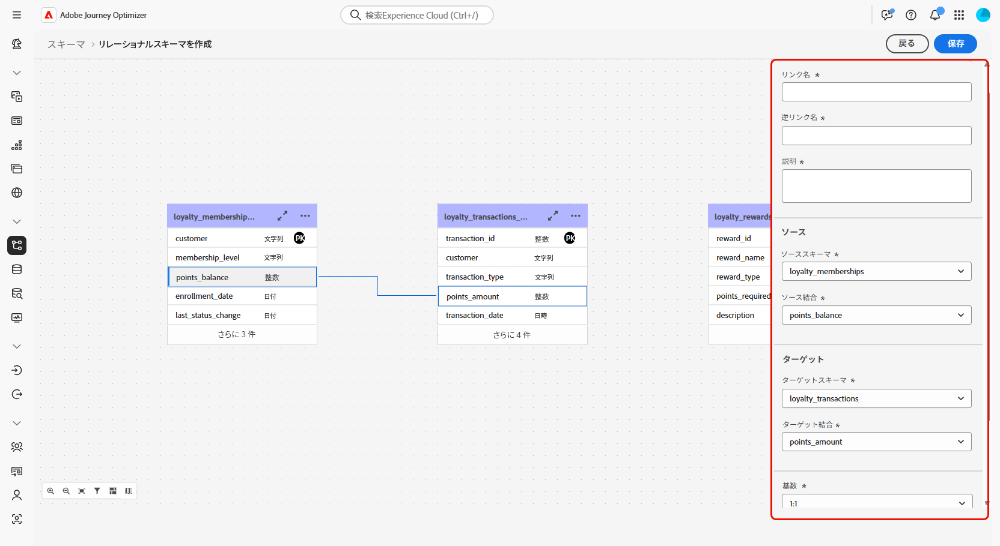
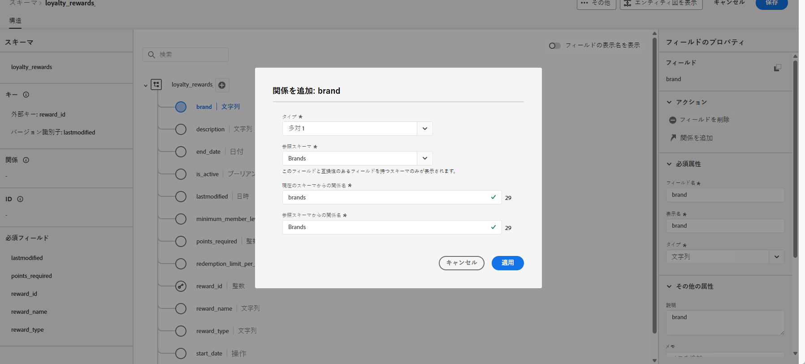

# DDL ファイルを使用したリレーショナルスキーマの作成 {#file-upload-schema}

**ロイヤルティメンバーシップ**、**ロイヤルティトランザクション**、**ロイヤルティ報酬**&#x200B;などのスキーマを作成して、調整されたキャンペーンに必要なリレーショナルデータモデルを定義します。各スキーマには、プライマリキー、バージョン管理属性、**受信者**&#x200B;や&#x200B;**ブランド**&#x200B;などのエンティティを参照する適切な関係を含める必要があります。

スキーマは、インターフェイスを通じて手動で作成することや、DDL ファイルを使用して一括で読み込むことができます。

この節では、DDL（データ定義言語）ファイルをアップロードして Adobe Experience Platform 内でリレーショナルスキーマを作成する方法について、手順を追って説明します。DDL ファイルを使用すると、テーブル、属性、キー、関係など、データモデルの構造を事前に定義できます。

1. [DDL ファイルをアップロード](#ddl-upload)してリレーショナルスキーマを作成し、その構造を定義します。

1. データモデルのテーブル間の[関係を定義](#relationships)します。

1. [スキーマをリンク](#link-schema)して、リレーショナルデータを受信者やブランドなどの既存のプロファイルエンティティに接続します。

1. サポートされているソースからデータセットに[データを取得](ingest-data.md)します。

## DDL ファイルのアップロード{#ddl-upload}

DDL ファイルをアップロードすると、テーブル、属性、キー、関係など、データモデルの構造を事前に定義できます。

Excel ベースのスキーマファイルのアップロードがサポートされています。[提供されているテンプレート](assets/template.zip)をダウンロードして、スキーマ定義を簡単に準備します。

+++Adobe Experience Platform でリレーショナルスキーマを作成する場合、次の機能がサポートされます。

* **ENUM**\
  ENUM フィールドは、DDL ベースと手動スキーマ作成の両方でサポートされているので、許可される値の固定セットを使用して属性を定義できます。

* **データガバナンスのスキーマラベル**\
  アクセス制御や使用制限などのデータガバナンスポリシーの適用に、スキーマフィールドレベルでラベル付けがサポートされています。詳しくは、[Adobe Experience Platform ドキュメント](https://experienceleague.adobe.com/docs/experience-platform/xdm/home.html?lang=ja)を参照してください。

* **複合キー**\
  複合プライマリキーは、リレーショナルスキーマ定義でサポートされるので、複数のフィールドと共に使用してレコードを一意に識別できます。

+++

1. Adobe Experience Platform にログインします。

1. **データ管理**／**スキーマ**&#x200B;メニューに移動します。

1. 「**スキーマを作成**」をクリックします。

1. **[!UICONTROL スキーマタイプ]**&#x200B;として「**リレーショナル**」を選択します。

   

1. 「**[!UICONTROL DDL ファイルをアップロード]**」を選択し、エンティティ関係ダイアグラムを定義して、スキーマを作成します。

   テーブル構造には、次の項目を含める必要があります。
   * 1 つ以上のプライマリキー
   * バージョン識別子（`datetime` タイプまたは `number` タイプの「`lastmodified`」フィールドなど）。
   * データキャプチャを変更（CDC）取り込みの場合、タイプ `String` の `_change_request_type` という特別な列。これは、データ変更のタイプ（挿入、更新、削除など）を示し、増分処理をできるようにします。

   >[!IMPORTANT]
   >
   > ターゲティングに使用するスキーマには、関連付けられた **ID 名前空間**&#x200B;を持つタイプ `String` の ID フィールドを 1 つ以上含める必要があります。\
   >これにより、Adobe Journey Optimizer のターゲティングおよび ID 解決機能との互換性が確保されます。

1. DDL ファイルをドラッグ＆ドロップし、「**[!UICONTROL 次へ]**」をクリックします。

   DDL ファイルの最大サポートサイズは 10 MB です。

1. **[!UICONTROL スキーマ名]**&#x200B;を入力します。

1. 各スキーマとその列を設定し、プライマリキーが指定されていることを確認します。

   `lastmodified` などの 1 つの属性をバージョン記述子として指定する必要があります。この属性は通常、`datetime`、`long` または `int` のタイプで、データセットが最新のデータバージョンで更新されるようにする取得プロセスに不可欠です。

   

1. 完了したら、「**[!UICONTROL 完了]**」をクリックします。

これで、キャンバス内でテーブルとフィールドの定義を確認できるようになりました。[詳しくは、以下の節を参照してください。](#entities)

## 関係の定義 {#relationships}

スキーマ内のテーブル間の論理接続を定義するには、次の手順に従います。

1. データモデルのキャンバス表示にアクセスし、リンクする 2 つのテーブルを選択します

1. ソース結合の横にある「」ボタンをクリックし、矢印をドラッグしてターゲット結合の方向に誘導し、接続を確立します。

   

1. 指定されたフォームに入力してリンクを定義し、設定が完了したら「**適用**」をクリックします。

   

   **基数**：

   * **一対多**：ソーステーブルの 1 つのオカレンスは、ターゲットテーブルの複数のオカレンスに対応させることができますが、ターゲットテーブルの 1 つのオカレンスは、ソーステーブルの最大 1 つのオカレンスにのみ対応させることができます。

   * **多対一**：ターゲットテーブルの 1 つのオカレンスは、ソーステーブルの複数のオカレンスに対応させることができますが、ソーステーブルの 1 つのオカレンスは、ターゲットテーブルの最大 1 つのオカレンスにのみ対応させることができます。

   * **一対一**：ソーステーブルの 1 つのオカレンスは、最大でターゲットテーブルの 1 つのオカレンスに対応させることができます。

1. データモデルで定義されたすべてのリンクは、キャンバス表示では矢印として表されます。必要に応じて、詳細を表示したり、編集したり、リンクを削除したりするには、2 つのテーブル間の矢印をクリックします。

   

1. ツールバーを使用して、キャンバスをカスタマイズおよび調整します。

   

   * **ズームイン**：データモデルの詳細がより明確に表示するには、キャンバスを拡大します。

   * **ズームアウト**：データモデルをより広く表示するには、キャンバスサイズを縮小します。

   * **表示に合わせる**：すべてのスキーマを表示領域内に合わせるには、ズームを調整します。

   * **フィルター**：キャンバス内に表示するスキーマを選択します。

   * **自動レイアウトを適用**：スキーマを自動的に整理して、より適切に整理します。

   * **マップを表示**：ミニマップオーバーレイを切り替えると、大規模スキーマレイアウトや複雑なスキーマレイアウトをより簡単に移動できます。

1. 完了したら、「**保存**」をクリックします。このアクションにより、スキーマと関連するデータセットが作成され、データセットを調整されたキャンペーンで使用できます。

1. 「**[!UICONTROL ジョブを開く]**」をクリックして、作成ジョブの進行状況を監視します。このプロセスは、DDL ファイルで定義されているテーブルの数に応じて、数分かかる場合があります。

   また、**[!UICONTROL DDL ファイルをアップロード]**&#x200B;ウィンドウを開き、「**[!UICONTROL すべてのリレーショナルジョブを表示]**」を選択して、リレーショナルジョブにアクセスすることもできます。

   

## スキーマをリンク {#link-schema}

>[!IMPORTANT]
>
> DDL ファイル内で明示的に定義された関係のみがシステムによって認識されます。DDL ファイルの外部に存在するエンティティの関係は無視され、処理されません。

**ロイヤルティトランザクション**&#x200B;スキーマと&#x200B;**受信者**&#x200B;スキーマ間の関係を確立して、各トランザクションを正しい顧客レコードに関連付けます。

1. **[!UICONTROL スキーマ]**&#x200B;に移動し、以前に作成した&#x200B;**ロイヤルティトランザクション**&#x200B;を開きます。

1. 顧客の&#x200B;**[!UICONTROL フィールドプロパティ]**&#x200B;から「**[!UICONTROL 関係を追加]**」をクリックします。

   

1. 「**[!UICONTROL 多対一]**」を関係&#x200B;**[!UICONTROL タイプ]**&#x200B;として選択します。

1. 既存の&#x200B;**受信者**&#x200B;スキーマにリンクします。

   

1. **[!UICONTROL 現在のスキーマからの関係名]**&#x200B;と&#x200B;**[!UICONTROL 参照スキーマからの関係名]**&#x200B;を入力します。

1. 「**[!UICONTROL 適用]**」をクリックして変更を保存します。

続けて、**ロイヤルティ報酬**&#x200B;スキーマと&#x200B;**ブランドスキーマ**&#x200B;の関係を作成し、各報酬エントリを適切なブランドに関連付けます。

