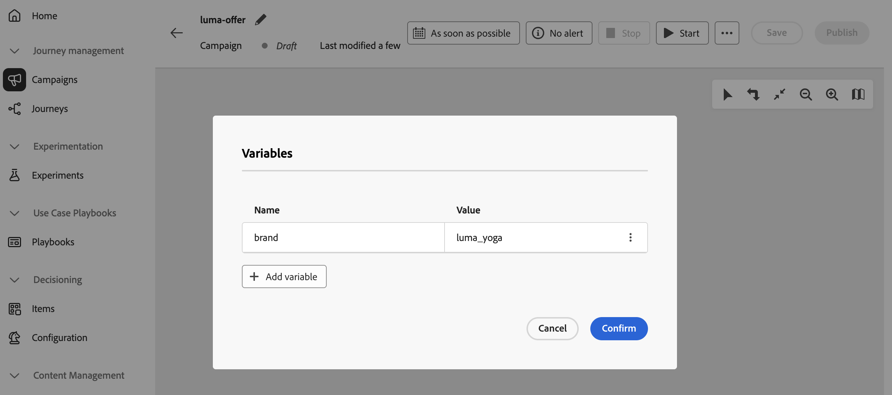

# オーケストレーションされたキャンペーンでのグローバル変数の定義 {#define-global-variables}

**グローバル変数**&#x200B;は、単一のオーケストレーションされたキャンペーンで設定した名前と値のペアで、各実行で再利用できるので、すべてのアクティビティに同じ値を貼り付けることなく、共有値（デフォルトチャネルやテストメールなど）を持つ&#x200B;**[!UICONTROL テスト]**&#x200B;条件、ルールビルダー、その他のキャンバスロジックを操作できます。

このページでは、グローバル変数の定義方法について説明します。 利用可能になったら、ルールと&#x200B;**[!UICONTROL テスト]**&#x200B;条件でそれらを使用する方法について詳しくは、[&#x200B; オーケストレーションされたキャンペーンでの変数の使用](variables-orchestrated-campaigns.md)を参照してください。

オーケストレーションされたキャンペーンにグローバル変数を追加または編集するには、次の手順に従います。

1. オーケストレーション済みキャンペーンを開きます。

1. **[!UICONTROL 保存]**&#x200B;の横にある&#x200B;**...** アイコンをクリックし、**[!UICONTROL 変数の編集]**&#x200B;を選択します。

   {zoomable="yes"}

1. 「**[!UICONTROL 変数を追加]**」をクリックし、変数の名前と値を設定します。 既存の変数を編集するには、**...** ボタンをクリックし、**[!UICONTROL 編集]**&#x200B;を選択します。

   変数を追加または編集する{zoomable="yes"}

ルールと&#x200B;**[!UICONTROL テスト]**&#x200B;条件でグローバル変数を定義した後に使用する方法については、[&#x200B; オーケストレーションされたキャンペーンで変数を使用](variables-orchestrated-campaigns.md#use)を参照してください。
