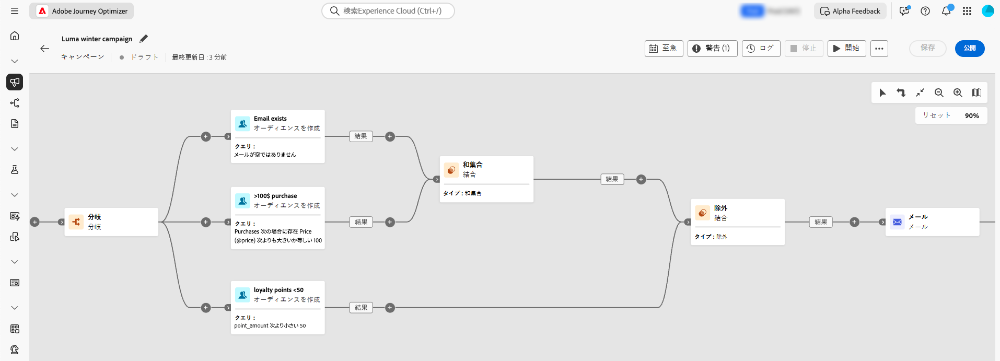
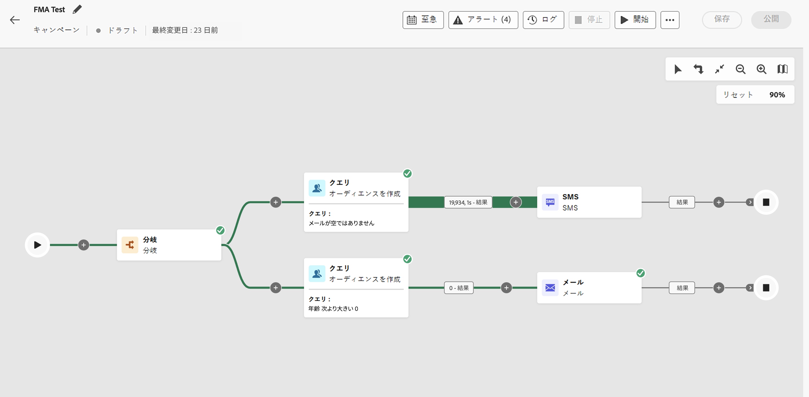

# 調整されたキャンペーンの基本を学ぶ {#orchestrated-camp}

>[!CONTEXTUALHELP]
>id="campaigns_overview_orchestrated"
>title="campaigns_overview_orchestrated"
>abstract="<b>キャンペーンオーケストレーション</b> リレーショナルデータセットを分割、組み合わせ、強化、操作して、オーディエンスを定義します   <b>マルチエンティティデータの活用</b> オーケストレーションキャンペーンでリレーショナルデータセットを活用して、セグメント化とパーソナライゼーション用のデータを強化する方法について説明します  <b>アドホックセグメント化と正確なカウント</b> 正確なカウントを使用してセグメントを段階的に作成します  <b>使用可能なチャネル</b> メール、SMS、プッシュ通知"

[!DNL Adobe Journey Optimizer] のキャンペーンオーケストレーションは、チャネルをまたいだブランド主導の洗練されたマーケティングキャンペーンを強化し、エンゲージメント、収益、顧客の忠誠度を大規模に促進します。

>[!IMPORTANT]
>
>キャンペーンオーケストレーションにアクセスするには、ライセンスに **Journey Optimizer - キャンペーンとジャーニー**&#x200B;または **Journey Optimizer - キャンペーン**&#x200B;パッケージのいずれかが含まれている必要があります。ライセンスを確認し、必要に応じて更新するには、アドビ担当者にお問い合わせください。

クロスチャネルマーケティングは不可欠ですが、調整されたキャンペーンはこれをシームレスにします。視覚的なドラッグ＆ドロップインターフェイスを使用すると、複数のチャネルをまたいで、セグメント化からメッセージ配信まで、複雑なマーケティングワークフローをデザインおよび自動化できます。すべてが、速度、コントロール、効率のために作成された、1 つの直感的な環境で実行されます。

{zoomable="yes"}

➡️ [オーケストレーションキャンペーンをビデオで確認](#video-oc)

## コア機能

キャンペーンオーケストレーションは、次の 4 つの主要な柱を中心に構築されています。

<table style="table-layout:auto">
<tr style="border: 0;">
<td></a></td><td><b>オンデマンドオーディエンス</b> データセット間で瞬時にクエリを実行し、データタイプとディメンションの任意の組み合わせを使用してオーディエンスセグメントを作成します。</td></tr>
<tr style="border: 0;">
<td></a></td><td><b>マルチエンティティのセグメント化と送信</b> 個人ベースのキャンペーンを超えて、製品カタログ、店舗の場所、サービスデータなどのエンティティを使用して、精密にターゲットを絞ります。  
プロファイルごとおよび関連するセカンダリエンティティごとに 1 つのメッセージが送信される、マルチレベルの送信をサポートします。これらのセカンダリエンティティには、連絡先の住所、予約、サブスクリプション、契約、その他のリンクされたデータを含めることができます。例えば、この機能を使って、プロファイルのすべての既知のアドレスまたはプロファイルに関連付けられた各予約に対してキャンペーンを送信できます。</td></tr>
<tr style="border: 0;">
<td></a></td><td><b>送信前の可視性と精度</b> ローンチ前に正確なセグメント化の数と完全なキャンペーンの範囲を取得し、正確性と信頼性を確保します。</td></tr>
<tr style="border: 0;">
<td></a></td><td><b>マルチステップキャンペーンのワークフロー</b> 毎日のメッセージから、季節のプロモーションや主要な製品の発売などの複雑なキャンペーンにまで及ぶマルチステップキャンペーンを設計します。</td></tr>
</table>

>[!NOTE]
>
>サポートされるチャネルの詳細については、この節の表 [ ジャーニーとキャンペーンのチャネル ](../channels/gs-channels.md#channels) を参照してください。
>
>使用できるチャネルは、ライセンスモデルとアドオンによって異なります。

## 調整されたキャンペーンとジャーニー

調整されたキャンペーンのビジュアライゼーションはジャーニーと類似点がありますが、次のように目的とユースケースが異なります。

* **ジャーニー** - 1 対 1 のキャンバスで、各プロファイルがそれぞれのペースで異なるステップを進んでいきます。各顧客のステータスはコンテキスト内に維持され、リアルタイムのアクションをトリガーします。

* **調整されたキャンペーン** - ジャーニーとは異なり、調整されたキャンペーンは、セグメントを計算するバッチキャンバスを使用して動作します。すべてのプロファイルが同時に処理されます。

どちらのキャンバスも、それぞれのユースケースに合わせて最適化されています。ジャーニーキャンバスは、長期間にわたって継続する傾向のあるジャーニーを公開し、キャンペーンキャンバスは、バッチキャンペーンを反復的かつ段階的に実行できるように設計されています。

## 調整されたキャンペーンの内部とは {#gs-ms-campaign-inside}

調整されたキャンペーンキャンバスは、実行されるべき処理を表したものです。これは、実行される様々なタスクと、タスク同士の関係を示すものです。

調整された各キャンペーンには、次が含まれます。

* **アクティビティ**：アクティビティとは、実行されるタスクです。[各種アクティビティ](activities/about-activities.md)は、キャンバス内にアイコンで示されます。各アクティビティには、特定のプロパティと、すべてのアクティビティに共通のその他のプロパティがあります。

  オーケストレーションキャンペーンキャンバスでは、指定されたアクティビティによって複数のタスクが生成される可能性があります。特に、ループまたは反復的なアクションが存在する場合です。

* **トランジション**：トランジションは、ソースアクティビティを宛先アクティビティにリンクし、そのシーケンスを定義します。

* **ワークテーブル**：ワークテーブルには、トランジションによって実行されるすべての情報が含まれます。調整された各キャンペーンは、複数のワークテーブルを使用します。これらのテーブルで伝達されたデータは、調整されたキャンペーンのライフサイクルを通じて使用できます。

## 概要ビデオ {#video-oc}

オーケストレーションキャンペーンで使用できる主な概念と機能について説明します。

>[!VIDEO](https://video.tv.adobe.com/v/3471538/?learn=on&enablevpops)

## さらに深く掘り下げましょう

調整されたキャンペーンについて理解できたので、これらのドキュメントの節を深く掘り下げ、この機能の使用を開始します。

<table><tr style="border: 0; text-align: center;">
<td>

<a href="gs-campaign-creation.md"><strong>設定の手順</strong></a>

</td>
<td>

<a href="create-orchestrated-campaign.md"><strong>調整されたキャンペーンの作成</strong>

</td>
<td>

<a href="activities/about-activities.md"><strong>アクティビティの操作</strong></a>

</td>
</tr></table>
