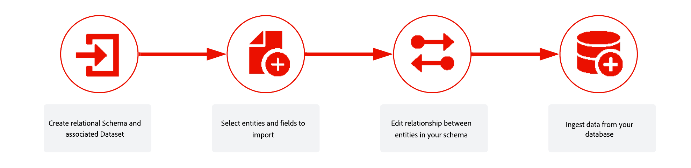

# リレーショナルスキーマとデータセットの基本を学ぶ{#gs-schemas}

>[!BEGINSHADEBOX]

**このページでは、**&#x200B;関係スキーマとデータセットを作成し、リンクし、オーケストレーションされたキャンペーンのデータを取り込むための主要な概念と手順について説明します。

>[!ENDSHADEBOX]

このガイドでは、リレーショナルスキーマの作成、オーケストレーションキャンペーン用のデータセットの設定、データの取り込みのプロセスについて説明します。

{zoomable="yes"}

## 主要概念

オーケストレーションキャンペーンのコンテキストでは、**データセット**&#x200B;とは、スキーマ（行）とフィールド（列）を含んだデータコレクション（通常はテーブル）のストレージおよび管理として機能する構成体です。 Experience Platform に正常に取り込まれたデータは、データレイク内にデータセットとして保存されます。

**スキーマ**&#x200B;は、データの構造と形式を表し、検証します。 実世界のオブジェクト（人物など）の抽象的な定義を提供し、そのオブジェクトの各インスタンス（名前、誕生日など）にどのようなデータを含めるべきかを概説します。

**データモデル**&#x200B;は、データを正規化する概念的なブループリントです

次の内容が記載されています。

* エンティティ（例：顧客、キャンペーン、セグメント）
* これらのエンティティの属性（例：顧客名、キャンペーン開始日）
* エンティティ間の関係（例：顧客はセグメントに属している、キャンペーンはセグメントをターゲットにしている）

データモデルは論理的かつ概念的であり、オーケストレーションされたキャンペーンにおける物理的な実装に関連付けられていません

**リレーショナルデータモデル**&#x200B;では、データは他のテーブルに関連するテーブルに整理されます。

* 各テーブルには、行（レコード）と列（属性）があります。
* 各テーブルには、行を一意に識別するプライマリキーがあります。
* テーブル間の関係は外部キーを使用して表されます

**リレーショナルスキーマ**&#x200B;は、リレーショナルデータモデルの正式な定義です。

次の内容が指定されています。

* テーブルのセット
* 各テーブルの列
* 制約
* テーブル間の関係

リレーショナルデータモデルでのスキーマやテーブルの整理は、データを複数のテーブルに構造化することです。 各テーブルに 1 つのタイプのエンティティ／スキーマが格納されていることを確認します。

➡️ [スキーマについて詳しくは、Adobe Experience Platform ドキュメントを参照してください](https://experienceleague.adobe.com/ja/docs/experience-platform/xdm/ui/resources/schemas#create-model-based-schema)

## 実装手順 {#implementation}

データを取り込み、リレーショナルスキーマを作成するには、次の手順に従います。

1. [リレーショナルスキーマを手動](manual-schema.md)で作成するか、[DDL ファイルを使用](file-upload-schema.md)して作成

   テーブル、属性、関係を含むデータモデルの構造を定義します。 ユーザーインターフェイスでスキーマを手動で作成するか、設定の高速化に DDL ファイルをアップロードするかを選択します。

   また、スキーマを手動で作成する際は、データセットも手動で作成して有効にする必要があります。 DDL ファイルを使用する際、データセットの作成とイネーブルメントは自動的に行われます。

1. [スキーマをリンク](file-upload-schema.md)

   スキーマ間の関係を確立して、データの一貫性を確保し、クロスエンティティクエリを有効にします。 例えば、ロイヤルティトランザクションを受信者にリンクしたり、報酬をブランドにリンクしたりします。

1. [データセットを作成](manual-schema.md#dataset)

   スキーマを定義したら、それに基づいてデータセットを作成する必要があります。 このデータセットは、取り込んだデータのストレージとして機能します。

1. [オーケストレーションキャンペーンを有効にする](manual-schema.md#enable)

   データセットには、取り込んだデータが保存され、Adobe Journey Optimizerでアクセスできるようにオーケストレーションされたキャンペーンに対して有効にする必要があります。

1. [データを取得](ingest-data.md)

   SFTP、クラウドストレージ、データベースなどのサポートされているソースからデータを Adobe Experience Platform に取り込みます。

