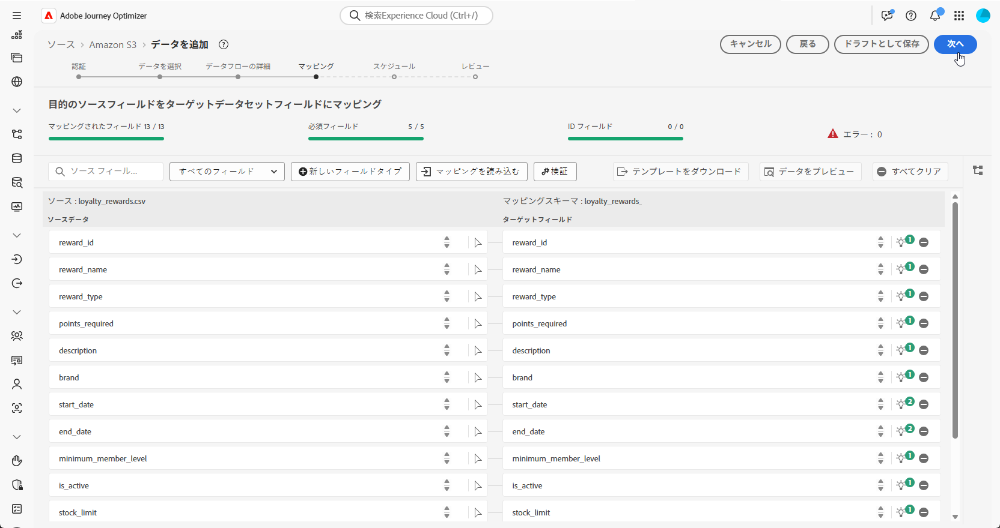

# データを取得 {#ingest-data}

>[!IMPORTANT]
>
>データセットのデータソースを変更するには、まず既存のデータフローを削除してから、同じデータセットと新しいソースを参照する新しいデータフローを作成する必要があります。
>
>Adobe Experience Platform では、データフローとデータセットの間に厳密な一対一の関係を適用します。これにより、ソースとデータセット間の同期を維持し、正確な増分取り込みを実現できます。

Adobe Experience Platform を使用すると、データを外部ソースから取得しながら、Experience Platform サービスを使用して、受信データの構造化、ラベル付け、拡張を行うことができます。アドビのアプリケーション、クラウドベースのストレージ、データベースなど、様々なソースからデータを取り込むことができます。

データセットは、スキーマ（列）とフィールド（行）で構成されるデータコレクション（通常はテーブル）を格納し管理するための構造です。Experience Platformに正常に取り込まれたデータは、データセットとしてデータレイク内に保存されます。

## 調整されたキャンペーンでサポートされるソース {#supported}

調整されたキャンペーンでは、次のソースの使用がサポートされています。

<table>
  <thead>
    <tr>
      <th>タイプ</th>
      <th>ソース</th>
    </tr>
  </thead>
  <tbody>
    <tr>
      <td rowspan="3">クラウドストレージ</td>
      <td><a href="https://experienceleague.adobe.com/ja/docs/experience-platform/sources/ui-tutorials/create/cloud-storage/s3">Amazon S3</a></td>
    </tr>
    <tr>
      <td><a href="https://experienceleague.adobe.com/ja/docs/experience-platform/sources/ui-tutorials/create/cloud-storage/google-cloud-storage">Google Cloud Storage</a></td>
    </tr>
    <tr>
      <td><a href="https://experienceleague.adobe.com/ja/docs/experience-platform/sources/ui-tutorials/create/cloud-storage/sftp">SFTP</a></td>
    </tr>
      <td rowspan="4">クラウドデータウェアハウス</td>
      <td><a href="https://experienceleague.adobe.com/ja/docs/experience-platform/sources/ui-tutorials/create/databases/snowflake">Snowflake</a></td>
    </tr>
    <tr>
      <td><a href="https://experienceleague.adobe.com/ja/docs/experience-platform/sources/ui-tutorials/create/databases/bigquery">Google BigQuery</a></td>
    </tr>
    <tr>
      <td><a href="https://experienceleague.adobe.com/ja/docs/experience-platform/sources/ui-tutorials/create/cloud-storage/data-landing-zone">データランディングゾーン<a></td>
    </tr>
    <tr>
      <td><a href="https://experienceleague.adobe.com/ja/docs/experience-platform/sources/ui-tutorials/create/databases/databricks">Azure Databricks</a></td>
    </tr>
    <tr>
      <td rowspan="3">ファイルベースのアップロード</td>
      <td><a href="https://experienceleague.adobe.com/ja/docs/experience-platform/sources/ui-tutorials/create/local-system/local-file-upload">ローカルファイルのアップロード<a></td>
    </tr>

</tbody>
</table>

## リレーショナルスキーマデータハイジーンのガイドライン {#cdc}

**[!UICONTROL データキャプチャを変更]**&#x200B;が有効になっているデータセットの場合、削除を含むすべてのデータ変更がソースシステムから Adobe Experience Platform に自動的にミラーリングされます。

Adobe Journey Optimizer キャンペーンでは、すべてのオンボードデータセットで&#x200B;**[!UICONTROL データキャプチャを変更]**&#x200B;を有効にする必要があるので、ソースでの削除の管理はお客様の責任となります。ソースシステムから削除したレコードは、Adobe Experience Platform の対応するデータセットから自動的に削除されます。

ファイルベースの取り込みを使用してレコードを削除するには、お客様のデータファイルで、「`Change Request Type`」フィールドの `D` 値を使用してレコードをマークする必要があります。これは、ソースシステムをミラーリングして、Adobe Experience Platform でレコードを削除する必要があることを示します。

元のソースデータに影響を与えずに Adobe Experience Platform からのみレコードを削除する場合は、次のオプションを使用できます。

* **データキャプチャを変更レプリケーション用のプロキシまたはサニタイズされたテーブル**

  お客様は、プロキシまたはサニタイズされたソーステーブルを作成して、Adobe Experience Platform にレプリケートされるレコードを制御できます。その後、この中間テーブルから削除を選択的に管理できます。

* **Data Distiller 経由での削除**

  ライセンスが付与されている場合、**Data Distiller** を使用して、ソースシステムに依存せずに、Adobe Experience Platform 内で直接削除操作をサポートできます。

  [詳しくは、Data Distiller を参照してください。](https://experienceleague.adobe.com/ja/docs/experience-platform/query/data-distiller/overview)

## データフローの設定

この例では、構造化データを Adobe Experience Platform に取り込むデータフローの設定方法を示します。設定したデータフローは、自動化されたスケジュール済みの取り込みをサポートし、リアルタイムの更新ができるようになります。

1. **[!UICONTROL 接続]**&#x200B;メニューから、**[!UICONTROL ソース]**&#x200B;メニューにアクセスします。

1. [調整されたキャンペーンでサポートされているソース](#supported)に応じてソースを選択します。

   

1. クラウドベースのソースを選択した場合は、クラウドストレージまたは Google Cloud Storage アカウントを接続します。

   

1. Adobe Experience Platformに取り込むデータを選択します。

   

1. **[!UICONTROL データセットの詳細]**&#x200B;ページで、「**[!UICONTROL 変更データキャプチャを有効にする]**」をオンにすると、リレーショナルスキーマにマッピングされ、プライマリキーとバージョン記述子の両方が含まれるデータセットのみが表示されます。

[リレーショナルスキーマのデータハイジーンに関するガイドラインの詳細情報](#cdc)

   >[!IMPORTANT]
   >
   > **ファイルベースのソースのみ**&#x200B;の場合、データファイルの各行には、値が `U`（アップサート）または `D`（削除）の `_change_request_type` 列を含める必要があります。この列がないと、システムはデータが変更トラッキングをサポートしていると認識せず、調整されたキャンペーンの切替スイッチが表示されず、データセットがターゲティング用に選択されなくなります。

   

1. 以前に作成したデータセットを選択し、「**[!UICONTROL 次へ]**」をクリックします。

   

1. ファイルベースのソースのみを使用している場合は、**[!UICONTROL データを選択]**&#x200B;ウィンドウからローカルファイルをアップロードし、その構造とコンテンツをプレビューします。

   サポートされる最大サイズは 100 MB です。

1. **[!UICONTROL マッピング]** ウィンドウで、各ソースファイル属性がターゲットスキーマの対応するフィールドに正しくマッピングされていることを確認します。 [ターゲティングディメンションの詳細情報を参照してください](target-dimension.md)。

   完了したら、「**[!UICONTROL 次へ]**」をクリックします。

   

1. 目的の頻度に基づいてデータフローの&#x200B;**[!UICONTROL スケジュール]**&#x200B;を設定します。

1. 「**[!UICONTROL 終了]**」をクリックしてデータフローを作成します。定義したスケジュールに従って自動的に実行されます。

1. **[!UICONTROL 接続]**&#x200B;メニューから「**[!UICONTROL ソース]**」を選択し、「**[!UICONTROL データフロー]**」タブにアクセスして、フローの実行を追跡し、取得されたレコードを確認し、エラーをトラブルシューティングします。

   

