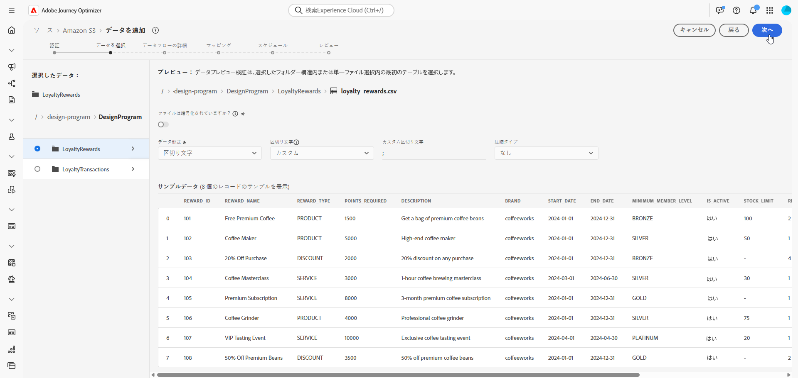
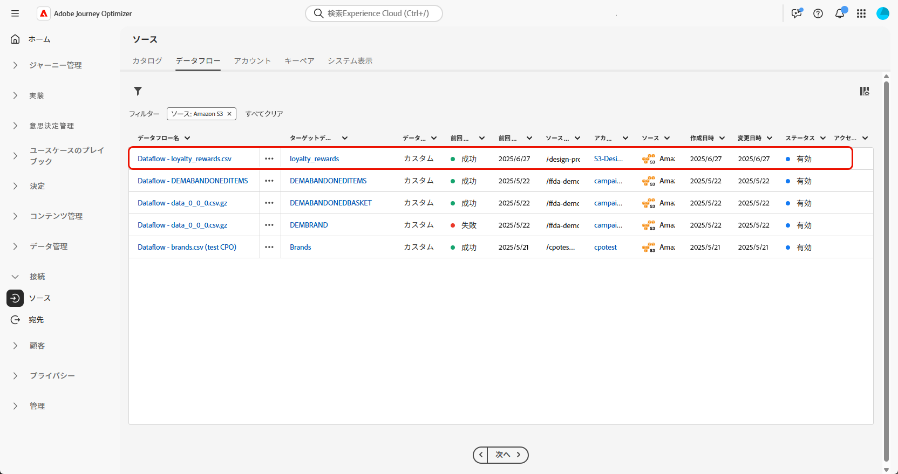

# データを取得 {#ingest-data}

+++ 目次

| 調整されたキャンペーンへようこそ | 最初の調整されたキャンペーンの開始 | データベースのクエリ | 調整されたキャンペーンアクティビティ |
|---|---|---|---|
| [ 調整されたキャンペーンの基本を学ぶ ](gs-orchestrated-campaigns.md)   リレーショナルスキーマとデータセットの作成および管理   <ul><li>[ スキーマとデータセットの概要 ](gs-schemas.md)</li><li>[ 手動スキーマ ](manual-schema.md)</li><li>[ ファイルアップロードスキーマ ](file-upload-schema.md)</li><li>[ データの取り込み ](ingest-data.md)</li></ul>[ オーケストレーションされたキャンペーンへのアクセスと管理 ](access-manage-orchestrated-campaigns.md)  [ オーケストレーションされたキャンペーンを作成するための主な手順 ](gs-campaign-creation.md) | [キャンペーンの作成とスケジュール](create-orchestrated-campaign.md)  [アクティビティの調整](orchestrate-activities.md)  [キャンペーンの開始と監視](start-monitor-campaigns.md)  [レポート](reporting-campaigns.md) | [ルールビルダーの操作](orchestrated-rule-builder.md)  [最初のクエリの作成](build-query.md)  [式の編集](edit-expressions.md)  [リターゲティング](retarget.md) | [アクティビティの基本を学ぶ](activities/about-activities.md)  アクティビティ： [AND 結合](activities/and-join.md) - [オーディエンスを作成](activities/build-audience.md) - [ディメンションを変更](activities/change-dimension.md) - [チャネルアクティビティ](activities/channels.md) - [結合](activities/combine.md) - [重複排除](activities/deduplication.md) - [エンリッチメント](activities/enrichment.md) - [分岐](activities/fork.md) - [紐付け](activities/reconciliation.md) - [オーディエンスを保存](activities/save-audience.md) - [分割](activities/split.md) - [待機](activities/wait.md) |

{style="table-layout:fixed"}

+++

 

>[!BEGINSHADEBOX]

 

このページのコンテンツは最終的なものではなく、変更される場合があります。

>[!ENDSHADEBOX]

>[!IMPORTANT]
>
>データセットのデータソースを変更するには、まず既存のデータフローを削除してから、同じデータセットと新しいソースを参照する新しいデータフローを作成する必要があります。
>
>Adobe Experience Platformでは、データフローとデータセットの間に厳密な 1 対 1 の関係を適用します。 これにより、ソースとデータセットの間の同期を維持して、正確な増分取り込みを行うことができます。

Adobe Experience Platform を使用すると、データを外部ソースから取得しながら、Experience Platform サービスを使用して、受信データの構造化、ラベル付け、拡張を行うことができます。アドビのアプリケーション、クラウドベースのストレージ、データベースなど、様々なソースからデータを取り込むことができます。

## 調整されたキャンペーンでサポートされるソース {#supported}

オーケストレートキャンペーンでの使用では、次のソースがサポートされます。

<table>
  <thead>
    <tr>
      <th>タイプ</th>
      <th>ソース</th>
    </tr>
  </thead>
  <tbody>
    <tr>
      <td rowspan="3">クラウドストレージ</td>
      <td><a href="https://experienceleague.adobe.com/en/docs/experience-platform/sources/ui-tutorials/create/cloud-storage/s3">Amazon S3</a></td>
    </tr>
    <tr>
      <td><a href="https://experienceleague.adobe.com/en/docs/experience-platform/sources/ui-tutorials/create/cloud-storage/google-cloud-storage">Google Cloud Storage</a></td>
    </tr>
    <tr>
      <td><a href="https://experienceleague.adobe.com/en/docs/experience-platform/sources/ui-tutorials/create/cloud-storage/sftp">SFTP</a></td>
    </tr>
      <td rowspan="4">クラウドデータウェアハウス</td>
      <td><a href="https://experienceleague.adobe.com/en/docs/experience-platform/sources/ui-tutorials/create/databases/snowflake">Snowflake</a></td>
    </tr>
    <tr>
      <td><a href="https://experienceleague.adobe.com/en/docs/experience-platform/sources/ui-tutorials/create/databases/bigquery">Google BigQuery</a></td>
    </tr>
    <tr>
      <td><a href="https://experienceleague.adobe.com/en/docs/experience-platform/sources/ui-tutorials/create/cloud-storage/data-landing-zone">Data Landing Zone<a></td>
    </tr>
    <tr>
      <td><a href="https://experienceleague.adobe.com/en/docs/experience-platform/sources/ui-tutorials/create/databases/databricks">Azure Databricks</a></td>
    </tr>
    <tr>
      <td rowspan="3">ファイルベースのアップロード</td>
      <td><a href="https://experienceleague.adobe.com/en/docs/experience-platform/sources/ui-tutorials/create/local-system/local-file-upload">ローカルファイルのアップロード<a></td>
    </tr>

</tbody>
</table>

## データフローの設定

この例では、構造化データをAdobe Experience Platformに取り込むデータフローの設定方法を示します。 設定されたデータフローは、スケジュールに沿った自動インジェストをサポートし、リアルタイムの更新を可能にします。

1. **[!UICONTROL 接続]**&#x200B;メニューから、**[!UICONTROL ソース]**&#x200B;メニューにアクセスします。

1. [ オーケストレートキャンペーンでサポートされているソース ](#supported) に応じてソースを選択します。

   

1. クラウドベースのソースを選択した場合は、クラウドストレージまたはGoogle クラウドストレージアカウントを接続します。

   

1. Adobe Experience Platformに取り込むデータを選択します。

   

1. **[!UICONTROL データセットの詳細]** ページで、「**[!UICONTROL 変更データキャプチャを有効にする]**」をチェックして、リレーショナルスキーマにマッピングされ、プライマリキーとバージョン記述子の両方が含まれるデータセットのみを表示します。

   >[!IMPORTANT]
   >
   > **ファイルベースのソースのみ** の場合、データファイルの各行には、`_change_request_type` （upsert）または `U` （delete）の値を持つ `D` 列を含める必要があります。 この列がないと、システムはデータをサポートする変更トラッキングとして認識せず、オーケストレーションされたキャンペーンの切り替えは表示されず、データセットがターゲティング用に選択されません。

   

1. 以前に作成したデータセットを選択し、「**[!UICONTROL 次へ]**」をクリックします。

   

1. ファイルベースのソースのみを使用している場合は、**[!UICONTROL データを選択]** ウィンドウからローカルファイルをアップロードし、構造と内容をプレビューします。

   サポートされる最大サイズは 100 MB です。

1. **[!UICONTROL マッピング]**&#x200B;ウィンドウで、各ソースファイル属性がターゲットスキーマの対応するフィールドに正しくマッピングされていることを確認します。

   完了したら、「**[!UICONTROL 次へ]**」をクリックします。

   

1. 目的の頻度に基づいてデータフローの&#x200B;**[!UICONTROL スケジュール]**&#x200B;を設定します。

1. 「**[!UICONTROL 終了]**」をクリックしてデータフローを作成します。定義したスケジュールに従って自動的に実行されます。

1. **[!UICONTROL 接続]**&#x200B;メニューから「**[!UICONTROL ソース]**」を選択し、「**[!UICONTROL データフロー]**」タブにアクセスして、フローの実行を追跡し、取得されたレコードを確認し、エラーをトラブルシューティングします。

   

