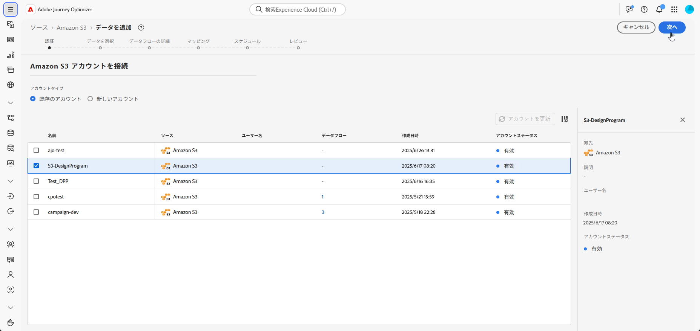
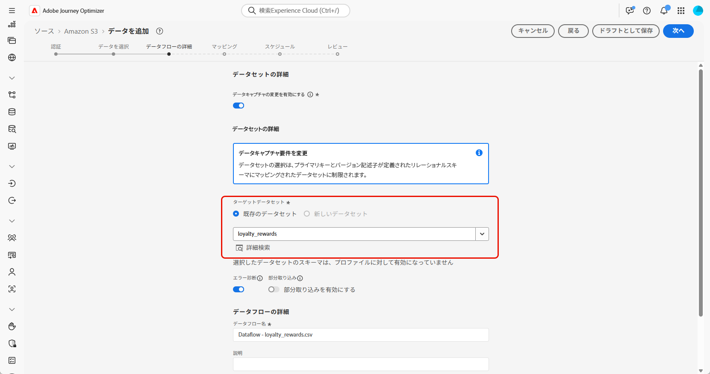

# データの取得 {#ingest-data}

+++ 目次

| 調整されたキャンペーンへようこそ | 最初の調整されたキャンペーンの開始 | データベースのクエリ | 調整されたキャンペーンアクティビティ |
|---|---|---|---|
| [ 調整されたキャンペーンの基本を学ぶ ](gs-orchestrated-campaigns.md)   リレーショナルスキーマとデータセットの作成および管理   <ul><li>[ スキーマとデータセットの概要 ](gs-schemas.md)</li><li>[ 手動スキーマ ](manual-schema.md)</li><li>[ ファイルアップロードスキーマ ](file-upload-schema.md)</li><li>[ データの取り込み ](ingest-data.md)</li></ul>[ オーケストレーションされたキャンペーンへのアクセスと管理 ](access-manage-orchestrated-campaigns.md)  [ オーケストレーションされたキャンペーンを作成するための主な手順 ](gs-campaign-creation.md) | [ キャンペーンの作成とスケジュール設定 ](create-orchestrated-campaign.md)  [ アクティビティのオーケストレーション ](orchestrate-activities.md)  [ キャンペーンの開始と監視 ](start-monitor-campaigns.md)  [ レポート ](reporting-campaigns.md) | [ ルールビルダーの操作 ](orchestrated-rule-builder.md)  [ 最初のクエリの作成 ](build-query.md)  [ 式の編集 ](edit-expressions.md)  [ リターゲティング ](retarget.md) | [ アクティビティの基本を学ぶ ](activities/about-activities.md)   アクティビティ： [AND 結合 ](activities/and-join.md) - [ オーディエンスを作成 ](activities/build-audience.md) - [ ディメンションの変更 ](activities/change-dimension.md) - [ チャネルアクティビティ ](activities/channels.md) - [ 結合 ](activities/combine.md) - [ 重複排除 ](activities/deduplication.md) - [ エンリッチメント ](activities/enrichment.md) - [ 分岐 ](activities/fork.md) - [ 紐付け ](activities/reconciliation.md) [&#128279;](activities/save-audience.md) [&#128279;](activities/split.md) [&#128279;](activities/wait.md) - |

{style="table-layout:fixed"}

+++

 

>[!BEGINSHADEBOX]

 

このページのコンテンツは最終的なものではなく、変更される場合があります。

>[!ENDSHADEBOX]

Adobe Experience Platformを使用すると、データを外部ソースから取得しながら、Experience Platform サービスを使用して、受信データの構造化、ラベル付け、拡張を行うことができます。 アドビのアプリケーション、クラウドベースのストレージ、データベースなど、様々なソースからデータを取り込むことができます。

## クラウドストレージを使用 {#ingest}

>[!IMPORTANT]
>
>Adobe Experience Platformの各データセットでは、一度に 1 つのアクティブなデータフローのみをサポートします。 データソースの切り替え方法に関する設定ガイダンスについて詳しくは、この [ 節 ](#cdc-ingestion) を参照してください。

データフローを設定して、Amazon S3 ソースからAdobe Experience Platformにデータを取り込むことができます。 設定が完了すると、データフローにより、構造化データの自動スケジュール取り込みが可能になり、リアルタイムの更新がサポートされます。

1. **[!UICONTROL 接続]** メニューから **[!UICONTROL ソース]** メニューにアクセスします。

1. 「**[!UICONTROL クラウドストレージ]**」カテゴリを選択し、「Amazon S3」を選択して、「**[!UICONTROL データを追加]**」をクリックします。

   

1. S3 アカウントの接続：

   * 既存のアカウントで

   * 新しいアカウントで

   [詳しくは、Adobe Experience Platform ドキュメントを参照してください](https://experienceleague.adobe.com/ja/docs/experience-platform/destinations/catalog/cloud-storage/amazon-s3#connect)

   

1. フォルダー **[!UICONTROL データフォーマット]**、**[!UICONTROL 区切り文字]** および **[!UICONTROL 圧縮タイプ]** を選択します。

1. 接続された S3 ソースをナビゲートして、目的のフォルダー（例：**ロイヤルティ報酬** および **ロイヤルティトランザクション** を見つけます。

1. データを含むフォルダーを選択します。

   フォルダーを選択すると、同じ構造を持つ現在のファイルと今後のファイルがすべて自動的に処理されます。 ただし、1 つのファイルを選択する場合は、新しいデータ増分ごとに手動でアップロードする必要があります。

   

1. フォルダー **[!UICONTROL データフォーマット]**、**[!UICONTROL 区切り文字]** および **[!UICONTROL 圧縮タイプ]** を選択します。 サンプルデータの精度を確認し、「**[!UICONTROL 次へ]**」をクリックします。

   

1. 「**[!UICONTROL チェンジ・データ・キャプチャを使用可能]**」にチェックを入れると、リレーショナル・スキーマにマッピングされ、プライマリ・キーとバージョン記述子の両方が定義されているデータセットから選択できます。

1. [ 以前に作成したデータセット ](file-upload-schema.md) を選択し、「**[!UICONTROL 次へ]**」をクリックします。

   

1. **[!UICONTROL マッピング]** ウィンドウで、各ソースファイル属性がターゲットスキーマの対応するフィールドに正しくマッピングされていることを確認します。

   完了したら、「**[!UICONTROL 次へ]**」をクリックします。

   

1. 目的の頻度に基づいてデータフロー **[!UICONTROL スケジュール]** を設定します。

1. **[!UICONTROL 終了]** をクリックして、データフローを作成します。 定義されたスケジュールに従って自動的に実行されます。

1. **[!UICONTROL 接続]** メニューから **[!UICONTROL ソース]** を選択し、「**[!UICONTROL データフロー]**」タブにアクセスしてフローの実行を追跡、取り込んだレコードを確認し、エラーのトラブルシューティングを行います。

   

<!--### Setting Up Change data capture ingestion {#cdc-ingestion}

If you need to change the data source, you must delete the existing dataflow and create a new one pointing to the same dataset with the new source.

When using Change Data Capture (CDC), it is essential that the source and dataset remain in sync to ensure accurate incremental updates. Follow the steps below:

1. **Schema Requirements**
   - Your schema must include:
     - A **primary key** (e.g., `transaction_id`)
     - A **versioning field** (e.g., `lastmodified` or an incrementing `version_id`)
   - Enable the dataset for **Orchestrated Campaigns** if needed.

2. **CDC Dataflow Setup**
   - During dataflow creation, after choosing your source and files:
     - **Enable the CDC option**
     - Select your CDC-ready dataset
     - Confirm field mappings (especially version field)

3. **Keep Source and Target in Sync**
   - The source system must consistently update the version field so the platform can detect changes accurately.

Once set up, the platform will automatically ingest **only changed or new records** each time the flow runs.
-->
