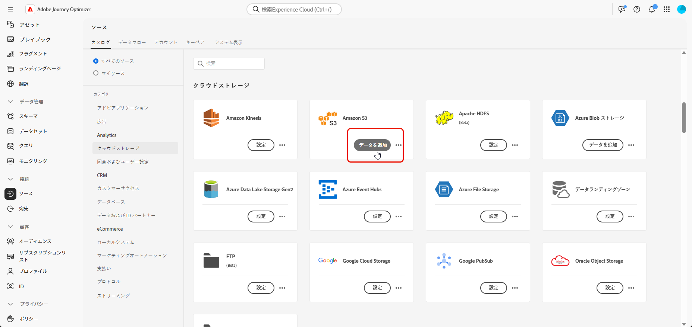
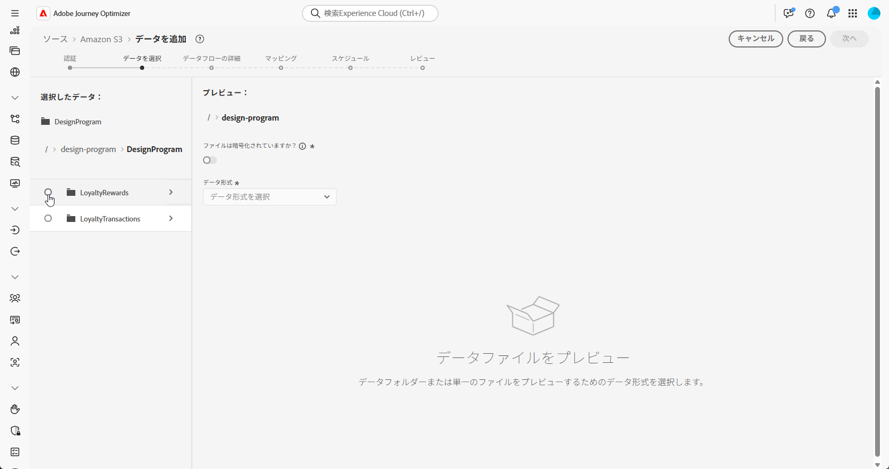

# データの取得 {#ingest-data}

+++ 目次

| 調整されたキャンペーンへようこそ | 最初の調整されたキャンペーンの開始 | データベースのクエリ | 調整されたキャンペーンアクティビティ |
|---|---|---|---|
| [ 調整されたキャンペーンの基本を学ぶ ](gs-orchestrated-campaigns.md)   リレーショナルスキーマとデータセットの作成および管理   <ul><li>[ スキーマとデータセットの概要 ](gs-schemas.md)</li><li>[ 手動スキーマ ](manual-schema.md)</li><li>[ ファイルアップロードスキーマ ](file-upload-schema.md)</li><li>[ データの取り込み ](ingest-data.md)</li></ul>[ オーケストレーションされたキャンペーンへのアクセスと管理 ](access-manage-orchestrated-campaigns.md)  [ オーケストレーションされたキャンペーンを作成するための主な手順 ](gs-campaign-creation.md) | [ キャンペーンの作成とスケジュール設定 ](create-orchestrated-campaign.md)  [ アクティビティのオーケストレーション ](orchestrate-activities.md)  [ キャンペーンの開始と監視 ](start-monitor-campaigns.md)  [ レポート ](reporting-campaigns.md) | [ ルールビルダーの操作 ](orchestrated-rule-builder.md)  [ 最初のクエリの作成 ](build-query.md)  [ 式の編集 ](edit-expressions.md)  [ リターゲティング ](retarget.md) | [ アクティビティの基本を学ぶ ](activities/about-activities.md)   アクティビティ： [AND 結合 ](activities/and-join.md) - [ オーディエンスを作成 ](activities/build-audience.md) - [ ディメンションの変更 ](activities/change-dimension.md) - [ チャネルアクティビティ ](activities/channels.md) - [ 結合 ](activities/combine.md) - [ 重複排除 ](activities/deduplication.md) - [ エンリッチメント ](activities/enrichment.md) - [ 分岐 ](activities/fork.md) - [ 紐付け ](activities/reconciliation.md) [&#128279;](activities/save-audience.md) [&#128279;](activities/split.md) [&#128279;](activities/wait.md) - |

{style="table-layout:fixed"}

+++

 

>[!BEGINSHADEBOX]

 

このページのコンテンツは最終的なものではなく、変更される場合があります。

>[!ENDSHADEBOX]

Adobe Experience Platformを使用すると、データを外部ソースから取得しながら、Experience Platform サービスを使用して、受信データの構造化、ラベル付け、拡張を行うことができます。 アドビのアプリケーション、クラウドベースのストレージ、データベースなど、様々なソースからデータを取り込むことができます。

<!--
## With Cloud storage {#ingest}

>[!IMPORTANT]
>
>Each dataset in Adobe Experience Platform supports only one active dataflow at a time. For detailed setup guidance on how to switch data sources, refer to this [section](#cdc-ingestion).

You can configure a data flow to ingest data from an Amazon S3 source into Adobe Experience Platform. Once configured, the data flow enables automated, scheduled ingestion of structured data and supports real-time updates.

1. From the **[!UICONTROL Connections]** menu, access the **[!UICONTROL Sources]** menu.

1. Select the **[!UICONTROL Cloud storage]** category then Amazon S3 and click **[!UICONTROL Add Data]**.

    

1. Connect your S3 Account:

    * With an existing account

    * With a new account

    [Learn more in Adobe Experience Platform documentation](https://experienceleague.adobe.com/en/docs/experience-platform/destinations/catalog/cloud-storage/amazon-s3#connect)

    

1. Choose your folder **[!UICONTROL Data format]**, **[!UICONTROL Delimiter]** and **[!UICONTROL Compression type]**.

1. Navigate through the connected S3 source until you locate the two folders created earlier i.e. **loyalty rewards** and **loyalty transactions**.

1. Select the folder that contains your data.
    
    Selecting a folder ensures that all current and future files with the same structure are automatically processed. Selecting a single file, however, requires manually uploading each new data increment.

    

1. Choose your folder **[!UICONTROL Data format]**, **[!UICONTROL Delimiter]** and **[!UICONTROL Compression type]**. Review your sample data for accuracy, then click **[!UICONTROL Next]**.

    

1. Check **[!UICONTROL Enable Change data capture]** to select from datasets that are mapped to relational schemas and have both a primary key and a version descriptor defined.

1. Select your [previously created Dataset](#entities) and click **[!UICONTROL Next]**.

    

1. In the **[!UICONTROL Mapping]** window, verify that each source file attribute is correctly mapped with the corresponding fields in the target schema.

    Click **[!UICONTROL Next]** once done.

    

1. Configure the data flow **[!UICONTROL Schedule]** based on your desired frequency.

1. Click **[!UICONTROL Finish]** to create the data flow. It will execute automatically according to the defined schedule.

1. From the **[!UICONTROL Connections]** menu, select **[!UICONTROL Sources]** and access the **[!UICONTROL Data Flows]** tab to track flow execution, review ingested records, and troubleshoot any errors.

    

-->

<!--### Setting Up Change data capture ingestion {#cdc-ingestion}

If you need to change the data source, you must delete the existing dataflow and create a new one pointing to the same dataset with the new source.

When using Change Data Capture (CDC), it is essential that the source and dataset remain in sync to ensure accurate incremental updates. Follow the steps below:

1. **Schema Requirements**
   - Your schema must include:
     - A **primary key** (e.g., `transaction_id`)
     - A **versioning field** (e.g., `lastmodified` or an incrementing `version_id`)
   - Enable the dataset for **Orchestrated Campaigns** if needed.

2. **CDC Dataflow Setup**
   - During dataflow creation, after choosing your source and files:
     - **Enable the CDC option**
     - Select your CDC-ready dataset
     - Confirm field mappings (especially version field)

3. **Keep Source and Target in Sync**
   - The source system must consistently update the version field so the platform can detect changes accurately.

Once set up, the platform will automatically ingest **only changed or new records** each time the flow runs.
-->