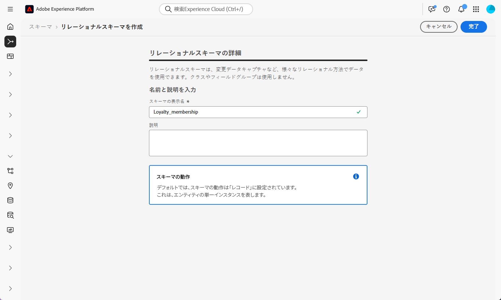
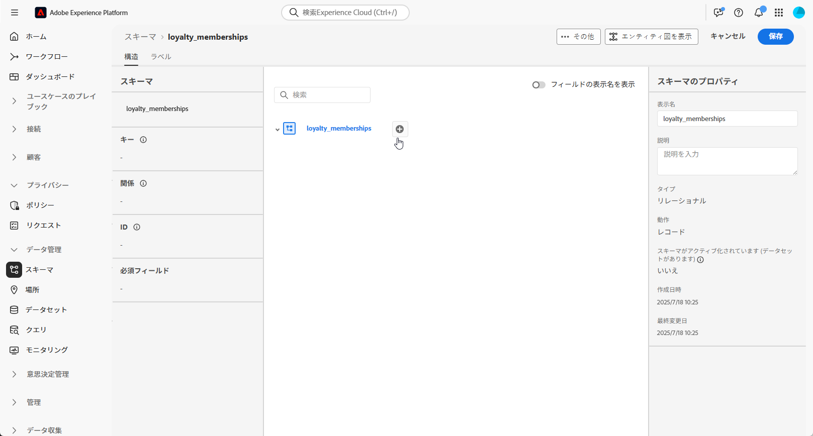
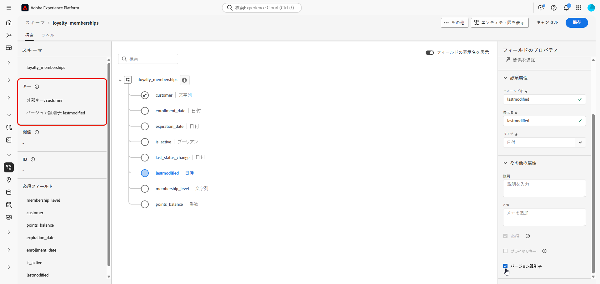
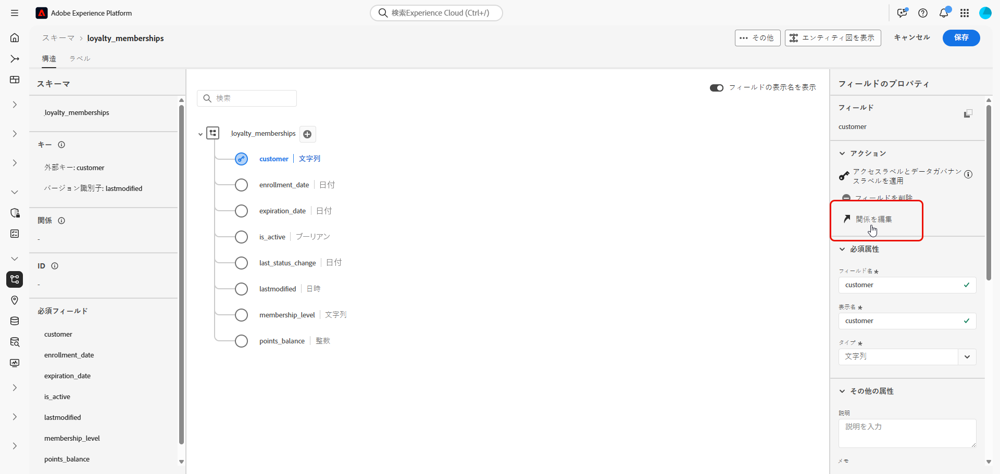
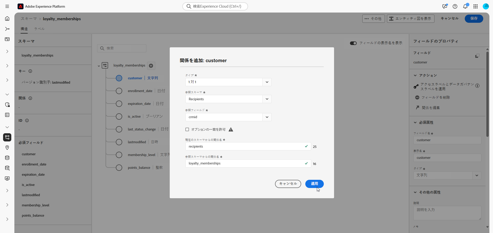
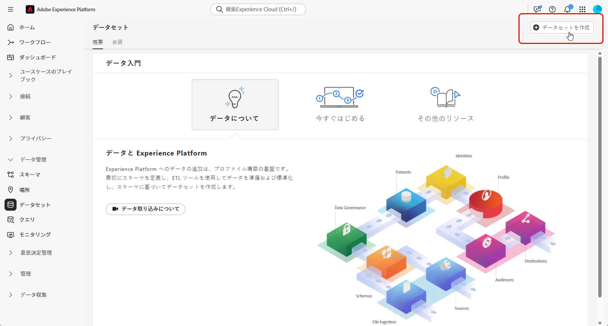
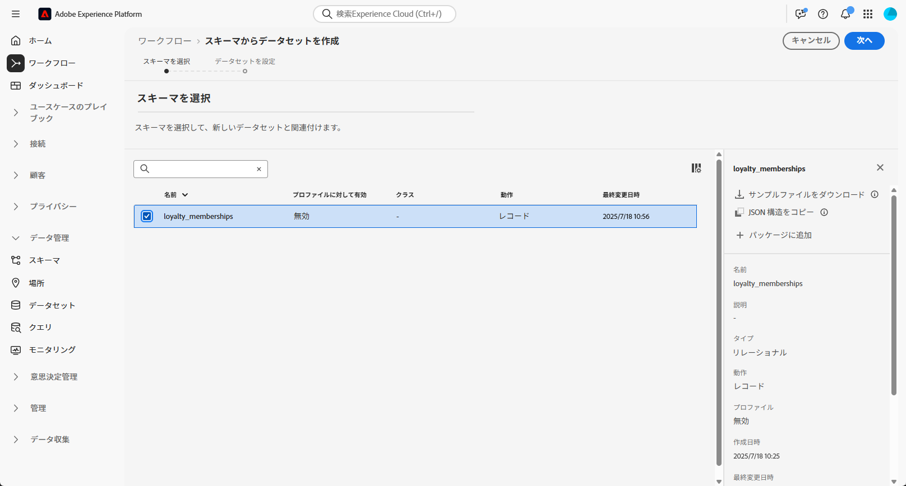
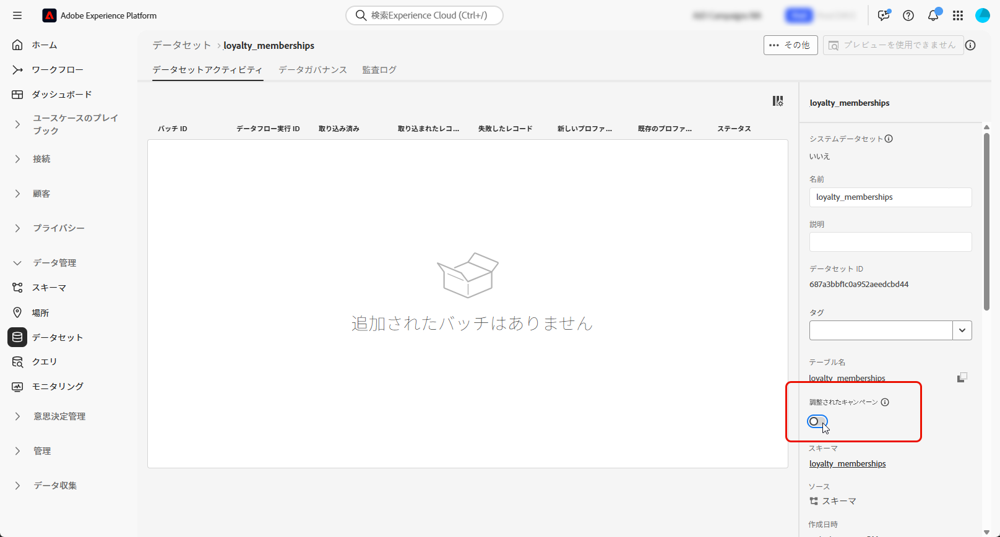

# 手動のモデルベースのスキーマの設定 {#manual-schema}

モデルベースのスキーマは、ユーザーインターフェイスを通じて直接作成できるので、属性、プライマリキー、バージョン管理フィールド、関係の詳細な設定が実現します。

次の例では、**ロイヤルティメンバーシップ**&#x200B;スキーマを手動で定義して、調整されたキャンペーンに必要な構造を示します。

1. Adobe Experience Platform インターフェイスを使用して、[モデルベースのスキーマを手動で作成します](#schema)。

1. 顧客 ID、メンバーシップレベル、ステータスフィールドなどの[属性を追加します](#schema-attributes)。

1. キャンペーンターゲティング用に、受信者などのビルトインスキーマに[スキーマをリンクします](#link-schema)。

1. スキーマに基づいて[データセットを作成](#dataset)し、調整されたキャンペーンで使用できるようにします。

1. サポートされているソースからデータセットにデータを[取り込みます](ingest-data.md)。

➡️ [手動モデルベーススキーマについて詳しくは、Adobe Experience Platform のドキュメントを参照してください](https://experienceleague.adobe.com/ja/docs/experience-platform/xdm/ui/resources/schemas#create-manually)

## スキーマの作成 {#schema}

まず、Adobe Experience Platform で新しいモデルベースのスキーマを手動で作成します。このプロセスにより、名前や動作など、スキーマ構造をゼロから定義できます。

1. Adobe Experience Platform にログインします。

1. **[!UICONTROL データ管理]**／**[!UICONTROL スキーマ]**&#x200B;メニューに移動します。

1. 「**[!UICONTROL スキーマを作成]**」をクリックします。

1. **スキーマタイプ**&#x200B;として「**[!UICONTROL モデルベース]**」を選択します。

   {zoomable="yes"}

1. 「**[!UICONTROL 手動で作成]**」を選択して、手動でフィールドを追加してスキーマを作成します。

1. **[!UICONTROL スキーマ表示名]**&#x200B;を入力します。

   {zoomable="yes"}

1. 「**終了**」をクリックして、スキーマの作成に進みます。

これで、スキーマへの属性の追加を開始して、その構造を定義できるようになりました。

## スキーマへの属性の追加 {#schema-attributes}

次に、属性を追加してスキーマの構造を定義します。 これらのフィールドは、顧客 ID、メンバーシップの詳細、アクティビティの日付など、調整されたキャンペーンで使用される主なデータポイントを表します。これらを正確に定義すると、信頼できるパーソナライゼーション、セグメント化およびトラッキングが確保されます。

ターゲティングに使用するスキーマには、関連付けられた ID 名前空間を持つタイプ `String` の ID フィールドを 1 つ以上含める必要があります。これにより、Adobe Journey Optimizer のターゲティングおよび ID 解決機能との互換性が確保されます。

+++Adobe Experience Platform でモデルベースのスキーマを作成する場合、次の機能がサポートされます。

* **ENUM**\
  ENUM フィールドは、DDL ベースと手動スキーマ作成の両方でサポートされているので、許可される値の固定セットを使用して属性を定義できます。

* **データガバナンスのスキーマラベル**\
  アクセス制御や使用制限などのデータガバナンスポリシーの適用に、スキーマフィールドレベルでラベル付けがサポートされています。詳しくは、[Adobe Experience Platform ドキュメント](https://experienceleague.adobe.com/docs/experience-platform/xdm/home.html?lang=ja)を参照してください。

* **複合キー**\
  複合プライマリキーは、モデルベースのスキーマ定義でサポートされるので、複数のフィールドと共に使用してレコードを一意に識別できます。

+++

1. キャンバスで、**スキーマ名**&#x200B;の横にある  をクリックして、属性の追加を開始します。

   {zoomable="yes"}

1. 属性の&#x200B;**[!UICONTROL フィールド名]**、**[!UICONTROL 表示名]**、**[!UICONTROL タイプ]**&#x200B;を入力します。

   この例では、次の表に示す属性を&#x200B;**ロイヤルティメンバーシップ**&#x200B;スキーマに追加しました。

   +++ 属性の例

   | 属性名 | データタイプ | その他の属性 |
   |-|-|-|
   | 顧客 | 文字列 | プライマリキー |
   | membership_level | 文字列 | 必須 |
   | points_balance | 整数 | 必須 |
   | enrollment_date | 日付 | 必須 |
   | last_status_change | 日付 | 必須 |
   | expiration_date | 日付 | - |
   | is_active | BOOLEAN | 必須 |
   | lastModified | 日時 | 必須 |

   +++ 

1. 適切なフィールドを&#x200B;**[!UICONTROL プライマリキー]**&#x200B;および&#x200B;**[!UICONTROL バージョン記述子]**&#x200B;として割り当てます。

   手動のスキーマを作成する場合は、次の必須フィールドが含まれていることを確認します。

   * 1 つ以上のプライマリキー
   * バージョン識別子（`datetime` タイプまたは `number` タイプの「`lastmodified`」フィールドなど）。
   * 変更データキャプチャ（CDC）取り込みの場合、タイプ `String` の `_change_request_type` という特別な列。これは、データ変更のタイプ（挿入、更新、削除など）を示し、増分処理を可能にします。`_change_request_type` をテーブルスキーマの一部にすることはできません。取り込み時にデータファイルにのみ追加する必要があります。

   {zoomable="yes"}

1. 「**[!UICONTROL 保存]**」をクリックします。

属性を作成して保存した後、関係を定義することで、スキーマを他のリレーショナルスキーマとリンクできます。

## スキーマをリンク {#link-schema}

2 つのスキーマ間に関係を作成すると、プライマリプロファイルスキーマ以外のデータを使用してオーケストレーションキャンペーンを強化できます。

1. 新しく作成したスキーマから、リンクとして使用する属性を選択し、「**[!UICONTROL 関係を追加]**」をクリックします。

   {zoomable="yes"}

1. **[!UICONTROL 参照スキーマ]**&#x200B;と&#x200B;**[!UICONTROL 参照フィールド]**&#x200B;を選択して、関係を確立します。

   この例では、`customer` 属性が `recipients` スキーマにリンクされています。

   {zoomable="yes"}

1. 現在のスキーマからの関係名と参照スキーマからの関係名を入力します。

1. 設定したら、「**[!UICONTROL 適用]**」をクリックします。

## スキーマのデータセットの作成 {#dataset}

スキーマを定義したら、それに基づいてデータセットを作成できるようになります。データセットには、取り込んだデータが格納されます。オーケストレーションキャンペーンにアクセスするには、データセットを有効にする必要があります。

1. **[!UICONTROL データ管理]**／**[!UICONTROL データセット]**&#x200B;メニューに移動し、「**[!UICONTROL データセットを作成]**」をクリックします。

   {zoomable="yes"}

1. 「**[!UICONTROL スキーマからデータセットを作成]**」をクリックします。

1. 以前に作成したスキーマ（ここでは「**ロイヤルティメンバーシップ**」）を選択し、「**[!UICONTROL 次へ]**」をクリックします。

   {zoomable="yes"}

1. **[!UICONTROL データセット]**&#x200B;に&#x200B;**[!UICONTROL 名前]**&#x200B;を入力して、「**[!UICONTROL 終了]**」をクリックします。

次に、オーケストレーションキャンペーン用のデータセットを有効にする必要があります。

## オーケストレーションキャンペーンのデータセットを有効にする {#enable}

>[!CONTEXTUALHELP]
>id="ajo_oc_enable_dataset_for_oc"
>title="調整されたキャンペーン"
>abstract="データセットを作成したら、調整されたキャンペーン用に明示的に有効にする必要があります。 この手順により、データセットを Adobe Journey Optimizer 内でリアルタイムのオーケストレーションとパーソナライゼーションに使用できるようになります。"

データセットを作成したら、調整されたキャンペーン用に明示的に有効にする必要があります。 この手順により、データセットを Adobe Journey Optimizer 内でリアルタイムのオーケストレーションとパーソナライゼーションに使用できるようになります。

データセットでオーケストレーションキャンペーン拡張機能を検証または有効にする方法について詳しくは、[Adobe 開発者用ドキュメント](https://developer.adobe.com/journey-optimizer-apis/references/orchestrated-campaign-dataset/#tag/DatasetEnablement)を参照してください。

1. **[!UICONTROL データセット]**&#x200B;リストでデータセットを見つけます。

1. **[!UICONTROL データセット]**&#x200B;設定から「**オーケストレーションキャンペーン**」オプションを有効にして、データセットをオーケストレーションキャンペーンで使用できるようにします。

   {zoomable="yes"}

1. イネーブルメントプロセスが完了するまで数分間待機します。この設定が完全にアクティブ化された場合にのみ、データ取り込みとキャンペーンの使用が可能になります。

これで、選択したソースを使用してスキーマへのデータの取り込みを開始できるようになりました。

➡️ [データの取り込み方法の詳細情報](ingest-data.md)
