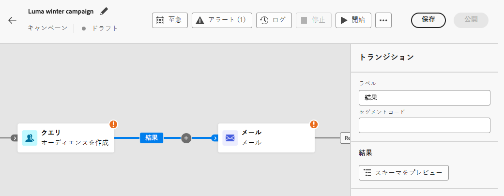

# キャンペーンアクティビティの調整 {#orchestrate}

[調整されたキャンペーンを作成](gs-campaign-creation.md)したら、実行される様々なタスクの調整を開始できます。これを行うために、視覚的なキャンバスが提供され、オーケストレーションされたキャンペーンキャンバスを作成できます。 このキャンバス内で、様々なアクティビティを追加し、順番に接続できます。

## アクティビティを追加 {#add}

設定のこの段階では、オーケストレーションされたキャンペーンキャンバスに、オーケストレーションされたキャンペーンの開始を表す「開始」アイコンが表示されます。 最初のアクティビティを追加するには、「開始」アイコンに接続されている「**+**」ボタンをクリックします。

オーケストレーションされたキャンペーンキャンバスに追加できるアクティビティのリストが表示されます。 使用可能なアクティビティは、オーケストレーションされたキャンペーンキャンバス内の位置によって異なります。 例えば、最初のアクティビティを追加する際に、オーディエンスをターゲティング、調整されたキャンペーンパスを分割、または調整されたキャンペーンの実行を遅らせる&#x200B;**待機**&#x200B;アクティビティを設定して、調整されたキャンペーンを開始できます。一方、**オーディエンスを作成**&#x200B;アクティビティの後に、ターゲティングアクティビティでターゲットを絞り込んだり、チャネルアクティビティでオーディエンスに配信を送信したり、フロー制御アクティビティで調整されたキャンペーンプロセスを整理したりできます。

{zoomable="yes"}

アクティビティがキャンバスに追加されると、右側のパネルが表示され、特定の設定を使用して設定できます。 各アクティビティの設定方法について詳しくは、[この節](activities/about-activities.md)を参照してください。

{zoomable="yes"}

この手順を繰り返し、調整されたキャンペーンで実行するタスクに応じて、必要なだけアクティビティを追加します。また、2 つのアクティビティの間に新しいアクティビティを挿入することもできます。これを行うには、アクティビティ間のトランジションで「**+**」ボタンをクリックし、目的のアクティビティを選択して、右側のパネルで設定します。

各アクティビティ間のトランジションの名前をカスタマイズすることもできます。これを行うには、トランジションを選択し、右側のパネルでそのラベルを変更します。

### キャンバスツールバー {#toolbar}

キャンバスツールバーには、アクティビティを簡単に操作し、キャンバス内を移動するオプションが用意されています。

：複数のアクティビティを選択してすべてを一度に削除するか、コピー＆ペーストします。[アクティビティのコピー＆ペースト方法の詳細情報](#copy)

：キャンバスを垂直方向に切り替えます。

：キャンバスのズームレベルを画面に合わせて調整します。

 ：キャンバスをズームアウトまたはズームインします。

：現在の位置を示すキャンバスのスナップショットを開きます。

### アクティビティの管理 {#manage}

アクティビティを追加する場合、プロパティパネルでアクションボタンを使用して複数の操作を実行できます。

：キャンバスからアクティビティを削除します。

 ：アクティビティを無効／有効にします。調整されたキャンペーンを実行すると、無効になっているアクティビティと、同じパス上にある後続のアクティビティは実行されず、調整されたキャンペーンが停止します。

 ：アクティビティを一時停止／再開します。調整されたキャンペーンを実行すると、一時停止したアクティビティで一時停止します。対応するタスクと、同じパス内でそのタスクに続くすべてのタスクが実行されません。

キャンバス内の任意のアクティビティをブレークポイントとして使用して、キャンペーンの実行を一時停止できます。つまり、キャンペーンはこのアクティビティまでのみ実行され、その後は実行が一時停止されます。実行を一時停止している間、セグメント化エンジンはプレビューできる一時データを保持します。 一時停止されたアクティビティの直前のインバウンドトランジションを選択して、転送されたデータを表示できます。詳しくは、[視覚的なフロー監視](../orchestrated/start-monitor-campaigns.md#flow)の節を参照してください。

：アクティビティをコピーします。[アクティビティのコピー＆ペースト方法の詳細情報](#copy)

：アクティビティのログとタスクにアクセスします。

「**結合**」や「**重複排除**」などの&#x200B;**ターゲティング**&#x200B;アクティビティを使用すると、残りの母集団を処理し、追加のアウトバウンドトランジションに含めることができます。例えば、**分割**&#x200B;アクティビティを使用している場合、補集合は、以前に定義されたサブセットのいずれにも一致しなかった母集団で構成されます。この機能を使用するには、「**[!UICONTROL 補集合を生成]**」オプションを有効化します。

### アクティビティのコピーとペースト {#copy}

アクティビティをコピーして、任意の調整されたキャンペーンキャンバスにペーストできます。宛先キャンペーンは、別のブラウザータブにある場合があります。

* 1 つのアクティビティをコピーするには、アクティビティプロパティパネルの  ボタンをクリックします。
* 複数のアクティビティをコピーするには、キャンバスツールバーの  アイコンをクリックします。

| 1 つのアクティビティをコピー | 複数のアクティビティをコピー |
|  ---  |  ---  |
| {width="200" align="center" zoomable="yes"} | {width="200" align="center" zoomable="yes"} |

アクティビティを貼り付けるには、トランジションの「**+**」ボタンをクリックし、「X 個のアクティビティをペースト」を選択します。

{zoomable="yes"}{width="50%"}

## キャンバスの例 {#example}

100 ドル以上を購入したすべての顧客にメールを送信し、50 未満のロイヤルティポイントを持つすべての顧客を除外するようにデザインされた、調整されたキャンペーンの例を以下に示します。

{zoomable="yes"}

これを実現するために、以下のアクティビティが追加されました。

* **[!UICONTROL 分岐]**&#x200B;アクティビティは、調整されたキャンペーンを 3 つのパスに分割します。
* **[!UICONTROL オーディエンスを作成]**&#x200B;アクティビティは、3 組の顧客をターゲットに設定します。

   * メールを送信した顧客。
   * 100 ドル以上を購入した顧客。
   * 50 未満のロイヤルティポイントを持つ顧客。

* **[!UICONTROL 結合]**&#x200B;アクティビティは、メールを送信した顧客と 100 ドル以上を購入した顧客をグループ化します。
* **[!UICONTROL 結合]**&#x200B;アクティビティは、50 未満のロイヤルティポイントを持つ顧客を除外します。
* **[!UICONTROL メール配信]**&#x200B;アクティビティは、結果の顧客にメールを送信します。

## 次の手順 {#next}

オーケストレーションされたキャンペーンキャンバスを正常に設計した後、オーケストレーションされたキャンペーンを実行し、様々なタスクの進行状況をトラッキングできます。 [詳しくは、調整されたキャンペーンを開始してその実行を監視する方法を参照してください。](start-monitor-campaigns.md)
