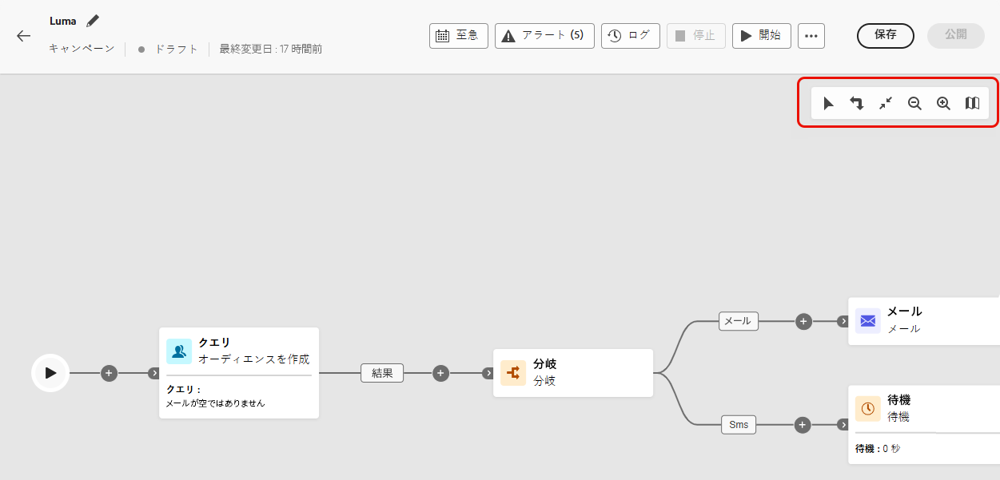
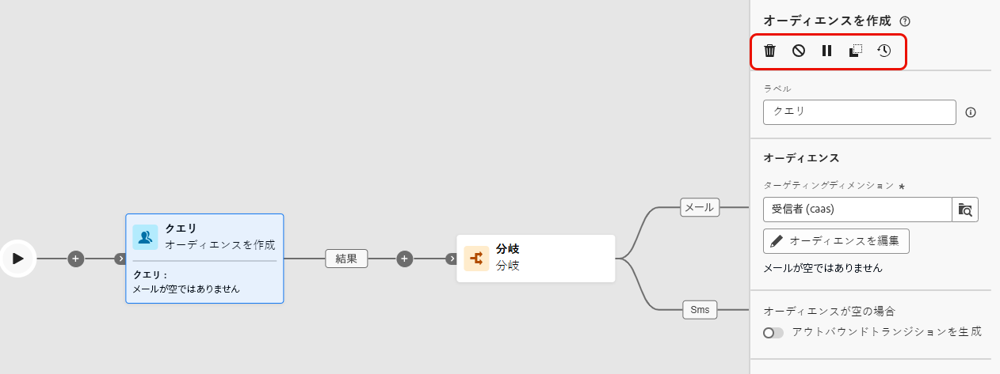
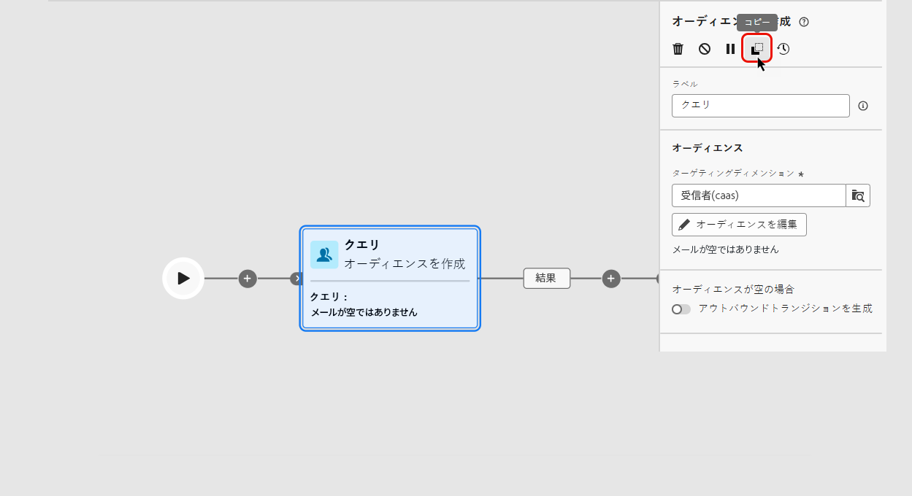
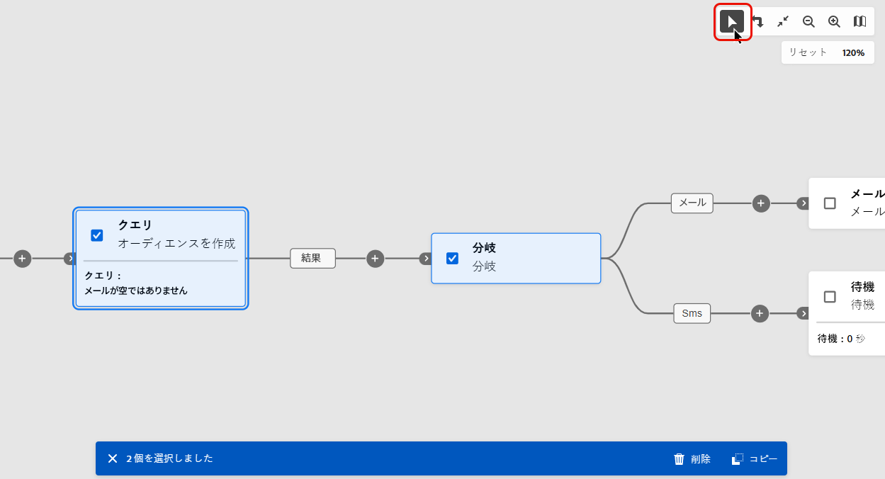
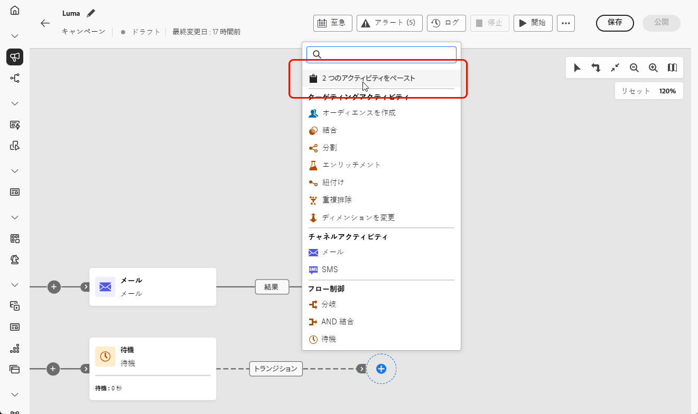
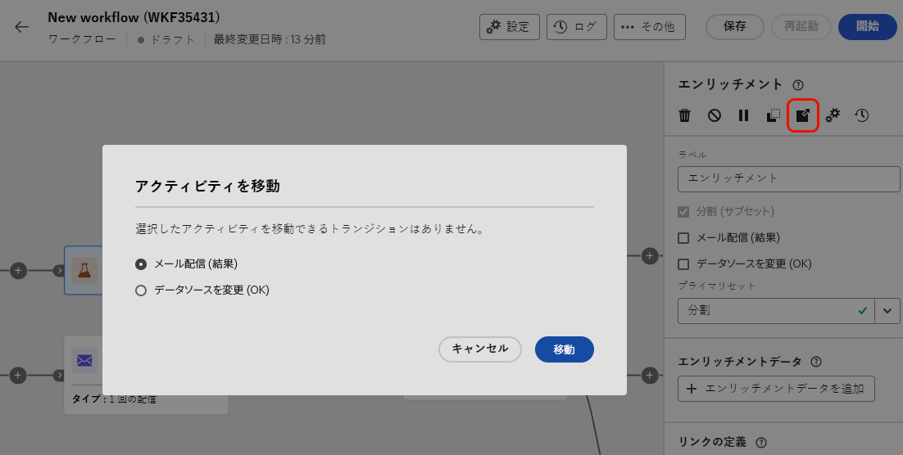
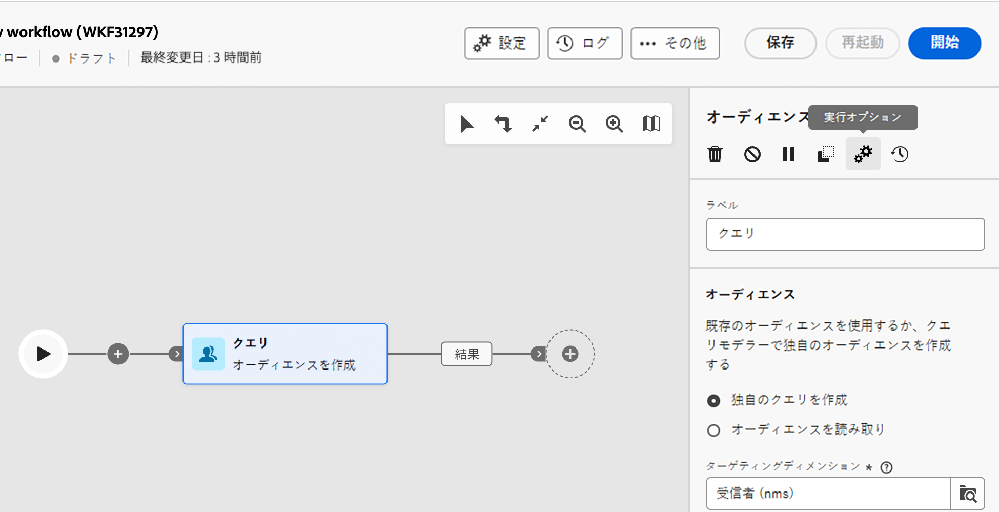

# キャンペーンアクティビティの調整 {#orchestrate}

+++ 目次

| 調整されたキャンペーンへようこそ | 最初の調整されたキャンペーンの開始 | データベースのクエリ | キャンペーンアクティビティをキャンセル |
|---|---|---|---|
| [ オーケストレーションされたキャンペーンの基本を学ぶ ](gs-orchestrated-campaigns.md)  [ 設定手順 ](configuration-steps.md)  [ オーケストレーションされたキャンペーンへのアクセスと管理 ](access-manage-orchestrated-campaigns.md) | [ オーケストレーションされたキャンペーンの作成 ](gs-campaign-creation.md)  [ キャンペーンの作成とスケジュール設定 ](create-orchestrated-campaign.md)  <b>[ アクティビティのオーケストレーション ](orchestrate-activities.md)</b>  [ オーケストレーションされたキャンペーンでのメッセージの送信 ](send-messages.md)  [ キャンペーンの開始と監視 ](start-monitor-campaigns.md)  [ レポート ](reporting-campaigns.md) | [ ルールビルダーの操作 ](orchestrated-rule-builder.md)  [ 最初のクエリの作成 ](build-query.md)  [ 式の編集 ](edit-expressions.md) | [ アクティビティの基本を学ぶ ](activities/about-activities.md)   アクティビティ： [AND 結合 ](activities/and-join.md) - [ オーディエンスを作成 ](activities/build-audience.md) - [ ディメンションを変更 ](activities/change-dimension.md) - [ 結合 ](activities/combine.md) - [ 重複排除 ](activities/deduplication.md) - [ エンリッチメント ](activities/enrichment.md) - [ 分岐 ](activities/fork.md) - [ 紐付け ](activities/reconciliation.md) - [ 分割 ](activities/split.md)  - |

{style="table-layout:fixed"}

+++

 

オーケストレーションされたキャンペーンメニューまたはキャンペーン内で [ オーケストレーションされたキャンペーンを作成 ](gs-campaign-creation.md) したら、実行される様々なタスクのオーケストレーションを開始できます。 これを行うために、視覚的なキャンバスが提供され、調整されたキャンペーン図を作成できます。 このダイアグラムに様々なアクティビティを追加し、順番に接続できます。

## アクティビティを追加 {#add}

設定のこの段階では、ダイアグラムに、調整されたキャンペーンの開始を表す「開始」アイコンが付きます。 最初のアクティビティを追加するには、「開始」アイコンに接続されている「**+**」ボタンをクリックします。

ダイアグラムに追加できるアクティビティのリストが表示されます。使用可能なアクティビティは、調整されたキャンペーン図内の位置によって異なります。 例えば、最初のアクティビティを追加する際に、オーディエンスをターゲティング、オーケストレーションされたキャンペーンパスを分割、またはオーケストレーションされたキャンペーンの実行を遅らせる **待機** アクティビティを設定することで、オーケストレーションされたキャンペーンを開始できます。 一方、**オーディエンスを作成** アクティビティの後に、ターゲティングアクティビティでターゲットを絞り込んだり、チャネルアクティビティでオーディエンスに配信を送信したり、フロー制御アクティビティで調整されたキャンペーンプロセスを整理したりできます。

{zoomable="yes"}

アクティビティがダイアグラムに追加されると、右側のパネルが表示され、新しく追加されたアクティビティを特定の設定で設定できます。各アクティビティの設定方法について詳しくは、[この節](activities/about-activities.md)を参照してください。

{zoomable="yes"}

このプロセスを繰り返し、オーケストレーションキャンペーンで実行するタスクに応じて、必要な数のアクティビティを追加します。 また、2 つのアクティビティの間に新しいアクティビティを挿入することもできます。これを行うには、アクティビティ間のトランジションで「**+**」ボタンをクリックし、目的のアクティビティを選択して、右側のパネルで設定します。

アクティビティを削除するには、キャンバスでアクティビティを選択し、アクティビティプロパティの「**削除**」アイコンをクリックします。

>[!TIP]
>
>各アクティビティ間のトランジションの名前をパーソナライズすることもできます。これを行うには、トランジションを選択し、右側のパネルでそのラベルを変更します。

## ツールバー {#toolbar}

キャンバスの右上隅にあるツールバーには、アクティビティを簡単に操作し、キャンバス内を移動するオプションが表示されます。

* **複数選択モード**：複数のアクティビティを選択してすべてを一度に削除するか、コピー＆ペーストします。詳しくは、[この節](#copy)を参照してください。
* **回転**：キャンバスを垂直方向に切り替えます。
* **画面に合わせる**：キャンバスのズームレベルを画面に合わせて調整します。
* **ズームアウト**／**ズームイン**：キャンバスをズームアウトまたはズームインします。
* **マップを表示**：現在の位置を示すキャンバスのスナップショットを開きます。

{zoomable="yes"}{width="50%"}

## アクティビティの管理 {#manage}

アクティビティを追加する場合、プロパティパネルでアクションボタンを使用して複数の操作を実行できます。

{zoomable="yes"}

実行できる操作は、次のとおりです。

* キャンバスからアクティビティを「**削除**」します。
* アクティビティを「**無効／有効**」にします。オーケストレーションされたキャンペーンを実行すると、同じパス上の無効なアクティビティと後続のアクティビティは実行されず、オーケストレーションされたキャンペーンは停止します。
* アクティビティを「**一時停止／再開**」します。調整したキャンペーンを実行すると、一時停止したアクティビティで一時停止します。 対応するタスクと、同じパス内でそのタスクに続くすべてのタスクが実行されません。
* アクティビティを「**コピー**」します。詳しくは、[この節](#copy)を参照してください。
* アクティビティの「**ログとタスク**」にアクセスします。

「**結合**」や「**重複排除**」などの&#x200B;**ターゲティング**&#x200B;アクティビティを使用すると、残りの母集団を処理し、追加のアウトバウンドトランジションに含めることができます。例えば、**分割**&#x200B;アクティビティを使用している場合、補集合は、以前に定義されたサブセットのいずれにも一致しなかった母集団で構成されます。この機能を使用するには、「**補集合を生成**」オプションを有効化します。

## アクティビティの移動またはコピー {#move-copy}

### アクティビティのコピーとペースト {#copy}

オーケストレーションされたキャンペーンアクティビティをコピーして、任意のワークフローに貼り付けることができます。 宛先でオーケストレーションされたキャンペーンは、別のブラウザータブに配置できます。

アクティビティをコピーするには、次の 2 つの方法があります。

* アクションボタンを使用して 1 個のアクティビティをする。

  {zoomable="yes"}{width="70%"}

* ツールバーボタンを使用して複数のアクティビティをコピーする。

  {zoomable="yes"}{width="70%"}

コピーしたアクティビティを貼り付けるには、トランジションの「**+**」ボタンをクリックし、「X 個のアクティビティをペースト」を選択します。

{zoomable="yes"}{width="50%"}

<!--
### Move activities and their child nodes {#move}

Journey Optimizer allows you to move an activity, along with the entire content of its child nodes (including all transitions and activities within it) to the end of another transition within the same orchestrated campaign.

This process disconnects the activity and everything in its outbound transition from the initial location, moving it to the new target transition.

To move an activity:

1. Select the activity you wish to move.
1. In the activity's properties pane, click the **Move** button.
1. Select the transition where you want to place the activity and its outbound transition, then confirm.

## Execution options {#execution}

All activities allow you to manage their execution options. Select an activity and click on the **Execution options** button. This lets you define the activity's execution mode and behavior in case of errors.

{zoomable="yes"}{width="70%"}

### Properties

The **Execution** field allows you to define the action to be carried out when the task is started.

The **Maximum execution duration** field allows you to specify a duration such as "30s" or "1h". If the activity is not finished after the duration specified has been elapsed, an alert is triggered. This has no impact on how the orchestrated campaign functions.

The **Time zone** field allows you to select the time zone of the activity. Adobe Journey Optimizer allows you to manage the time differences between multiple countries on the same instance. The setting applied is configured when the instance is created.

**The Affinity** field allows you to force an orchestrated campaign or an orchestrated campaign activity to execute on a particular machine. To do this, you must specify one or several affinities for the orchestrated campaign or activity in question.

The **Behavior** field allows you to define the procedure to follow if asynchronous tasks are used.

### Error management

The **In case of error** field allows you to specify the action to be carried out should the activity encounter an error.

### Initialization script

The **Initialization script** lets you initialize variables or modify activity properties. Click the **Edit code** button and type the snippet of code to execute. The script is called when the activity executes. 

## Example {#example}

Here is an orchestrated campaign example designed to send an email to all customers (other than VIP customers) with an email who are interested in coffee machines.

{zoomable="yes"}{zoomable="yes"}

To achieve this, activities below have been added:

* A **[!UICONTROL Fork]** activity that divides the orchestrated campaign into three paths (one for each set of customer),
* **[!UICONTROL Build audience]** activities to target the three sets of customers:

    * Customers with an email,
    * Customers belonging to the pre-existing "Interrested in Coffee Machine(s)" audience,
    * Customers belonging to the pre-existing "VIP ro reward" audience.

* A **[!UICONTROL Combine]** activity that groups together customers with an email and those interested in coffee machines,
* A **[!UICONTROL Combine]** activity that excludes VIP customers,
* An **[!UICONTROL Email delivery]** activity that sends an email to the resulting customers. 

Once you have completed the orchestrated campaign, add en **[!UICONTROL End]** activity at the end of the diagram. This activity allow you to visually mark the end of a workflow and has no functional impact.

After successfully designing the orchestrated campaign diagram, you can execute the orchestrated campaign and track the progress of its various tasks. [Learn how to start an orchestrated campaign and monitor its execution](start-monitor-campaigns.md)
-->