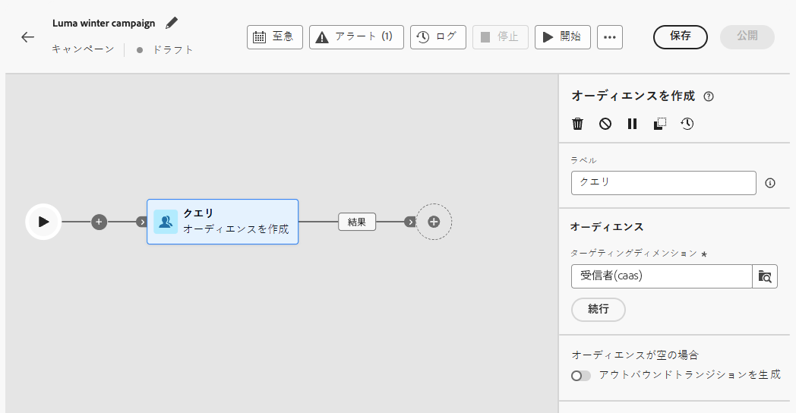
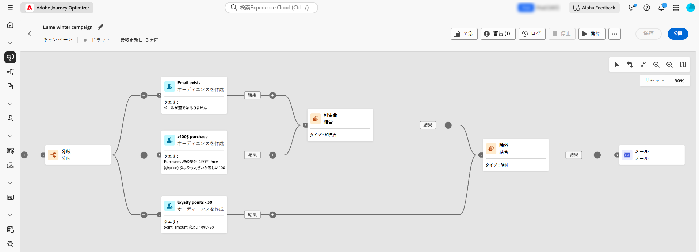

# キャンペーンアクティビティの調整 {#orchestrate}

+++ 目次

| オーケストレートキャンペーンへようこそ | 初めてのオーケストレートキャンペーンの開始 | データベースのクエリ | 調整されたキャンペーンアクティビティ |
|---|---|---|---|
| [ 調整されたキャンペーンの基本を学ぶ ](gs-orchestrated-campaigns.md)   リレーショナルスキーマとデータセットの作成および管理：  <ul><li>[ スキーマとデータセットの概要 ](gs-schemas.md)</li><li>[ 手動スキーマ ](manual-schema.md)</li><li>[ ファイルアップロードスキーマ ](file-upload-schema.md)</li><li>[ データの取り込み ](ingest-data.md)</li></ul>[ オーケストレートキャンペーンへのアクセスと管理 ](access-manage-orchestrated-campaigns.md)  [ オーケストレートキャンペーンを作成するための主な手順 ](gs-campaign-creation.md) | [キャンペーンの作成とスケジュール](create-orchestrated-campaign.md)  <b>[アクティビティの調整](orchestrate-activities.md)</b>  [キャンペーンの開始と監視](start-monitor-campaigns.md)  [レポート](reporting-campaigns.md) | [ルールビルダーの操作](orchestrated-rule-builder.md)  [最初のクエリの作成](build-query.md)  [式の編集](edit-expressions.md)  [リターゲティング](retarget.md) | [アクティビティの基本を学ぶ](activities/about-activities.md)  アクティビティ： [AND 結合](activities/and-join.md) - [オーディエンスを作成](activities/build-audience.md) - [ディメンションを変更](activities/change-dimension.md) - [チャネルアクティビティ](activities/channels.md) - [結合](activities/combine.md) - [重複排除](activities/deduplication.md) - [エンリッチメント](activities/enrichment.md) - [分岐](activities/fork.md) - [紐付け](activities/reconciliation.md) - [オーディエンスを保存](activities/save-audience.md) - [分割](activities/split.md) - [待機](activities/wait.md) |

{style="table-layout:fixed"}

+++

 

>[!BEGINSHADEBOX]

 

このページのコンテンツは最終的なものではなく、変更される場合があります。

>[!ENDSHADEBOX]

[ オーケストレーションされたキャンペーンを作成 ](gs-campaign-creation.md) したら、実行される様々なタスクのオーケストレーションを開始できます。 これを行うために、視覚的なキャンバスが提供され、オーケストレーションされたキャンペーン図を作成できます。 このダイアグラムに様々なアクティビティを追加し、順番に接続できます。

## アクティビティを追加 {#add}

設定のこの段階では、ダイアグラムに、オーケストレーションされたキャンペーンの開始を表す「開始」アイコンが付きます。 最初のアクティビティを追加するには、「開始」アイコンに接続されている「**+**」ボタンをクリックします。

ダイアグラムに追加できるアクティビティのリストが表示されます。使用可能なアクティビティは、オーケストレーションされたキャンペーン図内の位置によって異なります。 例えば、最初のアクティビティを追加する際に、オーディエンスをターゲティング、オーケストレーションされたキャンペーンパスを分割、またはオーケストレーションされたキャンペーンの実行を遅らせる **待機** アクティビティを設定することで、オーケストレーションされたキャンペーンを開始できます。 一方、**オーディエンスを作成** アクティビティの後に、ターゲティングアクティビティでターゲットを絞り込んだり、チャネルアクティビティでオーディエンスに配信を送信したり、フロー制御アクティビティで調整されたキャンペーンプロセスを整理したりできます。

{zoomable="yes"}

アクティビティがダイアグラムに追加されると、右側のパネルが表示され、特定の設定で指定できます。各アクティビティの設定方法について詳しくは、[この節](activities/about-activities.md)を参照してください。

{zoomable="yes"}

このプロセスを繰り返し、オーケストレートキャンペーンで実行するタスクに応じて、必要な数のアクティビティを追加します。 また、2 つのアクティビティの間に新しいアクティビティを挿入することもできます。これを行うには、アクティビティ間のトランジションで「**+**」ボタンをクリックし、目的のアクティビティを選択して、右側のパネルで設定します。

各アクティビティ間のトランジションの名前をカスタマイズすることもできます。 これを行うには、トランジションを選択し、右側のパネルでそのラベルを変更します。

### キャンバスツールバー {#toolbar}

キャンバスツールバーには、アクティビティを簡単に操作し、キャンバス内を移動するオプションが用意されています。

：複数のアクティビティを選択してすべてを一度に削除するか、コピー＆ペーストします。[アクティビティのコピー＆ペースト方法の詳細情報](#copy)

：キャンバスを垂直方向に切り替えます。

：キャンバスのズームレベルを画面に合わせて調整します。

 ：キャンバスをズームアウトまたはズームインします。

：現在の位置を示すキャンバスのスナップショットを開きます。

### アクティビティの管理 {#manage}

アクティビティを追加する場合、プロパティパネルでアクションボタンを使用して複数の操作を実行できます。

：キャンバスからアクティビティを削除します。

 ：アクティビティを無効／有効にします。オーケストレーションされたキャンペーンを実行すると、同じパス上の無効なアクティビティと後続のアクティビティは実行されず、オーケストレーションされたキャンペーンは停止します。

 ：アクティビティを一時停止／再開します。オーケストレートキャンペーンを実行すると、一時停止したアクティビティで一時停止します。 対応するタスクと、同じパス内でそのタスクに続くすべてのタスクが実行されません。

キャンバス内の任意のアクティビティをブレークポイントとして使用して、キャンペーンの実行を一時停止できます。 つまり、キャンペーンはこのアクティビティまで実行され、その後で実行を一時停止します。 実行の一時停止中、セグメント化エンジンはプレビューできる一時データを保持します。 一時停止したアクティビティの直前のインバウンドトランジションを選択して、トランスポートされたデータを表示できます。 詳しくは、「視覚的なフロー監視 [ を参照し ](../orchestrated/start-monitor-campaigns.md#flow) ください。

：アクティビティをコピーします。[アクティビティのコピー＆ペースト方法の詳細情報](#copy)

：アクティビティのログとタスクにアクセスします。

「**結合**」や「**重複排除**」などの&#x200B;**ターゲティング**&#x200B;アクティビティを使用すると、残りの母集団を処理し、追加のアウトバウンドトランジションに含めることができます。例えば、**分割**&#x200B;アクティビティを使用している場合、補集合は、以前に定義されたサブセットのいずれにも一致しなかった母集団で構成されます。この機能を使用するには、「**[!UICONTROL 補集合を生成]**」オプションを有効化します。

### アクティビティのコピーとペースト {#copy}

アクティビティをコピーして、任意のオーケストレーションされたキャンペーンキャンバスに貼り付けることができます。 宛先キャンペーンは、別のブラウザータブにある場合があります。

* 1 つのアクティビティをコピーするには、アクティビティプロパティパネルの  ボタンをクリックします。
* 複数のアクティビティをコピーするには、キャンバスツールバーの  アイコンをクリックします。

| 1 つのアクティビティをコピー | 複数のアクティビティをコピー |
|  ---  |  ---  |
| {width="200" align="center" zoomable="yes"} | {width="200" align="center" zoomable="yes"} |

アクティビティを貼り付けるには、トランジションの「**+**」ボタンをクリックし、「X 個のアクティビティをペースト」を選択します。

{zoomable="yes"}{width="50%"}

## ダイアグラムの例 {#example}

以下はオーケストレーションされたキャンペーンの例です。100 ドル以上の購入を行ったすべての顧客にメールを送信し、50 ロイヤルティポイント未満のすべての顧客を除外するように設計されています。

{zoomable="yes"}

これを実現するために、以下のアクティビティが追加されました。

* **[!UICONTROL 分岐]** アクティビティは、オーケストレーションされたキャンペーンを 3 つのパスに分割します。
* **[!UICONTROL オーディエンスを作成]**&#x200B;アクティビティは、3 組の顧客をターゲットに設定します。

   * メールを送信した顧客。
   * 100 ドル以上を購入した顧客。
   * 50 未満のロイヤルティポイントを持つ顧客。

* **[!UICONTROL 結合]**&#x200B;アクティビティは、メールを送信した顧客と 100 ドル以上を購入した顧客をグループ化します。
* **[!UICONTROL 結合]**&#x200B;アクティビティは、50 未満のロイヤルティポイントを持つ顧客を除外します。
* **[!UICONTROL メール配信]**&#x200B;アクティビティは、結果の顧客にメールを送信します。

## 次の手順 {#next}

オーケストレーションされたキャンペーンの図を正常に設計したら、オーケストレーションされたキャンペーンを実行し、様々なタスクの進捗をトラッキングできます。 [ オーケストレートキャンペーンを開始し、その実行を監視する方法について説明します ](start-monitor-campaigns.md)
