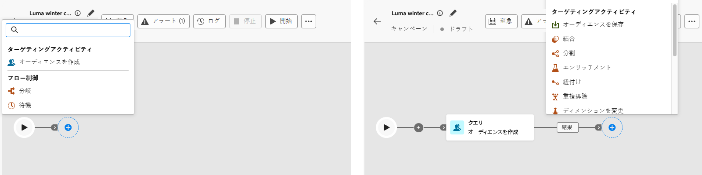

# キャンペーンアクティビティの調整 {#orchestrate}

+++ 目次

| 調整されたキャンペーンへようこそ | 最初の調整されたキャンペーンの開始 | データベースのクエリ | 調整されたキャンペーンアクティビティ |
|---|---|---|---|
| [ オーケストレーションされたキャンペーンの基本を学ぶ ](gs-orchestrated-campaigns.md)  [ 設定手順 ](configuration-steps.md)  [ オーケストレーションされたキャンペーンへのアクセスと管理 ](access-manage-orchestrated-campaigns.md) | [ キャンペーンの作成を調整するための主な手順 ](gs-campaign-creation.md)  [ キャンペーンの作成およびスケジュール設定 ](create-orchestrated-campaign.md)  <b>[ アクティビティの調整 ](orchestrate-activities.md)</b>  [ キャンペーンの開始および監視 ](start-monitor-campaigns.md)  [ レポート ](reporting-campaigns.md) | [ ルールビルダーの操作 ](orchestrated-rule-builder.md)  [ 最初のクエリの作成 ](build-query.md)  [ 式の編集 ](edit-expressions.md)  [ リターゲティング ](retarget.md) | [ アクティビティの基本を学ぶ ](activities/about-activities.md)   アクティビティ： [AND 結合 ](activities/and-join.md) - [ オーディエンスを作成 ](activities/build-audience.md) - [ ディメンションの変更 ](activities/change-dimension.md) - [ チャネルアクティビティ ](activities/channels.md) - [ 結合 ](activities/combine.md) - [ 重複排除 ](activities/deduplication.md) - [ エンリッチメント ](activities/enrichment.md) - [ 分岐 ](activities/fork.md) - [ 紐付け ](activities/reconciliation.md)    - |

{style="table-layout:fixed"}

+++

 

[ オーケストレーションされたキャンペーンを作成 ](gs-campaign-creation.md) したら、実行される様々なタスクのオーケストレーションを開始できます。 これを行うために、視覚的なキャンバスが提供され、調整されたキャンペーン図を作成できます。 このダイアグラムに様々なアクティビティを追加し、順番に接続できます。

## アクティビティを追加 {#add}

設定のこの段階では、ダイアグラムに、調整されたキャンペーンの開始を表す「開始」アイコンが付きます。 最初のアクティビティを追加するには、「開始」アイコンに接続されている「**+**」ボタンをクリックします。

ダイアグラムに追加できるアクティビティのリストが表示されます。使用可能なアクティビティは、調整されたキャンペーン図内の位置によって異なります。 例えば、最初のアクティビティを追加する際に、オーディエンスをターゲティング、オーケストレーションされたキャンペーンパスを分割、またはオーケストレーションされたキャンペーンの実行を遅らせる **待機** アクティビティを設定することで、オーケストレーションされたキャンペーンを開始できます。 一方、**オーディエンスを作成** アクティビティの後に、ターゲティングアクティビティでターゲットを絞り込んだり、チャネルアクティビティでオーディエンスに配信を送信したり、フロー制御アクティビティで調整されたキャンペーンプロセスを整理したりできます。

{zoomable="yes"}

アクティビティがダイアグラムに追加されると、右側のパネルが表示され、特定の設定を使用して設定できます。 各アクティビティの設定方法について詳しくは、[この節](activities/about-activities.md)を参照してください。

{zoomable="yes"}

このプロセスを繰り返し、オーケストレーションキャンペーンで実行するタスクに応じて、必要な数のアクティビティを追加します。 また、2 つのアクティビティの間に新しいアクティビティを挿入することもできます。これを行うには、アクティビティ間のトランジションで「**+**」ボタンをクリックし、目的のアクティビティを選択して、右側のパネルで設定します。

各アクティビティ間のトランジションの名前をパーソナライズすることもできます。これを行うには、トランジションを選択し、右側のパネルでそのラベルを変更します。

### キャンバスツールバー {#toolbar}

キャンバスツールバーには、アクティビティを簡単に操作し、キャンバス内を移動するためのオプションが用意されています。

 複数のアクティビティを選択して一度にすべてを削除するか、コピーして貼り付けます。 [ アクティビティのコピーと貼り付けの方法を学ぶ ](#copy)

 キャンバスを垂直方向に切り替えます。

 キャンバスのズームレベルを画面に合わせます。

 ズームアウトまたはキャンバス。

 キャンバスのスナップショットを開いて、位置を示します。

### アクティビティの管理 {#manage}

アクティビティを追加する場合、プロパティパネルでアクションボタンを使用して複数の操作を実行できます。

 キャンバスからアクティビティを削除します。

 アクティビティを無効/有効にします。 オーケストレーションされたキャンペーンを実行すると、同じパス上の無効なアクティビティと後続のアクティビティは実行されず、オーケストレーションされたキャンペーンは停止します。

 アクティビティを一時停止/再開します。 調整したキャンペーンを実行すると、一時停止したアクティビティで一時停止します。 対応するタスクと、同じパス内でそのタスクに続くすべてのタスクが実行されません。

 アクティビティをコピーします。 [ アクティビティのコピーと貼り付けの方法を学ぶ ](#copy)

 アクティビティのログとタスクにアクセスします。

「**結合**」や「**重複排除**」などの&#x200B;**ターゲティング**&#x200B;アクティビティを使用すると、残りの母集団を処理し、追加のアウトバウンドトランジションに含めることができます。例えば、「**分割**」アクティビティを使用している場合、補集合は、以前に定義されたどのサブセットにも一致しない母集団で構成されます。 この機能を使用するには、「**[!UICONTROL 補集合を生成]**」オプションを有効化します。

### アクティビティのコピーとペースト {#copy}

アクティビティをコピーして、調整した任意のキャンペーンキャンバスに貼り付けることができます。 宛先キャンペーンは、別のブラウザータブに配置できます。

* 1 つのアクティビティをコピーするには、アクティビティのプロパティペインで「」ボタンをクリックします。
* 複数のアクティビティをコピーするには、キャンバスツールバーの  アイコンをクリックします。

| 1 つのアクティビティをコピー | 複数のアクティビティのコピー |
|  ---  |  ---  |
| {width="200" align="center" zoomable="yes"} | {width="200" align="center" zoomable="yes"} |

アクティビティを貼り付けるには、トランジションの「**+**」ボタンをクリックし、「x アクティビティを貼り付け」を選択します。

{zoomable="yes"}{width="50%"}

## 図の例 {#example}

以下は、100 ドル以上の購入を行ったすべての顧客にメールを送信し、ロイヤルティポイントが 50 個未満のすべての顧客を除外するように設計された、オーケストレーションされたキャンペーンの例です。

{zoomable="yes"}

これを実現するために、以下のアクティビティが追加されました。

* **[!UICONTROL 分岐]** アクティビティは、調整されたキャンペーンを 3 つのパスに分割します。
* **[!UICONTROL オーディエンスを作成]** アクティビティは、次の 3 組の顧客をターゲットにします。

   * メールを送信した顧客。
   * 100 ドル以上のお客様
   * 50 未満のロイヤルポイントを持つお客様。

* **[!UICONTROL 結合]** アクティビティが、メールを送信した顧客と、100 ドル以上を購入した顧客をグループ化します。
* **[!UICONTROL 結合]** アクティビティでは、ロイヤルティポイントが 50 個未満の顧客は除外されます。
* **[!UICONTROL メール配信]** アクティビティは、結果の顧客にメールを送信します。

## 次の手順 {#next}

オーケストレーションされたキャンペーンの図を正常に設計したら、オーケストレーションされたキャンペーンを実行し、様々なタスクの進捗をトラッキングできます。 [ オーケストレートキャンペーンを開始し、その実行を監視する方法については、こちらを参照してください ](start-monitor-campaigns.md)
