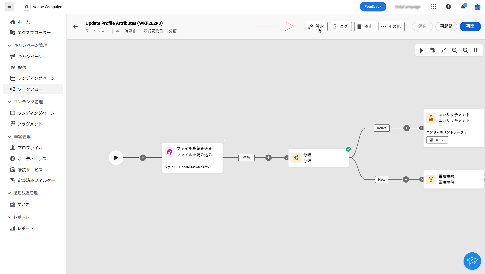
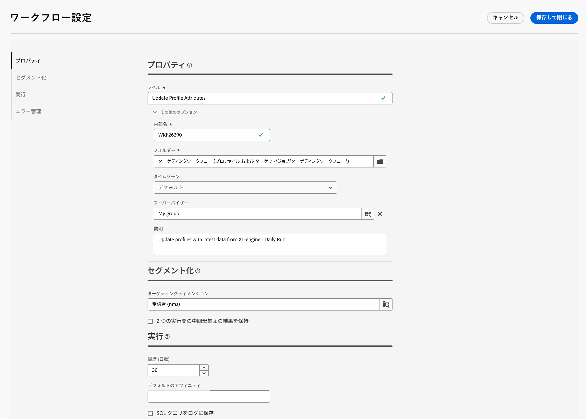

# 調整されたキャンペーン設定の構成 {#workflow-settings}

>[!CONTEXTUALHELP]
>id="ajo_workflow_creation_properties"
>title="調整されたキャンペーンプロパティ"
>abstract="この画面では、調整されたキャンペーンの作成に使用するテンプレートを選択し、ラベルを指定します。「**その他のオプション**」セクションを展開して、調整されたキャンペーンの内部名、フォルダー、タイムゾーン、スーパーバイザーグループなどの詳細設定を行います。エラーが発生した場合にオペレーターに警告できるように、スーパーバイザーグループを選択することを強くお勧めします。"

+++ 目次

| 調整されたキャンペーンへようこそ | 最初の調整されたキャンペーンの開始 | データベースのクエリ | キャンペーンアクティビティをキャンセル |
|---|---|---|---|
| [ オーケストレーションされたキャンペーンの概要 ](gs-orchestrated-campaigns.md)  [ 設定手順 ](configuration-steps.md)  [ オーケストレーションされたキャンペーンを作成するための主な手順 ](gs-campaign-creation.md) | [ オーケストレーションされたキャンペーンの作成 ](create-orchestrated-campaign.md)  [ アクティビティのオーケストレーション ](orchestrate-activities.md)  [ オーケストレーションされたキャンペーンでのメッセージの送信 ](send-messages.md)  [ キャンペーンの開始および監視 ](start-monitor-campaigns.md)  [ レポート ](reporting-campaigns.md) | [ クエリの操作Modeler](orchestrated-query-modeler.md)  [ 最初のクエリ ](build-query.md)  [ 編集式を作成 ](edit-expressions.md) | [ アクティビティの基本を学ぶ ](activities/about-activities.md)   アクティビティ： [AND 結合 ](activities/and-join.md) - [ オーディエンスを作成 ](activities/build-audience.md) - [ ディメンションを変更 ](activities/change-dimension.md) - [ 結合 ](activities/combine.md) - [ 重複排除 ](activities/deduplication.md) - [ エンリッチメント ](activities/enrichment.md) - [ 分岐 ](activities/fork.md) - [ 紐付け ](activities/reconciliation.md) - [ 分割 ](activities/split.md)  - |

{style="table-layout:fixed"}

+++

 

キャンバスでオーケストレートキャンペーンを作成したり、オーケストレートキャンペーンアクティビティをオーケストレーションする際に、オーケストレートキャンペーンに関連する詳細設定にアクセスできます。 例えば、オーケストレーションされたキャンペーンの特定のタイムゾーンを設定したり、エラーが発生した場合のオーケストレーションされたキャンペーンの動作を管理したり、オーケストレーションされたキャンペーンの履歴をパージする遅延時間を管理したりできます。

これらの設定は、オーケストレートキャンペーンの作成時に選択したテンプレートで事前に設定されていますが、この特定のオーケストレートキャンペーンで必要に応じて編集できます。

{zoomable="yes"}{width="70%" align="left"}

## 調整されたキャンペーンプロパティ {#properties}

>[!CONTEXTUALHELP]
>id="ajo_workflow_settings_properties"
>title="調整されたキャンペーンプロパティ"
>abstract="このセクションでは、調整されたキャンペーンの作成時にもアクセスできる一般的な調整されたキャンペーンプロパティを提供します。調整されたキャンペーンの作成に使用するテンプレートを選択し、ラベルを指定できます。「その他のオプション」セクションを展開して、調整されたキャンペーン保存フォルダーやタイムゾーンなどの特定の設定を構成します。"

**[!UICONTROL プロパティ]** セクションには、調整されたキャンペーンの作成時に設定できる一般的な設定が用意されています。 既存のオーケストレーションされたキャンペーンのプロパティにアクセスするには、オーケストレーションされたキャンペーンキャンバスの上のアクションバーにある「**[!UICONTROL 設定]**」ボタンをクリックします。

{zoomable="yes"}{width="70%" align="left"}

これらのプロパティは次のとおりです。

* リストに表示されるオーケストレーションされたキャンペーンの **[!UICONTROL ラベル]**。
* オーケストレーションされたキャンペーンの **[!UICONTROL 内部名]**。
* オーケストレーションされたキャンペーンを保存する **[!UICONTROL フォルダー]**。
* オーケストレーションされたすべてのキャンペーンのアクティビティで使用されるデフォルトの **[!UICONTROL タイムゾーン]**。 デフォルトでは、オーケストレーションされたキャンペーンのタイムゾーンは、現在の Campaign オペレーターに対して定義されたタイムゾーンになります。
使用可能な値：
   * **サーバータイムゾーン**:Adobe Experience Platform組織のタイムゾーンを使用します
   * **オペレータータイムゾーン**：オーケストレーションされたキャンペーンを実行するオペレーターのタイムゾーンを使用します
   * **データベースのタイムゾーン**：データベースサーバーのタイムゾーンを使用します
   * 特定のタイムゾーン
* オーケストレーションされたキャンペーンが失敗すると、「**[!UICONTROL スーパーバイザー]**」フィールドで選択されたオペレーターグループに属するオペレーターにメールで通知されます。
* また、オーケストレーションしたキャンペーンの **[!UICONTROL 説明]** を入力することもできます。

## セグメント化の設定  {#segmentation-settings}

>[!CONTEXTUALHELP]
>id="ajo_workflow_settings_segmentation"
>title="セグメント化の設定"
>abstract="このセクションでは、調整されたキャンペーンでプロファイルをターゲットにするターゲティングディメンションを選択し、2 回の実行の間にワークフローの結果を保持するように選択できます。このオプションは、テスト目的でのみ使用し、実稼動の調整されたキャンペーンでは絶対に有効にしないでください。"

* **[!UICONTROL ターゲティングディメンション]**：プロファイルのターゲットに使用するターゲティングディメンションを受信者、契約の受益者、オペレーター、サブスクライバーなどから選択します。

* **[!UICONTROL 2 つの実行間の中間母集団の結果を保持]**: デフォルトでは、調整されたキャンペーンの最後の実行の作業用テーブルのみが保持されます。 それ以前に実行した分の作業用テーブルは、毎日実行される、技術的に調整されたキャンペーンによりパージされます。

  このオプションを有効にした場合、作業用テーブルは、オーケストレーションされたキャンペーンが実行された後も保持されます。 テスト目的で使用できるので、開発環境またはステージング環境で&#x200B;**のみ**&#x200B;使用する必要があります。実稼動用に調整されたキャンペーンでは絶対にオンにしないでください。

## 実行設定  {#exec-settings}

>[!CONTEXTUALHELP]
>id="ajo_workflow_settings_execution"
>title="実行設定"
>abstract="このセクションでは、調整されたキャンペーンの履歴を保持する日数など、ワークフローの実行に関する設定を構成できます。"

* **[!UICONTROL 履歴（日数）]**：履歴をパージする必要があるまでの日数を指定します。履歴には、ログ、タスク、イベント（オーケストレーションされたキャンペーン操作にリンクされた技術的なオブジェクト）など、オーケストレーションされたキャンペーンに関連する要素が含まれます。 標準のオーケストレーションされたキャンペーンテンプレートのデフォルト値は 30 日です。 履歴のパージは、デフォルトで毎日実行されるデータベースクリーンアップテクニカルオーケストレートキャンペーンによって実行されます

  >[!IMPORTANT]
  >
  >「**[!UICONTROL 履歴（日数）]**」フィールドが空白のままの場合、その値は「1」と見なされます。つまり、履歴は 1 日後にパージされます。

* **[!UICONTROL デフォルトのアフィニティ]**：オーケストレーションされた複数の Campaign サーバーがインストールにある場合、このフィールドを使用して、オーケストレーションされたキャンペーンを実行するサーバーを指定します。 これにより、特定のサーバーで調整されたキャンペーンを強制的に実行します。 既存のアフィニティ名を選択できますが、スペースや句読点を使用しないようにしてください。異なるサーバーを使用する場合は、異なる名前をコンマで区切って指定します。

  >[!IMPORTANT]
  >
  >このフィールドで定義した値がどのサーバーにも存在しない場合、オーケストレーションされたキャンペーンは保留されたままになります。

* **[!UICONTROL SQL クエリをログに保存]**:workflmulti-step キャンペーンからの SQL クエリをログに保存する場合は、このオプションをオンにします。 この機能を設定できるのは上級ユーザーに限られます。**[!UICONTROL オーディエンスの作成]** などのターゲティングアクティビティを含んだオーケストレーションされたキャンペーンに適用されます。 このオプションを有効にすると、オーケストレートキャンペーンの実行中にデータベースに送信された SQL クエリがオーケストレートキャンペーンのログに表示され、クエリを分析して最適化や問題の診断が可能になります。

## エラー管理設定  {#error-settings}

>[!CONTEXTUALHELP]
>id="ajo_workflow_settings_error"
>title="エラー管理設定"
>abstract="このセクションでは、調整されたキャンペーンで実行中のエラーを管理する方法を定義できます。プロセスの一時停止、一定数のエラーの無視または調整されたキャンペーンの実行の停止を選択できます。"

* **[!UICONTROL エラー管理]**：このフィールドでは、調整されたキャンペーンタスクにエラーが発生した場合に行うアクションを定義できます。 次の 3 つのオプションが使用可能です。

   * **[!UICONTROL プロセスを中断]**：オーケストレーションされたキャンペーンは自動的に一時停止され、ステータスは **[!UICONTROL 失敗]** に変わります。 問題が解決したら、「再開 **[!UICONTROL ボタンを使用して、オーケストレーションされたキャンペーンを再開]** ます。
   * **[!UICONTROL 無視]**：エラーをトリガーしたタスクのステータスは「**[!UICONTROL 失敗]** に変わりますが、オーケストレーションされたキャンペーンのステータスは「**[!UICONTROL 開始済み]** のままです。<!-- TO ADD ONCE SCHEUDLER IS AVAILABLE This configuration is relevant for recurring tasks: if the branch includes a scheduler, it will start normally next time the workflow is executed.-->
   * **[!UICONTROL プロセスを中止]**：オーケストレーションされたキャンペーンは自動的に停止し、ステータスは **[!UICONTROL 失敗]** に変わります。 問題が解決したら、「開始 **[!UICONTROL ボタンを使用してオーケストレーションしたキャンペーンを再開]** ます。

* **[!UICONTROL 連続エラー]**：このフィールドは、「**[!UICONTROL エラーの場合]**」フィールドで「**[!UICONTROL 無視]**」の値が選択されたときに有効になります。プロセスを停止するまでに無視するエラーの数を指定できます。この数に達すると、オーケストレーションされたキャンペーンのステータスが **[!UICONTROL 失敗]** に変わります。 このフィールドの値が 0 の場合、エラーの数にかかわらず、オーケストレーションされたキャンペーンは停止しません。

