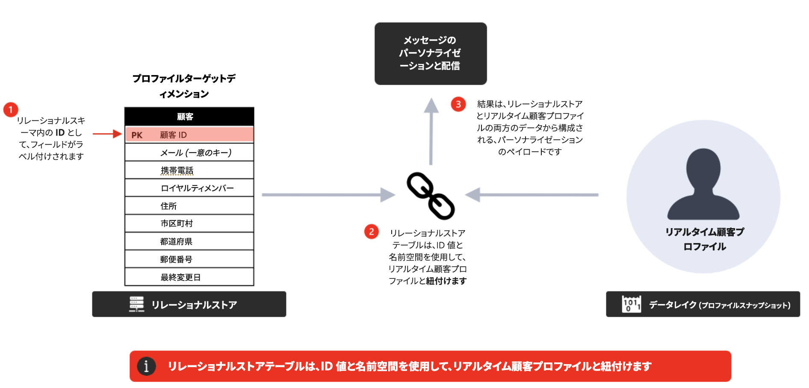

# よくある質問 {#faq-oc}

Adobe Journey Optimizer の調整されたキャンペーンに関するよくある質問を以下に示します。

さらに詳細が必要ですか？このページの下部にあるフィードバックオプションを使用して、質問を入力するか、[Adobe Journey Optimizer コミュニティ](https://experienceleaguecommunities.adobe.com/t5/adobe-journey-optimizer/ct-p/journey-optimizer?profile.language=ja){target="_blank"}にアクセスしてください。

+++ キャンペーンオーケストレーションとは何ですか？

キャンペーンオーケストレーションは、バッチエンゲージメントを目的としてリレーショナルデータストアを活用してオーディエンスを作成およびセグメント化する、シングルステップまたはマルチステップのワークフローをサポートする Journey Optimizer の機能です。

これにより、Journey Optimizer に新しいタイプのキャンペーンである&#x200B;**オーケストレーションキャンペーン**&#x200B;が導入されます。オーケストレーションキャンペーンを使用すると、ブランドの1 対多の複雑なマーケティングキャンペーンを大規模に実行できるようになります。プロモーション、季節のキャンペーン、アカウントベースのコミュニケーションなど、Adobe Journey Optimizer を使ってブランドのエンゲージメントを開始できます。

単一送信／アクションキャンペーンと比較すると、アウトバウンドマーケティングに&#x200B;**オーケストレーションとシーケンス**&#x200B;がもたらされます。つまり、オーディエンスは、1 回限りの大量のメールを受信するのではなく、マルチステップのワークフローを一緒に進めていくことになります。

+++

+++ オーケストレーションキャンペーンで実行できることは何ですか？

主な機能は次のとおりです。

* **オンデマンドオーディエンス**：リレーショナルクエリを使用して、ターゲットグループを瞬時に作成および調整します。
* **マルチエンティティのセグメント化**：お客様データを関連エンティティ（アカウント、購入、予約など）に関連付けて、正確なオーディエンスを作成します。
* **送信前の可視性**：キャンペーンを開始する前に正確なオーディエンス数を把握し、ターゲティングを最適化します。
* **複数ステップのワークフロー**：季節のプロモーション、製品の発売、ロイヤルティのオファーなど、順序付けされたキャンペーンを実行します。

**ベストプラクティス**

* ワークフローを設計する前に、**明確なキャンペーン目標**&#x200B;を定義します。
* スケーリングする前に、**パイロットオーディエンス**&#x200B;から開始して、カウントとロジックを検証します。
* セグメント化ルールは&#x200B;**可能な限りシンプル**&#x200B;に保持し、パフォーマンスと透明性を最適化します。
* 管理を簡単にするには、オーディエンスとキャンペーンに&#x200B;**一貫性のある命名規則**&#x200B;を使用します。

+++

+++ キャンペーンオーケストレーションにアクセスするにはどうすればよいですか？

キャンペーンオーケストレーションにアクセスするには、ライセンスに **Journey Optimizer - キャンペーンとジャーニー**&#x200B;または **Journey Optimizer - キャンペーン**&#x200B;パッケージのいずれかが含まれている必要があります。ライセンスを確認し、必要に応じて更新するには、アドビ担当者にお問い合わせください。

キャンペーンオーケストレーションライセンスモデルについて詳しくは、[Adobe Journey Optimizer 製品説明](https://helpx.adobe.com/jp/legal/product-descriptions/adobe-journey-optimizer.html){target="_blank"}を参照してください。

+++

+++ オーケストレーションキャンペーンとジャーニーの違いは何ですか？

* **オーケストレーションキャンペーン**：**バッチ、1 対多**&#x200B;のキャンペーンに最適です。オーディエンスは、スケジュールに従って一括で進行します。
* **ジャーニー**：**リアルタイム、1 対 1** のエンゲージメントに最適です。各顧客は、行動やイベントにトリガーされて、自分のペースでジャーニーを進めていきます。

**ベストプラクティス**：トリガーされたリアクティブなエクスペリエンスにはジャーニーを併用し、計画されたカレンダーベースのイニシアチブにはオーケストレーションキャンペーンを併用します。

+++

+++ マルチエンティティセグメント化とは何ですか？

Adobe Journey Optimizer のキャンペーンオーケストレーションでは、リレーショナルデータベースが使用されます。このタイプのデータモデルには、1:1 または 1:many の関係を通じて接続された個別のデータスキーマがあります。これにより、ユーザーは受信者レベルだけでなく、任意のスキーマでクエリを開始し、購入、製品、予約、受信者の詳細など、他の関連スキーマに切り替えることができるので、セグメントとオーディエンスを作成および調整する方法に優れた柔軟性が提供されます。

**例** - 今後 30 日以内に購読の有効期限が切れるすべての受信者をターゲットにします。キャンペーンオーケストレーションでは、クエリは購読スキーマから開始し、そのスキーマの有効期限列のみを検索して有効期限が切れるすべての購読を返します。その後、特定の購読 ID に関連する受信者データにロールアップすることで、受信者レベルで各クエリを開始するデータモデルより高速で効率的に結果を返します。

+++

+++ データモデルの仕組みを教えてください。

キャンペーンでは&#x200B;**リレーショナルデータベース**&#x200B;を使用します。このデータベースを使うことで、様々なデータセット（顧客、製品、サブスクリプションなど）をまたいでクエリし、柔軟に連携させ、高度なセグメント化を実現できます。

**ベストプラクティス**

* データセットを整理し、**関係（結合）**&#x200B;がビジネスロジックを反映するようにします。
* 不要な結合は回避し、クエリのパフォーマンスを維持します。
* 大規模な抽出を実行する前に、サンプル結果を検証します。

+++

+++ リレーショナルデータを使用してメッセージをパーソナライズできますか？

はい。キャンペーンオーケストレーションでは、「人物エンティティ」と呼ばれる受信者プロファイルを更新し、そのデータをパーソナライゼーションに使用できます。また、リレーショナルデータベース内のリンクされたエンティティから強化されたデータもパーソナライゼーションに使用できます。顧客プロファイルとリンクされたデータ（購入や購読など）を一緒に使用して、サポートされているすべてのチャネル全体でコンテンツをパーソナライズできます。

**レコメンデーション**

* **トランザクションデータと行動データ**&#x200B;を使用して、オファーの関連性を向上させます。
* **静的な属性**（例：ロイヤルティ層）と&#x200B;**動的な属性**（例：最終購入日）を組み合わせます。
* パーソナライゼーションを簡潔に保持 - データを含むメッセージを過負荷にすると、読みやすさが損なわれる場合があります。

+++

<!--
## Do Orchestrated campaigns integrate with other Adobe solutions? {#integrations}

Yes. Campaign orchestration is natively integrated with:

* **Customer Journey Analytics**: Campaign orchestration reports are available.  
* **Real-Time CDP**: Audiences built in Campaigns can be read in Real-Time CDP.  
* **Federated Audience Composition (FAC)**: Available as an add-on.  -->

+++ どのチャネルがサポートされていますか？

オーケストレーションキャンペーンを作成すると、**メール**、**SMS**、**プッシュ通知**&#x200B;を送信できます。

+++

+++ 同じオーケストレーションキャンペーン内で複数の通信と異なるチャネルを開始できますか？

はい、オーケストレーションキャンペーンは、クロスチャネルオーケストレーションをサポートしています。

+++

+++ オーケストレーションキャンペーンテンプレートは使用できますか？

いいえ、キャンペーンテンプレートを定義または使用できませんが、通信にコンテンツテンプレートを使用できます。

+++

+++ メッセージのコンテンツデザイナーはオーケストレーションキャンペーンに固有のものですか？

いいえ、E メールデザイナーを含むコンテンツデザイナーは、すべての Journey Optimizer 機能で共通です。

+++

+++ オーケストレーションキャンペーンで様々なチャネルを接続するにはどうすればよいですか？

チャネルコンポーネントとランタイムはすべての Journey Optimizer キャンペーンに共通ですが、サポートされるチャネルは異なります。

+++

+++ オーケストレーションキャンペーンはアウトバウンドチャネル（web、アプリ内）に接続できますか？

いいえ、アウトバウンドチャネルはオーケストレーションキャンペーンではサポートされていません。

+++

+++ 権限と同意について教えてください。

オーケストレーションキャンペーンとジャーニーの権限と同意は、Adobe Experience Platform で一元的に管理されます。これらの設定は、送信前に各受信者に対して両方のソリューションに適用されます。

**ベストプラクティス**

* **一元化されたガバナンス**&#x200B;を適用し、キャンペーンレベルで個別に同意を管理することは回避します。
* 同意データを定期的に監査して、不一致を検出します。
* **チャネル固有のオプトアウト**&#x200B;を適用 - グローバルな同意がすべてのチャネルに適用されるとは想定しないでください。

+++

+++ オーケストレーションキャンペーンでアドホックセグメント化を実行できますか？

キャンペーンオーケストレーションでは、アドホックセグメント化を「ライブセグメント化」と呼びます。これにより、リレーショナルストアで使用可能なすべてのデータにリアルタイムでアクセスし、その上に複雑なクエリを作成して、アウトバウンドチャネル（例：メール + SMS）を通じて即時にアクティブ化する結果を取得できます。

**ヒント**

* **時間的制約のあるニーズ**（Flash プロモーションなど）には、アドホックセグメント化を使用します。
* 役に立つクエリを保存および文書化すると、今後のキャンペーンで再利用できます。
* アクティブ化の前にオーディエンス数を検証して、配信数の不足や過剰を防ぎます。

+++

+++ キャンペーンオーケストレーションはバッチを通じて読み込まれるデータにのみアクセスしますか、それともリアルタイムで更新されるテーブル（Analytics データなど）もクエリを実行できますか？

Journey Optimizer キャンペーンオーケストレーションは、まずモデルベースのスキーマに基づいてアドホッククエリを作成できます。モデルベースのスキーマは現在、バッチソースのみをサポートしています。また、任意のタイプの Adobe Experience Platform オーディエンスからのオーディエンスを読み取りをサポートします。

+++

+++ オーケストレーションキャンペーンは決定をサポートしますか？

はい。決定では、オーケストレーションキャンペーンからのリレーショナルデータを使用できます。モデルベースのスキーマを XDM スキーマに接続すると、XDM データを決定に使用できます。

+++

+++ 環境間でのデプロイメントはどのように機能しますか？

オーケストレーションキャンペーンで作成されたオブジェクト（例：オーディエンス、ワークフロー）は、これらが作成されたサンドボックスに関連付けられます。環境（開発、ステージ、実稼動）をまたいだ標準のパッケージングおよびデプロイメントワークフローは現在、オーケストレーションキャンペーンでは使用できません。

**ベストプラクティス**

* 実験、QA、実稼動環境用に&#x200B;**個別のサンドボックス**&#x200B;を維持します。
* 必要に応じて、設定を詳細に文書化し、手動レプリケーションを有効にします。
* ガバナンスチームと連携し、環境間の設定の差異を減らします。

+++

<!--
## Are there recommended practices for running campaigns at scale? {#scale}

Yes, follow the best practices below:  

* **Plan campaigns around business calendars** (product launches, seasonal peaks) to align volume and resources.  
* Use **audience pre-views** before sending to confirm the expected size and avoid surprises.  
* Where possible, **stagger send times** to avoid overwhelming downstream systems (e.g., call centers, websites).  
* Establish a **monitoring routine**—track delivery logs, error rates, and opt-outs after each send.  
* Run **post-campaign analysis** in Customer Journey Analytics to refine targeting and orchestration for the next cycle.  
-->

+++ 受信者とプロファイルエンティティの関係とは何ですか？

Adobe Experience Platform プロファイルに対して送信する際、受信者に対してセグメント化が実行されます。受信者のターゲットディメンションは、統合プロファイルを、オーケストレーションキャンペーン内でのセグメント化に使用される追加データで拡張します。一方、受信者は、実行時にプロファイルと紐付けられ、メッセージを送信し、同意ポリシーとビジネスルールを確認します。この紐付けは、ビジネスルールと同意の適用をプロファイルレベルで統合するのに役立ちます。

+++

+++ どのような場合に受信者エンティティとプロファイルエンティティの使用が推奨されますか？

次の表の質問に「はい」と回答すると、最適なデータストアが推奨されます。ただし、ユースケースと制約に基づいた最適なアプローチについて詳しくは、常にアドビ担当者に確認してください。

| リレーショナルストア | リアルタイム顧客プロファイル |
|---------|----------|
| データのソースは既にリレーショナルですか？ | データのソースはストリーミングされていますか？ |
| マーケティングのユースケースのためにデータをそのまま取り込む予定ですか？ | データの鮮度は主要な要件ですか？ |
| マーケティングのアクティブ化のユースケースに必要な大量の履歴データ（`>` 2 か月）はありますか？ | 瞬間的なアクションや決定にデータが必要となるシナリオはありますか？ |
| オーディエンスの作成、評価、アクティブ化に対するアドホックなニーズはありますか？ | 事前に計算された集計を使用して、行動データを `<` 90 日に制限できますか？ |
|  | メッセージをリアルタイムでパーソナライズするにはデータが必要ですか？ |

+++

+++ オーケストレーションキャンペーンあたりのアクティビティの最大数はいくつですか？

オーケストレーションキャンペーンのアクティビティ数は 500 に制限されます。

+++

+++ エンリッチメントを実行して、データを追加できますか？

はい、リレーショナルストアと Adobe Experience Platform オーディエンスからデータを強化できます。

+++

+++ すべてのフィルターをオーディエンス経由で定義する必要がありますか、それとも何らかのタイプのフィルターを設定できますか？

オーケストレーションキャンペーンは定義済みフィルターをサポートしています。クエリをフィルターとして定義して保存し、お気に入りに追加して、以降のセグメント化タスクで再利用できます。

+++

## その他のリソース

学習内容と更新情報について詳しくは、以下のリソースを参照してください。

* [オーケストレーションキャンペーンのガードレールと制限](../orchestrated/guardrails.md)
* [オーケストレーションキャンペーンのスキーマとデータセットの基本を学ぶ](../orchestrated/gs-schemas.md)
* [最初のオーケストレーションキャンペーンの作成](../orchestrated/gs-campaign-creation.md)
* [Journey Optimizer 製品説明](https://helpx.adobe.com/jp/legal/product-descriptions/adobe-journey-optimizer.html){target="_blank"}
