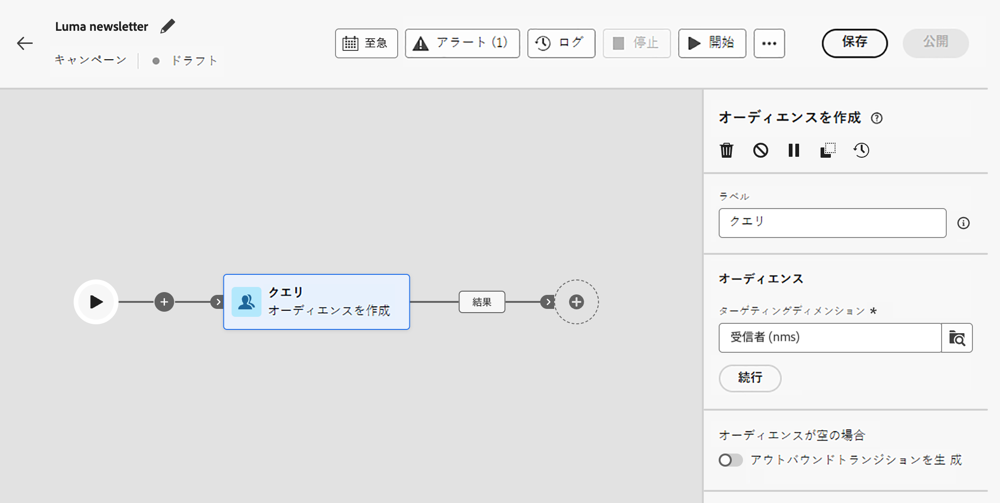
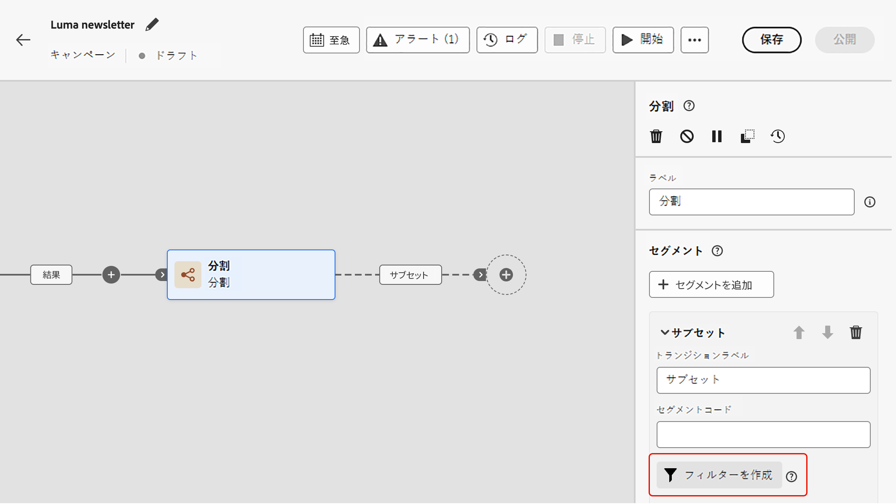
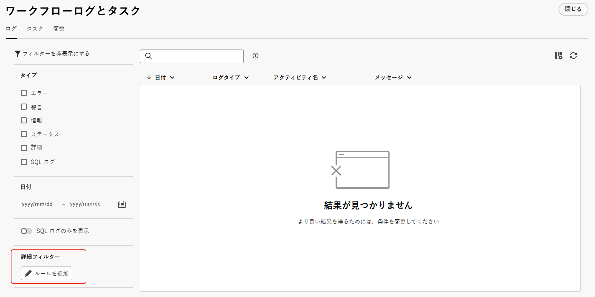

# ルールビルダーの操作 {#orchestrated-rule-builder}

調整されたキャンペーンには、様々な条件に基づいてデータベースをフィルタリングするプロセスを簡素化するルールビルダーが付属しています。ルールビルダーは非常に複雑で長いクエリを効率的に管理し、柔軟性と精度を向上させます。

また、条件内で定義済みフィルターをサポートしているので、包括的なオーディエンスのターゲティングとセグメント化戦略に高度な式と演算子を利用しながら、クエリを簡単に絞り込むことができます。

## ルールビルダーへのアクセス

ルールビルダーは、データをフィルターするルールを定義する必要があるすべてのコンテキストで使用できます。

| 用途 | 例 |
|  ---  |  ---  |
| **オーディエンスを作成**：**[!UICONTROL オーディエンスを作成]**&#x200B;アクティビティを使用して、調整されたキャンペーンのターゲットとして設定する母集団を指定し、ニーズに合わせて新しいオーディエンスを簡単に作成します。[詳しくは、オーディエンスの作成方法を参照してください。](../orchestrated/activities/build-audience.md) | {width="200" align="center" zoomable="yes"} |
| **キャンペーンキャンバスで条件を作成**：特定の要件に合わせて、**[!UICONTROL 分割]**&#x200B;アクティビティを使用してキャンペーンキャンバス内でルールを適用します。[分割アクティビティの使用方法の詳細情報](../orchestrated/activities/split.md) | {width="200" align="center" zoomable="yes"} |
| **詳細フィルターを作成**：キャンペーンログやターゲティングディメンションなどのリストに表示されるデータをフィルターするルールを作成します。 | {width="200" align="center" zoomable="yes"} |

## ルールビルダーインターフェイス {#interface}

ルールビルダーは、クエリを作成する中央のキャンバスと、ルールに関する情報を示すプロパティパネルを提供します。

* **中央のキャンバス**&#x200B;では、ルールを作成する様々なコンポーネントを追加して組み合わせます。[詳しくは、クエリの作成方法を参照してください。](../orchestrated/build-query.md)

* **[!UICONTROL ルールのプロパティ]**&#x200B;パネルには、ルールに関する情報が表示されます。これにより、様々な操作を実行してルールを確認し、ニーズに合うことを確認できます。

  このパネルは、オーディエンスを作成するクエリを作成する際に表示されます。[クエリを確認および検証する方法を学ぶ](build-query.md#check-and-validate-your-query)
