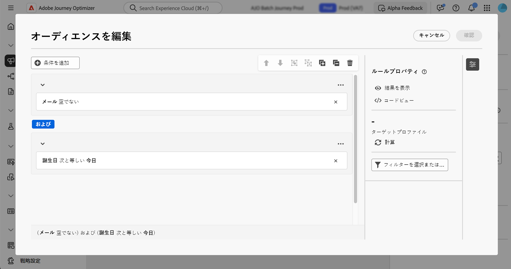

# ルールビルダーの操作 {#orchestrated-rule-builder}

+++ 目次

| 調整されたキャンペーンへようこそ | 最初の調整されたキャンペーンの開始 | データベースのクエリ | キャンペーンアクティビティをキャンセル |
|---|---|---|---|
| [ オーケストレーションされたキャンペーンの基本を学ぶ ](gs-orchestrated-campaigns.md)  [ 設定手順 ](configuration-steps.md)  [ オーケストレーションされたキャンペーンへのアクセスと管理 ](access-manage-orchestrated-campaigns.md) | [ オーケストレーションされたキャンペーンの作成 ](gs-campaign-creation.md)  [ キャンペーンの作成とスケジュール設定 ](create-orchestrated-campaign.md)  [ アクティビティのオーケストレーション ](orchestrate-activities.md)  [ オーケストレーションされたキャンペーンでのメッセージの送信 ](send-messages.md)  [ キャンペーンの開始と監視 ](start-monitor-campaigns.md)  [ レポート ](reporting-campaigns.md) | <b>[ ルールビルダーの操作 ](orchestrated-rule-builder.md)</b>  [ 最初のクエリの作成 ](build-query.md)  [ 式の編集 ](edit-expressions.md) | [ アクティビティの基本を学ぶ ](activities/about-activities.md)   アクティビティ： [AND 結合 ](activities/and-join.md) - [ オーディエンスを作成 ](activities/build-audience.md) - [ ディメンションを変更 ](activities/change-dimension.md) - [ 結合 ](activities/combine.md) - [ 重複排除 ](activities/deduplication.md) - [ エンリッチメント ](activities/enrichment.md) - [ 分岐 ](activities/fork.md) - [ 紐付け ](activities/reconciliation.md) - [ 分割 ](activities/split.md)  - |

{style="table-layout:fixed"}

+++

 

オーケストレートキャンペーンには、様々な条件に基づいてデータベースをフィルタリングするプロセスを簡素化するルールビルダーが付属しています。 ルールビルダーは、非常に複雑で長いクエリを効率的に管理し、柔軟性と精度を向上させます。

また、条件内で定義済みフィルターをサポートしているので、ユーザーは包括的なオーディエンスのターゲティングとセグメント化戦略に高度な式と演算子を利用しながら、クエリを簡単に絞り込むことができます。

## ルールビルダーへのアクセス

ルールビルダーは、**[!UICONTROL オーディエンスを作成]** アクティビティでクエリを作成してオーディエンスをターゲットにする際に使用できます。 ターゲットにする母集団を指定し、ニーズに合わせて新しいオーディエンスを簡単に作成できます。

## ルールビルダーインターフェイス {#interface}

ルールビルダーは、クエリを構築するための中央キャンバスと、ルールに関する情報を提供するプロパティペインを提供します。

* **中央キャンバス** では、様々なコンポーネントを追加および組み合わせてルールを作成します。 [ ルールの作成方法を学ぶ ](../orchestrated/build-query.md)

* **[!UICONTROL ルールのプロパティ]** ペインには、ルールに関する情報が表示されます。 様々な操作を実行してルールを確認し、ニーズに合っていることを確認できます。

  このパネルは、オーディエンスを作成するクエリを作成する際に表示されます。[クエリを確認および検証する方法を学ぶ](build-query.md#check-and-validate-your-query)
