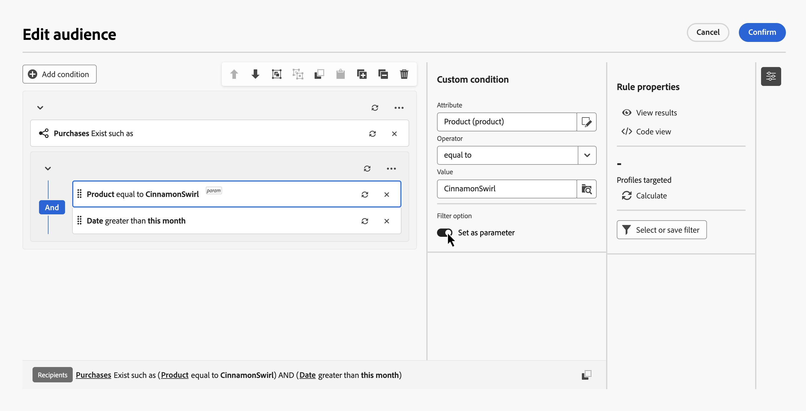
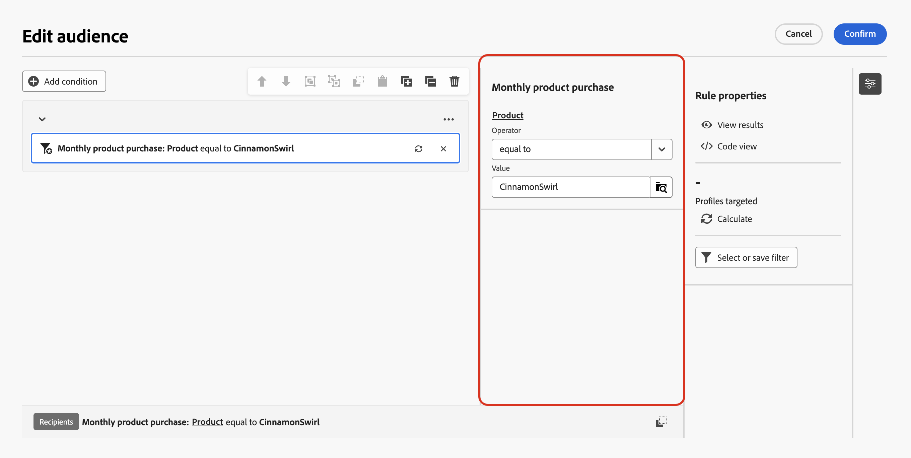
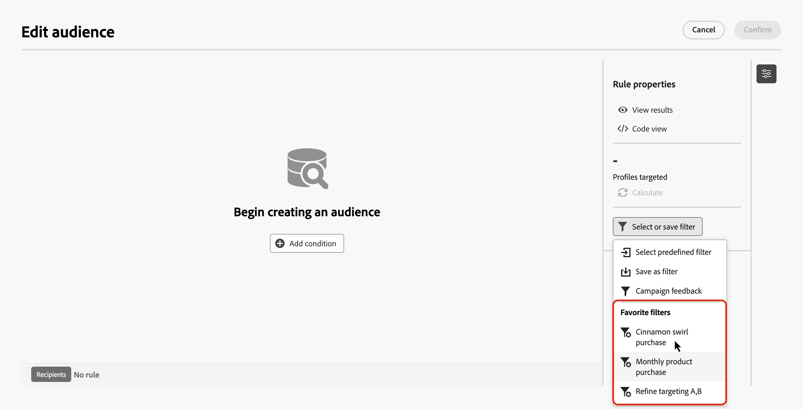
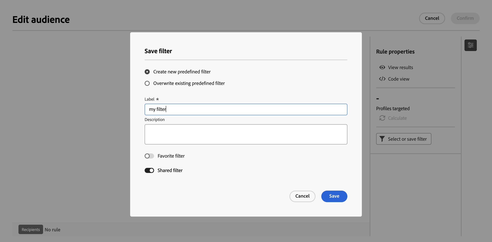

# 定義済みフィルターの操作 {#predefined-filters}

定義済みのフィルターは、ルールビルダーで再利用できるルールとして保存されています。 これにより、一般的なクエリの再構築を回避し、オーケストレーションされたキャンペーンをまたいでターゲティングロジックを標準化できます。

定義済みのフィルターをお気に入りとしてマークしたり、他のユーザーと共有したり、パラメーターを追加したりして、フィルターが適用されたときに選択したフィールドを編集できるようにすることができます。

## 定義済みフィルターの作成 {#create}

ルールビルダーからカスタムフィルターを保存して、後で使用できるようにします。 次の手順に従います。

1. ルールビルダーを開き、フィルター条件を定義します。 [詳しくは、クエリの作成方法を参照してください。](../orchestrated/build-query.md)

1. オプション：フィルターを使用する際に特定のフィールドを編集可能にするには、フィールドを選択し、**[!UICONTROL パラメーターとして設定]**&#x200B;で切り替えます。 フィルターを適用すると、これらのフィールドのみを編集できます。

   

1. フィルターを保存するには、**[!UICONTROL フィルターを選択または保存]**&#x200B;をクリックし、**[!UICONTROL フィルターとして保存]**&#x200B;を選択します。

   

1. フィルターのラベルと説明を入力し、**[!UICONTROL 保存]**&#x200B;をクリックします。

   * フィルターをお気に入りとして保存するには、「**[!UICONTROL お気に入りフィルター]**」オプションをオンに切り替えます。 詳しくは、[この節](#fav-filter)を参照してください。
   * フィルターを他のユーザーがアクセスできるようにするには、**[!UICONTROL 共有フィルター]** オプションを有効にします。 詳しくは、[この節](#share-filter)を参照してください。

   

これで、カスタムフィルターが&#x200B;**定義済みフィルター**&#x200B;リストに表示されるようになりました。

## ルールでの定義済みフィルターの使用 {#apply}

定義済みフィルターは、ルールビルダーでクエリを定義するときに使用できます。

1. **[!UICONTROL ルールのプロパティ]** ペインで、**[!UICONTROL フィルターを選択または保存]**&#x200B;をクリックします。

1. **[!UICONTROL 定義済みフィルターを選択]**&#x200B;し、フィルターを選択します。 リストからお気に入りに追加された定義済みフィルターを直接選択することもできます。

   

   >[!IMPORTANT]
   >
   >定義済みフィルターを選択すると、キャンバスに組み込まれたルールが、選択したフィルターに置き換えられます。

1. フィルターがカンバスで開きます。 必要に応じて条件の編集を続行します。

   

   選択したフィルターにパラメーターが含まれている場合は、パラメーターとしてマークされたフィールドのみを編集できます。 **[!UICONTROL ルールのプロパティ]** ペインの横にあるペインに表示されます。

   

   定義済みのフィルター自体を編集するには、 ボタンをクリックし、**[!UICONTROL ルール編集に切り替え]**&#x200B;を選択します。 すべての変更は、構築する現在のルールにのみ適用されます。 定義済みフィルターは変更されません。

   

## フィルターをお気に入りとして保存 {#fav-filter}

定義済みフィルターを作成する場合は、**[!UICONTROL お気に入りフィルター]** オプションを有効にして、この定義済みフィルターをお気に入りに表示します。

フィルターがお気に入りとして保存されると、次に示すように、フィルターリストの&#x200B;**[!UICONTROL お気に入りフィルター]** セクションに表示されます。

## 定義済みフィルターの共有 {#share-filter}

デフォルトでは、作成した定義済みフィルターは非公開であり、自分にしか表示されません。 組織内の他のオペレーターがフィルターにアクセスできるようにするには、「**[!UICONTROL 共有フィルター]**」オプションを有効にします。

共有フィルターは、すべてのユーザーに対して事前に定義されたフィルターリストに表示され、ユーザーは独自のルールでこれらのフィルターを使用できます。

## 定義済みフィルターの管理 {#manage-predefined-filter}

定義済みフィルターを編集または削除するには、次の手順に従います。

1. ルールのビルドで「**[!UICONTROL フィルターを選択または保存]**」ボタンを使用して、定義済みのフィルターリストを開きます。

1. フィルターの横にある ボタンを選択し、目的のアクションを選択します。

