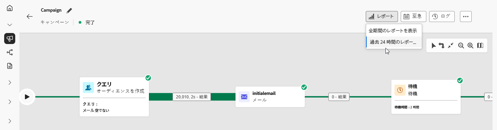

# 調整されたキャンペーンレポート {#report-campaigns}

+++ 目次

| 調整されたキャンペーンへようこそ | 最初の調整されたキャンペーンの開始 | データベースのクエリ | 調整されたキャンペーンアクティビティ |
|---|---|---|---|
| [ オーケストレーションされたキャンペーンの基本を学ぶ ](gs-orchestrated-campaigns.md)  [ 設定手順 ](configuration-steps.md)  [ オーケストレーションされたキャンペーンへのアクセスと管理 ](access-manage-orchestrated-campaigns.md) | [ キャンペーンの作成を調整するための主な手順 ](gs-campaign-creation.md)  [ キャンペーンの作成およびスケジュール設定 ](create-orchestrated-campaign.md)  [ アクティビティの調整 ](orchestrate-activities.md)  [ キャンペーンの開始および監視 ](start-monitor-campaigns.md)  <b>[ レポート ](reporting-campaigns.md)<b> | [ ルールビルダーの操作 ](orchestrated-rule-builder.md)  [ 最初のクエリの作成 ](build-query.md)  [ 式の編集 ](edit-expressions.md)  [ リターゲティング ](retarget.md) | [ アクティビティの基本を学ぶ ](activities/about-activities.md)   アクティビティ： [AND 結合 ](activities/and-join.md) - [ オーディエンスを作成 ](activities/build-audience.md) - [ ディメンションの変更 ](activities/change-dimension.md) - [ チャネルアクティビティ ](activities/channels.md) - [ 結合 ](activities/combine.md) - [ 重複排除 ](activities/deduplication.md) - [ エンリッチメント ](activities/enrichment.md) - [ 分岐 ](activities/fork.md) - [ 紐付け ](activities/reconciliation.md) [&#128279;](activities/save-audience.md) [&#128279;](activities/split.md) [&#128279;](activities/wait.md) - |

{style="table-layout:fixed"}

+++

 

調整されたキャンペーンは、その堅牢なレポート機能を通じて、実用的なインサイトを提供します。 これらのインサイトは、オーディエンスの行動をより深く理解し、カスタマージャーニーの各ステップのパフォーマンスを測定し、今後のキャンペーンを最適化するためのデータ駆動型の決定を行うのに役立ちます。 詳細な指標とビジュアライゼーションを使用すると、エンゲージメントを追跡し、ターゲティング戦略を微調整して、最大の効果を得ることができます。

## レポートのタイプ {#reporting-types}

<table style="table-layout:auto; width: 100%; border-collapse: collapse;">
  <tbody>
    <tr>
      <td></td>
      <td>
        <b> ライブレポート </b> を使用し、オーケストレーションしたキャンペーンの影響とパフォーマンスを組み込みダッシュボードでリアルタイムに測定および視覚化します。 調整したキャンペーンが <b> 過去 24 時間のレポートを表示 </b> メニューから実行されるとすぐに、<b> ライブレポート </b> でデータを入手できます。 ライブレポートについて詳しくは、<a href="../reports/live-report.md">この節</a>を参照してください。
      </td>
         
    </tr>
    <tr style="background-color: #FFFFFF;">
      <td></td>
      <td>
        <b> 常時レポート </b> は、Customer Journey Analyticsの機能と完全に統合されており、両方のプラットフォームでレポートを標準化し、データの一貫性と信頼性を向上させます。 すべての時間レポートについて詳しくは <a href="../reports/report-gs-cja.md"> この節 </a> を参照してください。
      </td>
    </tr>
  </tbody>
</table>

## チャネルレポートの詳細

<table style="table-layout:fixed"><tr style="border: 0; text-align: center;" >
<td> <a href="../reports/campaign-global-report-cja-email.md"><strong>メールレポート</strong></a></td>
<td> <a href="../reports/campaign-global-report-cja-sms.md"><strong>SMS レポート</strong></a></td>
<td><a href="../reports/campaign-global-report-cja-push.md"><strong>プッシュレポート</strong></a></td>
</tr></table>

