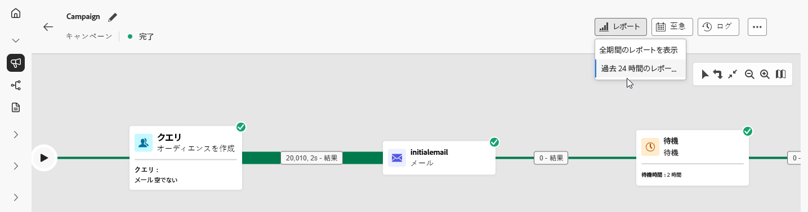
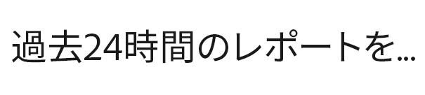
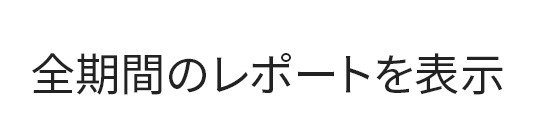

# 調整されたキャンペーンレポート {#report-campaigns}

調整されたキャンペーンでは、堅牢なレポート機能を通じて実用的なインサイトを提供します。 これらのインサイトは、オーディエンスの行動をより深く理解し、カスタマージャーニーの各ステップのパフォーマンスを測定し、データ駆動型の決定を行って今後のキャンペーンを最適化するのに役立ちます。 詳細な指標とビジュアライゼーションにより、エンゲージメントを追跡し、ターゲティング戦略を微調整して最大限の効果を得ることができます。

## レポートのタイプ {#reporting-types}

<table style="table-layout:auto; width: 100%; border-collapse: collapse;">
  <tbody>
    <tr>
      <td></td>
      <td>
        <b> ライブレポート </b>を使用して、オーケストレーションされたキャンペーンの影響とパフォーマンスをリアルタイムで測定し、組み込みのダッシュボードで視覚化します。オーケストレーションされたキャンペーンが<b>過去24時間レポートを表示</b> メニューから実行されると、データは<b> ライブレポート </b>で利用できるようになります。ライブレポート <a href="../reports/live-report.md">について詳しくは、この節</a>を参照してください。
      </td>
         
    </tr>
    <tr style="background-color: #FFFFFF;">
      <td></td>
      <td>
        <b>すべての時間レポート </b>は、Customer Journey Analytics機能と完全に統合されており、両方のプラットフォームでレポートを標準化し、データの一貫性と信頼性を向上させます。すべての時間レポート <a href="../reports/report-gs-cja.md">について詳しくは、この節</a>を参照してください。
      </td>
    </tr>
  </tbody>
</table>

## チャネルレポートの詳細

<table style="table-layout:fixed"><tr style="border: 0; text-align: center;" >
<td> <a href="../reports/campaign-global-report-cja-email.md"><strong>メールレポート</strong></a></td>
<td> <a href="../reports/campaign-global-report-cja-sms.md"><strong>SMS レポート</strong></a></td>
<td><a href="../reports/campaign-global-report-cja-push.md"><strong>プッシュレポート</strong></a></td><td><a href="../reports/campaign-global-report-cja-direct.md"><strong>ダイレクトメールレポート</strong></a></td>
</tr></table>

