# リターゲティングクエリの作成 {#retarget}

+++ 目次

| オーケストレートキャンペーンへようこそ | 初めてのオーケストレートキャンペーンの開始 | データベースのクエリ | 調整されたキャンペーンアクティビティ |
|---|---|---|---|
| [ 調整されたキャンペーンの基本を学ぶ ](gs-orchestrated-campaigns.md)   リレーショナルスキーマとデータセットの作成および管理：  <ul><li>[ スキーマとデータセットの概要 ](gs-schemas.md)</li><li>[ 手動スキーマ ](manual-schema.md)</li><li>[ ファイルアップロードスキーマ ](file-upload-schema.md)</li><li>[ データの取り込み ](ingest-data.md)</li></ul>[ オーケストレートキャンペーンへのアクセスと管理 ](access-manage-orchestrated-campaigns.md)  [ オーケストレートキャンペーンを作成するための主な手順 ](gs-campaign-creation.md) | [キャンペーンの作成とスケジュール](create-orchestrated-campaign.md)  [アクティビティの調整](orchestrate-activities.md)  [キャンペーンの開始と監視](start-monitor-campaigns.md)  [レポート](reporting-campaigns.md) | [ルールビルダーの操作](orchestrated-rule-builder.md)  [最初のクエリの作成](build-query.md)  [式の編集](edit-expressions.md)  <b>[リターゲティング](retarget.md)</b> | [アクティビティの基本を学ぶ](activities/about-activities.md)  アクティビティ： [AND 結合](activities/and-join.md) - [オーディエンスを作成](activities/build-audience.md) - [ディメンションを変更](activities/change-dimension.md) - [チャネルアクティビティ](activities/channels.md) - [結合](activities/combine.md) - [重複排除](activities/deduplication.md) - [エンリッチメント](activities/enrichment.md) - [分岐](activities/fork.md) - [紐付け](activities/reconciliation.md) - [オーディエンスを保存](activities/save-audience.md) - [分割](activities/split.md) - [待機](activities/wait.md) |

{style="table-layout:fixed"}

+++

 

>[!BEGINSHADEBOX]

 

このページのコンテンツは最終的なものではなく、変更される場合があります。

>[!ENDSHADEBOX]

リターゲティングを使用すると、以前のオーケストレーションされたキャンペーンに対する受信者の応答方法に基づいて、受信者をフォローアップできます。 例えば、最初のメールを受信したがクリックしなかった受信者に、2 番目のメールを送信できます。

**[!UICONTROL Orchestrated Campaign]** には、次の 2 つの主な属性があります。

* **[!UICONTROL メッセージフィードバック]**：送信済みメッセージ、開封済みメッセージ、バウンスなど、配信に関連するイベントをキャプチャします。
* **[!UICONTROL メールトラッキング]**：ユーザーのアクション（クリック数や開封数など）をキャプチャします。

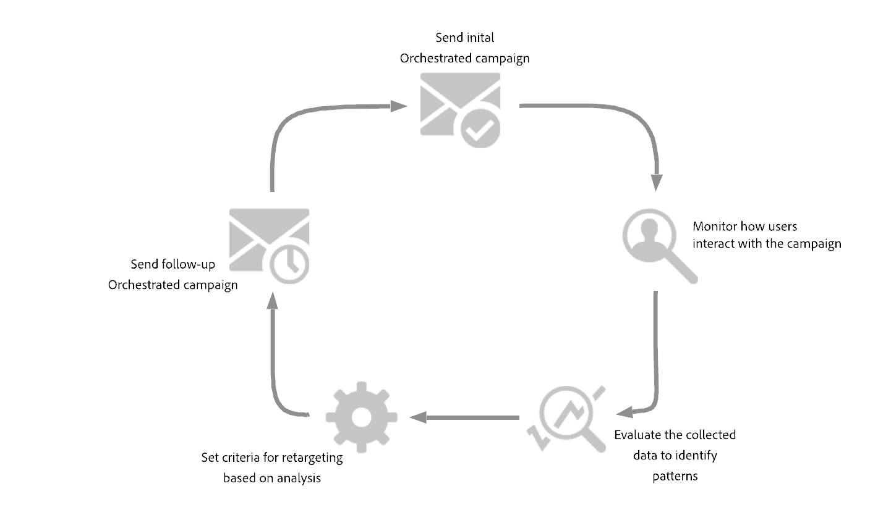{zoomable="yes"}

## フィードバックベースのリターゲティングルールの作成 {#feedback-retarget}

フィードバックベースのリターゲティングルールを使用すると、「**[!UICONTROL メッセージフィードバック]**」属性に取り込まれたメッセージ配信イベントに基づいて、受信者をリターゲットできます。 これらのイベントには、メッセージが送信される、開かれる、バウンスされる、スパムと見なされるなどの結果が含まれます。

このデータを使用すると、特定の配信ステータスに基づいたフォローアップ通信を可能にする、以前のメッセージを受信した受信者を識別するルールを定義できます。

1. 新しい **[!UICONTROL オーケストレートキャンペーン]** を作成します。

1. **[!UICONTROL オーディエンスを作成]** アクティビティを追加し、ターゲティングディメンションを **[!UICONTROL 受信者（caas）]** に設定します。

1. **[!UICONTROL ルールビルダー]** で **[!UICONTROL 条件を追加]** をクリックし、**[!UICONTROL 属性ピッカー]** から **[!UICONTROL メッセージフィードバック]** を選択します。 「**[!UICONTROL 確認]**」をクリックして、**メッセージフィードバックが存在する** 条件を作成します。

   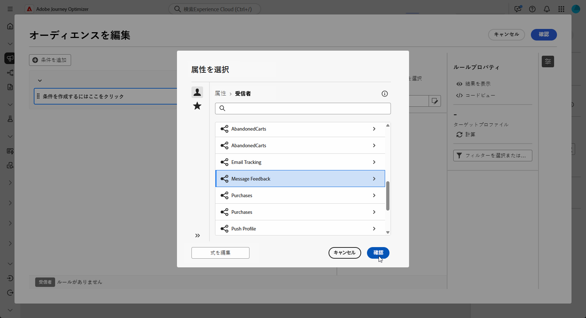{zoomable="yes"}

1. **[!UICONTROL フィードバックステータス]** 属性を選択して、メッセージ配信イベントをターゲットにします。

+++ 詳細な手順

   1. **[!UICONTROL メッセージフィードバック]** 属性にリンクされた別の条件を追加します。

   1. **[!UICONTROL フィードバックステータス]** 属性を検索して、「**[!UICONTROL 確認]**」をクリックします。

      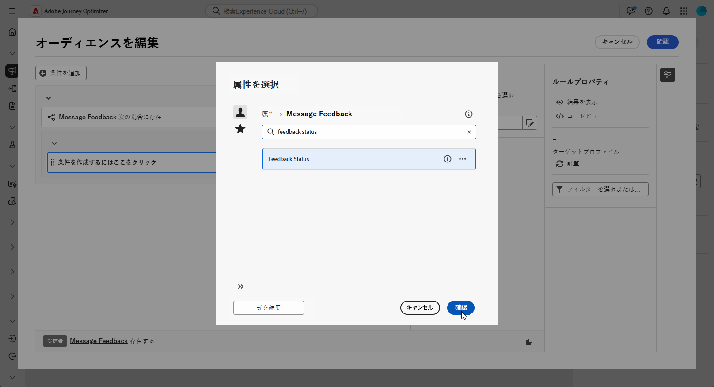{zoomable="yes"}

   1. **[!UICONTROL カスタム条件]** メニューの **[!UICONTROL 値]** ドロップダウンで、追跡する配信ステータスを選択します。

      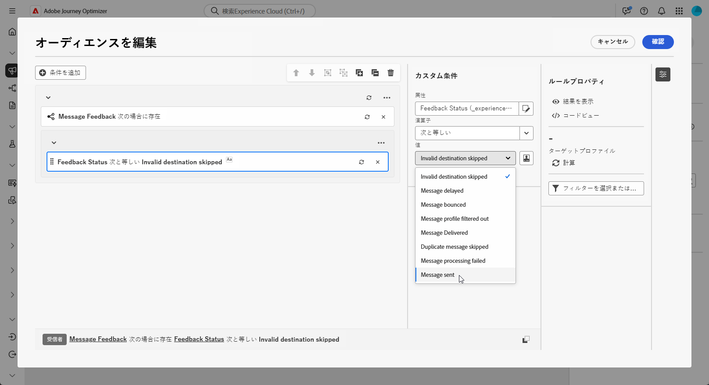{zoomable="yes"}

+++

1. **[!UICONTROL オーケストレートキャンペーン名]** 属性を選択して、特定のオーケストレートキャンペーンをターゲットにします。

+++ 詳細な手順

   1. **[!UICONTROL メッセージフィードバック]** 属性にリンクされた別の条件を追加し、**[!UICONTROL エンティティ]** を検索して、次に移動します。

      `_experience > CustomerJourneyManagement > Entities > AJO Orchestrated Campaign entity`。

   1. **[!UICONTROL オーケストレーションされたキャンペーン名]** を選択します。

      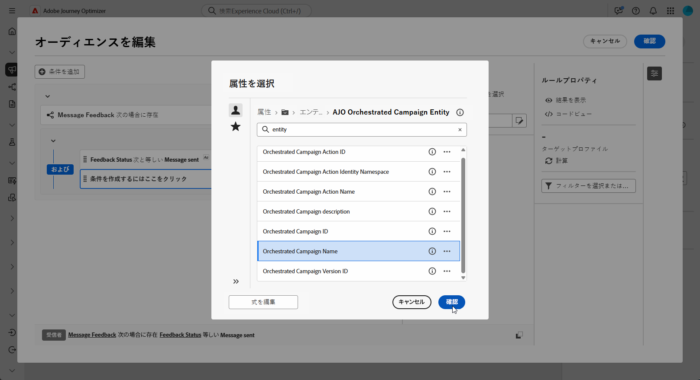{zoomable="yes"}

   1. **[!UICONTROL カスタム条件]** メニューの **[!UICONTROL 値]** フィールドでキャンペーン名を指定します。

+++

1. **[!UICONTROL オーケストレートキャンペーンアクション名]** 属性を選択して、オーケストレートキャンペーン内の特定のメッセージまたはアクティビティをターゲットにします。

+++ 詳細な手順

   1. **[!UICONTROL メッセージフィードバック]** 属性にリンクされた別の条件を追加し、**[!UICONTROL エンティティ]** を検索して、次に移動します。

      `_experience > CustomerJourneyManagement > Entities > AJO Orchestrated Campaign entity`。

   1. **[!UICONTROL オーケストレーションされたキャンペーンアクション名]** を選択します。

      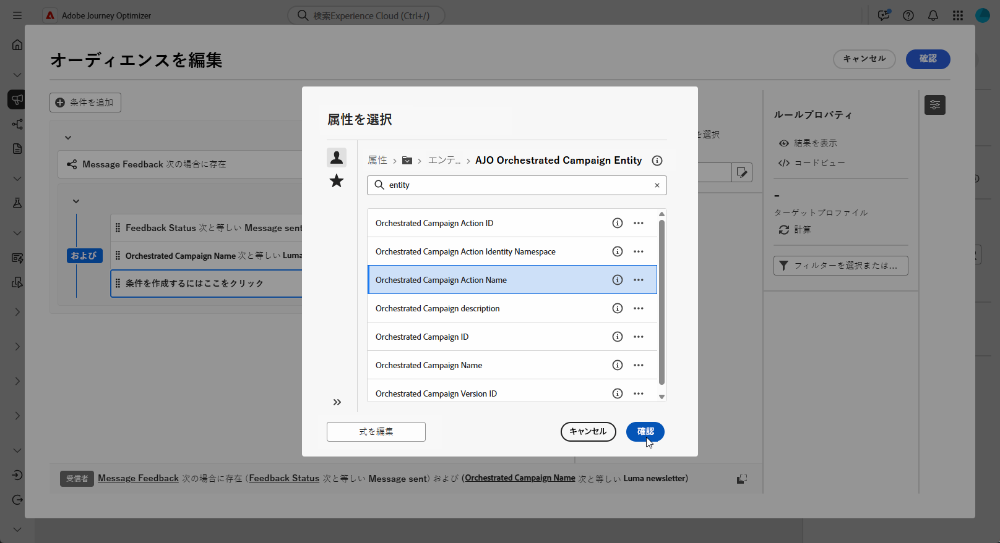{zoomable="yes"}

   1. **[!UICONTROL カスタム条件]** メニューの **[!UICONTROL 値]** フィールドでキャンペーンアクション名を指定します。

      アクション名は、アクティビティのラベルフィールドの横にある  をクリックすると見つかります。

+++

1. または、Campaign のプロパティにある **[!UICONTROL キャンペーン ID]** （UUID）でフィルタリングすることもできます。

フィードバックベースのリターゲティングルールを設定して、送信済み、開封、バウンス、スパムとしてマークなど、以前のメッセージの配信ステータスに基づいて受信者を識別できるようになりました。 このオーディエンスを定義すると、フォローアップメールを追加したり、ユーザーインタラクションデータを使用する [ トラッキングベースのリターゲティングルールを設定 ](#tracking-based) してターゲティングをさらに絞り込んだりできます。

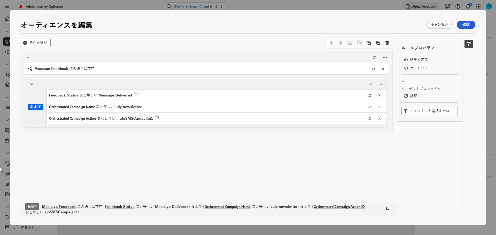{zoomable="yes"}

## トラッキングベースのリターゲティングルールを作成 {#tracking-based}

トラッキングベースのリターゲティングルールでは、**[!UICONTROL メールトラッキング]** 属性からのデータを使用して、メッセージとのインタラクションに基づいて受信者をターゲットに設定します。 メールの開封数やリンクのクリック数など、ユーザーのアクションをキャプチャします。

メッセージのインタラクション（開く、クリックなど）に基づいて受信者を再ターゲットするには、次のように **[!UICONTROL メールトラッキング]** エンティティを使用します。

1. 新しい **[!UICONTROL オーケストレートキャンペーン]** を作成します。

1. **[!UICONTROL オーディエンスを作成]** アクティビティを追加し、ターゲティングディメンションを **[!UICONTROL 受信者（caa）]** に設定して、以前のオーケストレーションされたキャンペーン受信者に焦点を当てます。

1. **[!UICONTROL ルールビルダー]** で「**[!UICONTROL 条件を追加]**」をクリックし、**[!UICONTROL 属性ピッカー]** から **[!UICONTROL メールトラッキング]** を選択します。

   「**[!UICONTROL 確認]**」をクリックして、**メールトラッキングが存在する** 条件を作成します。

   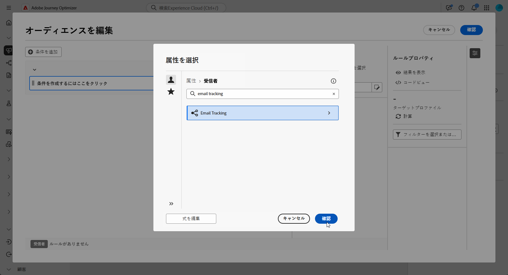{zoomable="yes"}

1. 受信者のメッセージとのインタラクションをターゲットするには、**[!UICONTROL メールトラッキング]** 属性にリンクされた別の条件を追加し、**[!UICONTROL インタラクションタイプ]** 属性を検索します。

   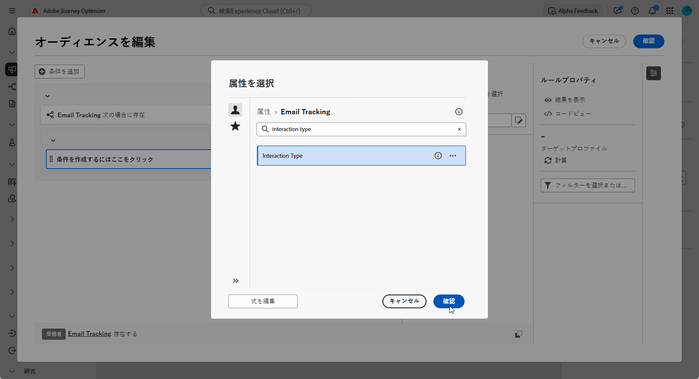{zoomable="yes"}

1. カスタム条件オプションから、「**[!UICONTROL 次に含む]**」を演算子として使用し、ユースケースに応じて 1 つ以上の値を選択します（例：**[!UICONTROL メッセージが開封されました]** または **[!UICONTROL メッセージリンクがクリックされました]**。

   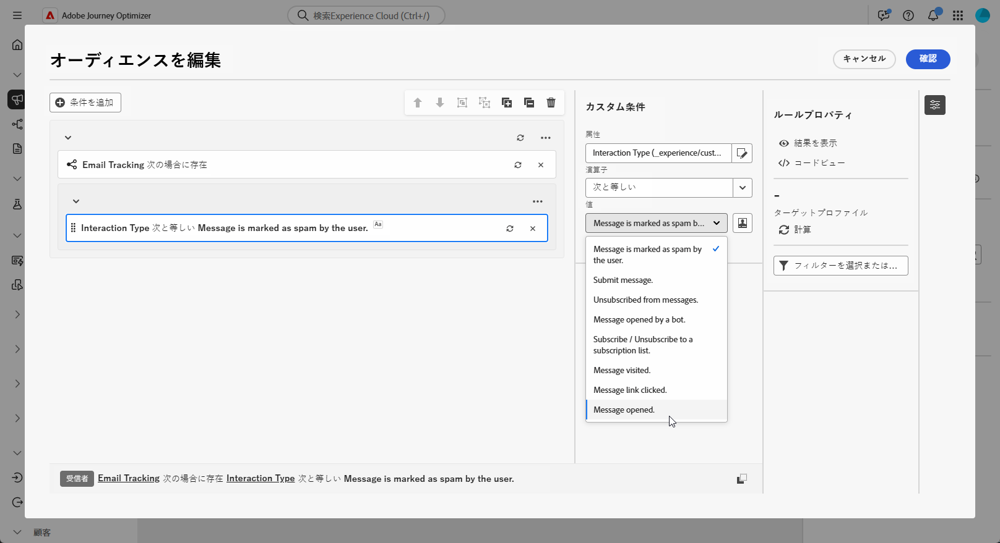{zoomable="yes"}

**[!UICONTROL メールトラッキング]** 属性からのデータを使用して、メールの開封数やリンククリック数など、以前のメッセージとのインタラクションに基づいて受信者をターゲットにする、トラッキングベースのリターゲティングルールを設定しました。 このオーディエンスを定義すると、フォローアップアクションを追加したり、[ フィードバックベースのリターゲティングルール ](#feedback-retarget) と組み合わせてターゲティングをさらに絞り込んだり、送信済み、バウンス、スパムとマークされたメッセージ結果を含めたりできます。

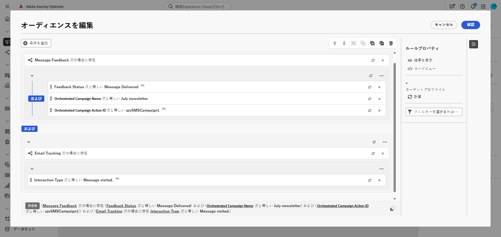{zoomable="yes"}
