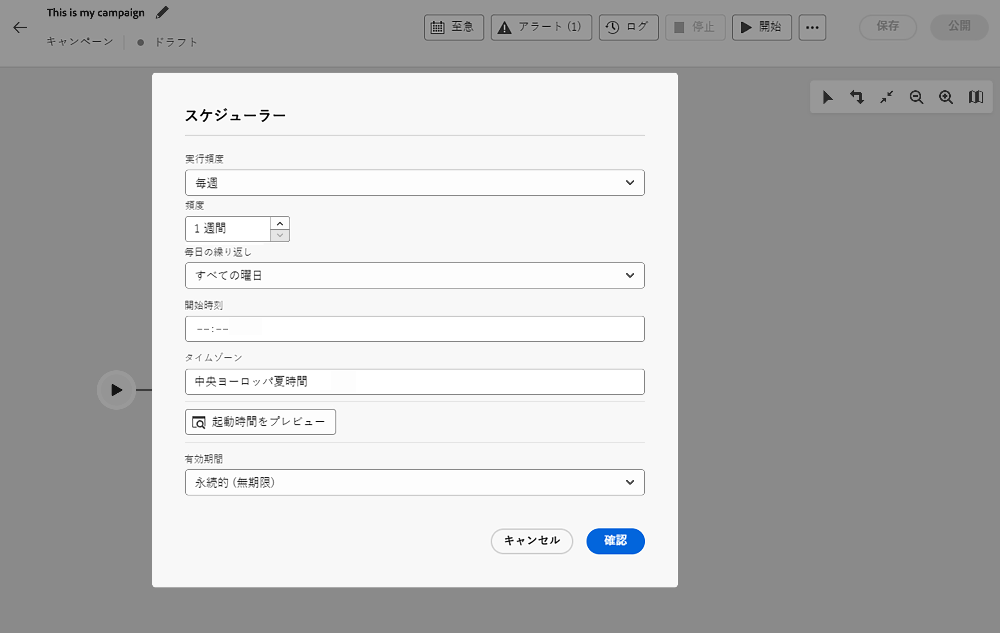
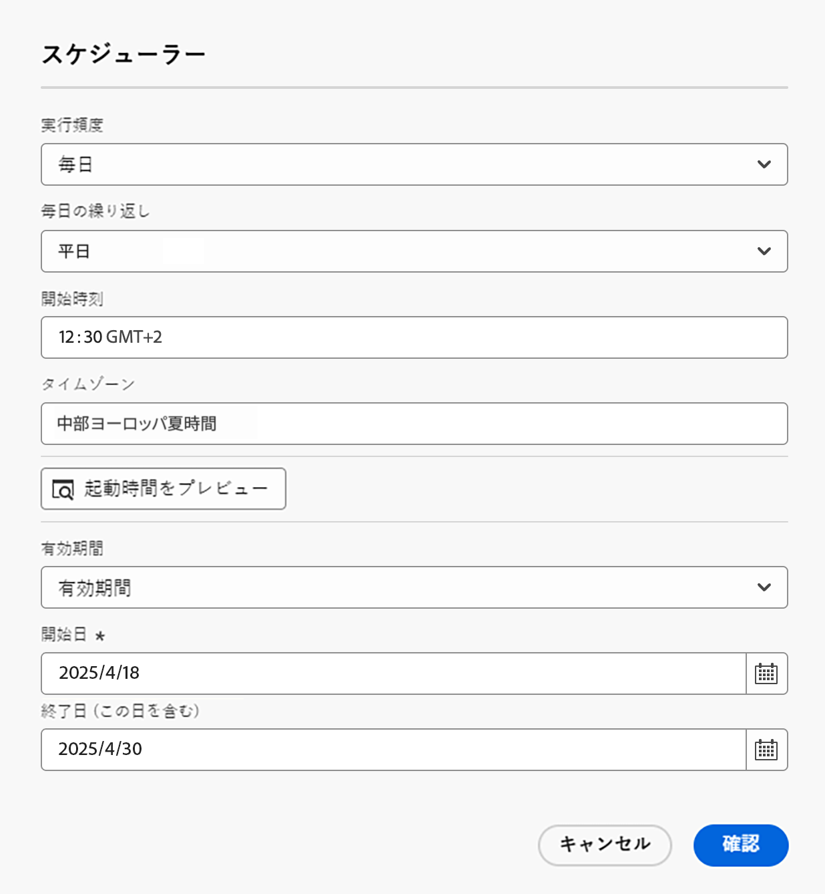
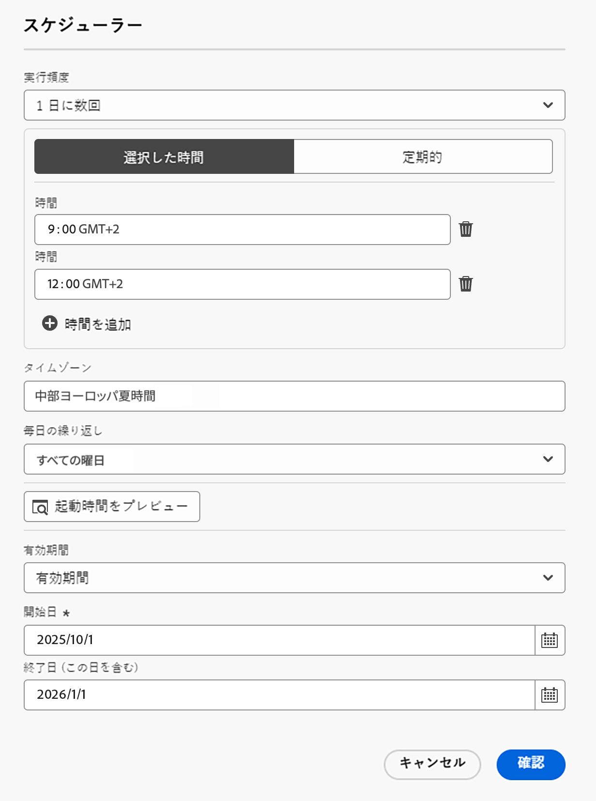

# 調整されたキャンペーンのスケジュール作成と開始 {#start-monitor}

>[!CONTEXTUALHELP]
>id="ajo_campaign_publication"
>title="調整されたキャンペーンの公開"
>abstract="キャンペーンを開始するには、公開する必要があります。公開前に、すべての警告がクリアされていることを確認します。"

+++ 目次

| 調整されたキャンペーンへようこそ | 最初の調整されたキャンペーンの開始 | データベースのクエリ | キャンペーンアクティビティをキャンセル |
|---|---|---|---|
| [ オーケストレーションされたキャンペーンの基本を学ぶ ](gs-orchestrated-campaigns.md)  [ 設定手順 ](configuration-steps.md) &lt;br/[ オーケストレーションされたキャンペーンへのアクセスと管理 ](access-manage-orchestrated-campaigns.md) | [ オーケストレーションされたキャンペーンの作成 ](gs-campaign-creation.md)  [ キャンペーンの作成とスケジュール設定 ](create-orchestrated-campaign.md)  [ アクティビティのオーケストレーション ](orchestrate-activities.md)  [ オーケストレーションされたキャンペーンでのメッセージの送信 ](send-messages.md)  <b>[ キャンペーンの開始と監視 ](start-monitor-campaigns.md)</b>  [ レポート ](reporting-campaigns.md) | [ ルールビルダーの操作 ](orchestrated-rule-builder.md)  [ 最初のクエリの作成 ](build-query.md)  [ 式の編集 ](edit-expressions.md) | [ アクティビティの基本を学ぶ ](activities/about-activities.md)   アクティビティ： [AND 結合 ](activities/and-join.md) - [ オーディエンスを作成 ](activities/build-audience.md) - [ ディメンションを変更 ](activities/change-dimension.md) - [ 結合 ](activities/combine.md) - [ 重複排除 ](activities/deduplication.md) - [ エンリッチメント ](activities/enrichment.md) - [ 分岐 ](activities/fork.md) - [ 紐付け ](activities/reconciliation.md) - [ 分割 ](activities/split.md)  - |

{style="table-layout:fixed"}

+++

 

キャンバスで実行するタスクを調整および設計して作成したら、そのタスクを公開し、実行方法を監視できます。

## 調整されたキャンペーンのスケジュール {#schedule}

>[!CONTEXTUALHELP]
>id="ajo_orchestration_scheduler"
>title="スケジューラーアクティビティ"
>abstract="**スケジューラー**&#x200B;キャンペーンを使用すると、調整されたキャンペーンの開始日時のスケジュールを設定できます。このアクティビティはスケジュール済みの開始として考慮する必要があります。それは調整されたキャンペーンの最初のアクティビティとしてのみ使用できます。"

キャンペーンマネージャーは、キャンペーンを特定の時間に自動的に開始するようにスケジュールして、マーケティングコミュニケーション用の正確なタイミングと正確なターゲティングデータを可能にします。

### ベストプラクティス {#scheduler-best-practices}

* システム全体のパフォーマンスが落ちたり、データベースにブロックが作成されたりする可能性があるので、調整されたキャンペーンの実行スケジュールは 15 分以上の間隔を空けてください。
* オーケストレートキャンペーンでワンショットメッセージを送信する場合は、**1 回** を実行するように設定できます。
* オーケストレーションされたキャンペーンで繰り返しメッセージを送信する場合は、**スケジュール** オプションを使用し、実行頻度を設定する必要があります。 繰り返し配信アクティビティでは、スケジュールを定義できません。

### キャンペーンスケジュールの設定 {#scheduler-configuration}

>[!CONTEXTUALHELP]
>id="ajo_orchestration_schedule_validity"
>title="スケジューラーの有効性"
>abstract="スケジューラーの有効期間を定義できます。永続的（デフォルト）にすることも、特定の日付まで有効にすることもできます。"

>[!CONTEXTUALHELP]
>id="ajo_orchestration_schedule_options"
>title="スケジューラーオプション"
>abstract="スケジューラーの頻度を定義します。特定の時点で、1 日、1 週間、1 か月に 1 回または数回実行できます。"

**調整されたキャンペーンスケジュール** を設定するには、次の手順に従います。

1. 調整したキャンペーンキャンバスの上部にある「**できるだけ早く**」ボタンを選択します。

1. **実行頻度**&#x200B;を設定します。

   * **1 回**：オーケストレーションされたキャンペーンは 1 回実行されます。

   * **毎日**：オーケストレーションされたキャンペーンは、1 日に 1 回、特定の時間に実行されます。

   * **1 日に数回：** 調整されたキャンペーンは、1 日に数回、定期的に実行されます。 特定の時間を指定するか、定期的に実行されるように設定できます。

   * **毎週**：オーケストレーションされたキャンペーンは、週に 1 回または数回、指定した時点で実行されます。

   * **毎月**：調整されたキャンペーンは、指定した時点、月に 1 回または数回だけ実行されます。 オーケストレーションされたキャンペーンを実行する必要がある場合は、月を選択できます。 月の第 2 火曜日など、月の特定の曜日に実行を設定することもできます。

     {width="50%" align="left"}

1. 選択した頻度に従って実行の詳細を定義します。詳細フィールドは、使用される頻度（時間、繰り返し頻度、指定された日数など）によって異なります。

1. 「**ローンチ時間をプレビュー**」をクリックして、オーケストレーションされたキャンペーンの次の 10 回の実行のスケジュールを確認します。

1. スケジューラーの有効期間を定義します。

   * **永続的（有効期限なし）**：指定された頻度に従って、オーケストレーションされたキャンペーンが、時間枠や繰り返し回数に制限なく実行されます。

   * **有効期限**：指定された頻度に従って、特定の日付までオーケストレーションされたキャンペーンが実行されます。 開始日と終了日を指定する必要があります。

1. 「**確認**」を選択して設定を保存します。 実行頻度は、調整されたキャンペーンキャンバスの上に表示されます。

>[!TIP]
>
>調整したキャンペーンをすぐに開始する場合は、**できるだけ早く** デフォルト値をそのまま使用します。

### 例 {#scheduler-example}

次の例では、調整されたキャンペーンが 1 日 2 回、2025 年 10 月 1 日～2026 年 1 月 1 日、毎日午前 9 時と午前 12 時に実行されるようにアクティビティを設定します。

{width="50%" align="left"}

## 調整されたキャンペーンの開始 {#start}

オーケストレーションされたキャンペーンを開始するには、**[!UICONTROL キャンペーン]** メニューの **[!UICONTROL オーケストレーション]** タブに移動し、開始するキャンペーンを選択して、キャンバスの右上隅にある **[!UICONTROL 再生]** ボタンをクリックします。

オーケストレーションされたキャンペーンが実行されると、オーケストレーションされたキャンペーンの終了に達するまで、キャンバス内の各アクティビティが順番に実行されます。

視覚的なフローを使用すると、ターゲットプロファイルの進行状況をリアルタイムで追跡できます。これにより、各アクティビティのステータスと、アクティビティ間で移行中のプロファイルの数をすばやく識別できます。

{zoomable="yes"}

調整されたキャンペーンでは、トランジションを通じてあるアクティビティから別のアクティビティに移されたデータは、一時的なワークテーブルに保存されます。 このデータは、トランジションごとに表示できます。これを行うには、トランジションを選択して、画面の右側でそのプロパティを開きます。

* 「**[!UICONTROL スキーマをプレビュー]**」をクリックして、作業用テーブルのスキーマを表示します。
* 「**[!UICONTROL 結果をプレビュー]**」をクリックして、選択したトランジションで転送されたデータを視覚化します。

{zoomable="yes"}

## キャンペーンの実行の監視

### アクティビティ実行を監視 {#activities}

各アクティビティボックスの右上隅にある視覚的な指標を使用すると、アクティビティの実行を確認できます。

| 視覚的な指標 | 説明 |
|-----|------------|
| {zoomable="yes"}{width="70%"} | このアクティビティは現在実行中です。 |
| {zoomable="yes"}{width="70%"} | このアクティビティには注意が必要です。これには、配信の送信確認や、必要なアクションの実行が含まれる場合があります。 |
| {zoomable="yes"}{width="70%"} | アクティビティでエラーが発生しました。この問題を解決するには、調整されたキャンペーンログを開いて詳細を確認します。 |
| {zoomable="yes"}{width="70%"} | アクティビティが正常に実行されました。 |

### ログとタスクを監視 {#logs-tasks}

>[!CONTEXTUALHELP]
>id="ajo_campaign_logs"
>title="ログとタスク"
>abstract="**ログとタスク**&#x200B;画面には、調整されたキャンペーンの実行履歴が表示され、すべてのユーザーのアクションと発生したエラーが記録されます。"

ログとタスクの監視は、調整されたキャンペーンを分析し、それらが正しく実行されていることを確認するための重要な手順です。 これらには、アクションツールバーと各アクティビティのプロパティパネルにある「**[!UICONTROL ログ]**」アイコンからアクセスできます。

**[!UICONTROL ログとタスク]** メニューには、オーケストレーションされたキャンペーンの実行履歴が表示され、すべてのユーザーのアクションと発生したエラーが記録されます。

{zoomable="yes"}

次の 2 種類の情報を使用できます。

* 「**[!UICONTROL ログ]**」タブには、オーケストレーションされたすべてのキャンペーンアクティビティの実行履歴が含まれます。 実行された操作と実行エラーのインデックスを時系列順に作成します。
* 「**[!UICONTROL タスク]**」タブでは、アクティビティの実行順序の詳細が表示されます。

両方のタブで、表示される列とその順序を選択し、フィルターを適用し、検索フィールドを使用して目的の情報をすばやく見つけることができます。

## 調整されたキャンペーン実行コマンド {#execution-commands}

右上隅のアクションバーには、調整されたキャンペーンの実行を管理できるコマンドが用意されています。 実行できる操作は、次のとおりです。

* **[!UICONTROL 開始]** / **[!UICONTROL 再開]** の実行   キャンペーンを調整すると、進捗ステータスになります。 オーケストレーションされたキャンペーンが一時停止した場合は再開されます。それ以外の場合は、キャンペーンが開始され、初期のアクティビティがアクティブ化されます。

* **[!UICONTROL 一時停止]** オーケストレーションされたキャンペーンの実行。一時停止のステータスになります。 ワークフローが再開されるまでは新しいアクティビティは有効化されません。ただし、進行中の操作は中断されません。

* **[!UICONTROL 停止]** 実行中のオーケストレーションされたキャンペーン。その後、完了ステータスになります。 進行中の操作は、可能であれば中断されます。オーケストレーションされたキャンペーンを、停止した場所から再開することはできません。
