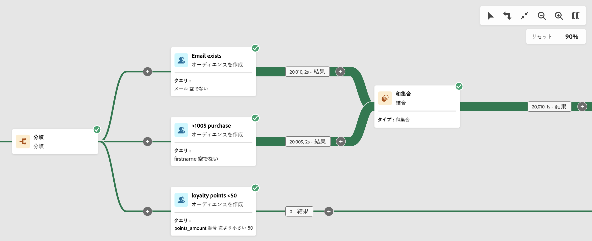
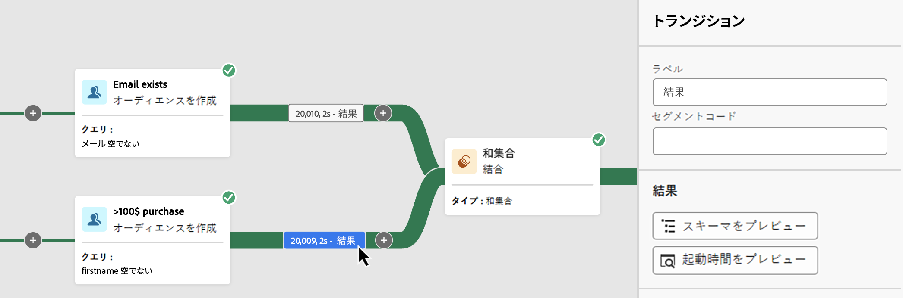
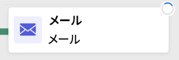
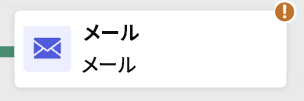
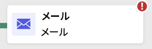
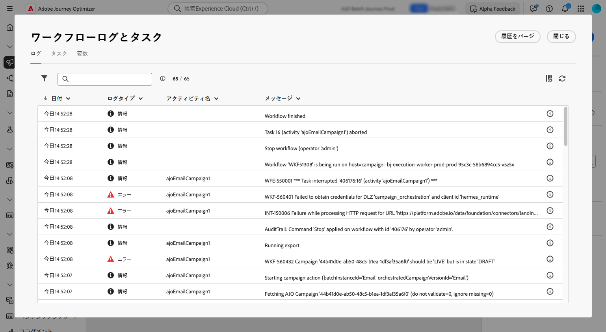

# 調整されたキャンペーンの開始と監視 {#start-monitor}

>[!CONTEXTUALHELP]
>id="ajo_campaign_publication"
>title="調整されたキャンペーンの公開"
>abstract="キャンペーンを開始するには、公開する必要があります。公開前に、すべての警告がクリアされていることを確認します。"

+++ 目次

| 調整されたキャンペーンへようこそ | 最初の調整されたキャンペーンの開始 | データベースのクエリ | 調整されたキャンペーンアクティビティ |
|---|---|---|---|
| [ オーケストレーションされたキャンペーンの基本を学ぶ ](gs-orchestrated-campaigns.md)  [ 設定手順 ](configuration-steps.md) &lt;br/[ オーケストレーションされたキャンペーンへのアクセスと管理 ](access-manage-orchestrated-campaigns.md) | [ オーケストレーションされたキャンペーンの作成 ](gs-campaign-creation.md)  [ キャンペーンの作成とスケジュール設定 ](create-orchestrated-campaign.md)  [ アクティビティのオーケストレーション ](orchestrate-activities.md)  [ オーケストレーションされたキャンペーンでのメッセージの送信 ](send-messages.md)  <b>[ キャンペーンの開始と監視 ](start-monitor-campaigns.md)</b>  [ レポート ](reporting-campaigns.md) | [ ルールビルダーの操作 ](orchestrated-rule-builder.md)  [ 最初のクエリの作成 ](build-query.md)  [ 式の編集 ](edit-expressions.md) | [ アクティビティの基本を学ぶ ](activities/about-activities.md)   アクティビティ： [AND 結合 ](activities/and-join.md) - [ オーディエンスを作成 ](activities/build-audience.md) - [ ディメンションを変更 ](activities/change-dimension.md) - [ 結合 ](activities/combine.md) - [ 重複排除 ](activities/deduplication.md) - [ エンリッチメント ](activities/enrichment.md) - [ 分岐 ](activities/fork.md) - [ 紐付け ](activities/reconciliation.md) - [ 分割 ](activities/split.md)  - |

{style="table-layout:fixed"}

+++

 

キャンバスで実行するタスクを調整および設計して作成したら、そのタスクを公開し、実行方法を監視できます。

## 調整されたキャンペーンの開始 {#start}

オーケストレーションされたキャンペーンを開始するには、**[!UICONTROL キャンペーン]** メニューの **[!UICONTROL オーケストレーション]** タブに移動し、開始するキャンペーンを選択して、キャンバスの右上隅にある **[!UICONTROL 再生]** ボタンをクリックします。

オーケストレーションされたキャンペーンが実行されると、オーケストレーションされたキャンペーンの終了に達するまで、キャンバス内の各アクティビティが順番に実行されます。

視覚的なフローを使用すると、ターゲットプロファイルの進行状況をリアルタイムで追跡できます。これにより、各アクティビティのステータスと、アクティビティ間で移行中のプロファイルの数をすばやく識別できます。

{zoomable="yes"}

調整されたキャンペーンでは、トランジションを通じてあるアクティビティから別のアクティビティに移されたデータは、一時的なワークテーブルに保存されます。 このデータは、トランジションごとに表示できます。これを行うには、トランジションを選択して、画面の右側でそのプロパティを開きます。

* 「**[!UICONTROL スキーマをプレビュー]**」をクリックして、作業用テーブルのスキーマを表示します。
* 「**[!UICONTROL 結果をプレビュー]**」をクリックして、選択したトランジションで転送されたデータを視覚化します。

{zoomable="yes"}

## キャンペーンの実行の監視

### アクティビティ実行を監視 {#activities}

各アクティビティボックスの右上隅にある視覚的な指標を使用すると、アクティビティの実行を確認できます。

| 視覚的な指標 | 説明 |
|-----|------------|
| {zoomable="yes"}{width="70%"} | このアクティビティは現在実行中です。 |
| {zoomable="yes"}{width="70%"} | このアクティビティには注意が必要です。これには、配信の送信確認や、必要なアクションの実行が含まれる場合があります。 |
| {zoomable="yes"}{width="70%"} | アクティビティでエラーが発生しました。この問題を解決するには、調整されたキャンペーンログを開いて詳細を確認します。 |
| {zoomable="yes"}{width="70%"} | アクティビティが正常に実行されました。 |

### ログとタスクを監視 {#logs-tasks}

>[!CONTEXTUALHELP]
>id="ajo_campaign_logs"
>title="ログとタスク"
>abstract="**ログとタスク**&#x200B;画面には、調整されたキャンペーンの実行履歴が表示され、すべてのユーザーのアクションと発生したエラーが記録されます。"

ログとタスクの監視は、調整されたキャンペーンを分析し、それらが正しく実行されていることを確認するための重要な手順です。 これらには、アクションツールバーと各アクティビティのプロパティパネルにある「**[!UICONTROL ログ]**」アイコンからアクセスできます。

**[!UICONTROL ログとタスク]** メニューには、オーケストレーションされたキャンペーンの実行履歴が表示され、すべてのユーザーのアクションと発生したエラーが記録されます。

{zoomable="yes"}

次の 2 種類の情報を使用できます。

* 「**[!UICONTROL ログ]**」タブには、オーケストレーションされたすべてのキャンペーンアクティビティの実行履歴が含まれます。 実行された操作と実行エラーのインデックスを時系列順に作成します。
* 「**[!UICONTROL タスク]**」タブでは、アクティビティの実行順序の詳細が表示されます。

両方のタブで、表示される列とその順序を選択し、フィルターを適用し、検索フィールドを使用して目的の情報をすばやく見つけることができます。

## 調整されたキャンペーン実行コマンド {#execution-commands}

右上隅のアクションバーには、調整されたキャンペーンの実行を管理できるコマンドが用意されています。 実行できる操作は、次のとおりです。

* **[!UICONTROL 開始]** / **[!UICONTROL 再開]** の実行   キャンペーンを調整すると、進捗ステータスになります。 オーケストレーションされたキャンペーンが一時停止した場合は再開されます。それ以外の場合は、キャンペーンが開始され、初期のアクティビティがアクティブ化されます。

* **[!UICONTROL 一時停止]** オーケストレーションされたキャンペーンの実行。一時停止のステータスになります。 ワークフローが再開されるまでは新しいアクティビティは有効化されません。ただし、進行中の操作は中断されません。

* **[!UICONTROL 停止]** 実行中のオーケストレーションされたキャンペーン。その後、完了ステータスになります。 進行中の操作は、可能であれば中断されます。オーケストレーションされたキャンペーンを、停止した場所から再開することはできません。
