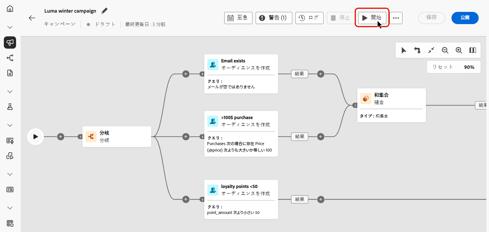
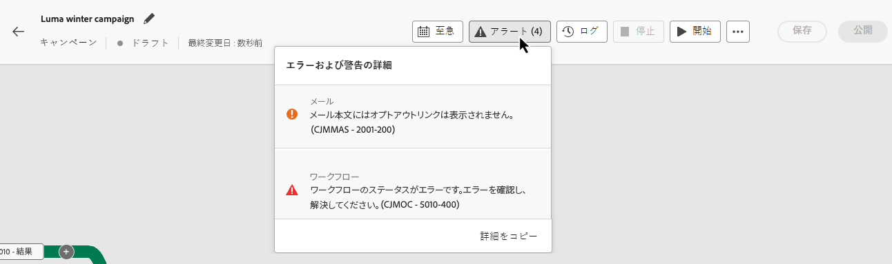
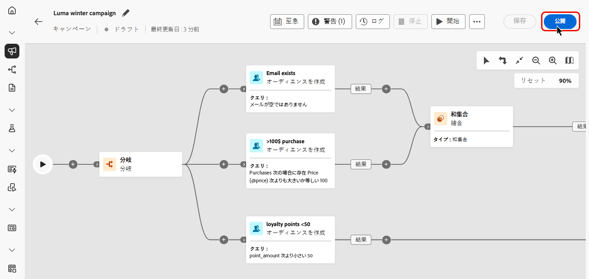

# 調整されたキャンペーンの開始と監視 {#start-monitor}

>[!CONTEXTUALHELP]
>id="ajo_campaign_publication"
>title="調整されたキャンペーンの公開"
>abstract="キャンペーンを開始するには、公開する必要があります。公開前に、すべてのエラーがクリアされていることを確認します。"

+++ 目次

| 調整されたキャンペーンへようこそ | 最初の調整されたキャンペーンの開始 | データベースのクエリ | 調整されたキャンペーンアクティビティ |
|---|---|---|---|
| [ オーケストレーションされたキャンペーンの基本を学ぶ ](gs-orchestrated-campaigns.md)  [ 設定手順 ](configuration-steps.md)  [ オーケストレーションされたキャンペーンへのアクセスと管理 ](access-manage-orchestrated-campaigns.md)  [ オーケストレーションされたキャンペーンを作成するための主な手順 ](gs-campaign-creation.md) | [ キャンペーンの作成とスケジュール設定 ](create-orchestrated-campaign.md)  [ アクティビティのオーケストレーション ](orchestrate-activities.md)  <b>[ キャンペーンの開始と監視 ](start-monitor-campaigns.md)</b>  [ レポート ](reporting-campaigns.md) | [ ルールビルダーの操作 ](orchestrated-rule-builder.md)  [ 最初のクエリの作成 ](build-query.md)  [ 式の編集 ](edit-expressions.md)  [ リターゲティング ](retarget.md) | [ アクティビティの基本を学ぶ ](activities/about-activities.md)   アクティビティ： [AND 結合 ](activities/and-join.md) - [ オーディエンスを作成 ](activities/build-audience.md) - [ ディメンションの変更 ](activities/change-dimension.md) - [ チャネルアクティビティ ](activities/channels.md) - [ 結合 ](activities/combine.md) - [ 重複排除 ](activities/deduplication.md) - [ エンリッチメント ](activities/enrichment.md) - [ 分岐 ](activities/fork.md) - [ 紐付け ](activities/reconciliation.md) [&#128279;](activities/save-audience.md) [&#128279;](activities/split.md) [&#128279;](activities/wait.md) - |

{style="table-layout:fixed"}

+++

 

>[!BEGINSHADEBOX]

ドキュメントを処理中

>[!ENDSHADEBOX]

キャンバスで実行するタスクを調整および設計して作成したら、そのタスクを公開し、実行方法を監視できます。

また、キャンペーンをテストモードで実行して、その実行と様々なアクティビティの結果を確認することもできます。

## 公開前にキャンペーンをテスト {#test}

[!DNL Journey Optimizer] を使用すると、オーケストレーションされたキャンペーンを運用開始前にテストできます。 キャンペーンを作成すると、デフォルトで **ドラフト** 状態になります。 この状態で、キャンペーンを手動で実行して、フローをテストできます。

キャンバス内のすべてのアクティビティは、**[!UICONTROL オーディエンスを保存]** アクティビティとチャネルアクティビティを除いて実行されます。 データやオーディエンスへの機能的な影響はありません。

キャンペーンをテストするには：

1. オーケストレーションされたキャンペーンを開きます。
2. 「**[!UICONTROL 開始]**」をクリックします。

{zoomable="yes"}

キャンペーン内の各アクティビティは、図の最後に達するまで順番に実行されます。

テスト中にキャンバスのアクションバーを使用して、キャンペーンの実行を制御できます。 ここから、次のことができます。

* **停止** 実行はいつでも行います。
* **開始** 実行を再度行います。
* **再開** 問題が原因で以前に実行が一時停止された場合、実行します。

実行中にエラーや警告が発生した場合は、キャンバスツールバーの **[!UICONTROL アラート]**/**[!UICONTROL 警告]** アイコンで通知されます。

{zoomable="yes"}

また、各アクティビティに直接表示される [ 視覚的なステータスインジケーター ](#activities) を使用して、失敗したアクティビティをすばやく識別することもできます。 トラブルシューティングについて詳しくは、[campaign のログ ](#logs-tasks) を開くと、エラーとそのコンテキストに関する詳細が表示されます。

検証が完了したら、キャンペーンを公開できます。

## キャンペーンの公開 {#publish}

キャンペーンがテストされ、準備が整ったら、「**[!UICONTROL 公開]**」をクリックしてライブにします。

{zoomable="yes"}

>[!NOTE]
>
>「**[!UICONTROL 公開]**」ボタンが無効（グレー表示）になっている場合は、アクションバーのログにアクセスし、エラーメッセージを確認します。 キャンペーンを公開するには、すべてのエラーを修正する必要があります。

視覚的なフローが再開し、実際のプロファイルがジャーニーをリアルタイムで流れ始めます。

公開アクションが失敗した場合（メッセージコンテンツが見つからないなど）、警告が表示され、再試行する前に問題を修正する必要があります。 公開が成功すると、キャンペーンは（即時またはスケジュールに従って）実行を開始し、**ドラフト** ステータスから **ライブ** ステータスに移動して、「読み取り専用」になります。

## キャンペーン実行の監視 {#monitor}

### 視覚的なフロー監視 {#flow}

（テストモードまたはライブモードで）実行中、視覚的なフローは、プロファイルがジャーニー内をどのように移動するかをリアルタイムで示します。 タスク間で移行中のプロファイルの数が表示されます。

{zoomable="yes"}

トランジションによって 1 つのアクティビティから別のアクティビティに移されたデータは、一時的なワークテーブルに保存されます。 このデータは、トランジションごとに表示できます。アクティビティ間で渡されるデータを検査するには：

1. トランジションを選択します。
1. プロパティペインで **[!UICONTROL スキーマをプレビュー]** をクリックし、ワークテーブルのスキーマを表示します。 **[!UICONTROL 結果をプレビュー]** を選択して、転送されたデータを表示します。

{zoomable="yes"}

### アクティビティ実行指標 {#activities}

視覚的なステータス指標は、各アクティビティのパフォーマンスを把握するのに役立ちます。

| 視覚的な指標 | 説明 |
|-----|------------|
| {zoomable="yes"}{width="70%"} | このアクティビティは現在実行中です。 |
| {zoomable="yes"}{width="70%"} | このアクティビティには注意が必要です。これには、配信の送信確認や、必要なアクションの実行が含まれる場合があります。 |
| {zoomable="yes"}{width="70%"} | アクティビティでエラーが発生しました。この問題を解決するには、調整されたキャンペーンログを開いて詳細を確認します。 |
| {zoomable="yes"}{width="70%"} | アクティビティが正常に実行されました。 |

### ログとタスク {#logs-tasks}

>[!CONTEXTUALHELP]
>id="ajo_campaign_logs"
>title="ログとタスク"
>abstract="**ログとタスク**&#x200B;画面には、調整されたキャンペーンの実行履歴が表示され、すべてのユーザーのアクションと発生したエラーが記録されます。"

ログとタスクの監視は、調整されたキャンペーンを分析し、それらが正しく実行されていることを確認するための重要な手順です。 ログとタスクには、「**[!UICONTROL ログ]**」ボタンからアクセスできます。このボタンは、キャンバスツールバーのテストモードとライブモードの両方、または各アクティビティのプロパティパネルで使用できます。

**[!UICONTROL ログとタスク]** 画面には、キャンペーンの実行の完全な履歴が表示され、すべてのユーザーのアクションと発生したエラーが記録されます。

{zoomable="yes"}

次の 2 種類の情報を使用できます。

* 「**[!UICONTROL ログ]**」タブには、すべての操作とエラーの時系列の履歴が表示されます。
* **[!UICONTROL タスク]** タブでは、アクティビティの実行シーケンスの詳細が手順ごとに表示されます。

両方のタブで、表示される列とその順序を選択し、フィルターを適用し、検索フィールドを使用して目的の情報をすばやく見つけることができます。
