# 調整されたキャンペーンの開始と監視 {#start-monitor}

>[!CONTEXTUALHELP]
>id="ajo_campaign_publication"
>title="調整されたキャンペーンの公開"
>abstract="キャンペーンを開始するには、公開する必要があります。 公開前に、すべてのエラーがクリアされていることを確認します。"

オーケストレーションされたキャンペーンを作成し、キャンバスで実行するタスクを設計したら、それを公開して、その実行方法を監視できます。 また、キャンペーンをテストモードで実行して、その実行と様々なアクティビティの結果を確認することもできます。

## キャンペーンのライフサイクルの概要 {#lifecycle}

オーケストレーションされたキャンペーンは、定義されたステートのセットを通過します。 公開ワークフローの主な段階は次のとおりです。

| ステータス | 意味 |
|---|---|
| **ドラフト** | キャンペーンは構築、テスト中であり、まだアクティブではありません。 |
| **ライブ** | キャンペーンは公開され、実行中です。 |
| **閉じる** | 定期的なキャンペーンは新しいエントリに対してクローズされますが、アクティブなプロファイルはすべてのアクティビティが完了するまで続行されます。 |
| **完了** | キャンペーンの実行が完了しました。 |

>[!NOTE]
>
>すべてのステータス（スケジュール済み、停止済み、アーカイブ済みなど）と各ステージで利用可能なアクションについては、[&#x200B; キャンペーンステータスの理解](../campaigns/manage-campaigns.md#statuses)を参照してください。

## 公開前のキャンペーンのテスト {#test}

[!DNL Journey Optimizer] では、調整されたキャンペーンを公開前にテストできます。 キャンペーンを作成すると、デフォルトで&#x200B;**ドラフト**&#x200B;状態になります。 この状態では、キャンペーンを手動で実行してフローをテストできます。

>[!IMPORTANT]
>
>**[!UICONTROL オーディエンスを保存]**&#x200B;アクティビティとチャネルアクティビティを除く、キャンバス内のすべてのアクティビティが実行されます。 データやオーディエンスに機能上の影響はありません。

調整されたキャンペーンをテストするには、キャンペーンを開き、「**[!UICONTROL 開始]**」を選択します。 キャンペーン内の各アクティビティは、キャンバスの最後に達するまで順番に実行されます。

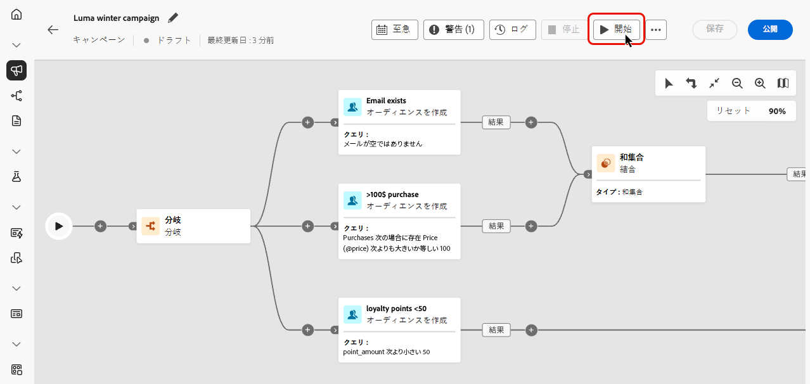{zoomable="yes"}

**トリガーされたオーケストレーション済みキャンペーン**&#x200B;の場合、システムはAPI呼び出しを待ってキャンペーンを開始します。 テストを続行するには、信号を送信する必要があります。 [&#x200B; シグナル トリガー型キャンペーンをテストする方法を説明します](trigger-orchestrated-campaign.md#complete-and-test)。

テスト中に、キャンバスのアクションバーを使用してキャンペーンの実行を管理できます。 ここから、次のことができます。

* **停止**：いつでも実行を停止できます。
* **開始**：実行を再度開始します。
* **実行を再起動**&#x200B;して、ワークフローをリセットし、1回のアクションで再実行します。 これは、変更を加えた後でキャンペーンフローをすばやく再テストしたい場合に特に便利です。
* **再開**：実行が以前に一時停止されていた場合は、実行を再開します。

キャンバスツールバーにある **[!UICONTROL アラート]**／**[!UICONTROL 警告]** アイコンは、実行前にプロアクティブに表示される警告や、実行中または実行後に発生するエラーなどの問題を通知します。

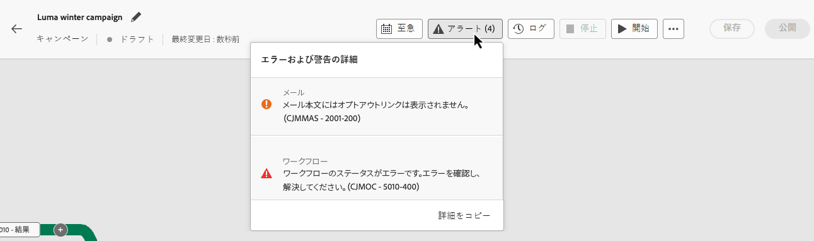{zoomable="yes"}

また、各アクティビティに直接表示される[視覚的なステータス指標](#activities)を使用して、失敗したアクティビティをすばやく識別することもできます。 トラブルシューティングについて詳しくは、[キャンペーンのログ](#logs-tasks)を開き、エラーとそのコンテキストに関する詳細な情報を参照してください。

キャンバスにチャネルアクティビティを追加した場合は、「**[!UICONTROL コンテンツをシミュレート]**」ボタンを使用して、メッセージのコンテンツをプレビューおよびテストできます。 [&#x200B; チャネルアクティビティの操作方法とコンテンツのシミュレーション方法について説明します](activities/channels.md#simulate-content-test-profiles)。

>[!TIP]
>
>**[!UICONTROL 公開]**&#x200B;をクリックする前に、次の点を確認してください。
>* キャンペーンはテストモードで正常に実行され、[&#x200B; ログ &#x200B;](#logs-tasks)にエラーはありませんでした。
>* メッセージのコンテンツは、**[!UICONTROL コンテンツをシミュレート]**&#x200B;を使用してプレビューされました。
>* スケジュールされたキャンペーンの場合、[&#x200B; スケジュールは](create-orchestrated-campaign.md#schedule)に設定されます。
>* [送信確認](#confirm-sending)の動作を確認しました。非定期的なキャンペーンの場合、公開後に送信を明示的に承認するまでメッセージは送信されません。

## キャンペーンの公開 {#publish}

キャンペーンのテストが完了し、準備が整ったら、「**[!UICONTROL 公開]**」をクリックしてキャンペーンを公開します。

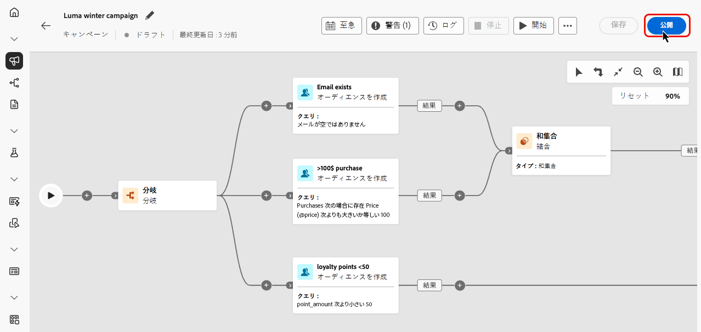{zoomable="yes"}

>[!NOTE]
>
>「**[!UICONTROL 公開]**」ボタンが無効（グレー表示）になっている場合は、アクションバーからログにアクセスしてエラーメッセージを確認します。 キャンペーンを公開する前に、すべてのエラーを修正する必要があります。

視覚的なフローが再開し、実際のプロファイルがリアルタイムでジャーニーを通じてフローを開始します。

公開アクションが失敗した場合（例：メッセージコンテンツが欠落している）、警告が表示され、再試行する前に問題を修正する必要があります。 公開が成功すると、キャンペーンは（直ちに、またはスケジュールに従って）実行を開始し、**ドラフト**&#x200B;から&#x200B;**ライブ**&#x200B;状態に移行し、「読み取り専用」になります。

>[!IMPORTANT]
>
>非定期的なキャンペーンの場合、メッセージ配信は、チャネルアクティビティのプロパティペインから送信を明示的に確認するまで、公開後に一時停止されます。 キャンペーンは&#x200B;**Live**&#x200B;として表示されますが、確認されるまでメッセージは送信されません。 [詳細情報](#confirm-sending)

### 公開時の実行シーケンス {#publication-sequence}

**[!UICONTROL 公開]**&#x200B;をクリックすると、次のシーケンスが内部で発生します。

1. **スケジューラーアクティベーション** — キャンペーンに[&#x200B; スケジュールが設定されている場合](create-orchestrated-campaign.md#schedule)、スケジューラーはキックインし、定義された時間に実行をトリガーします。
1. **オーディエンスを保存アクティビティが最初に実行されます** — ワークフロー内の[&#x200B; オーディエンスを保存](activities/save-audience.md) アクティビティは、メッセージアクティビティの前に実行されます。 オーディエンスシェルは[Audience Portal](../audience/about-audiences.md#browse)内で作成され、適格プロファイルの取り込みが開始されます。
1. **メッセージの実行が開始** — [&#x200B; チャネルアクティビティ &#x200B;](activities/channels.md)が、ワークフローの最初のメッセージアクティビティの処理を開始します。
1. **プロファイル スナップショット ルックアップ** — プロファイル データは、リアルタイム プロファイルではなく、公開時に撮影されたスナップショットに対して解決されます。 これにより、実行全体の一貫性が確保されます。
1. **同意評価** – 一致するプロファイルの場合、同意はプロファイルレコードから直接尊重されます。 送信時に同意が再評価されることはありません。 [同意管理について詳しく見る](../action/consent.md)
1. **即座にプロファイルを作成** – 既存のレコードと一致しないプロファイルは、実行中に即座に作成されます。
1. **配信ログの作成** – 配信イベントは、[`ajo_message_feedback_event`](../data/datasets-query-examples.md#message-feedback-event-dataset) データセットに記録されます。これは、配信ログと送信後の検証の主なソースです。

実行後に結果を検証するには、Journey Optimizer レポート機能を使用します。 [オーケストレーションキャンペーンレポートの詳細情報](reporting-campaigns.md)

## キャンペーンをドラフトに戻す {#back-to-draft}

「**[!UICONTROL ドラフトに戻る]**」機能を使用すると、特定の状況で、オーケストレーションされたキャンペーンを非公開にし、ドラフトステータスに戻すことができます。 キャンペーンライフサイクルの整合性を維持しながら、メッセージを送信する前に問題を修正できる回復メカニズムとして設計されています。

このオプションは、次の2つのシナリオで使用できます。

* **実施待ちのスケジュール済みキャンペーン**: キャンペーンが特定の時間に実行するようにスケジュールされていて、その時間に達していない場合は、キャンペーンの実行を開始する前に、「戻る」を使用してキャンペーンをレビューおよび修正できます。 ただし、キャンペーンが繰り返され（毎日スケジュールされたキャンペーンなど）、少なくとも1つの実行が既に発生している場合、このオプションは使用できなくなります。 その場合、代わりに[&#x200B; キャンペーン &#x200B;](../campaigns/manage-campaigns.md#duplicate-a-campaign)を複製する必要があります。

* **実行エラーのあるライブキャンペーン**：実行中にエラーが発生し、キャンペーンの実行がまだ完了しておらず、キャンペーンの実行中に一時停止した場合、戻ってドラフトを使用してエラーを修正し、キャンペーンを再公開できます。

キャンペーンをドラフトステータスに戻すには、オーケストレーションされたキャンペーンを開き、キャンペーンキャンバスツールバーの「**[!UICONTROL ドラフトに戻る]**」ボタンをクリックします。

キャンペーンは非公開になり、ワークフローは停止されます。 キャンペーンは&#x200B;**ドラフト**&#x200B;状態に戻ります。 特定された問題を修正できるようになりました。次に、[&#x200B; キャンペーンをテスト &#x200B;](#test)し、[準備ができたら再び公開します](#publish)。

## メッセージ送信を確認 {#confirm-sending}

デフォルトでは、非定期的なオーケストレーションされたキャンペーンの場合、送信を明示的に承認するまでメッセージ配信は一時停止されます。 キャンペーンを公開したら、チャネルアクティビティのプロパティペインから送信リクエストを確認します。 確認されるまで、チャネルアクティビティは保留中のままになり、メッセージは送信されません。

公開前に、チャネルアクティビティプロパティペインで送信確認を無効にすることができます。 詳しくは、[&#x200B; メッセージ送信の確認](activities/channels.md#confirm-message-sending)を参照してください。

## キャンペーン実行の監視 {#monitor}

### 視覚的なフロー監視 {#flow}

（テストモードまたはライブモードで）実行中、視覚的なフローは、プロファイルがリアルタイムでジャーニーをどのように移動するかを示します。 タスク間を移行するプロファイルの数が表示されます。

プロファイルフローを示す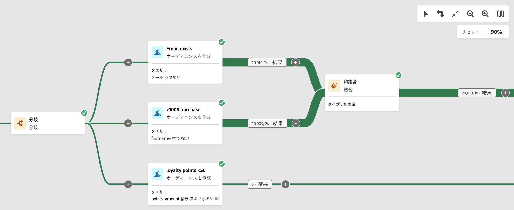{zoomable="yes"}

トランジションを通じて 1 つのアクティビティから別のアクティビティへ移されたデータは、一時的な作業用テーブルに保存されます。 このデータは、トランジションごとに表示できます。 アクティビティ間で渡されるデータを検査するには：

1. トランジションを選択します。
1. プロパティパネルで、「**[!UICONTROL スキーマをプレビュー]**」をクリックして、作業用テーブルスキーマを表示します。 「**[!UICONTROL 結果をプレビュー]**」を選択して、転送されたデータを表示します。

   作業テーブルのスキーマと結果を表示する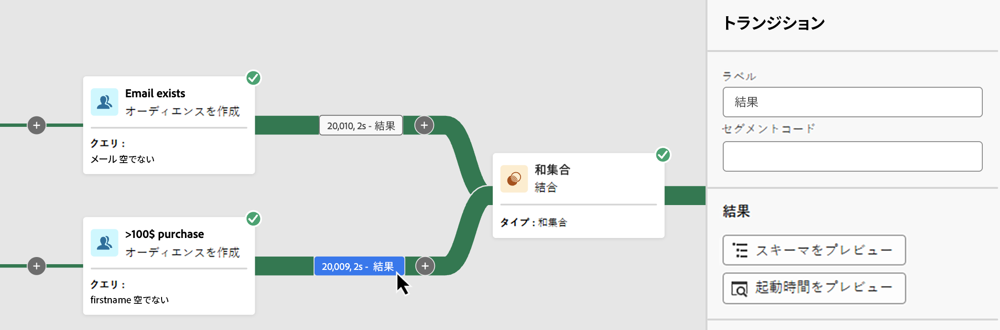{zoomable="yes"}

アクティビティ間で渡されたデータを調べて、キャンペーンフローを検証し、各アクティビティが期待されるプロファイルを処理していることを確認できるようになりました。

### アクティビティ実行指標 {#activities}

視覚的なステータス指標は、各アクティビティのパフォーマンスを把握するのに役立ちます。

| 視覚的な指標 | 説明 |
|-----|------------|
| 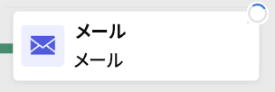{zoomable="yes"}{width="70%"} | このアクティビティは現在実行中です。 |
| 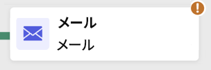{zoomable="yes"}{width="70%"} | このアクティビティには注意が必要です。 これには、配信の送信確認や、必要なアクションの実行が含まれる場合があります。 |
| 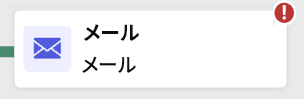{zoomable="yes"}{width="70%"} | アクティビティでエラーが発生しました。 この問題を解決するには、調整されたキャンペーンのログを開いて詳細を確認します。 |
| 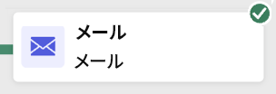{zoomable="yes"}{width="70%"} | アクティビティが正常に実行されました。 |

### ログとタスク {#logs-tasks}

>[!CONTEXTUALHELP]
>id="ajo_campaign_logs"
>title="ログとタスク"
>abstract="**ログとタスク**&#x200B;画面には、オーケストレーションキャンペーンの実行履歴が表示され、すべてのユーザーのアクションと発生したエラーが記録されます。"

ログとタスクの監視は、調整されたキャンペーンを分析し、正しく実行されていることを確認する重要な手順です。 ログとタスクには、キャンバスツールバーのテストモードとライブモードの両方で使用できる「**[!UICONTROL ログ]**」ボタンからアクセスできます。

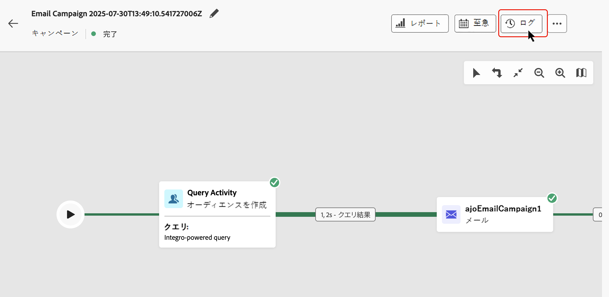{zoomable="yes"}

**[!UICONTROL ログとタスク]**&#x200B;画面には、キャンペーンの実行の完全な履歴が表示され、すべてのユーザーのアクションと発生したエラーが記録されます。

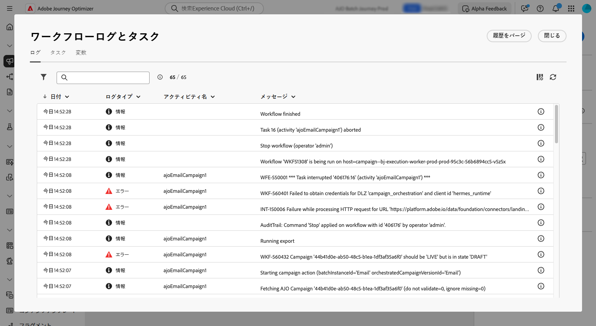{zoomable="yes"}

次の 2 種類の情報を使用できます。

* 「**[!UICONTROL ログ]**」タブには、すべての操作とエラーの時系列履歴が含まれます。
* 「**[!UICONTROL タスク]**」タブには、アクティビティの段階的な実行シーケンスの詳細が表示されます。

両方のタブで、表示される列とその順序を選択し、フィルターを適用し、検索フィールドを使用して目的の情報をすばやく見つけることができます。

## 次の手順 {#next}

オーケストレーションキャンペーンのキャンバスを開始した後、Journey Optimizer のレポート機能を使用して、オーディエンスの行動の把握や、カスタマージャーニーの各ステップのパフォーマンスの測定などのインサイトを得ることができます。 [オーケストレーションキャンペーンレポートの詳細情報](../orchestrated/reporting-campaigns.md)

オーケストレーションキャンペーンについて質問がある場合は、 実務担当者からの最も一般的な質問に対する回答については、[&#x200B; オーケストレーションキャンペーンに関するFAQ](orchestrated-campaigns-faq.md)を参照してください。
