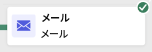

# オーケストレートキャンペーンの開始と監視 {#start-monitor}

>[!CONTEXTUALHELP]
>id="ajo_campaign_publication"
>title="オーケストレーションされたキャンペーンの公開"
>abstract="キャンペーンを開始するには、公開する必要があります。公開前に、すべてのエラーがクリアされていることを確認します。"

+++ 目次

| オーケストレートキャンペーンへようこそ | 初めてのオーケストレートキャンペーンの開始 | データベースのクエリ | 調整されたキャンペーンアクティビティ |
|---|---|---|---|
| [ 調整されたキャンペーンの基本を学ぶ ](gs-orchestrated-campaigns.md)   リレーショナルスキーマとデータセットの作成および管理：  <ul><li>[ スキーマとデータセットの概要 ](gs-schemas.md)</li><li>[ 手動スキーマ ](manual-schema.md)</li><li>[ ファイルアップロードスキーマ ](file-upload-schema.md)</li><li>[ データの取り込み ](ingest-data.md)</li></ul>[ オーケストレートキャンペーンへのアクセスと管理 ](access-manage-orchestrated-campaigns.md)  [ オーケストレートキャンペーンを作成するための主な手順 ](gs-campaign-creation.md) | [キャンペーンの作成とスケジュール](create-orchestrated-campaign.md)  [アクティビティの調整](orchestrate-activities.md)  <b>[キャンペーンの開始と監視](start-monitor-campaigns.md)</b>  [レポート](reporting-campaigns.md) | [ルールビルダーの操作](orchestrated-rule-builder.md)  [最初のクエリの作成](build-query.md)  [式の編集](edit-expressions.md)  [リターゲティング](retarget.md) | [アクティビティの基本を学ぶ](activities/about-activities.md)  アクティビティ： [AND 結合](activities/and-join.md) - [オーディエンスを作成](activities/build-audience.md) - [ディメンションを変更](activities/change-dimension.md) - [チャネルアクティビティ](activities/channels.md) - [結合](activities/combine.md) - [重複排除](activities/deduplication.md) - [エンリッチメント](activities/enrichment.md) - [分岐](activities/fork.md) - [紐付け](activities/reconciliation.md) - [オーディエンスを保存](activities/save-audience.md) - [分割](activities/split.md) - [待機](activities/wait.md) |

{style="table-layout:fixed"}

+++

 

>[!BEGINSHADEBOX]

 

このページのコンテンツは最終的なものではなく、変更される場合があります。

>[!ENDSHADEBOX]

調整されたキャンペーンを作成し、キャンバスで実行するタスクを設計したら、公開して実行状況を監視できます。

また、キャンペーンをテストモードで実行して、その実行と様々なアクティビティの結果を確認することもできます。

## 公開前のキャンペーンのテスト {#test}

[!DNL Journey Optimizer] を使用すると、運用開始前にオーケストレーション済みキャンペーンをテストできます。 キャンペーンを作成すると、デフォルトで **ドラフト** 状態になります。 この状態で、キャンペーンを手動で実行して、フローをテストできます。

>[!IMPORTANT]
>
>キャンバス内のすべてのアクティビティは、**[!UICONTROL オーディエンスを保存]** アクティビティとチャネルアクティビティを除いて実行されます。 データやオーディエンスへの機能上の影響はありません。**

キャンペーンをテストするには：

1. オーケストレーション済みキャンペーンを開きます。
2. 「**[!UICONTROL 開始]**」をクリックします。

{zoomable="yes"}

キャンペーン内の各アクティビティは、図の最後に達するまで順番に実行されます。

テスト中にキャンバスのアクションバーを使用して、キャンペーンの実行を制御できます。 ここから、次のことができます。

* **停止**：いつでも実行を停止できます。
* **開始**：実行を再度開始します。
* **再開** 実行が以前に一時停止されていた場合は、その実行を再開します。

キャンバスツールバーにある **[!UICONTROL アラート]**/**[!UICONTROL 警告]** アイコンは、実行前に先行して表示される可能性のある警告や、実行中または実行後に発生するエラーなど、問題を通知します。

{zoomable="yes"}

また、各アクティビティに直接表示される[視覚的なステータス指標](#activities)を使用して、失敗したアクティビティをすばやく識別することもできます。トラブルシューティングについて詳しくは、[キャンペーンのログ](#logs-tasks)を開き、エラーとそのコンテキストに関する詳細な情報を参照してください。

キャンバスにチャネルアクティビティを追加した場合は、「**[!UICONTROL コンテンツをシミュレート]** ボタンを使用して、メッセージのコンテンツをプレビューおよびテストできます。 [ チャネルアクティビティの操作方法については、こちらを参照してください ](activities/channels.md)

検証が完了したら、キャンペーンを公開できます。

## キャンペーンの公開 {#publish}

キャンペーンのテストが完了し、準備が整ったら、「**[!UICONTROL 公開]**」をクリックしてキャンペーンを公開します。

{zoomable="yes"}

>[!NOTE]
>
>「**[!UICONTROL 公開]**」ボタンが無効（グレー表示）になっている場合は、アクションバーのログにアクセスし、エラーメッセージを確認します。 キャンペーンを公開するには、すべてのエラーを修正する必要があります。

視覚的なフローが再開し、実際のプロファイルがリアルタイムでジャーニーを通じてフローを開始します。

公開アクションが失敗した場合（メッセージコンテンツが見つからないなど）、警告が表示され、再試行する前に問題を修正する必要があります。 公開が成功すると、キャンペーンは（即時またはスケジュールに従って）実行を開始し、**ドラフト** ステータスから **ライブ** ステータスに移動して、「読み取り専用」になります。

## キャンペーン実行の監視 {#monitor}

### 視覚的なフロー監視 {#flow}

実行中（テストモードまたはライブモードで）は、視覚的なフローにプロファイルがリアルタイムでジャーニーを通じて移動する状況が表示されます。タスク間を移行するプロファイルの数が表示されます。

{zoomable="yes"}

トランジションを通じて 1 つのアクティビティから別のアクティビティへ移されたデータは、一時的な作業用テーブルに保存されます。このデータは、トランジションごとに表示できます。アクティビティ間で渡されるデータを検査するには：

1. トランジションを選択します。
1. プロパティパネルで、「**[!UICONTROL スキーマをプレビュー]**」をクリックして、作業用テーブルスキーマを表示します。「**[!UICONTROL 結果をプレビュー]**」を選択して、転送されたデータを表示します。

{zoomable="yes"}

### アクティビティ実行指標 {#activities}

視覚的なステータス指標は、各アクティビティのパフォーマンスを把握するのに役立ちます。

| 視覚的な指標 | 説明 |
|-----|------------|
| {zoomable="yes"}{width="70%"} | このアクティビティは現在実行中です。 |
| {zoomable="yes"}{width="70%"} | このアクティビティには注意が必要です。これには、配信の送信確認や、必要なアクションの実行が含まれる場合があります。 |
| {zoomable="yes"}{width="70%"} | アクティビティでエラーが発生しました。この問題を解決するには、オーケストレーションされたキャンペーンログを開いて詳細を確認します。 |
| {zoomable="yes"}{width="70%"} | アクティビティが正常に実行されました。 |

### ログとタスク {#logs-tasks}

>[!CONTEXTUALHELP]
>id="ajo_campaign_logs"
>title="ログとタスク"
>abstract="**ログとタスク** 画面には、オーケストレーションされたキャンペーンの実行履歴が表示され、すべてのユーザーのアクションと発生したエラーが記録されます。"

ログとタスクの監視は、オーケストレートキャンペーンを分析し、正しく実行されていることを確認するための重要な手順です。 ログとタスクには、キャンバスツールバーまたは各アクティビティのプロパティパネルのテストモードとライブモードの両方で使用できる「**[!UICONTROL ログ]**」ボタンからアクセスできます。

**[!UICONTROL ログとタスク]**&#x200B;画面には、キャンペーンの実行の完全な履歴が表示され、すべてのユーザーのアクションと発生したエラーが記録されます。

{zoomable="yes"}

次の 2 種類の情報を使用できます。

* 「**[!UICONTROL ログ]**」タブには、すべての操作とエラーの時系列履歴が含まれます。
* 「**[!UICONTROL タスク]**」タブには、アクティビティの段階的な実行シーケンスの詳細が表示されます。

両方のタブで、表示される列とその順序を選択し、フィルターを適用し、検索フィールドを使用して目的の情報をすばやく見つけることができます。
