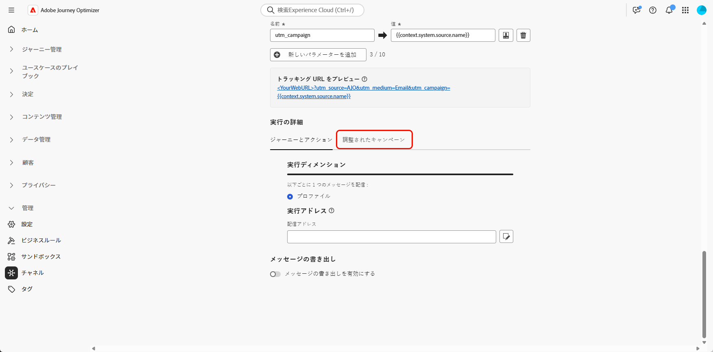
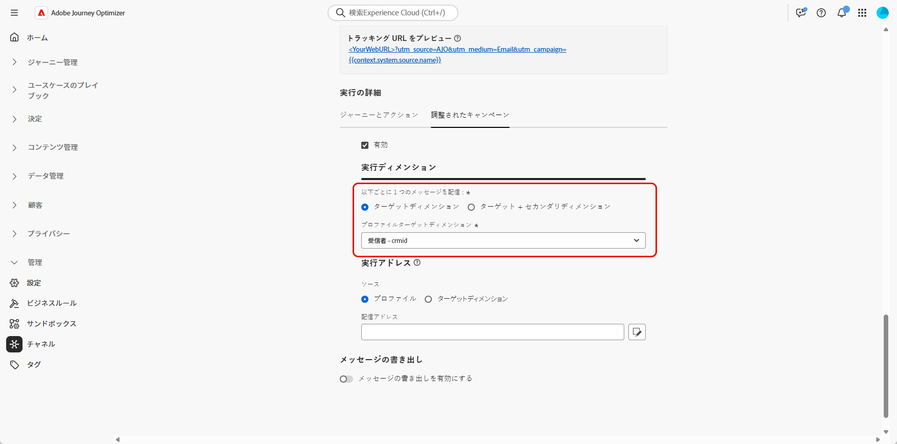

# ターゲティングディメンションの設定 {#configuration}

+++ 目次

| 調整されたキャンペーンへようこそ | 最初の調整されたキャンペーンの開始 | データベースのクエリ | 調整されたキャンペーンアクティビティ |
|---|---|---|---|
| [ 調整されたキャンペーンの基本を学ぶ ](gs-orchestrated-campaigns.md)   リレーショナルスキーマとデータセットの作成および管理：  <ul><li>[ スキーマとデータセットの概要 ](gs-schemas.md)</li><li>[ 手動スキーマ ](manual-schema.md)</li><li>[ ファイルアップロードスキーマ ](file-upload-schema.md)</li><li>[ データの取り込み ](ingest-data.md)</li></ul>[ オーケストレーションされたキャンペーンへのアクセスと管理 ](access-manage-orchestrated-campaigns.md)  [ オーケストレーションされたキャンペーンを作成するための主な手順 ](gs-campaign-creation.md)  [ ターゲットディメンションの設定 ](target-dimension.md) | <b>[キャンペーンの作成とスケジュール](create-orchestrated-campaign.md)</b>  [アクティビティの調整](orchestrate-activities.md)  [キャンペーンの開始と監視](start-monitor-campaigns.md)  [レポート](reporting-campaigns.md) | [ルールビルダーの操作](orchestrated-rule-builder.md)  [最初のクエリの作成](build-query.md)  [式の編集](edit-expressions.md)  [リターゲティング](retarget.md) | [アクティビティの基本を学ぶ](activities/about-activities.md)  アクティビティ： [AND 結合](activities/and-join.md) - [オーディエンスを作成](activities/build-audience.md) - [ディメンションを変更](activities/change-dimension.md) - [チャネルアクティビティ](activities/channels.md) - [結合](activities/combine.md) - [重複排除](activities/deduplication.md) - [エンリッチメント](activities/enrichment.md) - [分岐](activities/fork.md) - [紐付け](activities/reconciliation.md) - [オーディエンスを保存](activities/save-audience.md) - [分割](activities/split.md) - [待機](activities/wait.md) |

{style="table-layout:fixed"}

+++

 

>[!BEGINSHADEBOX]

 

このページのコンテンツは最終的なものではなく、変更される場合があります。

>[!ENDSHADEBOX]

多くの場合、1 つの顧客プロファイルを複数の関連エンティティ（サブスクリプション、サービス契約、デバイスなど）にリンクでき、それぞれに独自の識別子と通信ニーズがあります。

**調整されたキャンペーン** を使用すると、**Adobe Experience Platformのリレーショナルスキーマ機能** を使用して、ターゲットコミュニケーションを設計し、エンティティレベルで配信できるようになりました。 これにより、受信者ごとではなく、エンティティごとにセグメント化、パーソナライズ、レポートをおこなうことができます。

## ターゲティングディメンションの作成 {#targeting-dimension}

1 つの顧客プロファイルを、契約、デバイス、サブスクリプションなど、それぞれに一意の ID を持つ複数の関連エンティティに関連付けることができます。 この設定を使用すると、各エンティティを個別にターゲット、セグメント化およびレポートできます。

まず、リレーショナルスキーマを顧客プロファイルにマッピングして、キャンペーンオーケストレーションを設定します。

1. **[!UICONTROL 管理]** から **[!UICONTROL 設定]** メニューにアクセスし、**[!UICONTROL Campaign Target Dimension]** を選択します。

   

1. **[!UICONTROL 作成]** をクリックして、**[!UICONTROL ターゲティングディメンション]** の作成を開始します。

1. ドロップダウンから [ 以前に設定したスキーマ ](gs-schemas.md)&#x200B;を選択します。

1. ターゲットにするエンティティを表す **[!UICONTROL ID 値]** を選択します。

   この例では、顧客プロファイルは複数のサブスクリプションにリンクされ、それぞれが `crmID` スキーマ内の一意の `Recipient` で表されます。 **[!UICONTROL スキーマとその]** ID を使用するように `Recipient`Target Dimension`crmID` を設定することで、メイン顧客プロファイルではなく購読レベルでメッセージを送信でき、各契約または明細が独自にパーソナライズされたメッセージを受信するようになります。

   [詳しくは、Adobe Experience Platform ドキュメントを参照してください。](https://experienceleague.adobe.com/en/docs/experience-platform/xdm/schema/composition#identity)

   

1. **[!UICONTROL 保存]** をクリックして、設定を完了します。

**[!UICONTROL Target Dimension]** を設定したら、**[!UICONTROL チャネル設定]** の作成とセットアップに進み、対応する **[!UICONTROL 実行の詳細]** を定義します。

## チャネル設定の指定 {#channel-configuration}

**[!UICONTROL Target Dimension]** を設定した後、メールまたは SMS **[!UICONTROL チャネルを設定し]** 適切な **[!UICONTROL 実行の詳細]** を定義する必要があります。 これにより、正しい ID とターゲティングロジックを使用して、メッセージが送信されるようになります。

1. まず、**[!UICONTROL チャネル設定]** を作成および設定します。

   また、既存の **[!UICONTROL チャネル設定]** を更新することもできます。

   ➡️ [ このページで説明されている手順に従ってください ](../email/surface-personalization.md)

1. **[!UICONTROL チャネル設定]** の **[!UICONTROL 実行の詳細]** セクションから、**[!UICONTROL オーケストレーションされたキャンペーン]** タブにアクセスします。

   

1. **[!UICONTROL 有効]** をクリックして、オーケストレートキャンペーンと互換性を持たせます。

1. 配信方法を選択します。

   * **[!UICONTROL Target Dimension]**：プライマリエンティティ（受信者など）に送信します。

   * **[!UICONTROL Target +セカンダリDimension]**：プライマリエンティティとセカンダリエンティティの両方を使用して送信します（例：受信者+ コントラクト）。

1. ドロップダウンから [ 以前に作成した Target Dimension](#targeting-dimension) を選択します。

   

1. 「**[!UICONTROL 実行アドレス]**」セクションで、配信アドレスの取得に使用する **[!UICONTROL 2&rbrace;Source&rbrace; を選択します（メールアドレスや電話番号など）。]**

   * **[!UICONTROL プロファイル]**：配信アドレス（メールなど）がメイン顧客プロファイルに直接保存されている場合は、このオプションを選択します。

     特定の関連エンティティではなく、メイン顧客にメッセージを送信する場合に役立ちます。

   * **[!UICONTROL Target Dimension]**：配信アドレスが関連するエンティティ（受信者や購読など）に保存されている場合に選択します。

     各受信者が独自の配信アドレス（別のメールや電話番号など）を持っている場合に役立ちます。

1. 「**[!UICONTROL 配信アドレス]**」フィールドで  をクリックして、メッセージ配信に使用する特定のフィールドを選択します。

   

1. 設定が完了したら、「**[!UICONTROL 送信]**」をクリックします。

これで、チャネルをオーケストレートキャンペーンで使用する準備が整い、選択したターゲットディメンションに従ってメッセージが配信されます。
