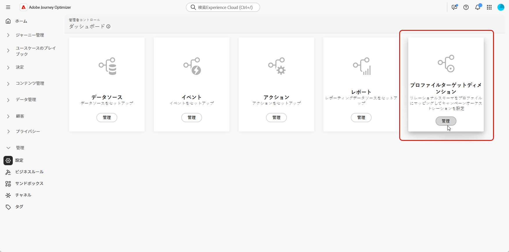
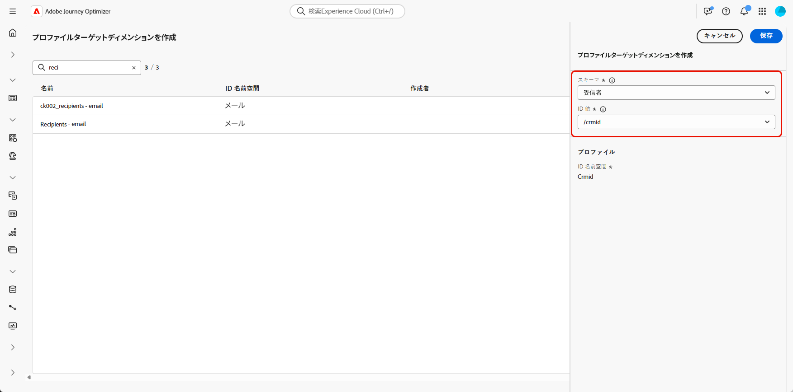

# ターゲティングディメンションの設定 {#configuration}

**[!UICONTROL オーケストレーションキャンペーン]**&#x200B;を使用すると、Adobe Experience Platform のリレーショナルスキーマ機能を活用して、エンティティレベルでターゲットコミュニケーションを設計および配信できます。Experience Platform では、スキーマを使用して、一貫性のある再利用可能な方法でデータの構造を記述します。データが Experience Platform に取り込まれると、XDM スキーマに応じて構造化されます。

**[!UICONTROL 調整されたキャンペーン]**&#x200B;のセグメント化は主にリレーショナルスキーマで動作しますが、実際のメッセージ配信は常に&#x200B;**プロファイル**&#x200B;レベルで行われます。

ターゲティングを設定する際は、次の 2 つの重要な側面を定義します。

* **ターゲット可能スキーマ**

  ターゲットとして実施要件を満たすリレーショナルスキーマを指定します。デフォルトでは、`Recipient` という名前のスキーマが使用されますが、`Visitors`、`Customers` などの代替スキーマを設定することもできます。

  >[!IMPORTANT]
  >
  > ターゲットスキーマは、`Profile` スキーマと 1:1 の関係を持つ必要があります。例えば、`Purchases` は通常一対多の関係を表すので、ターゲットスキーマとして使用できません。

* **プロファイルのリンケージ**

  システムは、ターゲットスキーマが `Profile` にどのようにマッピングされるかを理解する必要があります。これは、ターゲットスキーマと `Profile` スキーマの両方に存在し、ID 名前空間として設定される共有 ID フィールドを通じて実現されます。

➡️ [ リレーショナルスキーマについて詳しくは、Adobe Experience Platform ドキュメントを参照してください ](https://experienceleague.adobe.com/en/docs/experience-platform/xdm/schema/relational#how-relational-schemas-differ-from-standard-xdm-schemas)

## ターゲティングディメンションの作成 {#targeting-dimension}

まず、リレーショナルスキーマを顧客プロファイルにマッピングして、キャンペーンオーケストレーションを設定します。

1. **[!UICONTROL 管理]**&#x200B;から&#x200B;**[!UICONTROL 設定]**&#x200B;メニューにアクセスし、「**[!UICONTROL キャンペーンターゲットディメンション]**」を選択します。

   

1. 「**[!UICONTROL 作成]**」をクリックして、**[!UICONTROL ターゲティングディメンション]**&#x200B;の作成を開始します。

1. ドロップダウンから[以前に設定したスキーマ](gs-schemas.md)を選択します。

   すべてのリレーショナルスキーマが表示されますが、選択できるのは **プロファイル** に対して直接 ID 関係を持つスキーマのみです。 人物以外のスキーマ（購入など）を選択したり、プロファイルに直接関連付けられているスキーマを選択したりしないでください。

1. ターゲットにするエンティティを表す **[!UICONTROL ID 値]**&#x200B;を選択します。

   この例では、顧客プロファイルは複数のサブスクリプションにリンクされ、それぞれが `Recipient` スキーマ内の一意の `crmID` で表されます。`Recipient` スキーマとその `crmID` ID を使用するように&#x200B;**[!UICONTROL ターゲットディメンション]**&#x200B;を設定すると、メインの顧客プロファイルではなくサブスクリプションレベルでメッセージを送信できるので、各契約または回線ごとに独自のパーソナライズされたメッセージを受信するようになります。

   [詳しくは、Adobe Experience Platform ドキュメントを参照してください。](https://experienceleague.adobe.com/ja/docs/experience-platform/xdm/schema/composition#identity)

   

1. 「**[!UICONTROL 保存]**」をクリックして、設定を完了します。一度作成した&#x200B;**[!UICONTROL ターゲットディメンション]**&#x200B;は、削除または編集できません。

**[!UICONTROL ターゲットディメンション]**&#x200B;を設定したら、**[!UICONTROL チャネル設定]**&#x200B;の作成と指定に進み、対応する&#x200B;**[!UICONTROL 実行の詳細]**&#x200B;を定義します。